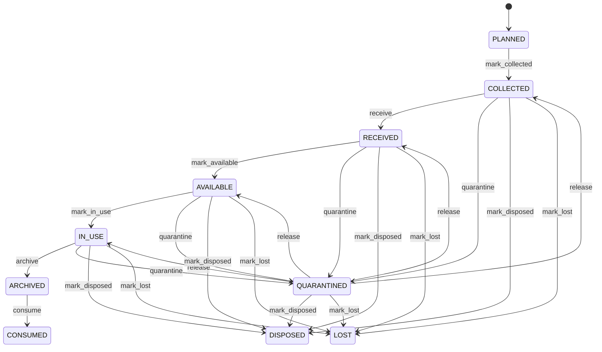

# Sample

First-class research specimen and sample entity for life-sciences and scientific workflows. Sample closes the research traceability graph between Compound and Experiment while keeping scientific specimens separate from quality-control InspectionSample. Sample represents research material; InspectionSample represents a selection event within a QualityInspection. Life sciences, drug discovery, laboratory research, scientific experiments, compound studies, specimen management, chain of custody, reporting, and audit. Compound supplies investigated substance context; Experiment supplies research execution context; parentSample and derivedSamples preserve lineage; UnitOfMeasure supplies quantity semantics. It is intentionally distinct from InspectionSample. Planned/collected/received → available → in use → consumed/disposed/archived, with quarantine or loss as controlled exceptional states. Changes to sample status, quantity, unit, lineage, Compound association, or Experiment participation must revalidate open research workflows while preserving completed historical evidence. A compound stock specimen is received as Sample S-100, split into aliquot Sample S-101, and S-101 is used by Experiment E-42. Both the Compound association and parent-sample lineage remain traceable after the experiment completes.

## Finding records

Open **Sample** from the menu or from its card on the dashboard.

The list shows Sample Code, Sample Type, Status, Collected At, Quantity, Unit Of Measure, Parent Sample, with the most recently changed record first. The **Help** button beside the title opens this window's help text.

- **Search**: type in the search box above the grid to narrow the rows. **Search** at the top left opens advanced search, where you pick a field, a comparison (equals, contains, starts with, before, after, and so on) and a value.
- **Sort**: click a column heading; click again to reverse.
- **Refresh**: the refresh button at the top right re-reads the rows and every dropdown, so a record created a moment ago by someone else appears.
- **Export**: **CSV** downloads the rows you are looking at.
- **Open a record**: click a row. The line under the title, "Showing 1 to n of N entries", tells you how many rows match.

## Creating a record

Choose **New** at the top of the list. The form opens on its own page, with the fields in sections. A badge beside each label names the control (Text, Dropdown, Date, and so on); a red star marks a required field; the question-mark icon shows that field's help; and a hint such as “max 300” shows the longest entry accepted.

1. Fill in the fields described under [Fields](#fields).
2. These are required and must be completed before the record can be saved: **Sample Code**, **Sample Type**, **Status**.
3. For a dropdown that points at another window, pick the matching record; if the record you need does not exist yet, create it in its own window first. A dropdown may narrow to what you have already chosen, for example the states of the chosen country.
4. Choose **Create** (or **Save** in the toolbar). You return to the record, and it appears at the top of the list. If something is wrong the form says which field and why, and nothing is saved.

## Reading, changing and deleting a record

Click a row to open the record. Above the fields are the arrows that step through the list ("1 of 5"). Below them sit **Notes**, where anyone may leave a comment on the record, and the **Audit Trail**, which lists every change with who made it, when, and which fields changed.

- **Edit** (toolbar) makes the fields editable. Change them and choose **Save**; **Undo Changes** puts back what you changed and **Cancel Editing** leaves edit mode.
- **Copy Record** starts a new record from this one.
- **Delete Record** is available in edit mode and asks you to confirm; a record other records still depend on cannot be deleted.

Every change is also written to the [Audit Log](/administration/#audit-log).

## Fields

| Field | What you use | Rules | What to enter |
| --- | --- | --- | --- |
| Sample Code | Text | Required, Unique, Up to 120 characters | Human-readable business identifier for the sample. Provides the operational label used to identify the specimen during collection, handling, testing, storage, and reporting. Labels, searches, laboratory workflows, reports, integrations, and audit. Identifies the Sample rather than the Experiment or Compound associated with it. Required for operational identification. |
| Sample Type | Choice | Required | Classification of the scientific sample. Describes the nature or role of the sample so handling, storage, testing, and interpretation can apply appropriate rules. Laboratory routing, protocol selection, reporting, safety, and analytics. Sample type is independent of the Compound or Experiment relationship and can constrain applicable processes. Required because handling and interpretation depend on sample classification. The sample type of the sample is specimen; set it when that is what the business means for this record. The sample type of the sample is aliquot; set it when that is what the business means for this record. The sample type of the sample is compound; set it when that is what the business means for this record. The sample type of the sample is material; set it when that is what the business means for this record. The sample type of the sample is biological; set it when that is what the business means for this record. The sample type of the sample is chemical; set it when that is what the business means for this record. The sample type of the sample is environmental; set it when that is what the business means for this record. The sample type of the sample is control; set it when that is what the business means for this record. The sample type of the sample is reference; set it when that is what the business means for this record. The sample type of the sample is other; set it when that is what the business means for this record. Choose one: Specimen, Aliquot, Compound, Material, Biological, Chemical, Environmental, Control, Reference, Other. |
| Status | Choice | Required | Lifecycle state of the sample. Indicates whether the specimen is planned, available for research, in use, exhausted, unavailable, or retained historically. Experiment gating, chain of custody, inventory-like laboratory control, audit, and disposal. Status constrains new Experiment use but does not rewrite historical Experiment or Compound associations. Sample is expected but has not yet been collected or received. Sample has been collected and awaits normal receipt or availability controls. Sample has entered the governed laboratory or research custody process. Sample is eligible for governed research use. Sample is currently participating in an active research activity. Usable sample quantity has been exhausted by governed activity. Sample was intentionally disposed of under an authorized process. Sample can no longer be physically accounted for. Sample is held from normal use pending review or resolution. Sample is retained for historical or long-term controlled storage. Required to govern sample availability and custody. Choose one: Planned, Collected, Received, Available, In use, Consumed, Disposed, Lost, Quarantined, Archived. |
| Collected At | Date and time | Optional | Time at which the sample was collected or created. Establishes the origin chronology of the specimen. Chain of custody, protocol compliance, stability analysis, reporting, and audit. May precede receipt and experiment use; derived samples may use creation time as collection time. Optional when the source system or sample type does not provide a collection timestamp. |
| Quantity | Amount | Optional | Governed quantity currently represented by the sample record when quantity tracking applies. Describes how much specimen or material is associated with the sample for planning and traceability. Laboratory planning, aliquoting, consumption tracking, reporting, and reconciliation. Quantity requires a compatible UnitOfMeasure and must not be confused with enterprise InventoryBalance unless an explicit integration exists. Optional for samples whose business meaning is discrete or not quantity-controlled. |
| Unit Of Measure | Lookup | Optional | Unit in which sample quantity is expressed. Gives dimensional meaning to the sample quantity. Quantity comparison, conversion, reporting, and audit. Required when quantity is dimensional; changes to unit definitions must not silently reinterpret historical sample evidence. Optional when quantity is absent or explicitly unitless. Pick a record from **Unit Of Measure**. |
| Parent Sample | Lookup | Optional | Source sample from which this sample was derived. Preserves provenance for aliquots, splits, preparations, or other derived specimens. Lineage, chain of custody, quantity reconciliation, and audit. A sample may have at most one immediate parent in this model. Parent-child lineage must remain acyclic. Pick a record from **Parent Sample**. |

## How it connects to other records
- A sample is linked to many **Compound** records.
- A sample is linked to many **Experiment** records.
- A sample has many **Sample** records.

## Lifecycle: Sample lifecycle

A sample record starts as **Planned** and ends as **Consumed** or **Disposed** or **Lost**. Open a record and the bar above its fields shows its current **State** and, after **Next**, a button for each move that leaves it; choose one to make the move. Any move the diagram does not draw is refused, for everyone including the administrator.

| From | To | Move |
| --- | --- | --- |
| Planned | Collected | Mark collected |
| Collected | Received | Receive |
| Received | Available | Mark available |
| Available | In use | Mark in use |
| In use | Archived | Archive |
| Archived | Consumed | Consume |
| Collected | Quarantined | Quarantine |
| Quarantined | Collected | Release |
| Received | Quarantined | Quarantine |
| Quarantined | Received | Release |
| Available | Quarantined | Quarantine |
| Quarantined | Available | Release |
| In use | Quarantined | Quarantine |
| Quarantined | In use | Release |
| Collected | Disposed | Mark disposed |
| Received | Disposed | Mark disposed |
| Available | Disposed | Mark disposed |
| In use | Disposed | Mark disposed |
| Quarantined | Disposed | Mark disposed |
| Collected | Lost | Mark lost |
| Received | Lost | Mark lost |
| Available | Lost | Mark lost |
| In use | Lost | Mark lost |
| Quarantined | Lost | Mark lost |

## What happens when you save
Business rules run around the save. They are listed here and explained in full under [Business rules](/administration/rules/).

| Rule | When | Order |
| --- | --- | --- |
| Sample invariants before create | before a sample is created | 100 |
| Sample invariants before update | before a sample is changed | 100 |
| Sample workflows after update | after a sample is changed | 100 |

Processes started from this record: [Sample exception raised](/administration/processes/#sample-exception-raised).

## Who may use it

Anyone who holds a role with access to the **Sample** window. Access is granted by role under [Roles and access](/administration/access/).
