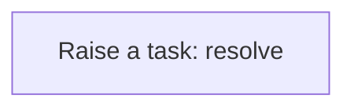
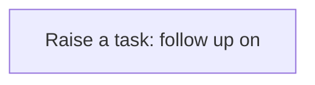
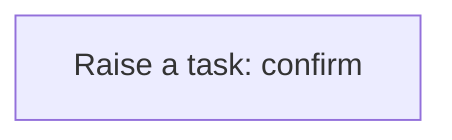

# Processes

A process is a sequence of steps the application runs for you: create a task, update a record, call a service. A business rule usually starts it; you can also run one by hand from the Workflow Designer. Every run is logged step by step in the Workflow Monitor. This application has **11** processes.

## Party exception raised {#party-exception-raised}

When a party is blocked, a high-priority task asks someone to resolve it.

Runs when a **Party** is changed, started by a business rule.

1. **Raise a task: resolve** — creates a **Task** record.

## Exchange rate follow up required {#exchange-rate-follow-up-required}

When a exchange rate is cancelled, a task asks someone to settle what depended on it.

Runs when a **Exchange Rate** is changed, started by a business rule.

1. **Raise a task: follow up on** — creates a **Task** record.

## Shipment exception raised {#shipment-exception-raised}

When a shipment is exception, a high-priority task asks someone to resolve it.

Runs when a **Shipment** is changed, started by a business rule.

1. **Raise a task: resolve** — creates a **Task** record.

## Shipment follow up required {#shipment-follow-up-required}

When a shipment is cancelled, a task asks someone to settle what depended on it.

Runs when a **Shipment** is changed, started by a business rule.

1. **Raise a task: follow up on** — creates a **Task** record.

## Shipment completion confirmed {#shipment-completion-confirmed}

When a shipment is delivered, a task asks someone to confirm the outcome.

Runs when a **Shipment** is changed, started by a business rule.

1. **Raise a task: confirm** — creates a **Task** record.

## Sales order follow up required {#sales-order-follow-up-required}

When a sales order is cancelled, a task asks someone to settle what depended on it.

Runs when a **Sales Order** is changed, started by a business rule.

1. **Raise a task: follow up on** — creates a **Task** record.

## Sales order completion confirmed {#sales-order-completion-confirmed}

When a sales order is fulfilled, a task asks someone to confirm the outcome.

Runs when a **Sales Order** is changed, started by a business rule.

1. **Raise a task: confirm** — creates a **Task** record.

## Trip follow up required {#trip-follow-up-required}

When a trip is cancelled, a task asks someone to settle what depended on it.

Runs when a **Trip** is changed, started by a business rule.

1. **Raise a task: follow up on** — creates a **Task** record.

## Trip segment follow up required {#trip-segment-follow-up-required}

When a trip segment is cancelled, a task asks someone to settle what depended on it.

Runs when a **Trip** is changed, started by a business rule.

1. **Raise a task: follow up on** — creates a **Task** record.

## Customer exception raised {#customer-exception-raised}

When a customer is blocked, a high-priority task asks someone to resolve it.

Runs when a **Customer** is changed, started by a business rule.

1. **Raise a task: resolve** — creates a **Task** record.

## Product exception raised {#product-exception-raised}

When a product is blocked, a high-priority task asks someone to resolve it.

Runs when a **Product** is changed, started by a business rule.

1. **Raise a task: resolve** — creates a **Task** record.

