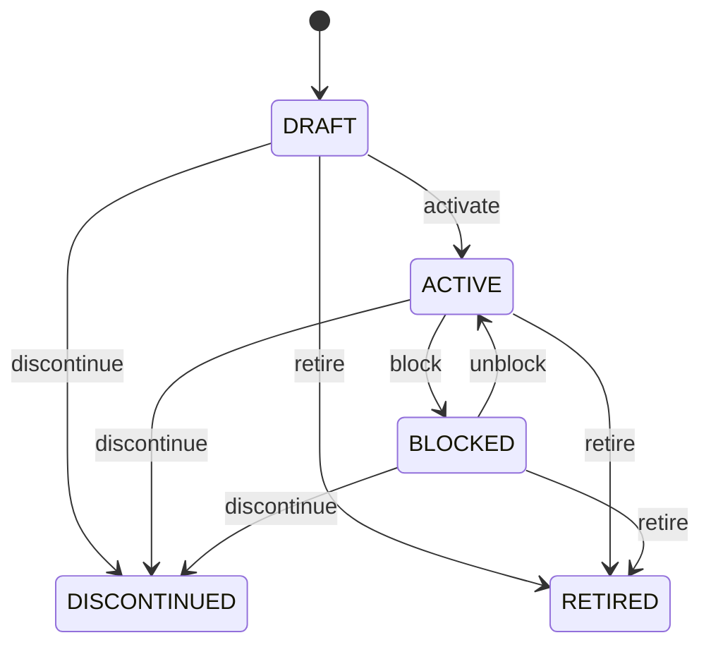

# Product

Canonical product master with mandatory downstream dependency propagation and transaction-time preservation rules. Product defines what is offered or managed; transaction entities define occurrences. Master changes affect future eligibility and dependent open workflows, not completed historical facts. Central to catalog, pricing, sales, procurement, inventory, manufacturing, logistics, fulfillment, invoicing, tax, service, subscriptions, and analytics. Product connects to ProductCategory, Supplier, UnitOfMeasure, Location, demand, procurement, inventory state/events, and billing. Transaction entities own their occurrence-specific facts. Product create/update → validate category/unit/tax/location/supplier dependencies → propagate eligibility changes to open SalesOrderLine/PurchaseOrderLine and inventory workflows → resolve exceptions → permit future transactions. Product changes never silently recalculate issued documents or historical movements. Draft → active → discontinued/blocked → retired. Lifecycle transitions require dependent-workflow validation and preserve historical references. SalesOrderLine eligibility. PurchaseOrderLine eligibility. inventory operations. fulfillment eligibility. future InvoiceLine creation. open order quantities. receipt quantities. inventory operations. conversion rules. future TaxRule determination. future InvoiceLine calculation. future default pricing only. catalog. assortment. reporting. policy eligibility. future sourcing and PurchaseOrder eligibility. future operational availability and inventory configuration. If a Product is blocked, the system validates open SalesOrders and PurchaseOrders, prevents new incompatible use, and identifies dependent inventory/fulfillment workflows. Existing invoices and inventory movements remain unchanged. If its tax category changes, future tax determination uses the new category while issued invoices retain their historical tax evidence.

## Finding records

Open **Product** from the menu or from its card on the dashboard.

The list shows Code, Name, Description, Product Type, Status, Sku, Unit Of Measure, with the most recently changed record first. The **Help** button beside the title opens this window's help text.

- **Search**: type in the search box above the grid to narrow the rows. **Search** at the top left opens advanced search, where you pick a field, a comparison (equals, contains, starts with, before, after, and so on) and a value.
- **Sort**: click a column heading; click again to reverse.
- **Refresh**: the refresh button at the top right re-reads the rows and every dropdown, so a record created a moment ago by someone else appears.
- **Export**: **CSV** downloads the rows you are looking at.
- **Open a record**: click a row. The line under the title, "Showing 1 to n of N entries", tells you how many rows match.

## Creating a record

Choose **New** at the top of the list. The form opens on its own page, with the fields in sections. A badge beside each label names the control (Text, Dropdown, Date, and so on); a red star marks a required field; the question-mark icon shows that field's help; and a hint such as “max 300” shows the longest entry accepted.

1. Fill in the fields described under [Fields](#fields).
2. These are required and must be completed before the record can be saved: **Code**, **Name**, **Product Type**, **Status**.
3. For a dropdown that points at another window, pick the matching record; if the record you need does not exist yet, create it in its own window first. A dropdown may narrow to what you have already chosen, for example the states of the chosen country.
4. Choose **Create** (or **Save** in the toolbar). You return to the record, and it appears at the top of the list. If something is wrong the form says which field and why, and nothing is saved.

## Reading, changing and deleting a record

Click a row to open the record. Above the fields are the arrows that step through the list ("1 of 5"). Below them sit **Notes**, where anyone may leave a comment on the record, and the **Audit Trail**, which lists every change with who made it, when, and which fields changed.

- **Edit** (toolbar) makes the fields editable. Change them and choose **Save**; **Undo Changes** puts back what you changed and **Cancel Editing** leaves edit mode.
- **Copy Record** starts a new record from this one.
- **Delete Record** is available in edit mode and asks you to confirm; a record other records still depend on cannot be deleted.

Every change is also written to the [Audit Log](/administration/#audit-log).

## Fields

| Field | What you use | Rules | What to enter |
| --- | --- | --- | --- |
| Code | Text | Required, Unique, Up to 100 characters | The code of the product: a value the business records on it. Entered or maintained when a product is created or changed; shown on its form and available to search and reports. Read together with the product's other fields and its relationships; it is not meaningful on its own. Required: a product cannot be understood without its code. |
| Name | Text | Required, Up to 300 characters | The name of the product: a value the business records on it. Entered or maintained when a product is created or changed; shown on its form and available to search and reports. Read together with the product's other fields and its relationships; it is not meaningful on its own. Required: a product cannot be understood without its name. |
| Description | Text | Up to 4000 characters | The description of the product: a value the business records on it. Entered or maintained when a product is created or changed; shown on its form and available to search and reports. Read together with the product's other fields and its relationships; it is not meaningful on its own. |
| Product Type | Choice | Required | The product type of the product: a value the business records on it. Entered or maintained when a product is created or changed; shown on its form and available to search and reports. Read together with the product's other fields and its relationships; it is not meaningful on its own. Required: a product cannot be understood without its product type. The product type of the product is good; set it when that is what the business means for this record. The product type of the product is material; set it when that is what the business means for this record. The product type of the product is service; set it when that is what the business means for this record. The product type of the product is subscription; set it when that is what the business means for this record. The product type of the product is asset; set it when that is what the business means for this record. The product type of the product is bundle; set it when that is what the business means for this record. The product type of the product is other; set it when that is what the business means for this record. Choose one: Good, Material, Service, Subscription, Asset, Bundle, Other. |
| Status | Choice | Required | The status of the product: a value the business records on it. Entered or maintained when a product is created or changed; shown on its form and available to search and reports. Read together with the product's other fields and its relationships; it is not meaningful on its own. Required: a product cannot be understood without its status. The status of the product is draft; set it when that is what the business means for this record. The status of the product is active; set it when that is what the business means for this record. The status of the product is discontinued; set it when that is what the business means for this record. The status of the product is blocked; set it when that is what the business means for this record. The status of the product is retired; set it when that is what the business means for this record. Choose one: Draft, Active, Discontinued, Blocked, Retired. |
| Sku | Text | Up to 100 characters | The sku of the product: a value the business records on it. Entered or maintained when a product is created or changed; shown on its form and available to search and reports. Read together with the product's other fields and its relationships; it is not meaningful on its own. |
| Unit Of Measure | Lookup | Optional | The unit of measure of the product: a link to another record the business records on it. Entered or maintained when a product is created or changed; shown on its form and available to search and reports. Read together with the product's other fields and its relationships; it is not meaningful on its own. Pick a record from **Unit Of Measure**. |
| Standard Price | Amount | Optional | The standard price of the product: a monetary amount the business records on it. Entered or maintained when a product is created or changed; shown on its form and available to search and reports. Read together with the product's other fields and its relationships; it is not meaningful on its own. |
| Tax Category | Text | Up to 100 characters | The tax category of the product: a value the business records on it. Entered or maintained when a product is created or changed; shown on its form and available to search and reports. Read together with the product's other fields and its relationships; it is not meaningful on its own. |
| Currency | Lookup | Optional | The Currency this Product belongs to. Pick a record from **Currency**. |

## How it connects to other records
- A product belongs to one **Currency**.
- A product belongs to one **Unit Of Measure**.
- A product has many **Shipment** records.
- A product has many **Inventory Movement** records.
- A product has many **Sales Order** records.
- A product has many **Location** records.

## Lifecycle: Product lifecycle

A product record starts as **Draft** and ends as **Discontinued** or **Retired**. Open a record and the bar above its fields shows its current **State** and, after **Next**, a button for each move that leaves it; choose one to make the move. Any move the diagram does not draw is refused, for everyone including the administrator.

| From | To | Move |
| --- | --- | --- |
| Draft | Active | Activate |
| Active | Blocked | Block |
| Blocked | Active | Unblock |
| Draft | Discontinued | Discontinue |
| Active | Discontinued | Discontinue |
| Blocked | Discontinued | Discontinue |
| Draft | Retired | Retire |
| Active | Retired | Retire |
| Blocked | Retired | Retire |

## What happens when you save
Business rules run around the save. They are listed here and explained in full under [Business rules](/administration/rules/).

| Rule | When | Order |
| --- | --- | --- |
| Product invariants before create | before a product is created | 100 |
| Product invariants before update | before a product is changed | 100 |
| Product workflows after update | after a product is changed | 100 |

Processes started from this record: [Product exception raised](/administration/processes/#product-exception-raised).

## Who may use it

Anyone who holds a role with access to the **Product** window. Access is granted by role under [Roles and access](/administration/access/).
