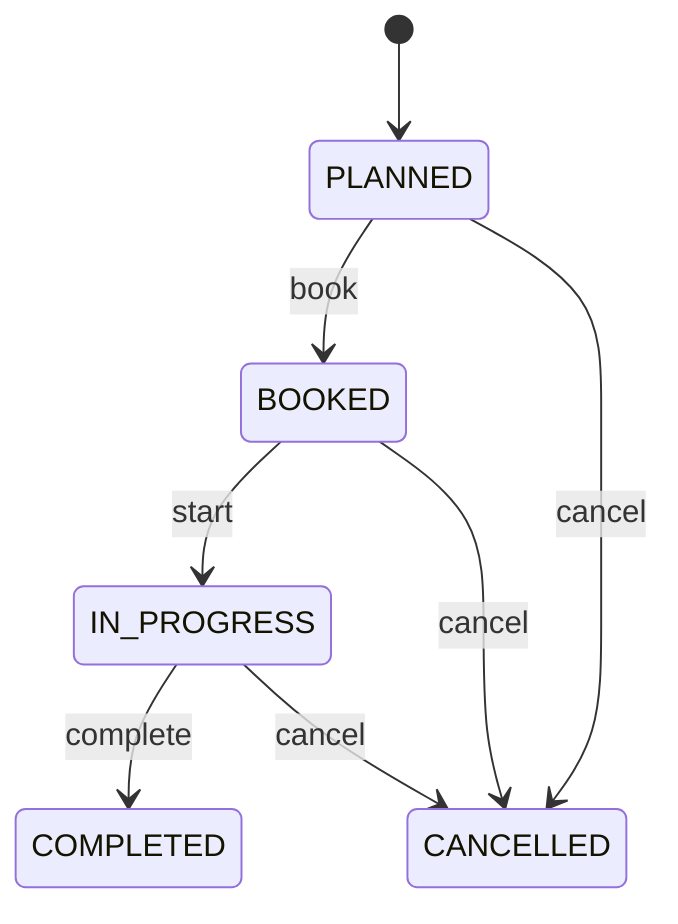

# Trip

Represents a travel entity called TripSegment within the CEDM business model. TripSegment is a business concept with its own identity and lifecycle. It captures information that must remain understandable independently of a database, API, or user interface. Used by business processes, transactions, forms, reports, integrations, and domain capabilities that create, find, change, or relate TripSegment records. The entity participates in a wider business graph through relationships with Trip, Location, Location, Vehicle. These relationships provide the context needed to interpret the record rather than treating its fields as isolated database columns. The entity lifecycle is governed by its status, invariants, and related business processes. State changes must preserve the declared business meaning and relationships. A typical TripSegment record represents one identifiable business occurrence or master-data object that can be referenced by related CEDM processes.

## Finding records

Lines are added from the parent: open a **Trip** and choose the **Trip** tab.

The list shows Sequence, Mode, Departure At, Arrival At, Status, Trip, Origin, with the most recently changed record first. The **Help** button beside the title opens this window's help text.

- **Search**: type in the search box above the grid to narrow the rows. **Search** at the top left opens advanced search, where you pick a field, a comparison (equals, contains, starts with, before, after, and so on) and a value.
- **Sort**: click a column heading; click again to reverse.
- **Refresh**: the refresh button at the top right re-reads the rows and every dropdown, so a record created a moment ago by someone else appears.
- **Export**: **CSV** downloads the rows you are looking at.
- **Open a record**: click a row. The line under the title, "Showing 1 to n of N entries", tells you how many rows match.

## Adding a line

Open the parent record, choose the **Trip** tab and use **New**. The line is tied to its parent automatically.

## Reading, changing and deleting a record

Click a row to open the record. Above the fields are the arrows that step through the list ("1 of 5"). Below them sit **Notes**, where anyone may leave a comment on the record, and the **Audit Trail**, which lists every change with who made it, when, and which fields changed.

- **Edit** (toolbar) makes the fields editable. Change them and choose **Save**; **Undo Changes** puts back what you changed and **Cancel Editing** leaves edit mode.
- **Copy Record** starts a new record from this one.
- **Delete Record** is available in edit mode and asks you to confirm; a record other records still depend on cannot be deleted.

Every change is also written to the [Audit Log](/administration/#audit-log).

## Fields

| Field | What you use | Rules | What to enter |
| --- | --- | --- | --- |
| Sequence | Whole number | Required | Captures the business meaning of sequence for the TripSegment. It is interpreted together with the entity's other attributes and relationships to support the processes that manage this record. Used when creating, reviewing, searching, validating, reporting on, or integrating TripSegment records, where applicable. Its meaning is specific to TripSegment; it must be interpreted with the entity's relationships, lifecycle, and business rules rather than as an isolated technical value. Required because the business model cannot reliably interpret the record for its declared purpose without this value. |
| Mode | Choice | Required | Captures the business meaning of mode for the TripSegment. It is interpreted together with the entity's other attributes and relationships to support the processes that manage this record. Used when creating, reviewing, searching, validating, reporting on, or integrating TripSegment records, where applicable. Its meaning is specific to TripSegment; it must be interpreted with the entity's relationships, lifecycle, and business rules rather than as an isolated technical value. Represents the air state or classification in the context of TripSegment. Represents the rail state or classification in the context of TripSegment. Represents the road state or classification in the context of TripSegment. Represents the sea state or classification in the context of TripSegment. Represents the bus state or classification in the context of TripSegment. Represents the walk state or classification in the context of TripSegment. Represents the other state or classification in the context of TripSegment. Required because the business model cannot reliably interpret the record for its declared purpose without this value. Choose one: Air, Rail, Road, Sea, Bus, Walk, Other. |
| Departure At | Date and time | Required | Records when the departure event occurred. It establishes chronology, supports auditability, and helps coordinate related lifecycle and process activities. Used when creating, reviewing, searching, validating, reporting on, or integrating TripSegment records, where applicable. Its meaning is specific to TripSegment; it must be interpreted with the entity's relationships, lifecycle, and business rules rather than as an isolated technical value. Required because the business model cannot reliably interpret the record for its declared purpose without this value. |
| Arrival At | Date and time | Optional | Records when the arrival event occurred. It establishes chronology, supports auditability, and helps coordinate related lifecycle and process activities. Used when creating, reviewing, searching, validating, reporting on, or integrating TripSegment records, where applicable. Its meaning is specific to TripSegment; it must be interpreted with the entity's relationships, lifecycle, and business rules rather than as an isolated technical value. Optional because the business concept can remain valid when this value is not yet known or is not applicable. |
| Status | Choice | Required | The lifecycle state of the record. It controls which business actions are normally permitted and how the record is treated by related processes. Used when creating, reviewing, searching, validating, reporting on, or integrating TripSegment records, where applicable. Its meaning is specific to TripSegment; it must be interpreted with the entity's relationships, lifecycle, and business rules rather than as an isolated technical value. Represents the planned state or classification in the context of TripSegment. Represents the booked state or classification in the context of TripSegment. Represents the in progress state or classification in the context of TripSegment. Represents the completed state or classification in the context of TripSegment. Represents the cancelled state or classification in the context of TripSegment. Required because the business model cannot reliably interpret the record for its declared purpose without this value. Choose one: Planned, Booked, In progress, Completed, Cancelled. |
| Trip | Lookup | Required | Connects TripSegment to Trip so related business context can be navigated and enforced. Used when processes need to find or reason about Trip records associated with a TripSegment. The declared cardinality 1 expresses how many related records may participate in the relationship. The relationship is part of the CEDM semantic graph and is interpreted together with source and target entities, ownership, conditions, and invariants. Pick a record from **Trip**. |
| Origin | Lookup | Required | Connects TripSegment to Location so related business context can be navigated and enforced. Used when processes need to find or reason about Location records associated with a TripSegment. The declared cardinality 1 expresses how many related records may participate in the relationship. The relationship is part of the CEDM semantic graph and is interpreted together with source and target entities, ownership, conditions, and invariants. Pick a record from **Location**. |
| Vehicle | Lookup | Optional | Connects TripSegment to Vehicle so related business context can be navigated and enforced. Used when processes need to find or reason about Vehicle records associated with a TripSegment. The declared cardinality 0..1 expresses how many related records may participate in the relationship. The relationship is part of the CEDM semantic graph and is interpreted together with source and target entities, ownership, conditions, and invariants. Pick a record from **Vehicle**. |

## How it connects to other records

A trip is a line of a **Trip**. It has no window of its own: open the trip and use the **Trip** tab to see and add lines.
- A trip belongs to one **Trip**.
- A trip belongs to one **Location**.
- A trip belongs to one **Vehicle**.

## Lifecycle: Trip segment lifecycle

A trip record starts as **Planned** and ends as **Completed** or **Cancelled**. Open a record and the bar above its fields shows its current **State** and, after **Next**, a button for each move that leaves it; choose one to make the move. Any move the diagram does not draw is refused, for everyone including the administrator.

| From | To | Move |
| --- | --- | --- |
| Planned | Booked | Book |
| Booked | In progress | Start |
| In progress | Completed | Complete |
| Planned | Cancelled | Cancel |
| Booked | Cancelled | Cancel |
| In progress | Cancelled | Cancel |

## What happens when you save
Business rules run around the save. They are listed here and explained in full under [Business rules](/administration/rules/).

| Rule | When | Order |
| --- | --- | --- |
| Trip segment workflows after update | after a trip is changed | 100 |

Processes started from this record: [Trip segment follow up required](/administration/processes/#trip-segment-follow-up-required).

## Who may use it

Anyone who holds a role with access to the **Trip** window. Access is granted by role under [Roles and access](/administration/access/).
