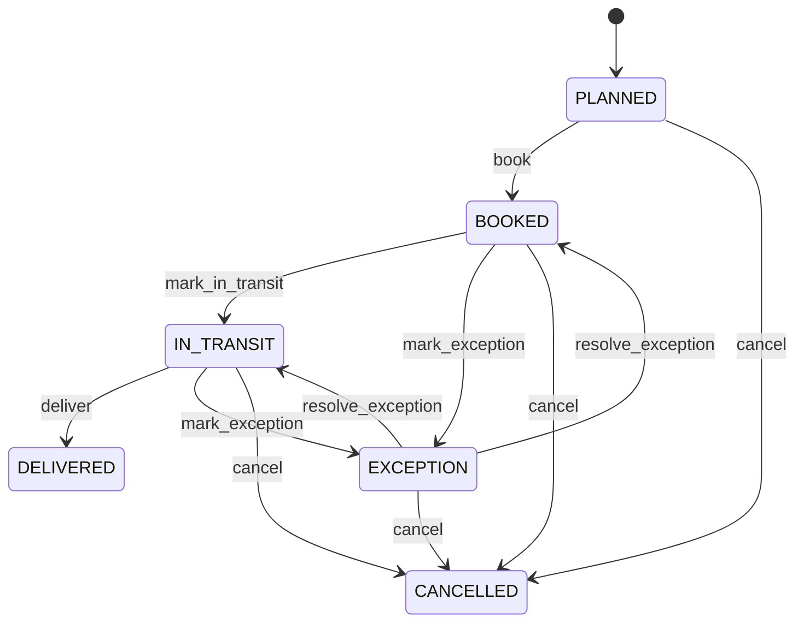

# Shipment

Represents physical logistics execution bridging commercial fulfillment and transport while keeping inventory and financial state under their authoritative workflows. Shipment answers how goods are physically moved. It is not itself the inventory ledger, SalesOrder fulfillment ledger, GoodsReceipt acceptance, or financial settlement. Transportation, warehouse operations, procurement, order fulfillment, carrier management, customs, customer service and container logistics. SalesOrder supplies outbound demand, PurchaseOrder supplies inbound procurement context, Container supplies equipment, Location supplies endpoints, InventoryMovement supplies stock consequences, GoodsReceipt supplies inbound acceptance, and Invoice supplies financial claim. Outbound: confirmed SalesOrder → allocation/reservation → pick/issue → Shipment booked → dispatch → transport → delivery evidence → SalesOrder fulfillment update. Inbound: PurchaseOrder → expected shipment → arrival → GoodsReceipt → acceptance → InventoryMovement. Transfer: source allocation → dispatch issue → transit → destination receipt. Return: authorized return → transport → receipt/inspection → disposition → inventory movement. Planned → booked → in transit → delivered, with cancellation and exception paths. Delivery evidence contributes to fulfillment but never bypasses authoritative inventory or financial workflows. Shipment status changes invoke dependent workflow transitions; master-data changes affecting an open shipment require revalidation; posted downstream effects require compensating events for reversal. Dispatch, delivery and inventory posting require idempotency keys and concurrency control to prevent duplicate issue/receipt/fulfillment effects. Twelve units are reserved for an outbound SalesOrder. Dispatch creates one authoritative inventory issue event for the shipped quantity and updates fulfillment through the controlled workflow. A retry cannot issue the same quantity twice. Delivery confirms transport completion but does not itself settle the invoice.

## Finding records

Open **Shipment** from the menu or from its card on the dashboard.

The list shows Shipment Number, Shipment Type, Status, Planned Date, Actual Date, Tracking Reference, Origin, with the most recently changed record first. The **Help** button beside the title opens this window's help text.

- **Search**: type in the search box above the grid to narrow the rows. **Search** at the top left opens advanced search, where you pick a field, a comparison (equals, contains, starts with, before, after, and so on) and a value.
- **Sort**: click a column heading; click again to reverse.
- **Refresh**: the refresh button at the top right re-reads the rows and every dropdown, so a record created a moment ago by someone else appears.
- **Export**: **CSV** downloads the rows you are looking at.
- **Open a record**: click a row. The line under the title, "Showing 1 to n of N entries", tells you how many rows match.

## Creating a record

Choose **New** at the top of the list. The form opens on its own page, with the fields in sections. A badge beside each label names the control (Text, Dropdown, Date, and so on); a red star marks a required field; the question-mark icon shows that field's help; and a hint such as “max 300” shows the longest entry accepted.

1. Fill in the fields described under [Fields](#fields).
2. These are required and must be completed before the record can be saved: **Shipment Number**, **Shipment Type**, **Status**.
3. For a dropdown that points at another window, pick the matching record; if the record you need does not exist yet, create it in its own window first. A dropdown may narrow to what you have already chosen, for example the states of the chosen country.
4. Choose **Create** (or **Save** in the toolbar). You return to the record, and it appears at the top of the list. If something is wrong the form says which field and why, and nothing is saved.

## Reading, changing and deleting a record

Click a row to open the record. Above the fields are the arrows that step through the list ("1 of 5"). Below them sit **Notes**, where anyone may leave a comment on the record, and the **Audit Trail**, which lists every change with who made it, when, and which fields changed.

- **Edit** (toolbar) makes the fields editable. Change them and choose **Save**; **Undo Changes** puts back what you changed and **Cancel Editing** leaves edit mode.
- **Copy Record** starts a new record from this one.
- **Delete Record** is available in edit mode and asks you to confirm; a record other records still depend on cannot be deleted.

Every change is also written to the [Audit Log](/administration/#audit-log).

## Fields

| Field | What you use | Rules | What to enter |
| --- | --- | --- | --- |
| Shipment Number | Text | Required, Unique, Up to 100 characters | The shipment number of the shipment: a value the business records on it. Entered or maintained when a shipment is created or changed; shown on its form and available to search and reports. Read together with the shipment's other fields and its relationships; it is not meaningful on its own. Required: a shipment cannot be understood without its shipment number. |
| Shipment Type | Choice | Required | The shipment type of the shipment: a value the business records on it. Entered or maintained when a shipment is created or changed; shown on its form and available to search and reports. Read together with the shipment's other fields and its relationships; it is not meaningful on its own. Required: a shipment cannot be understood without its shipment type. The shipment type of the shipment is inbound; set it when that is what the business means for this record. The shipment type of the shipment is outbound; set it when that is what the business means for this record. The shipment type of the shipment is transfer; set it when that is what the business means for this record. The shipment type of the shipment is return; set it when that is what the business means for this record. Choose one: Inbound, Outbound, Transfer, Return. |
| Status | Choice | Required | Operational execution state of the shipment. Controls booking, dispatch, tracking, delivery, exception and cancellation actions. Status is not inventory status and does not itself prove customer acceptance or invoice payment. Drives permitted logistics transitions and downstream fulfillment/movement workflows. The status of the shipment is planned; set it when that is what the business means for this record. The status of the shipment is booked; set it when that is what the business means for this record. The status of the shipment is in transit; set it when that is what the business means for this record. The status of the shipment is delivered; set it when that is what the business means for this record. The status of the shipment is cancelled; set it when that is what the business means for this record. The status of the shipment is exception; set it when that is what the business means for this record. Choose one: Planned, Booked, In transit, Delivered, Cancelled, Exception. |
| Planned Date | Date | Optional | The planned date of the shipment: a calendar date the business records on it. Entered or maintained when a shipment is created or changed; shown on its form and available to search and reports. Read together with the shipment's other fields and its relationships; it is not meaningful on its own. |
| Actual Date | Date | Optional | The actual date of the shipment: a calendar date the business records on it. Entered or maintained when a shipment is created or changed; shown on its form and available to search and reports. Read together with the shipment's other fields and its relationships; it is not meaningful on its own. |
| Tracking Reference | Text | Up to 200 characters | The tracking reference of the shipment: a value the business records on it. Entered or maintained when a shipment is created or changed; shown on its form and available to search and reports. Read together with the shipment's other fields and its relationships; it is not meaningful on its own. |
| Origin | Lookup | Optional | Links a shipment to location, the origin it relates to. Chosen from the existing location records when the shipment is created or edited. A shipment has at most one location in this role. Lets the shipment be found from, and reported with, its location. Pick a record from **Location**. |
| Carrier | Lookup | Optional | Links a shipment to party, the carrier it relates to. Chosen from the existing party records when the shipment is created or edited. A shipment has at most one party in this role. Lets the shipment be found from, and reported with, its party. Pick a record from **Party**. |
| Sales Order | Lookup | Optional | Links a shipment to sales order, the sales order it relates to. Chosen from the existing sales order records when the shipment is created or edited. A shipment has at most one sales order in this role. Lets the shipment be found from, and reported with, its sales order. Pick a record from **Sales Order**. |
| Sales Order Line | Lookup | Optional | The SalesOrderLine this Shipment belongs to. Pick a record from **Sales Order**. |

## How it connects to other records
- A shipment has many **Shipment** records.
- A shipment belongs to one **Location**.
- A shipment belongs to one **Party**.
- A shipment belongs to one **Sales Order**.
- A shipment has many **Inventory Movement** records.
- A shipment has many **Delivery** records.
- A shipment has many **Freight Charge** records.
- A shipment has many **Tracking Event** records.

## Lifecycle: Shipment lifecycle

A shipment record starts as **Planned** and ends as **Delivered** or **Cancelled**. Open a record and the bar above its fields shows its current **State** and, after **Next**, a button for each move that leaves it; choose one to make the move. Any move the diagram does not draw is refused, for everyone including the administrator.

| From | To | Move |
| --- | --- | --- |
| Planned | Booked | Book |
| Booked | In transit | Mark in transit |
| In transit | Delivered | Deliver |
| Booked | Exception | Mark exception |
| Exception | Booked | Resolve exception |
| In transit | Exception | Mark exception |
| Exception | In transit | Resolve exception |
| Planned | Cancelled | Cancel |
| Booked | Cancelled | Cancel |
| In transit | Cancelled | Cancel |
| Exception | Cancelled | Cancel |

## What happens when you save
Business rules run around the save. They are listed here and explained in full under [Business rules](/administration/rules/).

| Rule | When | Order |
| --- | --- | --- |
| Shipment workflows after update | after a shipment is changed | 100 |

Processes started from this record: [Shipment exception raised](/administration/processes/#shipment-exception-raised), [Shipment follow up required](/administration/processes/#shipment-follow-up-required), [Shipment completion confirmed](/administration/processes/#shipment-completion-confirmed).

## Who may use it

Anyone who holds a role with access to the **Shipment** window. Access is granted by role under [Roles and access](/administration/access/).
