# Record lifecycles

A lifecycle is the set of states a record can be in and the moves between them. The application enforces it on every write, through the screen and through the API: a move the diagram does not draw is refused for everyone, administrators included. Role restrictions narrow who may make a particular move. This application has **15** lifecycles.

## Party: Party lifecycle

States: **Active**, **Inactive**, **Blocked**, **Retired**. A new record starts as **Active**; **Retired** ends the lifecycle.

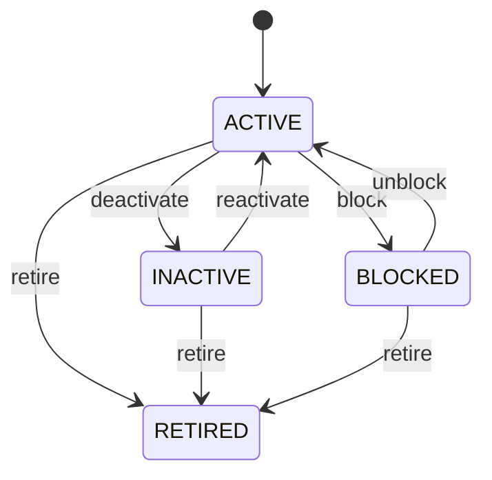

Any role that may change the record may make any move the diagram draws.

See [Party](/entities/foundation/party/) for the record itself.

## Organization: Organization lifecycle

States: **Draft**, **Active**, **Inactive**, **Retired**. A new record starts as **Draft**; **Retired** ends the lifecycle.

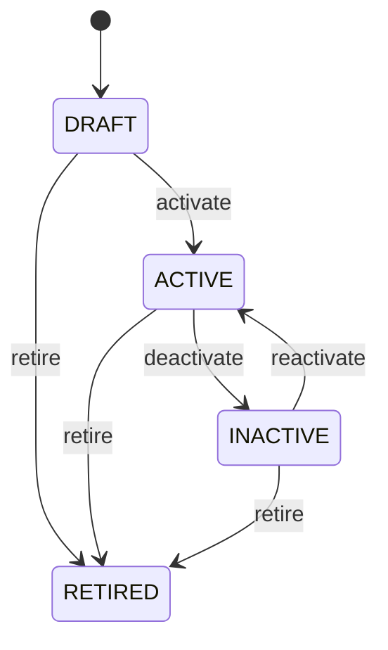

Any role that may change the record may make any move the diagram draws.

See [Organization](/entities/foundation/organization/) for the record itself.

## Party Role: Party role lifecycle

States: **Active**, **Inactive**, **Expired**. A new record starts as **Active**; **Expired** ends the lifecycle.

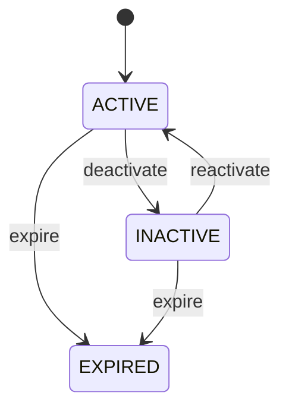

Any role that may change the record may make any move the diagram draws.

See [Party Role](/entities/foundation/party-role/) for the record itself.

## Address: Address lifecycle

States: **Active**, **Inactive**, **Retired**. A new record starts as **Active**; **Retired** ends the lifecycle.

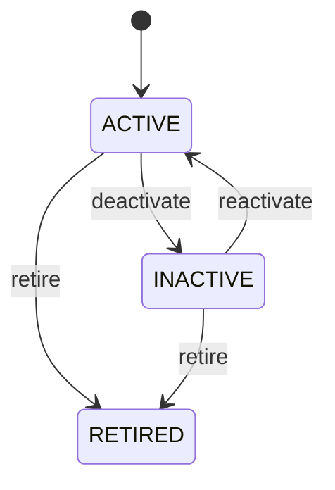

Any role that may change the record may make any move the diagram draws.

See [Address](/entities/foundation/address/) for the record itself.

## Location: Location lifecycle

States: **Planned**, **Active**, **Inactive**, **Closed**, **Retired**. A new record starts as **Planned**; **Closed**, **Retired** ends the lifecycle.

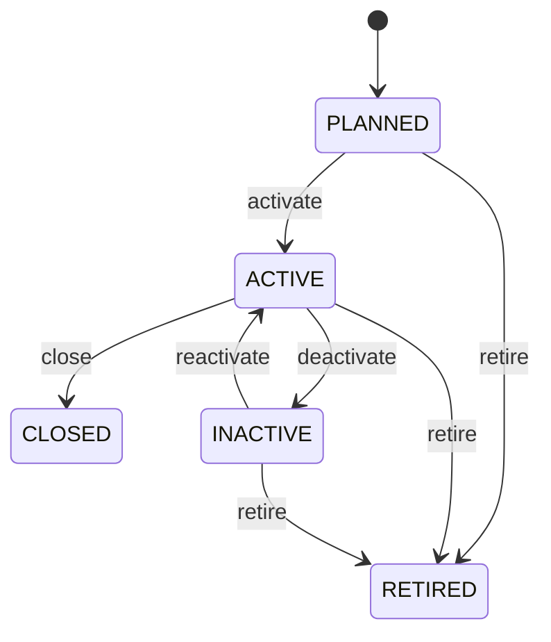

Any role that may change the record may make any move the diagram draws.

See [Location](/entities/foundation/location/) for the record itself.

## Currency: Currency lifecycle

States: **Active**, **Inactive**, **Retired**. A new record starts as **Active**; **Retired** ends the lifecycle.

Any role that may change the record may make any move the diagram draws.

See [Currency](/entities/foundation/currency/) for the record itself.

## Exchange Rate: Exchange rate lifecycle

States: **Draft**, **Active**, **Expired**, **Cancelled**. A new record starts as **Draft**; **Expired**, **Cancelled** ends the lifecycle.

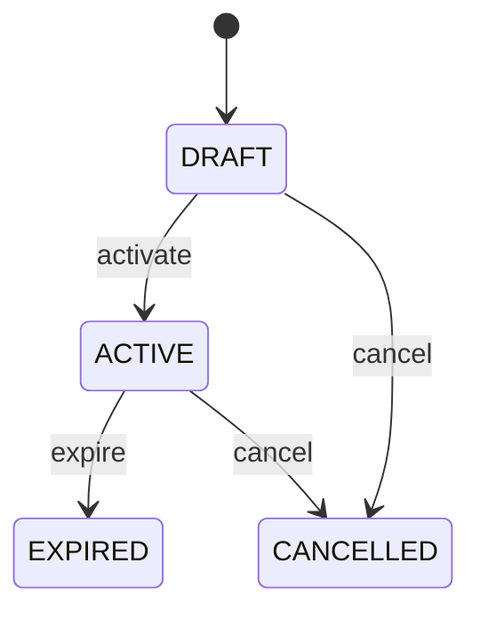

Any role that may change the record may make any move the diagram draws.

See [Exchange Rate](/entities/foundation/exchange-rate/) for the record itself.

## Unit Of Measure: Unit of measure lifecycle

States: **Active**, **Inactive**, **Retired**. A new record starts as **Active**; **Retired** ends the lifecycle.

Any role that may change the record may make any move the diagram draws.

See [Unit Of Measure](/entities/foundation/unit-of-measure/) for the record itself.

## Task: Task lifecycle

States: **Created**, **Ready**, **Assigned**, **In progress**, **Blocked**, **Completed**, **Cancelled**, **Failed**. A new record starts as **Created**; **Completed**, **Cancelled**, **Failed** ends the lifecycle.

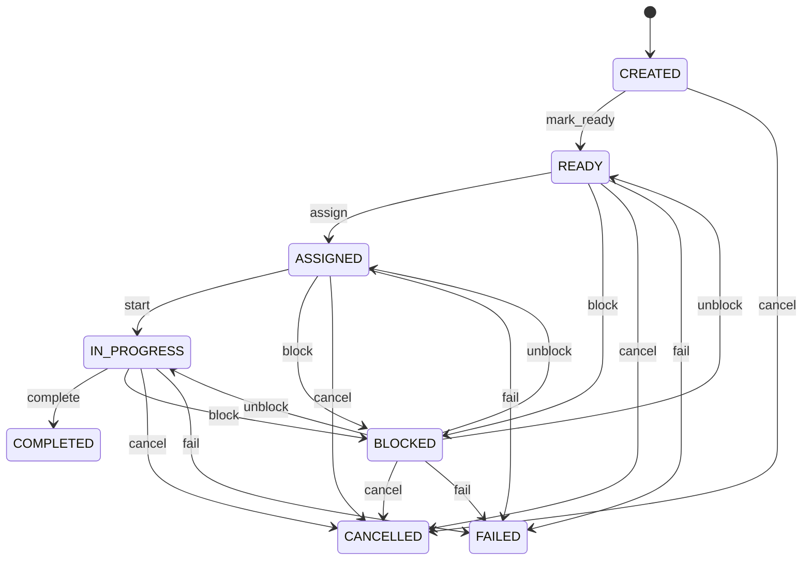

Any role that may change the record may make any move the diagram draws.

See [Task](/entities/foundation/task/) for the record itself.

## Asset: Asset lifecycle

States: **Planned**, **Active**, **Under maintenance**, **Held**, **Disposed**, **Retired**. A new record starts as **Planned**; **Disposed**, **Retired** ends the lifecycle.

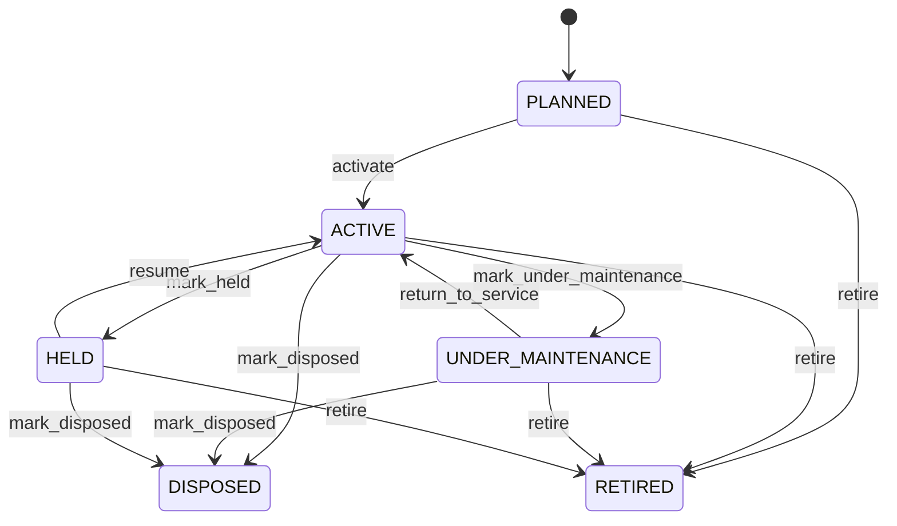

Any role that may change the record may make any move the diagram draws.

See [Asset](/entities/maintenance-management/asset/) for the record itself.

## Maintenance Plan: Maintenance plan lifecycle

States: **Draft**, **Active**, **Suspended**, **Retired**. A new record starts as **Draft**; **Retired** ends the lifecycle.

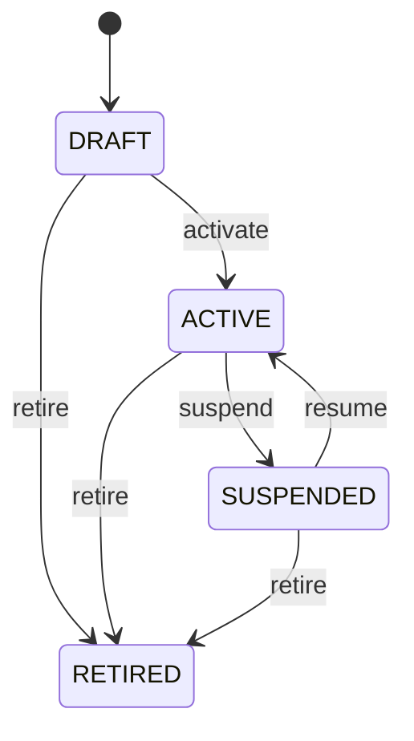

Any role that may change the record may make any move the diagram draws.

See [Maintenance Plan](/entities/maintenance-management/maintenance-plan/) for the record itself.

## Maintenance Work Order: Maintenance work order lifecycle

States: **Open**, **Planned**, **Assigned**, **In progress**, **On hold**, **Completed**, **Cancelled**. A new record starts as **Planned**; **Completed**, **Cancelled** ends the lifecycle.

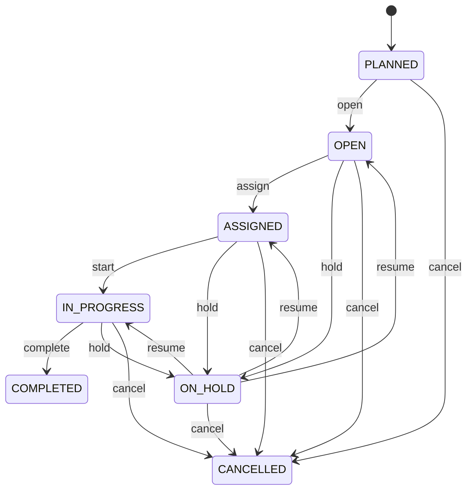

Any role that may change the record may make any move the diagram draws.

See [Maintenance Work Order](/entities/maintenance-management/maintenance-work-order/) for the record itself.

## Repair Estimate: Repair estimate lifecycle

States: **Draft**, **Submitted**, **Approved**, **Rejected**, **Completed**, **Cancelled**. A new record starts as **Draft**; **Completed**, **Rejected**, **Cancelled** ends the lifecycle.

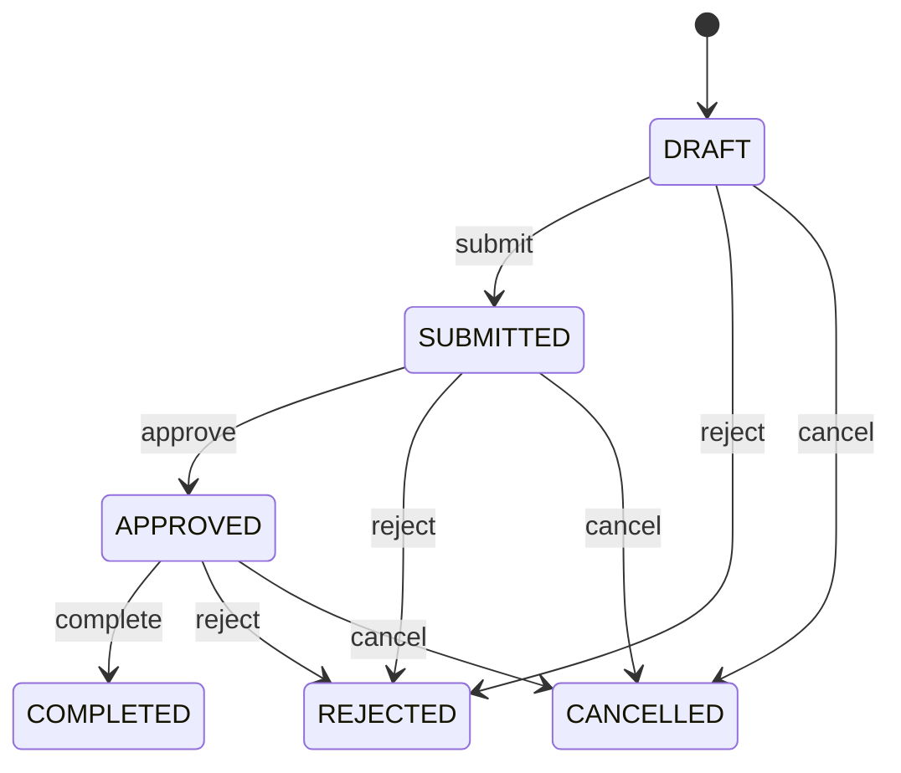

Any role that may change the record may make any move the diagram draws.

See [Repair Estimate](/entities/maintenance-management/repair-estimate/) for the record itself.

## Container: Container lifecycle

States: **Active**, **In repair**, **Damaged**, **Sold**, **Scrapped**, **Lost**, **Retired**. A new record starts as **Active**; **Sold**, **Scrapped**, **Lost**, **Retired** ends the lifecycle.

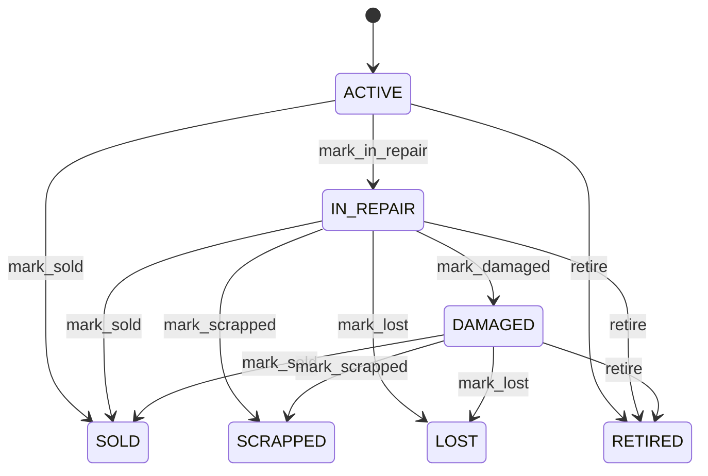

Any role that may change the record may make any move the diagram draws.

See [Container](/entities/foundation/container/) for the record itself.

## Product: Product lifecycle

States: **Draft**, **Active**, **Discontinued**, **Blocked**, **Retired**. A new record starts as **Draft**; **Discontinued**, **Retired** ends the lifecycle.

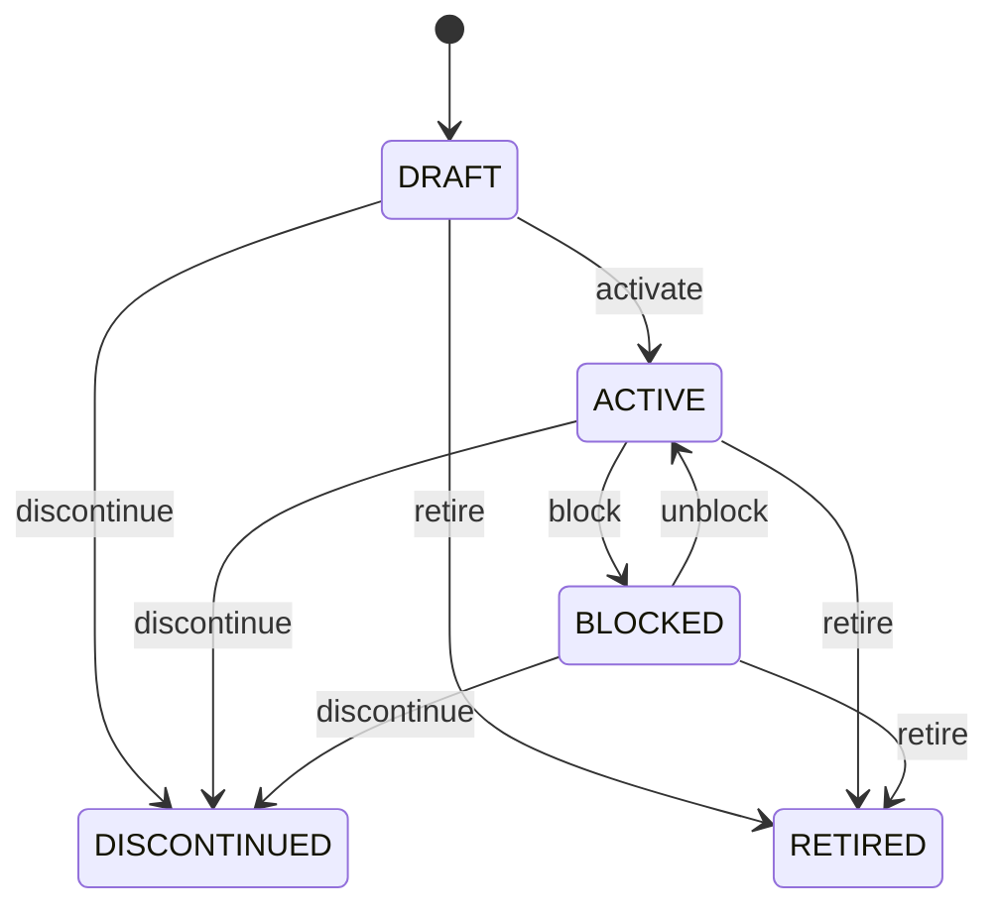

Any role that may change the record may make any move the diagram draws.

See [Product](/entities/foundation/product/) for the record itself.

