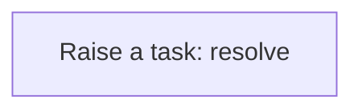
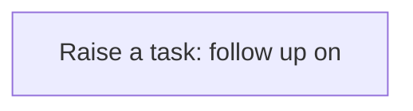
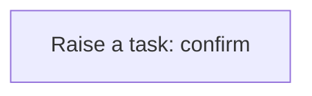
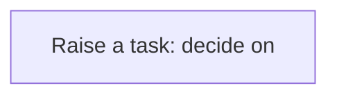

# Processes

A process is a sequence of steps the application runs for you: create a task, update a record, call a service. A business rule usually starts it; you can also run one by hand from the Workflow Designer. Every run is logged step by step in the Workflow Monitor. This application has **10** processes.

## Party exception raised {#party-exception-raised}

When a party is blocked, a high-priority task asks someone to resolve it.

Runs when a **Party** is changed, started by a business rule.

1. **Raise a task: resolve** — creates a **Task** record.

## Exchange rate follow up required {#exchange-rate-follow-up-required}

When a exchange rate is cancelled, a task asks someone to settle what depended on it.

Runs when a **Exchange Rate** is changed, started by a business rule.

1. **Raise a task: follow up on** — creates a **Task** record.

## Asset exception raised {#asset-exception-raised}

When a asset is held, a high-priority task asks someone to resolve it.

Runs when a **Asset** is changed, started by a business rule.

1. **Raise a task: resolve** — creates a **Task** record.

## Maintenance work order exception raised {#maintenance-work-order-exception-raised}

When a maintenance work order is on hold, a high-priority task asks someone to resolve it.

Runs when a **Maintenance Work Order** is changed, started by a business rule.

1. **Raise a task: resolve** — creates a **Task** record.

## Maintenance work order follow up required {#maintenance-work-order-follow-up-required}

When a maintenance work order is cancelled, a task asks someone to settle what depended on it.

Runs when a **Maintenance Work Order** is changed, started by a business rule.

1. **Raise a task: follow up on** — creates a **Task** record.

## Maintenance work order completion confirmed {#maintenance-work-order-completion-confirmed}

When a maintenance work order is completed, a task asks someone to confirm the outcome.

Runs when a **Maintenance Work Order** is changed, started by a business rule.

1. **Raise a task: confirm** — creates a **Task** record.

## Repair estimate approval requested {#repair-estimate-approval-requested}

When a repair estimate is submitted, a task asks someone to decide on it.

Runs when a **Repair Estimate** is changed, started by a business rule.

1. **Raise a task: decide on** — creates a **Task** record.

## Repair estimate follow up required {#repair-estimate-follow-up-required}

When a repair estimate is rejected or cancelled, a task asks someone to settle what depended on it.

Runs when a **Repair Estimate** is changed, started by a business rule.

1. **Raise a task: follow up on** — creates a **Task** record.

## Repair estimate completion confirmed {#repair-estimate-completion-confirmed}

When a repair estimate is completed, a task asks someone to confirm the outcome.

Runs when a **Repair Estimate** is changed, started by a business rule.

1. **Raise a task: confirm** — creates a **Task** record.

## Product exception raised {#product-exception-raised}

When a product is blocked, a high-priority task asks someone to resolve it.

Runs when a **Product** is changed, started by a business rule.

1. **Raise a task: resolve** — creates a **Task** record.

