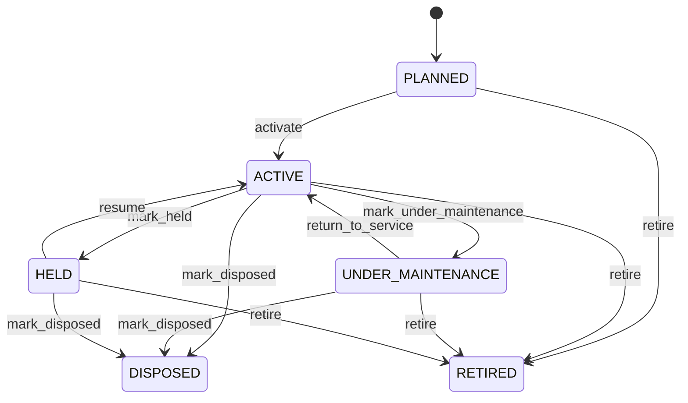

# Asset

Represents the long-lived business object for a durable resource whose identity, ownership, location, maintenance, financial treatment, and lifecycle must be managed over time. Asset is the instance-level concept used when an organization must manage a specific physical or accountable resource rather than merely a product type. A container, vehicle, machine, aircraft, or facility equipment item can be represented as an Asset when individual lifecycle and accountability matter. Used across asset management, maintenance, finance, depreciation, inventory, logistics, leasing, insurance, compliance, and operational planning. Product describes what the asset is as a standardized model. Asset identifies the individual resource. Location describes current operational placement. MaintenanceWorkOrder records maintenance activity. AssetDepreciation records financial measurement. Organization identifies ownership when applicable. Historical movements and transactions should preserve changes rather than overwriting the asset's identity. An asset may be planned before entering service, active during productive use, under maintenance while temporarily unavailable, held pending a business decision, disposed when ownership/control has ended, or retired when operational use has ceased. Lifecycle state should not erase history; it changes how current processes may act on the asset. A shipping container is acquired and assigned an assetNumber and serial/equipment identity. It is linked to a Product model, located at a depot, receives MaintenanceWorkOrder records during its service life, and has AssetDepreciation records for financial reporting. When its repair economics no longer justify continued use, a RepairEstimate may recommend SALE or SCRAP; the resulting disposition changes the asset lifecycle while preserving its historical record.

## Finding records

Open **Asset** from the menu or from its card on the dashboard.

The list shows Asset Number, Name, Asset Type, Acquisition Date, Acquisition Cost, Status, Serial Number, with the most recently changed record first. The **Help** button beside the title opens this window's help text.

- **Search**: type in the search box above the grid to narrow the rows. **Search** at the top left opens advanced search, where you pick a field, a comparison (equals, contains, starts with, before, after, and so on) and a value.
- **Sort**: click a column heading; click again to reverse.
- **Refresh**: the refresh button at the top right re-reads the rows and every dropdown, so a record created a moment ago by someone else appears.
- **Export**: **CSV** downloads the rows you are looking at.
- **Open a record**: click a row. The line under the title, "Showing 1 to n of N entries", tells you how many rows match.

## Creating a record

Choose **New** at the top of the list. The form opens on its own page, with the fields in sections. A badge beside each label names the control (Text, Dropdown, Date, and so on); a red star marks a required field; the question-mark icon shows that field's help; and a hint such as “max 300” shows the longest entry accepted.

1. Fill in the fields described under [Fields](#fields).
2. These are required and must be completed before the record can be saved: **Asset Number**, **Name**, **Asset Type**, **Status**.
3. For a dropdown that points at another window, pick the matching record; if the record you need does not exist yet, create it in its own window first. A dropdown may narrow to what you have already chosen, for example the states of the chosen country.
4. Choose **Create** (or **Save** in the toolbar). You return to the record, and it appears at the top of the list. If something is wrong the form says which field and why, and nothing is saved.

## Reading, changing and deleting a record

Click a row to open the record. Above the fields are the arrows that step through the list ("1 of 5"). Below them sit **Notes**, where anyone may leave a comment on the record, and the **Audit Trail**, which lists every change with who made it, when, and which fields changed.

- **Edit** (toolbar) makes the fields editable. Change them and choose **Save**; **Undo Changes** puts back what you changed and **Cancel Editing** leaves edit mode.
- **Copy Record** starts a new record from this one.
- **Delete Record** is available in edit mode and asks you to confirm; a record other records still depend on cannot be deleted.

Every change is also written to the [Audit Log](/administration/#audit-log).

## Fields

| Field | What you use | Rules | What to enter |
| --- | --- | --- | --- |
| Asset Number | Text | Required, Unique, Up to 100 characters | The organization-assigned business identifier used to recognize an asset in operational and financial processes. Used by asset managers, maintenance teams, finance, warehouse operations, reports, documents, and users when referring to the asset. It is the organization's business reference, while serialNumber may identify the manufacturer's physical equipment identity and assetId remains the immutable CEDM identity. Required because managed assets need a recognizable organizational identifier. |
| Name | Text | Required, Up to 300 characters | A human-readable description of the asset used to identify it in lists, forms, reports, and operational communication. Supports search, maintenance screens, asset registers, reporting, and user recognition when an asset number alone is insufficient. The name describes this asset instance and should not be confused with Product.name, which describes a reusable product definition or asset type. Required for practical human interpretation of the asset record. |
| Asset Type | Text | Required, Up to 100 characters | Classifies the kind of durable resource represented by the asset, such as container, vehicle, machine, building equipment, or other capital-controlled resource. Drives asset policies, maintenance programs, depreciation treatment, reporting, authorization, and lifecycle rules. assetType classifies the asset instance; Product can provide the standardized model or product definition from which the asset originated. Required because asset lifecycle and financial treatment depend on the type of resource being managed. |
| Acquisition Date | Date | Optional | The business date on which the organization acquired or otherwise recognized control of the asset. Used for capitalization, depreciation start rules, asset aging, warranty analysis, lifecycle reporting, and ownership history. AcquisitionDate concerns the organization's acquisition event and is distinct from manufacture date, commissioning date, or first operational use. Optional when the asset predates the available records or acquisition occurred outside the modeled process. |
| Acquisition Cost | Amount | Optional | The capitalized or recognized cost associated with acquiring the asset under the organization's accounting policy. Used as an input to capitalization, depreciation, book-value calculations, asset valuation, and financial reporting. Acquisition cost is an accounting/business value and should not be confused with Product price, repair cost, sale price, or current market value. Optional for assets whose historical cost is unavailable, immaterial, or maintained in a separate financial system. |
| Status | Choice | Required | The lifecycle state describing whether the asset is planned, operational, temporarily unavailable, disposed, or retired. Controls operational availability, maintenance eligibility, reporting, depreciation policy, and downstream business actions. Asset status describes the asset's lifecycle, while MaintenanceWorkOrder status describes a particular maintenance activity. An asset can be UNDER_MAINTENANCE while a work order is IN_PROGRESS. The asset is expected to enter service or be recognized operationally but is not yet active. The asset is available for its intended business use subject to normal operational constraints. The asset is temporarily undergoing maintenance and may be unavailable or restricted from normal use. The asset is intentionally retained but is not currently available for normal productive use, often pending inspection, disposition, or another decision. The organization has completed the disposition process and no longer treats the asset as an active managed resource. The asset has been withdrawn from operational use, while historical records may remain available for audit and analysis. Required because asset processes need an authoritative lifecycle state. Choose one: Planned, Active, Under maintenance, Held, Disposed, Retired. |
| Serial Number | Text | Up to 200 characters | The manufacturer or industry identifier permanently associated with the physical equipment when such an identifier exists. Used for equipment traceability, warranty, maintenance history, inspections, recalls, regulatory reporting, and physical identification. SerialNumber identifies physical equipment supplied by a manufacturer; it is different from the organization's assetNumber and CEDM assetId. Optional for assets that are not individually serialized or where the serial identifier is unavailable. |
| Owner | Lookup | Optional | Identifies the organization that legally or commercially owns the asset when ownership is relevant to the asset model. Used for ownership reporting, financial accountability, insurance, maintenance responsibility, leasing, and disposition. Zero or one owner may be recorded because ownership may be external, shared, represented by a separate agreement, or maintained in another system. Owner is an organizational relationship; it is distinct from the Party that currently possesses, leases, operates, or maintains the asset. Pick a record from **Organization**. |
| Location | Lookup | Optional | Identifies the current operational location at which the asset is recorded or physically situated. Used for maintenance dispatch, inventory visibility, asset tracking, utilization, inspections, and operational planning. Zero or one current location may be recorded when the asset is mobile, in transit, or its location is maintained through a separate movement system. Location is current state; historical movements should be preserved through movement/event entities rather than inferred from a changing location field. Pick a record from **Location**. |
| Product | Lookup | Optional | Identifies the standardized product or equipment model from which the asset instance was created or classified. Used for technical specifications, spare-parts planning, maintenance standards, procurement, fleet classification, and analytics. Zero or one Product may be linked because not every managed asset has a corresponding product-master definition. Product represents the reusable definition or model; Asset represents the individually managed instance. Pick a record from **Product**. |
| Maintenance Plan | Lookup | Optional | The MaintenancePlan this Asset belongs to. Pick a record from **Maintenance Plan**. |

## How it connects to other records
- A asset belongs to one **Organization**.
- A asset belongs to one **Location**.
- A asset belongs to one **Product**.
- A asset has many **Maintenance Work Order** records.
- A asset belongs to one **Maintenance Plan**.
- A asset has many **Equipment** records.

## Lifecycle: Asset lifecycle

A asset record starts as **Planned** and ends as **Disposed** or **Retired**. Open a record and the bar above its fields shows its current **State** and, after **Next**, a button for each move that leaves it; choose one to make the move. Any move the diagram does not draw is refused, for everyone including the administrator.

| From | To | Move |
| --- | --- | --- |
| Planned | Active | Activate |
| Active | Under maintenance | Mark under maintenance |
| Under maintenance | Active | Return to service |
| Active | Held | Mark held |
| Held | Active | Resume |
| Active | Disposed | Mark disposed |
| Under maintenance | Disposed | Mark disposed |
| Held | Disposed | Mark disposed |
| Planned | Retired | Retire |
| Active | Retired | Retire |
| Under maintenance | Retired | Retire |
| Held | Retired | Retire |

## What happens when you save
Business rules run around the save. They are listed here and explained in full under [Business rules](/administration/rules/).

| Rule | When | Order |
| --- | --- | --- |
| Asset invariants before create | before a asset is created | 100 |
| Asset invariants before update | before a asset is changed | 100 |
| Asset workflows after update | after a asset is changed | 100 |

Processes started from this record: [Asset exception raised](/administration/processes/#asset-exception-raised).

## Who may use it

Anyone who holds a role with access to the **Asset** window. Access is granted by role under [Roles and access](/administration/access/).
