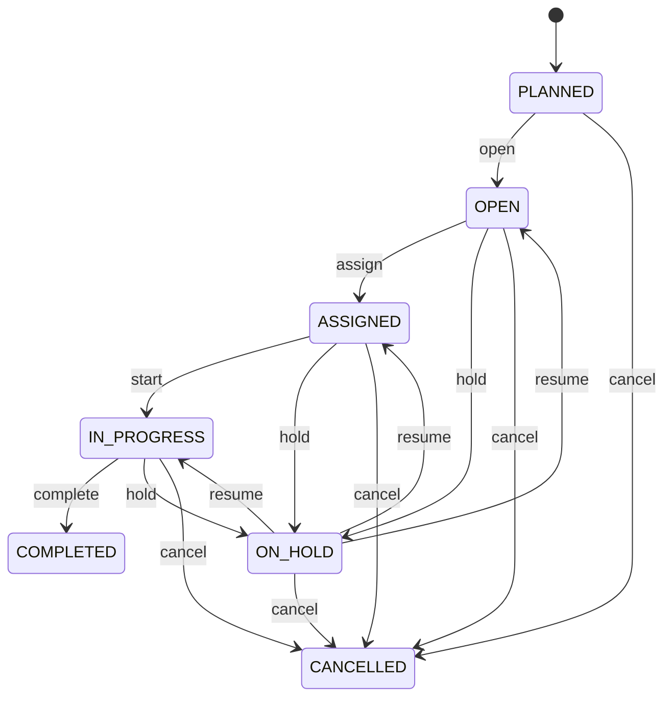

# Maintenance Work Order

Represents one controlled maintenance intervention from reported need through planning, assignment, execution, and completion or cancellation. MaintenanceWorkOrder is the executable maintenance record that turns an identified need into accountable work. It provides the bridge between Asset condition or maintenance policy and the technicians, contractors, parts, estimates, costs, physical movements, and completion evidence needed to restore or preserve asset capability. Used by maintenance management, field service, depot repair, fleet maintenance, facilities management, manufacturing maintenance, container repair, utilities, aviation, automotive, and other asset-intensive operations. Asset identifies what requires work. MaintenancePlan explains recurring preventive work. Party identifies who is responsible. Location identifies where work occurs. RepairEstimate can define expected repair economics before execution. ContainerMovement records physical repositioning when the maintained asset is a container. Detailed labor, parts, inspections, failures, and costs should be represented by their own related entities when required. A request opens the maintenance need. Planning establishes timing and resources. Assignment establishes accountability. In-progress records active execution. On-hold preserves the work order while a blocking condition is resolved. Completion records acceptance of the defined scope. Cancellation terminates the work without claiming that the maintenance objective was achieved. For a container repair, an approved RepairEstimate with disposition REPAIR may create the MaintenanceWorkOrder. If the container is not already at the repair location, ContainerMovement moves it into the workshop or repair area. Work execution then consumes labor/material resources and produces completion evidence. After acceptance, a subsequent operational workflow may return the container to ACTIVE service and move it to an available YardSlot. None of these downstream facts should be inferred solely from work-order status. A shipping container is found with damaged flooring during depot inspection. A corrective MaintenanceWorkOrder identifies the container asset, records the requested condition, receives high priority, links to an approved RepairEstimate for expected material and labor, is assigned to a repair team, may link to ContainerMovement events bringing the container into and out of the workshop, progresses through execution, and is completed after the repair is inspected and accepted.

## Finding records

Open **Maintenance Work Order** from the menu or from its card on the dashboard.

The list shows Work Order Number, Work Type, Status, Priority, Requested At, Scheduled At, Completed At, with the most recently changed record first. The **Help** button beside the title opens this window's help text.

- **Search**: type in the search box above the grid to narrow the rows. **Search** at the top left opens advanced search, where you pick a field, a comparison (equals, contains, starts with, before, after, and so on) and a value.
- **Sort**: click a column heading; click again to reverse.
- **Refresh**: the refresh button at the top right re-reads the rows and every dropdown, so a record created a moment ago by someone else appears.
- **Export**: **CSV** downloads the rows you are looking at.
- **Open a record**: click a row. The line under the title, "Showing 1 to n of N entries", tells you how many rows match.

## Creating a record

Choose **New** at the top of the list. The form opens on its own page, with the fields in sections. A badge beside each label names the control (Text, Dropdown, Date, and so on); a red star marks a required field; the question-mark icon shows that field's help; and a hint such as “max 300” shows the longest entry accepted.

1. Fill in the fields described under [Fields](#fields).
2. These are required and must be completed before the record can be saved: **Work Order Number**, **Work Type**, **Status**, **Priority**, **Requested At**.
3. For a dropdown that points at another window, pick the matching record; if the record you need does not exist yet, create it in its own window first. A dropdown may narrow to what you have already chosen, for example the states of the chosen country.
4. Choose **Create** (or **Save** in the toolbar). You return to the record, and it appears at the top of the list. If something is wrong the form says which field and why, and nothing is saved.

## Reading, changing and deleting a record

Click a row to open the record. Above the fields are the arrows that step through the list ("1 of 5"). Below them sit **Notes**, where anyone may leave a comment on the record, and the **Audit Trail**, which lists every change with who made it, when, and which fields changed.

- **Edit** (toolbar) makes the fields editable. Change them and choose **Save**; **Undo Changes** puts back what you changed and **Cancel Editing** leaves edit mode.
- **Copy Record** starts a new record from this one.
- **Delete Record** is available in edit mode and asks you to confirm; a record other records still depend on cannot be deleted.

Every change is also written to the [Audit Log](/administration/#audit-log).

## Fields

| Field | What you use | Rules | What to enter |
| --- | --- | --- | --- |
| Work Order Number | Text | Required, Unique, Up to 100 characters | The human-facing reference used by maintenance personnel to identify the work order. Used on maintenance requests, work instructions, technician communications, inspection records, repair documents, and reports. It is a business reference rather than the technical identity and remains the primary operational reference for people. Required so maintenance teams can unambiguously refer to the work instruction. |
| Work Type | Choice | Required | Classifies the maintenance purpose and determines the general execution method and planning context. Drives maintenance planning, technician assignment, priority, preventive-compliance reporting, repair analytics, and cost analysis. Work type describes why maintenance is being performed; Asset identifies what is being maintained and MaintenancePlan explains recurring planned work when applicable. Examination performed to determine condition, compliance, or the need for further work without necessarily changing the asset. Planned maintenance performed at a defined interval, usage threshold, or condition trigger to reduce the likelihood of failure. Work performed to correct a known condition or restore an asset to its required operating state. Work specifically focused on restoring damaged, defective, or failed components or equipment. Urgent intervention required because an immediate failure, safety concern, operational disruption, or critical condition requires action. Required because maintenance planning and reporting depend on the reason for the work. Choose one: Inspection, Preventive, Corrective, Repair, Emergency. |
| Status | Choice | Required | The controlled lifecycle state of the maintenance work order. Controls scheduling, assignment, execution, escalation, completion, reporting, and downstream asset-history processing. Work-order status describes the maintenance instruction and execution; it does not by itself prove that an Asset is operational, repaired, or returned to service. A valid maintenance need exists but execution has not yet been fully planned. Timing, scope, or resources have been planned sufficiently for execution. Responsibility for performing the work has been allocated to a Party or maintenance team. Maintenance execution has started. Work is temporarily stopped because of parts, access, safety, approval, diagnosis, scheduling, or another blocking condition. The defined work has been performed and accepted according to the applicable completion criteria. The work order has been intentionally terminated without completing the planned work. Required because maintenance processes must know whether work is pending, active, blocked, completed, or terminated. Choose one: Open, Planned, Assigned, In progress, On hold, Completed, Cancelled. |
| Priority | Choice | Required | Indicates the operational urgency with which the maintenance work should be scheduled and executed. Used for dispatching, queue ordering, escalation, resource allocation, service-level monitoring, and maintenance planning. Priority expresses urgency; it is different from workType, which expresses purpose, and from Asset criticality, which expresses the importance of the asset itself. Can normally be scheduled after higher-priority maintenance without significant operational impact. Standard maintenance urgency under normal operational planning. Requires accelerated scheduling because delay may materially affect operations, reliability, or service. Requires immediate or near-immediate attention because delay may create severe safety, operational, financial, or regulatory consequences. Required because maintenance queues need a defined prioritization basis. Choose one: Low, Normal, High, Critical. |
| Requested At | Date and time | Required | The date and time when the maintenance need or work request was formally raised. Used for response-time measurement, backlog analysis, SLA monitoring, maintenance history, and audit. It marks demand for maintenance, not necessarily the time work was scheduled, assigned, or started. Required to measure the elapsed time from maintenance demand to execution. |
| Scheduled At | Date and time | Optional | The planned date and time at which maintenance execution is expected to begin. Used for technician scheduling, asset availability planning, shutdown coordination, parts readiness, and maintenance calendars. It represents a plan and may differ from the actual execution start recorded elsewhere or inferred from status history. Optional while the work remains unscheduled. |
| Completed At | Date and time | Optional | The date and time at which the maintenance work order was formally completed and accepted. Used for maintenance history, downtime analysis, SLA measurement, compliance reporting, asset availability, and cost closure. Completion means the work-order scope has been accepted; it does not necessarily mean the Asset has returned to service if a separate commissioning or release process exists. Optional until the work is completed. |
| Description | Text | Up to 4000 characters | The human-readable statement of the maintenance problem, requested work, observed condition, or intended scope. Provides context to planners, technicians, inspectors, approvers, and downstream reports when structured fields alone cannot capture the maintenance requirement. It complements structured workType, Asset, RepairEstimate, and MaintenancePlan information and should not be used as the sole source for critical machine-readable conditions. Optional when the work scope is fully defined through structured request or task data. |
| Asset | Lookup | Optional | Identifies the physical or operational Asset that the maintenance work is intended to inspect, maintain, correct, or repair. Connects maintenance history to asset condition, service intervals, failure history, warranty, depreciation, and operational availability. Zero or one Asset may be recorded when the work concerns a location, general maintenance activity, or an asset not yet identified at request time. Asset answers what is being maintained; MaintenanceWorkOrder answers what work is being requested or performed on it. Pick a record from **Asset**. |
| Maintenance Plan | Lookup | Optional | Identifies the recurring or preventive maintenance plan that generated or governs the work order. Supports preventive scheduling, compliance tracking, service intervals, and automatic work-order generation. Zero or one plan may be linked because corrective, emergency, and ad-hoc work can originate outside a maintenance plan. MaintenancePlan defines recurring maintenance policy; the work order represents one executable occurrence of that policy. Pick a record from **Maintenance Plan**. |
| Assignee | Lookup | Optional | Identifies the person, team, contractor, or organization responsible for executing or coordinating the work. Drives dispatching, accountability, workload planning, technician performance, contractor management, and communication. Zero or one Party may be assigned while work is unallocated or when assignment is maintained in an external workforce system. Party supplies identity; its applicable role determines whether it acts as technician, maintenance organization, contractor, or another responsibility type. Pick a record from **Party**. |
| Location | Lookup | Optional | Identifies the physical location where the maintenance activity is expected to occur. Used for technician routing, access planning, site coordination, safety requirements, and operational scheduling. Zero or one location may be supplied when the Asset itself determines location or work is performed remotely. Location describes where work occurs and is distinct from the Asset being serviced. Pick a record from **Location**. |
| Repair Estimate | Lookup | Optional | Links the work order to the approved estimate that authorizes or informs the repair scope and financial boundary. Supports traceability from condition assessment and approved repair economics into executable maintenance work. Zero or one estimate may be linked because inspection, preventive, corrective, and emergency work may not require a repair estimate. RepairEstimate evaluates and authorizes the proposed repair decision; MaintenanceWorkOrder executes it. A work order must not be treated as proof that the estimate's predicted amount became actual cost. Pick a record from **Repair Estimate**. |
| Spare Part | Lookup | Optional | The SparePart this MaintenanceWorkOrder belongs to. Pick a record from **Spare Part**. |

## How it connects to other records
- A maintenance work order belongs to one **Asset**.
- A maintenance work order belongs to one **Maintenance Plan**.
- A maintenance work order belongs to one **Party**.
- A maintenance work order belongs to one **Location**.
- A maintenance work order belongs to one **Repair Estimate**.
- A maintenance work order belongs to one **Spare Part**.

## Lifecycle: Maintenance work order lifecycle

A maintenance work order record starts as **Planned** and ends as **Completed** or **Cancelled**. Open a record and the bar above its fields shows its current **State** and, after **Next**, a button for each move that leaves it; choose one to make the move. Any move the diagram does not draw is refused, for everyone including the administrator.

| From | To | Move |
| --- | --- | --- |
| Planned | Open | Open |
| Open | Assigned | Assign |
| Assigned | In progress | Start |
| In progress | Completed | Complete |
| Open | On hold | Hold |
| On hold | Open | Resume |
| Assigned | On hold | Hold |
| On hold | Assigned | Resume |
| In progress | On hold | Hold |
| On hold | In progress | Resume |
| Planned | Cancelled | Cancel |
| Open | Cancelled | Cancel |
| Assigned | Cancelled | Cancel |
| In progress | Cancelled | Cancel |
| On hold | Cancelled | Cancel |

## What happens when you save
Business rules run around the save. They are listed here and explained in full under [Business rules](/administration/rules/).

| Rule | When | Order |
| --- | --- | --- |
| Maintenance work order invariants before create | before a maintenance work order is created | 100 |
| Maintenance work order invariants before update | before a maintenance work order is changed | 100 |
| Maintenance work order workflows after update | after a maintenance work order is changed | 100 |

Processes started from this record: [Maintenance work order exception raised](/administration/processes/#maintenance-work-order-exception-raised), [Maintenance work order follow up required](/administration/processes/#maintenance-work-order-follow-up-required), [Maintenance work order completion confirmed](/administration/processes/#maintenance-work-order-completion-confirmed).

## Who may use it

Anyone who holds a role with access to the **Maintenance Work Order** window. Access is granted by role under [Roles and access](/administration/access/).
