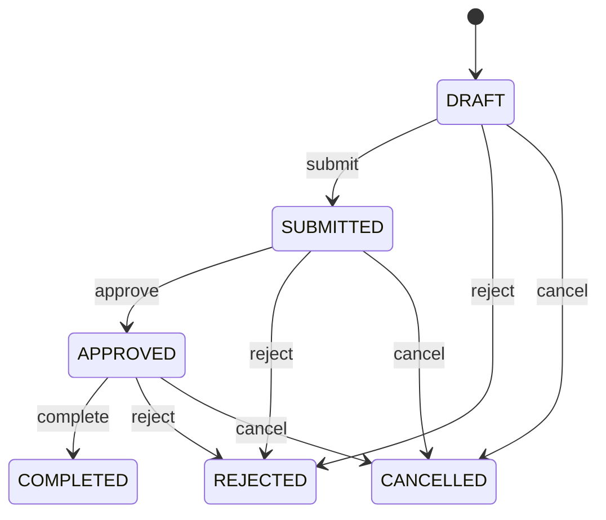

# Repair Estimate

Represents the controlled decision assessment between asset condition and the eventual repair or commercial disposition action. RepairEstimate is not the repair itself. It evaluates what is wrong, what it is expected to cost, and which outcome is economically or operationally appropriate. It therefore sits between inspection/condition evidence and downstream execution or disposition. Used by depot maintenance, fleet management, repair vendors, asset managers, finance, approval workflows, and predictive analytics. Historical estimates can also provide labeled data for disposition and sale-value prediction. Container identifies the asset. RepairEstimateLine explains technical scope. MaintenanceWorkOrder executes approved repair. SalesOrder or a disposition transaction executes sale. Inventory and financial transactions record actual operational and monetary outcomes. Currency qualifies monetary values and Document supplies evidence. DRAFT → SUBMITTED → APPROVED or REJECTED, followed by COMPLETED or CANCELLED according to policy. Approval authorizes a decision but does not itself perform repair or sale. Revisions preserve decision history rather than overwriting earlier approved facts. When disposition is REPAIR, an approved estimate may create one or more MaintenanceWorkOrders. The work order must reference the originating estimate, remain within the approved scope unless an authorized estimate revision is made, and record actual execution separately. Work-order completion does not automatically make the estimate's estimated amounts actual costs. A returned container has damaged flooring, side panels, and door hardware. The estimate contains line-level components and labor, compares expected repair cost with sale value and asset economics, and is approved with disposition REPAIR. A MaintenanceWorkOrder is then created for execution. The final actual repair cost is recorded separately from the estimate.

## Finding records

Open **Repair Estimate** from the menu or from its card on the dashboard.

The list shows Estimate Number, Revision, Estimate Date, Status, Disposition, Estimated Repair Amount, Estimated Sale Amount, with the most recently changed record first. The **Help** button beside the title opens this window's help text.

- **Search**: type in the search box above the grid to narrow the rows. **Search** at the top left opens advanced search, where you pick a field, a comparison (equals, contains, starts with, before, after, and so on) and a value.
- **Sort**: click a column heading; click again to reverse.
- **Refresh**: the refresh button at the top right re-reads the rows and every dropdown, so a record created a moment ago by someone else appears.
- **Export**: **CSV** downloads the rows you are looking at.
- **Open a record**: click a row. The line under the title, "Showing 1 to n of N entries", tells you how many rows match.

## Creating a record

Choose **New** at the top of the list. The form opens on its own page, with the fields in sections. A badge beside each label names the control (Text, Dropdown, Date, and so on); a red star marks a required field; the question-mark icon shows that field's help; and a hint such as “max 300” shows the longest entry accepted.

1. Fill in the fields described under [Fields](#fields).
2. These are required and must be completed before the record can be saved: **Estimate Number**, **Revision**, **Estimate Date**, **Status**, **Container**.
3. For a dropdown that points at another window, pick the matching record; if the record you need does not exist yet, create it in its own window first. A dropdown may narrow to what you have already chosen, for example the states of the chosen country.
4. Choose **Create** (or **Save** in the toolbar). You return to the record, and it appears at the top of the list. If something is wrong the form says which field and why, and nothing is saved.

## Reading, changing and deleting a record

Click a row to open the record. Above the fields are the arrows that step through the list ("1 of 5"). Below them sit **Notes**, where anyone may leave a comment on the record, and the **Audit Trail**, which lists every change with who made it, when, and which fields changed.

- **Edit** (toolbar) makes the fields editable. Change them and choose **Save**; **Undo Changes** puts back what you changed and **Cancel Editing** leaves edit mode.
- **Copy Record** starts a new record from this one.
- **Delete Record** is available in edit mode and asks you to confirm; a record other records still depend on cannot be deleted.

Every change is also written to the [Audit Log](/administration/#audit-log).

## Fields

| Field | What you use | Rules | What to enter |
| --- | --- | --- | --- |
| Estimate Number | Text | Required, Unique, Up to 100 characters | The human-facing business reference for the repair assessment. Used by depot, maintenance, fleet, owners, approvers, customers, and reports. Unlike repairEstimateId, this is intended for business communication and documents. Required for operational and approval workflows. |
| Revision | Whole number | Required | The version number of the technical and commercial assessment. Preserves changes in damage scope, material pricing, labor assumptions, disposition, or approval values. A revision is historical decision context and must not silently overwrite an earlier approved assessment. Required for traceable estimate evolution. |
| Estimate Date | Date | Required | The business date on which this estimate revision was prepared or recognized. Supports approval chronology, estimate aging, repair-cycle analysis, and financial reporting. Distinct from Container manufacture date, damage date, repair completion date, or sale date. Required to establish decision chronology. |
| Status | Choice | Required | The lifecycle state of the assessment and its authorization status. Controls preparation, review, approval, rejection, completion, and cancellation workflows. Estimate status describes the decision artifact; it does not mean that repair execution or sale execution has completed. Assessment is still being prepared. Assessment is awaiting review or authorization. The proposed decision/scope has been authorized; execution remains a separate process. The proposed assessment or decision was not authorized. The estimate's decision process is concluded. Assessment was intentionally terminated and must not drive active downstream work. Required to separate assessment preparation from authorization and execution. Choose one: Draft, Submitted, Approved, Rejected, Completed, Cancelled. |
| Disposition | Choice | Optional | The intended operational or commercial outcome selected after evaluating condition and economics. Determines whether the asset returns to lease-related use, enters a sale process, is scrapped, requires repair, or remains pending. Disposition is a decision about the asset, not a physical repair status. REPAIR may create a MaintenanceWorkOrder; SALE may create a SalesOrder or disposition transaction. Asset is intended to remain available for lease-related use after the applicable process. Asset is intended for commercial sale rather than return to the active lease fleet. Asset is intended for disposal and removal from productive inventory. Repair is justified and maintenance execution is required or expected. No final disposition has been executed; further information or approval is required. Optional until a disposition decision is reached. Choose one: Lease, Sale, Scrap, Repair, Hold. |
| Estimated Repair Amount | Amount | Optional | The estimated cost of the repair scope represented by the assessment. Supports repair-vs-sale-vs-scrap economics, approval thresholds, budgets, and predictive analysis. Should reconcile to RepairEstimateLine values and Currency; it is an estimate, not an actual posted maintenance cost. Optional until sufficient repair scope is known. |
| Estimated Sale Amount | Amount | Optional | The expected realization from selling the asset under the current valuation assumptions. Supports disposition economics and comparison with repair cost, book value, residual value, and lease alternatives. It is decision-support data, not an executed sale amount or payment. Optional when sale is not under consideration. |
| Approved Amount | Amount | Optional | The monetary amount explicitly authorized by the approval decision. Establishes the financial boundary for downstream repair execution or approved disposition activity. Approval amount is not the same as final actual maintenance cost; actual cost belongs to execution and financial records. Optional before approval or for non-monetary decisions. |
| Currency | Lookup | Optional | The currency that gives monetary estimate values their denomination. Required to interpret repair, sale, and approval amounts consistently. Currency qualifies amounts; it does not identify ownership, supplier, or asset identity. Optional while monetary assessment is incomplete. Pick a record from **Currency**. |
| Container | Lookup | Required | The physical container whose condition, repair economics, and disposition are being assessed. Connects the estimate to equipment identity, current location, ownership/lease context, condition, and maintenance history. Exactly one Container is assessed. Container is the asset; RepairEstimate records a decision assessment about that asset without duplicating master data. Pick a record from **Container**. |
| Organization | Lookup | Optional | The organization responsible for preparing, owning, or approving the assessment. Supports depot responsibility, approval authority, cost attribution, and reporting. Optional when organization is inherited from operating context. This organization may differ from Container owner, lessor, lessee, customer, or repair vendor. Pick a record from **Organization**. |

## How it connects to other records
- A repair estimate has many **Maintenance Work Order** records.
- A repair estimate belongs to one **Container**.
- A repair estimate has many **Repair Estimate** records.
- A repair estimate belongs to one **Organization**.

## Lifecycle: Repair estimate lifecycle

A repair estimate record starts as **Draft** and ends as **Completed** or **Rejected** or **Cancelled**. Open a record and the bar above its fields shows its current **State** and, after **Next**, a button for each move that leaves it; choose one to make the move. Any move the diagram does not draw is refused, for everyone including the administrator.

| From | To | Move |
| --- | --- | --- |
| Draft | Submitted | Submit |
| Submitted | Approved | Approve |
| Approved | Completed | Complete |
| Draft | Rejected | Reject |
| Submitted | Rejected | Reject |
| Approved | Rejected | Reject |
| Draft | Cancelled | Cancel |
| Submitted | Cancelled | Cancel |
| Approved | Cancelled | Cancel |

## What happens when you save
Business rules run around the save. They are listed here and explained in full under [Business rules](/administration/rules/).

| Rule | When | Order |
| --- | --- | --- |
| Repair estimate invariants before create | before a repair estimate is created | 100 |
| Repair estimate invariants before update | before a repair estimate is changed | 100 |
| Repair estimate workflows after update | after a repair estimate is changed | 100 |

Processes started from this record: [Repair estimate approval requested](/administration/processes/#repair-estimate-approval-requested), [Repair estimate follow up required](/administration/processes/#repair-estimate-follow-up-required), [Repair estimate completion confirmed](/administration/processes/#repair-estimate-completion-confirmed).

## Who may use it

Anyone who holds a role with access to the **Repair Estimate** window. Access is granted by role under [Roles and access](/administration/access/).
