# Record lifecycles

A lifecycle is the set of states a record can be in and the moves between them. The application enforces it on every write, through the screen and through the API: a move the diagram does not draw is refused for everyone, administrators included. Role restrictions narrow who may make a particular move. This application has **18** lifecycles.

## Party: Party lifecycle

States: **Active**, **Inactive**, **Blocked**, **Retired**. A new record starts as **Active**; **Retired** ends the lifecycle.

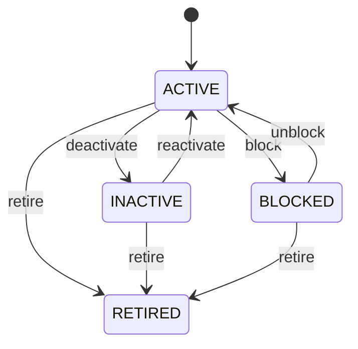

Any role that may change the record may make any move the diagram draws.

See [Party](/entities/foundation/party/) for the record itself.

## Organization: Organization lifecycle

States: **Draft**, **Active**, **Inactive**, **Retired**. A new record starts as **Draft**; **Retired** ends the lifecycle.

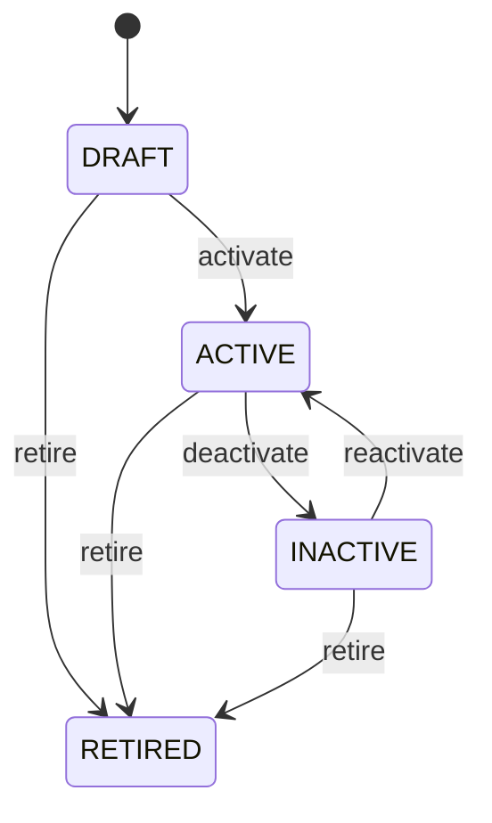

Any role that may change the record may make any move the diagram draws.

See [Organization](/entities/foundation/organization/) for the record itself.

## Party Role: Party role lifecycle

States: **Active**, **Inactive**, **Expired**. A new record starts as **Active**; **Expired** ends the lifecycle.

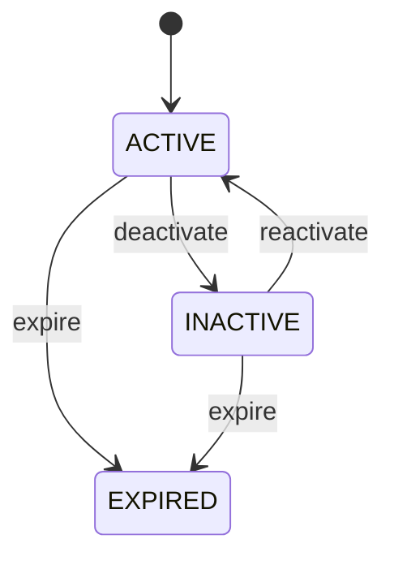

Any role that may change the record may make any move the diagram draws.

See [Party Role](/entities/foundation/party-role/) for the record itself.

## Address: Address lifecycle

States: **Active**, **Inactive**, **Retired**. A new record starts as **Active**; **Retired** ends the lifecycle.

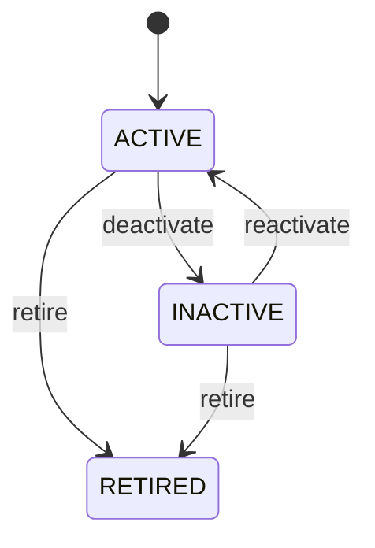

Any role that may change the record may make any move the diagram draws.

See [Address](/entities/foundation/address/) for the record itself.

## Location: Location lifecycle

States: **Planned**, **Active**, **Inactive**, **Closed**, **Retired**. A new record starts as **Planned**; **Closed**, **Retired** ends the lifecycle.

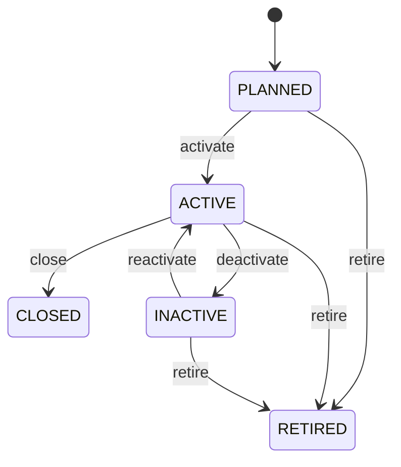

Any role that may change the record may make any move the diagram draws.

See [Location](/entities/foundation/location/) for the record itself.

## Currency: Currency lifecycle

States: **Active**, **Inactive**, **Retired**. A new record starts as **Active**; **Retired** ends the lifecycle.

Any role that may change the record may make any move the diagram draws.

See [Currency](/entities/foundation/currency/) for the record itself.

## Exchange Rate: Exchange rate lifecycle

States: **Draft**, **Active**, **Expired**, **Cancelled**. A new record starts as **Draft**; **Expired**, **Cancelled** ends the lifecycle.

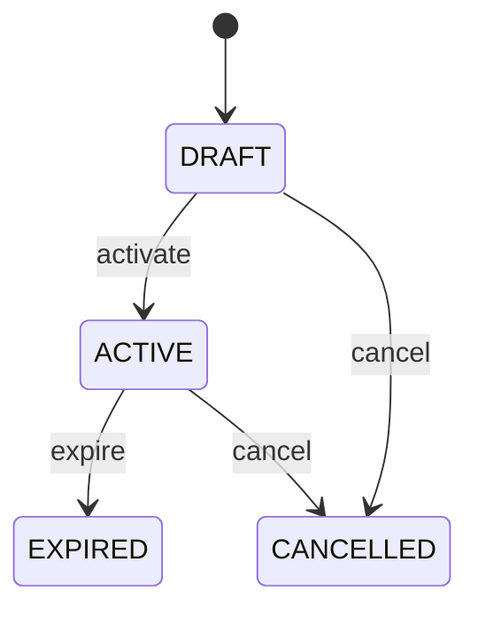

Any role that may change the record may make any move the diagram draws.

See [Exchange Rate](/entities/foundation/exchange-rate/) for the record itself.

## Unit Of Measure: Unit of measure lifecycle

States: **Active**, **Inactive**, **Retired**. A new record starts as **Active**; **Retired** ends the lifecycle.

Any role that may change the record may make any move the diagram draws.

See [Unit Of Measure](/entities/foundation/unit-of-measure/) for the record itself.

## Task: Task lifecycle

States: **Created**, **Ready**, **Assigned**, **In progress**, **Blocked**, **Completed**, **Cancelled**, **Failed**. A new record starts as **Created**; **Completed**, **Cancelled**, **Failed** ends the lifecycle.

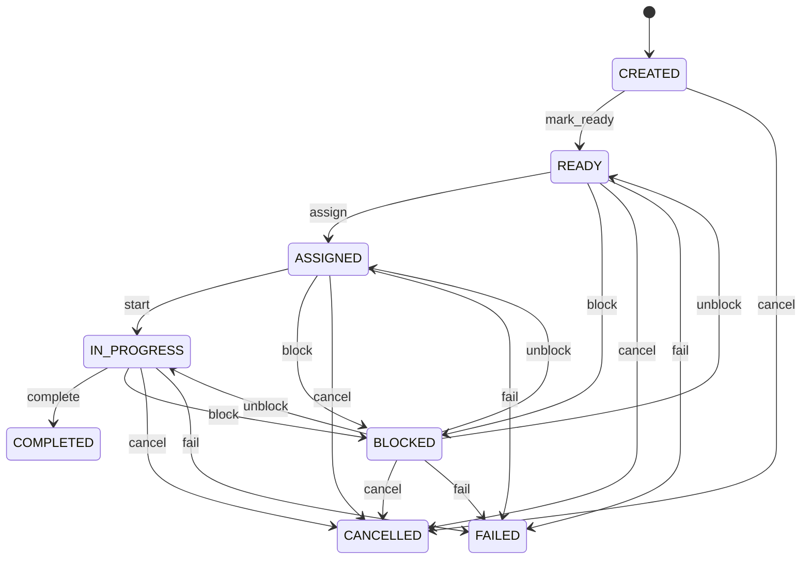

Any role that may change the record may make any move the diagram draws.

See [Task](/entities/foundation/task/) for the record itself.

## Product: Product lifecycle

States: **Draft**, **Active**, **Discontinued**, **Blocked**, **Retired**. A new record starts as **Draft**; **Discontinued**, **Retired** ends the lifecycle.

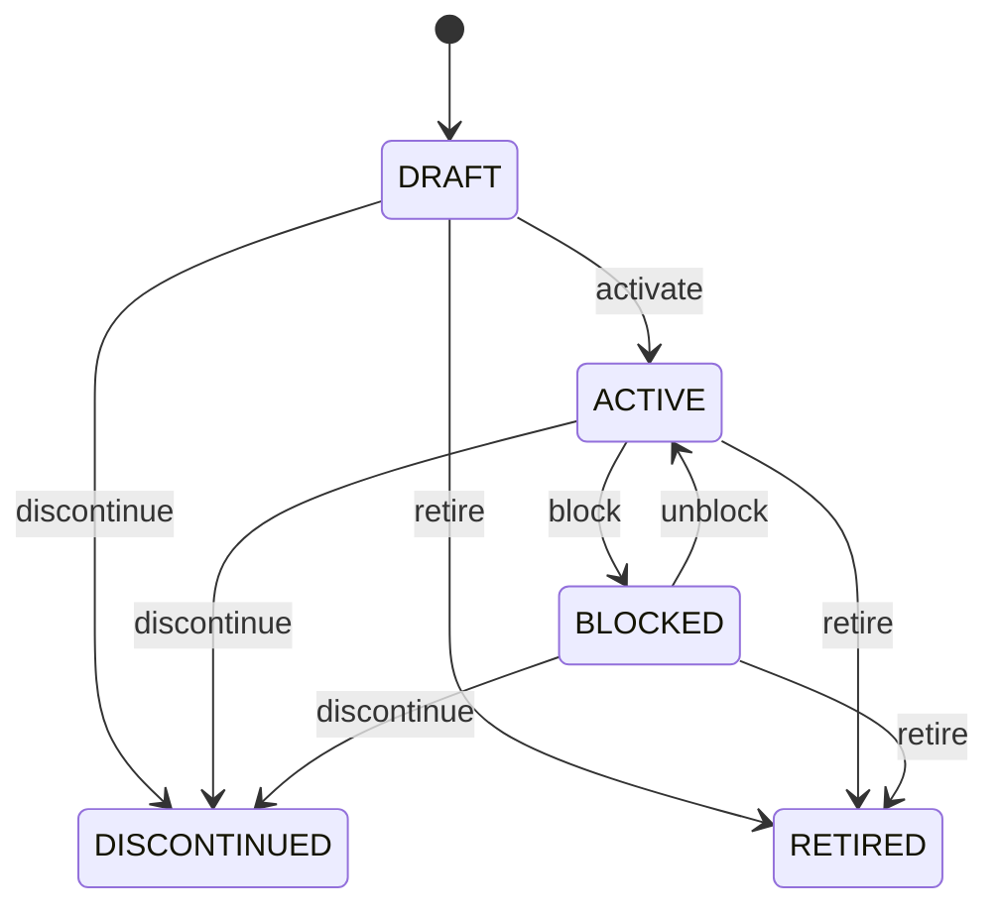

Any role that may change the record may make any move the diagram draws.

See [Product](/entities/manufacturing-management/product/) for the record itself.

## Bill Of Material: Bill of material lifecycle

States: **Draft**, **Active**, **Obsolete**. A new record starts as **Draft**; **Obsolete** ends the lifecycle.

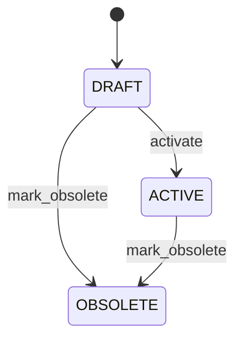

Any role that may change the record may make any move the diagram draws.

See [Bill Of Material](/entities/manufacturing-management/bill-of-material/) for the record itself.

## Routing: Routing lifecycle

States: **Draft**, **Active**, **Suspended**, **Obsolete**. A new record starts as **Draft**; **Obsolete** ends the lifecycle.

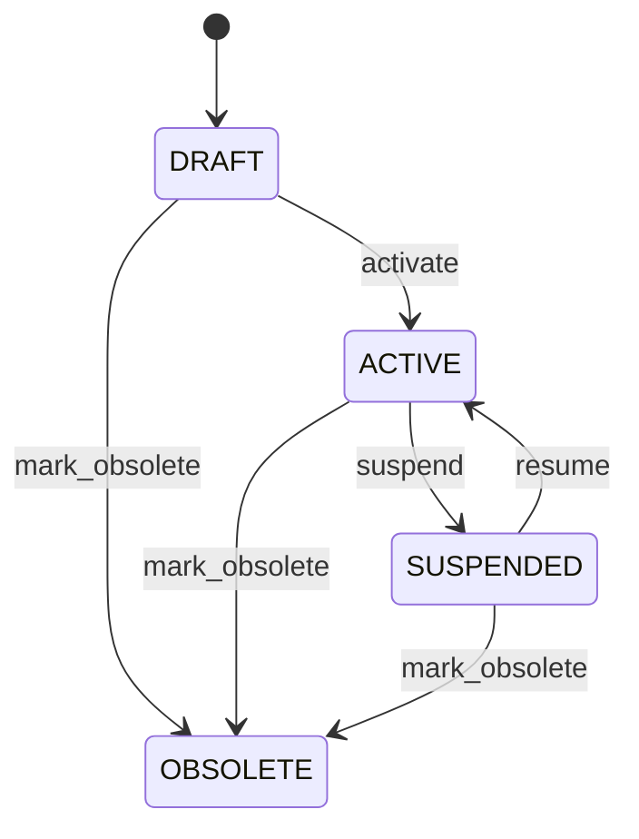

Any role that may change the record may make any move the diagram draws.

See [Routing](/entities/manufacturing-management/routing/) for the record itself.

## Work Center: Work center lifecycle

States: **Active**, **Inactive**, **Maintenance**, **Retired**. A new record starts as **Active**; **Retired** ends the lifecycle.

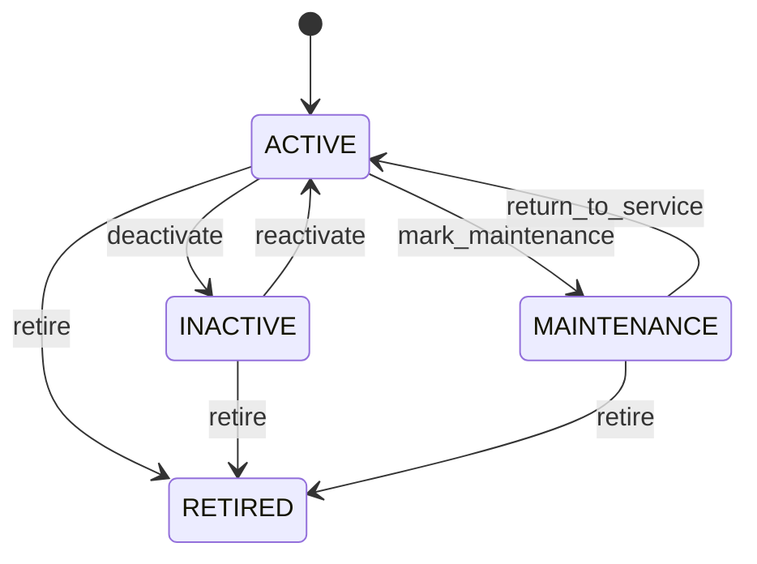

Any role that may change the record may make any move the diagram draws.

See [Work Center](/entities/manufacturing-management/work-center/) for the record itself.

## Manufacturing Work Order: Manufacturing work order lifecycle

States: **Planned**, **Released**, **In progress**, **Completed**, **Closed**, **Cancelled**. A new record starts as **Planned**; **Closed**, **Cancelled** ends the lifecycle.

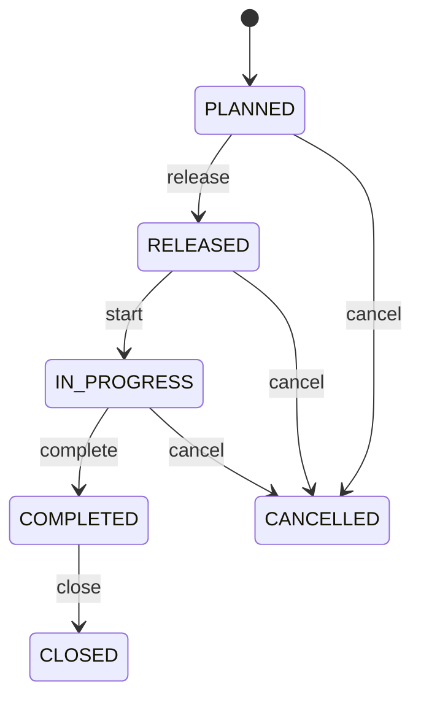

Any role that may change the record may make any move the diagram draws.

See [Manufacturing Work Order](/entities/manufacturing-management/manufacturing-work-order/) for the record itself.

## Lot: Lot lifecycle

States: **Active**, **Hold**, **Quarantined**, **Released**, **Expired**, **Rejected**, **Consumed**, **Closed**. A new record starts as **Active**; **Consumed**, **Expired**, **Rejected** ends the lifecycle.

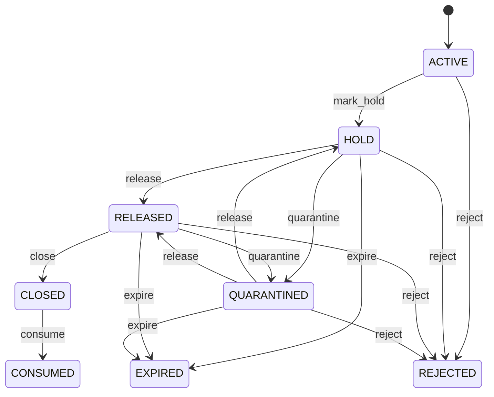

Any role that may change the record may make any move the diagram draws.

See [Lot](/entities/manufacturing-management/lot/) for the record itself.

## Serial Number: Serial number lifecycle

States: **Expected**, **Available**, **Reserved**, **In transit**, **Installed**, **Consumed**, **Returned**, **Quarantined**, **Scrapped**, **Retired**. A new record starts as **Expected**; **Returned**, **Scrapped**, **Retired** ends the lifecycle.

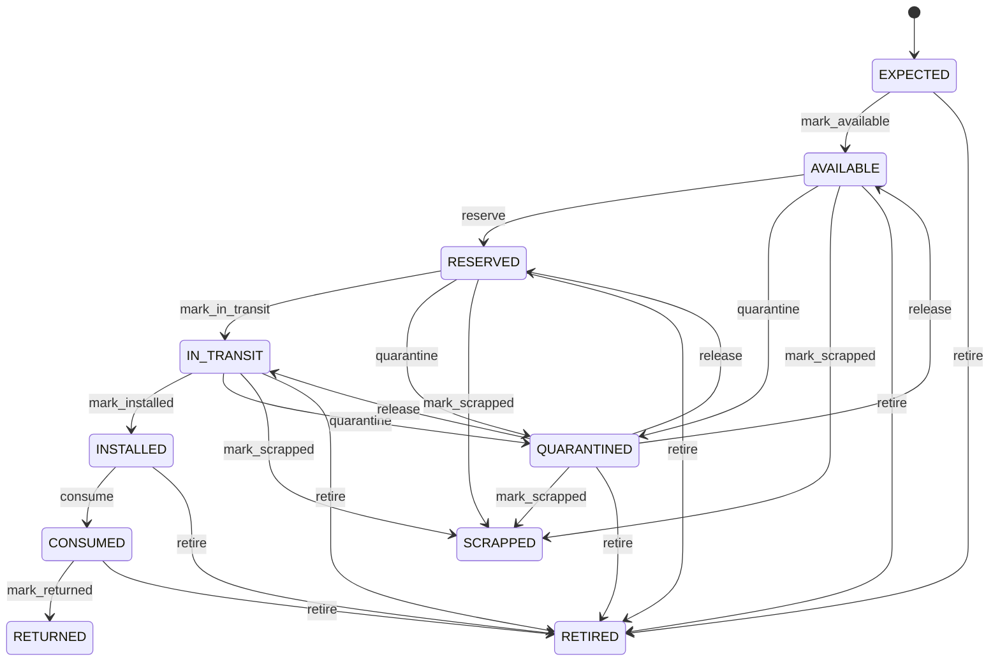

Any role that may change the record may make any move the diagram draws.

See [Serial Number](/entities/manufacturing-management/serial-number/) for the record itself.

## Quality Inspection: Quality inspection lifecycle

States: **Open**, **In progress**, **Passed**, **Failed**, **Conditional**, **Cancelled**. A new record starts as **Open**; **Passed**, **Failed**, **Cancelled** ends the lifecycle.

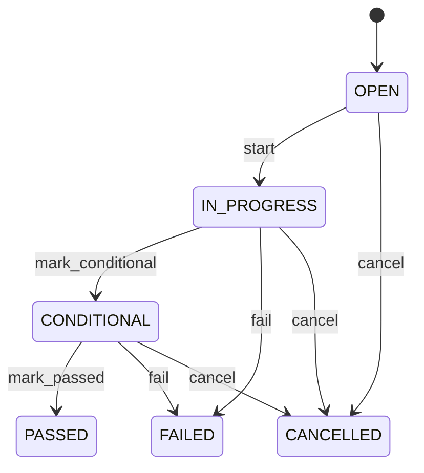

Any role that may change the record may make any move the diagram draws.

See [Quality Inspection](/entities/manufacturing-management/quality-inspection/) for the record itself.

## Production Record: Production record lifecycle

States: **Planned**, **Recorded**, **Verified**, **Rejected**. A new record starts as **Recorded**; **Rejected** ends the lifecycle.

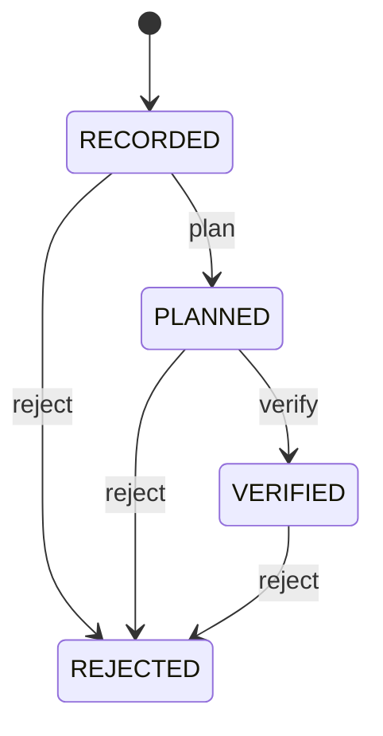

Any role that may change the record may make any move the diagram draws.

See [Production Record](/entities/manufacturing-records/production-record/) for the record itself.

