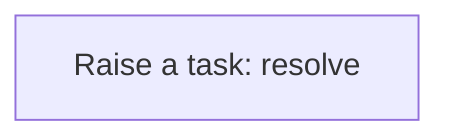
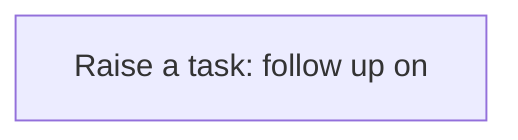
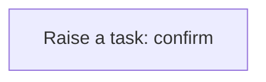

# Processes

A process is a sequence of steps the application runs for you: create a task, update a record, call a service. A business rule usually starts it; you can also run one by hand from the Workflow Designer. Every run is logged step by step in the Workflow Monitor. This application has **11** processes.

## Party exception raised {#party-exception-raised}

When a party is blocked, a high-priority task asks someone to resolve it.

Runs when a **Party** is changed, started by a business rule.

1. **Raise a task: resolve** — creates a **Task** record.

## Exchange rate follow up required {#exchange-rate-follow-up-required}

When a exchange rate is cancelled, a task asks someone to settle what depended on it.

Runs when a **Exchange Rate** is changed, started by a business rule.

1. **Raise a task: follow up on** — creates a **Task** record.

## Product exception raised {#product-exception-raised}

When a product is blocked, a high-priority task asks someone to resolve it.

Runs when a **Product** is changed, started by a business rule.

1. **Raise a task: resolve** — creates a **Task** record.

## Manufacturing work order follow up required {#manufacturing-work-order-follow-up-required}

When a manufacturing work order is cancelled, a task asks someone to settle what depended on it.

Runs when a **Manufacturing Work Order** is changed, started by a business rule.

1. **Raise a task: follow up on** — creates a **Task** record.

## Manufacturing work order completion confirmed {#manufacturing-work-order-completion-confirmed}

When a manufacturing work order is completed, a task asks someone to confirm the outcome.

Runs when a **Manufacturing Work Order** is changed, started by a business rule.

1. **Raise a task: confirm** — creates a **Task** record.

## Lot exception raised {#lot-exception-raised}

When a lot is quarantined, a high-priority task asks someone to resolve it.

Runs when a **Lot** is changed, started by a business rule.

1. **Raise a task: resolve** — creates a **Task** record.

## Lot follow up required {#lot-follow-up-required}

When a lot is rejected, a task asks someone to settle what depended on it.

Runs when a **Lot** is changed, started by a business rule.

1. **Raise a task: follow up on** — creates a **Task** record.

## Serial number exception raised {#serial-number-exception-raised}

When a serial number is quarantined, a high-priority task asks someone to resolve it.

Runs when a **Serial Number** is changed, started by a business rule.

1. **Raise a task: resolve** — creates a **Task** record.

## Quality inspection exception raised {#quality-inspection-exception-raised}

When a quality inspection is failed, a high-priority task asks someone to resolve it.

Runs when a **Quality Inspection** is changed, started by a business rule.

1. **Raise a task: resolve** — creates a **Task** record.

## Quality inspection follow up required {#quality-inspection-follow-up-required}

When a quality inspection is cancelled, a task asks someone to settle what depended on it.

Runs when a **Quality Inspection** is changed, started by a business rule.

1. **Raise a task: follow up on** — creates a **Task** record.

## Production record follow up required {#production-record-follow-up-required}

When a production record is rejected, a task asks someone to settle what depended on it.

Runs when a **Production Record** is changed, started by a business rule.

1. **Raise a task: follow up on** — creates a **Task** record.

