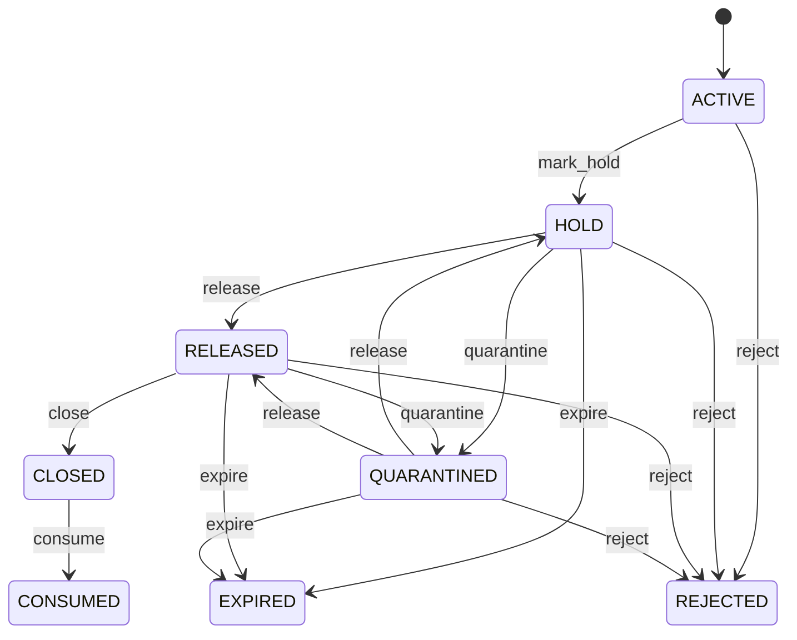

# Lot

Batch-level inventory identity for end-to-end genealogy and recall. Product identifies what an item is; Lot identifies which production or receipt batch a quantity belongs to. Inventory, WMS, manufacturing, quality, procurement, sales fulfillment, expiry management, recall, and regulatory traceability. Lot follows Product quantities through InventoryMovement and InventoryBalance and may later connect to receipt, production, shipment, inspection, and certificate evidence. Created/received → active or quarantined → released/held → consumed/expired/rejected → closed. Status, expiry, or quality changes immediately revalidate availability, reservations, picking, shipment, production consumption, and disposition without altering historical movements.

## Finding records

Open **Lot** from the menu or from its card on the dashboard.

The list shows Lot Number, Manufactured At, Expires At, Status, Product, with the most recently changed record first. The **Help** button beside the title opens this window's help text.

- **Search**: type in the search box above the grid to narrow the rows. **Search** at the top left opens advanced search, where you pick a field, a comparison (equals, contains, starts with, before, after, and so on) and a value.
- **Sort**: click a column heading; click again to reverse.
- **Refresh**: the refresh button at the top right re-reads the rows and every dropdown, so a record created a moment ago by someone else appears.
- **Export**: **CSV** downloads the rows you are looking at.
- **Open a record**: click a row. The line under the title, "Showing 1 to n of N entries", tells you how many rows match.

## Creating a record

Choose **New** at the top of the list. The form opens on its own page, with the fields in sections. A badge beside each label names the control (Text, Dropdown, Date, and so on); a red star marks a required field; the question-mark icon shows that field's help; and a hint such as “max 300” shows the longest entry accepted.

1. Fill in the fields described under [Fields](#fields).
2. These are required and must be completed before the record can be saved: **Lot Number**, **Status**, **Product**.
3. For a dropdown that points at another window, pick the matching record; if the record you need does not exist yet, create it in its own window first. A dropdown may narrow to what you have already chosen, for example the states of the chosen country.
4. Choose **Create** (or **Save** in the toolbar). You return to the record, and it appears at the top of the list. If something is wrong the form says which field and why, and nothing is saved.

## Reading, changing and deleting a record

Click a row to open the record. Above the fields are the arrows that step through the list ("1 of 5"). Below them sit **Notes**, where anyone may leave a comment on the record, and the **Audit Trail**, which lists every change with who made it, when, and which fields changed.

- **Edit** (toolbar) makes the fields editable. Change them and choose **Save**; **Undo Changes** puts back what you changed and **Cancel Editing** leaves edit mode.
- **Copy Record** starts a new record from this one.
- **Delete Record** is available in edit mode and asks you to confirm; a record other records still depend on cannot be deleted.

Every change is also written to the [Audit Log](/administration/#audit-log).

## Fields

| Field | What you use | Rules | What to enter |
| --- | --- | --- | --- |
| Lot Number | Text | Required, Up to 150 characters | Business-facing lot or batch identifier. Traceability code used operationally and externally. Receiving, labels, picking, quality, recall, and certificates. Uniqueness is governed with Product and organizational policy. Required. |
| Manufactured At | Date and time | Optional | Time the lot was manufactured or produced. Anchors production age and provenance. Shelf-life, quality, genealogy, and recall. Distinct from receipt date. Optional when unknown or not applicable. |
| Expires At | Date and time | Optional | Expiry or use-by time for the lot. Controls eligibility where shelf life applies. FEFO allocation, quarantine, disposal, and compliance. Does not itself post inventory movement. Optional for non-expiring products. |
| Status | Choice | Required | Governed usability state of the lot. Controls allocation and operational eligibility while preserving stock history. Quality release, warehouse allocation, production, recall, and disposition. Status restrictions affect availability but do not rewrite movement history. Operationally recognized. Temporarily restricted. Segregated pending decision. Approved for governed use. Past governed shelf life. Not approved for intended use. Quantity fully consumed under tracked processes. Traceability lifecycle closed. Required. Choose one: Active, Hold, Quarantined, Released, Expired, Rejected, Consumed, Closed. |
| Product | Lookup | Required | Product represented by this lot. Defines item identity for all lot quantities. Inventory and quality validation. Exactly one Product. Movements and balances must use the same product. Pick a record from **Product**. |

## How it connects to other records
- A lot belongs to one **Product**.
- A lot has many **Material Issue** records.
- A lot has many **Production Receipt** records.
- A lot has many **Inventory Movement** records.
- A lot has many **Serial Number** records.
- A lot has many **Scrap** records.

## Lifecycle: Lot lifecycle

A lot record starts as **Active** and ends as **Consumed** or **Expired** or **Rejected**. Open a record and the bar above its fields shows its current **State** and, after **Next**, a button for each move that leaves it; choose one to make the move. Any move the diagram does not draw is refused, for everyone including the administrator.

| From | To | Move |
| --- | --- | --- |
| Active | Hold | Mark hold |
| Hold | Released | Release |
| Released | Closed | Close |
| Closed | Consumed | Consume |
| Hold | Quarantined | Quarantine |
| Quarantined | Hold | Release |
| Released | Quarantined | Quarantine |
| Quarantined | Released | Release |
| Hold | Expired | Expire |
| Released | Expired | Expire |
| Quarantined | Expired | Expire |
| Active | Rejected | Reject |
| Hold | Rejected | Reject |
| Released | Rejected | Reject |
| Quarantined | Rejected | Reject |

## What happens when you save
Business rules run around the save. They are listed here and explained in full under [Business rules](/administration/rules/).

| Rule | When | Order |
| --- | --- | --- |
| Lot workflows after update | after a lot is changed | 100 |

Processes started from this record: [Lot exception raised](/administration/processes/#lot-exception-raised), [Lot follow up required](/administration/processes/#lot-follow-up-required).

## Who may use it

Anyone who holds a role with access to the **Lot** window. Access is granted by role under [Roles and access](/administration/access/).
