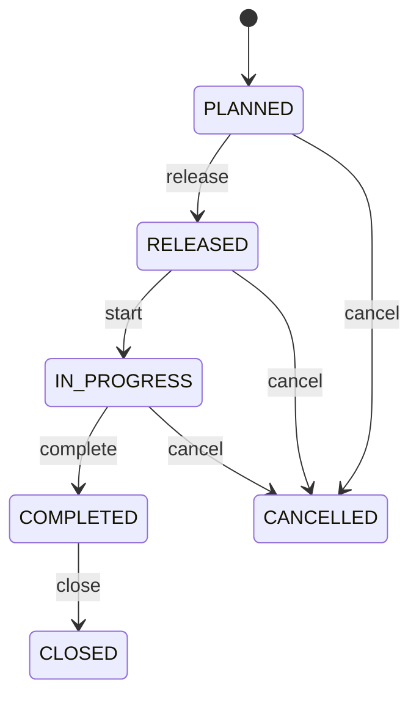

# Manufacturing Work Order

Canonical CEDM production-order transaction. ManufacturingWorkOrder authorizes production; BOM defines material expectations; Routing defines process expectations; execution transactions preserve actual material, output and scrap evidence. MRP, scheduling, shop-floor execution, inventory, costing, quality, genealogy and project manufacturing. Product is output; BOM and Routing are controlled definitions; MaterialIssue consumes inputs; ProductionReceipt accepts outputs; Scrap explains governed losses. Planned → released → in progress → completed → closed, with controlled cancellation. Release freezes effective definitions; execution updates inventory and genealogy; corrections use compensating evidence rather than rewriting posted history.

## Finding records

Open **Manufacturing Work Order** from the menu or from its card on the dashboard.

The list shows Order Number, Quantity, Planned Start, Planned End, Status, Product, Location, with the most recently changed record first. The **Help** button beside the title opens this window's help text.

- **Search**: type in the search box above the grid to narrow the rows. **Search** at the top left opens advanced search, where you pick a field, a comparison (equals, contains, starts with, before, after, and so on) and a value.
- **Sort**: click a column heading; click again to reverse.
- **Refresh**: the refresh button at the top right re-reads the rows and every dropdown, so a record created a moment ago by someone else appears.
- **Export**: **CSV** downloads the rows you are looking at.
- **Open a record**: click a row. The line under the title, "Showing 1 to n of N entries", tells you how many rows match.

## Creating a record

Choose **New** at the top of the list. The form opens on its own page, with the fields in sections. A badge beside each label names the control (Text, Dropdown, Date, and so on); a red star marks a required field; the question-mark icon shows that field's help; and a hint such as “max 300” shows the longest entry accepted.

1. Fill in the fields described under [Fields](#fields).
2. These are required and must be completed before the record can be saved: **Order Number**, **Quantity**, **Status**, **Product**.
3. For a dropdown that points at another window, pick the matching record; if the record you need does not exist yet, create it in its own window first. A dropdown may narrow to what you have already chosen, for example the states of the chosen country.
4. Choose **Create** (or **Save** in the toolbar). You return to the record, and it appears at the top of the list. If something is wrong the form says which field and why, and nothing is saved.

## Reading, changing and deleting a record

Click a row to open the record. Above the fields are the arrows that step through the list ("1 of 5"). Below them sit **Notes**, where anyone may leave a comment on the record, and the **Audit Trail**, which lists every change with who made it, when, and which fields changed.

- **Edit** (toolbar) makes the fields editable. Change them and choose **Save**; **Undo Changes** puts back what you changed and **Cancel Editing** leaves edit mode.
- **Copy Record** starts a new record from this one.
- **Delete Record** is available in edit mode and asks you to confirm; a record other records still depend on cannot be deleted.

Every change is also written to the [Audit Log](/administration/#audit-log).

## Fields

| Field | What you use | Rules | What to enter |
| --- | --- | --- | --- |
| Order Number | Text | Required, Unique, Up to 100 characters | Human-facing production-order reference. Operational identifier used across planning and shop-floor execution. Scheduling, material staging, production, quality, costing, and audit. Distinct from inventory transaction references. Required. |
| Quantity | Amount | Required | Authorized target output quantity. Defines planned production magnitude. Material planning, capacity, completion and variance. Interpreted with output Product and UOM policy. Required. |
| Planned Start | Date and time | Optional | Planned production start. Scheduling expectation rather than execution evidence. Capacity and material planning. Actual events are recorded separately. Optional until scheduled. |
| Planned End | Date and time | Optional | Planned production completion. Scheduling target for output availability. Capacity, promise and planning. Must not precede plannedStart. Optional until scheduled. |
| Status | Choice | Required | Manufacturing order lifecycle state. Controls authorization and execution eligibility. Planning, shop-floor control, inventory and costing. Posted execution evidence is not reversed by changing header status. Being planned and not executable. Authorized for governed execution. Execution has begun. Production execution is materially complete pending closure where applicable. Reconciled and administratively closed. Terminated before remaining execution. Required. Choose one: Planned, Released, In progress, Completed, Closed, Cancelled. |
| Product | Lookup | Required | Product authorized as manufacturing output. Defines what the work order produces. Planning, output receipt and genealogy. Exactly one output Product. ProductionReceipt Product must reconcile. Pick a record from **Product**. |
| Location | Lookup | Optional | Primary production location. Places execution within the operating network. Scheduling, staging and reporting. Optional for distributed/virtual production. Constrains material and resource execution where applicable. Pick a record from **Location**. |
| Bill Of Material | Lookup | Optional | Effective material structure governing planned component demand. Defines expected inputs. Material planning, issue validation, variance and genealogy. Optional for processes without formal BOM. RELEASED work preserves the effective BOM version. Pick a record from **Bill Of Material**. |
| Routing | Lookup | Optional | Effective process definition governing production execution. Defines ordered operations and resource expectations. Scheduling, execution, costing and audit. Optional for simple production without formal routing. RELEASED work preserves the effective routing version. Pick a record from **Routing**. |

## How it connects to other records
- A manufacturing work order belongs to one **Product**.
- A manufacturing work order belongs to one **Location**.
- A manufacturing work order belongs to one **Bill Of Material**.
- A manufacturing work order belongs to one **Routing**.
- A manufacturing work order has many **Material Issue** records.
- A manufacturing work order has many **Production Receipt** records.
- A manufacturing work order has many **Scrap** records.
- A manufacturing work order has many **Production Record** records.

## Lifecycle: Manufacturing work order lifecycle

A manufacturing work order record starts as **Planned** and ends as **Closed** or **Cancelled**. Open a record and the bar above its fields shows its current **State** and, after **Next**, a button for each move that leaves it; choose one to make the move. Any move the diagram does not draw is refused, for everyone including the administrator.

| From | To | Move |
| --- | --- | --- |
| Planned | Released | Release |
| Released | In progress | Start |
| In progress | Completed | Complete |
| Completed | Closed | Close |
| Planned | Cancelled | Cancel |
| Released | Cancelled | Cancel |
| In progress | Cancelled | Cancel |

## What happens when you save
Business rules run around the save. They are listed here and explained in full under [Business rules](/administration/rules/).

| Rule | When | Order |
| --- | --- | --- |
| Manufacturing work order invariants before create | before a manufacturing work order is created | 100 |
| Manufacturing work order invariants before update | before a manufacturing work order is changed | 100 |
| Manufacturing work order workflows after update | after a manufacturing work order is changed | 100 |

Processes started from this record: [Manufacturing work order follow up required](/administration/processes/#manufacturing-work-order-follow-up-required), [Manufacturing work order completion confirmed](/administration/processes/#manufacturing-work-order-completion-confirmed).

## Who may use it

Anyone who holds a role with access to the **Manufacturing Work Order** window. Access is granted by role under [Roles and access](/administration/access/).
