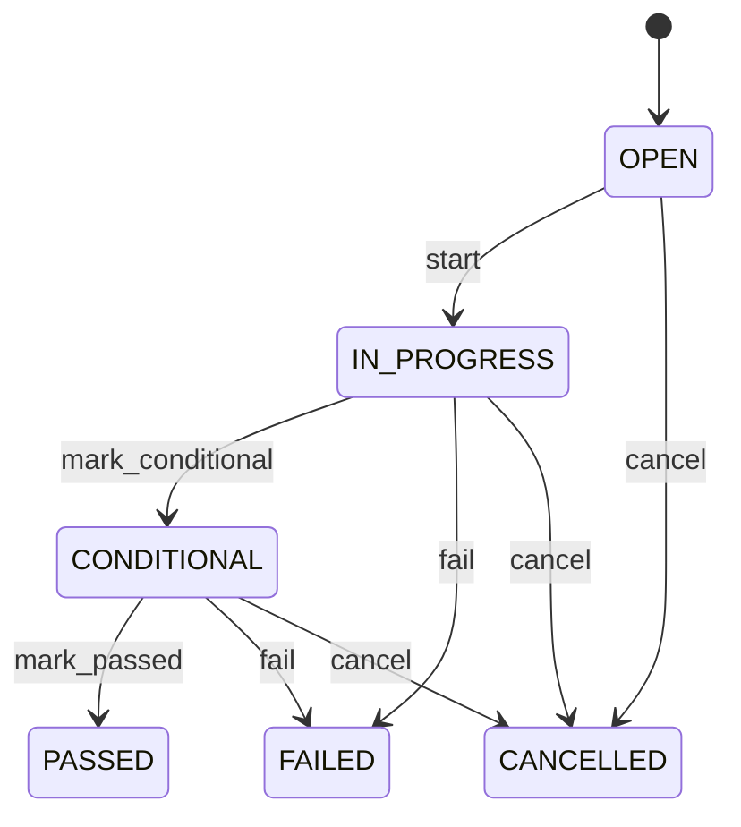

# Quality Inspection

Represents a quality inspection and its controlled sampling, measurements, result and disposition across inbound receiving and supplier-return workflows. QualityInspection provides the execution context and overall decision; InspectionSample records the actual selected sample; QualityMeasurement records individual factual observations. The inspection does not itself perform inventory or financial changes. Receiving quality, supplier quality, acceptance sampling, returns, quarantine, nonconformance, corrective action, compliance and audit. QualityPlan/QualityPlanCharacteristic define controls; SamplingPlan/SamplingRule define selection; InspectionSample records execution; QualityMeasurement provides test evidence; InventoryMovement records physical stock consequence; SupplierCreditNote records financial consequence; Nonconformance records deviations. QualityPlan → QualityPlanCharacteristic → SamplingPlan/SamplingRule → QualityInspection → InspectionSample selection → sample measurement → aggregate result → Nonconformance/disposition. For unsampled characteristics, measurement may be captured directly under the inspection. For supplier returns, SupplierReturn → inspection → sample/measurement/disposition → attributable InventoryMovement → SupplierCreditNote/exception completion. Open → in progress → sampling/evidence captured → passed/failed/conditional → dispositioned, with cancellation or controlled reinspection. Changes to receipt, supplier return, product, quality plan, characteristic configuration, sampling policy, unit definitions or measurement evidence affecting an open inspection trigger revalidation. Completed inspection and sample history is not silently rewritten; reinspection or correction creates explicit evidence. A received lot of 500 units is governed by a 20-unit SamplingRule. InspectionSample records the selected sample, QualityMeasurement records weight and purity observations, and the inspection aggregates those results before deciding release or quarantine.

## Finding records

Open **Quality Inspection** from the menu or from its card on the dashboard.

The list shows Inspection Number, Inspection Date, Status, Result, Disposition, Notes, Product, with the most recently changed record first. The **Help** button beside the title opens this window's help text.

- **Search**: type in the search box above the grid to narrow the rows. **Search** at the top left opens advanced search, where you pick a field, a comparison (equals, contains, starts with, before, after, and so on) and a value.
- **Sort**: click a column heading; click again to reverse.
- **Refresh**: the refresh button at the top right re-reads the rows and every dropdown, so a record created a moment ago by someone else appears.
- **Export**: **CSV** downloads the rows you are looking at.
- **Open a record**: click a row. The line under the title, "Showing 1 to n of N entries", tells you how many rows match.

## Creating a record

Choose **New** at the top of the list. The form opens on its own page, with the fields in sections. A badge beside each label names the control (Text, Dropdown, Date, and so on); a red star marks a required field; the question-mark icon shows that field's help; and a hint such as “max 300” shows the longest entry accepted.

1. Fill in the fields described under [Fields](#fields).
2. These are required and must be completed before the record can be saved: **Inspection Number**, **Inspection Date**, **Status**.
3. For a dropdown that points at another window, pick the matching record; if the record you need does not exist yet, create it in its own window first. A dropdown may narrow to what you have already chosen, for example the states of the chosen country.
4. Choose **Create** (or **Save** in the toolbar). You return to the record, and it appears at the top of the list. If something is wrong the form says which field and why, and nothing is saved.

## Reading, changing and deleting a record

Click a row to open the record. Above the fields are the arrows that step through the list ("1 of 5"). Below them sit **Notes**, where anyone may leave a comment on the record, and the **Audit Trail**, which lists every change with who made it, when, and which fields changed.

- **Edit** (toolbar) makes the fields editable. Change them and choose **Save**; **Undo Changes** puts back what you changed and **Cancel Editing** leaves edit mode.
- **Copy Record** starts a new record from this one.
- **Delete Record** is available in edit mode and asks you to confirm; a record other records still depend on cannot be deleted.

Every change is also written to the [Audit Log](/administration/#audit-log).

## Fields

| Field | What you use | Rules | What to enter |
| --- | --- | --- | --- |
| Inspection Number | Text | Required, Unique, Up to 100 characters | Business-facing inspection reference. Identifies the inspection in quality operations and audit. Quality records, supplier disputes and reporting. Distinct from GoodsReceipt.receiptNumber and SupplierReturn.returnNumber. Provides human-recognizable traceability. Required. |
| Inspection Date | Date and time | Required | Date and time inspection was performed or initiated. Establishes quality chronology. Audit, release, supplier performance and compliance. May occur after receipt or return authorization and before final disposition. Anchors inspection evidence. Required. |
| Status | Choice | Required | Lifecycle state of inspection. Indicates whether inspection is pending, executing, completed with a result, or cancelled. Controls release and disposition workflows. Inspection status is independent of sample status, receipt/return status, and inventory state. PASSED/FAILED/CONDITIONAL controls eligible disposition. Required. The status of the quality inspection is open; set it when that is what the business means for this record. The status of the quality inspection is in progress; set it when that is what the business means for this record. The status of the quality inspection is passed; set it when that is what the business means for this record. The status of the quality inspection is failed; set it when that is what the business means for this record. The status of the quality inspection is conditional; set it when that is what the business means for this record. The status of the quality inspection is cancelled; set it when that is what the business means for this record. Choose one: Open, In progress, Passed, Failed, Conditional, Cancelled. |
| Result | Choice | Optional | Overall outcome of inspection or test. Records whether the inspected scope satisfies applicable requirements after evaluating relevant samples, measurements and other evidence. Drives acceptance, rejection, quarantine, return, repair or release decisions. May be derived from QualityMeasurement and InspectionSample evidence; it does not replace that evidence. Supplies aggregate evidence for controlled disposition. Optional until testing is complete. The result of the quality inspection is pass; set it when that is what the business means for this record. The result of the quality inspection is fail; set it when that is what the business means for this record. The result of the quality inspection is conditional; set it when that is what the business means for this record. The result of the quality inspection is not tested; set it when that is what the business means for this record. Choose one: Pass, Fail, Conditional, Not tested. |
| Disposition | Choice | Optional | Controlled operational disposition resulting from inspection. Defines what happens to inspected material after quality evaluation. Controls inventory availability, supplier return, repair, scrap and release processes. RETURN_TO_SUPPLIER may initiate or support SupplierReturn; it does not itself reduce inventory until an attributable InventoryMovement is posted. Converts quality result into an authorized physical disposition. Optional until a disposition decision is made. The disposition of the quality inspection is release; set it when that is what the business means for this record. The disposition of the quality inspection is accept; set it when that is what the business means for this record. The disposition of the quality inspection is reject; set it when that is what the business means for this record. The disposition of the quality inspection is quarantine; set it when that is what the business means for this record. The disposition of the quality inspection is return to supplier; set it when that is what the business means for this record. The disposition of the quality inspection is rework; set it when that is what the business means for this record. The disposition of the quality inspection is repair; set it when that is what the business means for this record. The disposition of the quality inspection is scrap; set it when that is what the business means for this record. The disposition of the quality inspection is conditional release; set it when that is what the business means for this record. Choose one: Release, Accept, Reject, Quarantine, Return to supplier, Rework, Repair, Scrap, Conditional release. |
| Notes | Text | Up to 4000 characters | Inspection observations and supporting context. Records qualitative evidence not represented by structured measurements. Quality review, supplier disputes and audit. Complements QualityMeasurement, InspectionSample and Nonconformance; does not replace structured evidence. Supports disposition decisions. Optional. |
| Product | Lookup | Optional | Product being inspected. Identifies material subject to quality evaluation. Quality history, supplier performance and disposition. Supplies item context. Pick a record from **Product**. |
| Inspector | Lookup | Optional | Party performing or accountable for inspection. Identifies inspector or quality authority. Accountability, audit and compliance. Provides execution responsibility. Pick a record from **Party**. |

## How it connects to other records
- A quality inspection has many **Production Receipt** records.
- A quality inspection belongs to one **Product**.
- A quality inspection belongs to one **Party**.

## Lifecycle: Quality inspection lifecycle

A quality inspection record starts as **Open** and ends as **Passed** or **Failed** or **Cancelled**. Open a record and the bar above its fields shows its current **State** and, after **Next**, a button for each move that leaves it; choose one to make the move. Any move the diagram does not draw is refused, for everyone including the administrator.

| From | To | Move |
| --- | --- | --- |
| Open | In progress | Start |
| In progress | Conditional | Mark conditional |
| Conditional | Passed | Mark passed |
| In progress | Failed | Fail |
| Conditional | Failed | Fail |
| Open | Cancelled | Cancel |
| In progress | Cancelled | Cancel |
| Conditional | Cancelled | Cancel |

## What happens when you save
Business rules run around the save. They are listed here and explained in full under [Business rules](/administration/rules/).

| Rule | When | Order |
| --- | --- | --- |
| Quality inspection workflows after update | after a quality inspection is changed | 100 |

Processes started from this record: [Quality inspection exception raised](/administration/processes/#quality-inspection-exception-raised), [Quality inspection follow up required](/administration/processes/#quality-inspection-follow-up-required).

## Who may use it

Anyone who holds a role with access to the **Quality Inspection** window. Access is granted by role under [Roles and access](/administration/access/).
