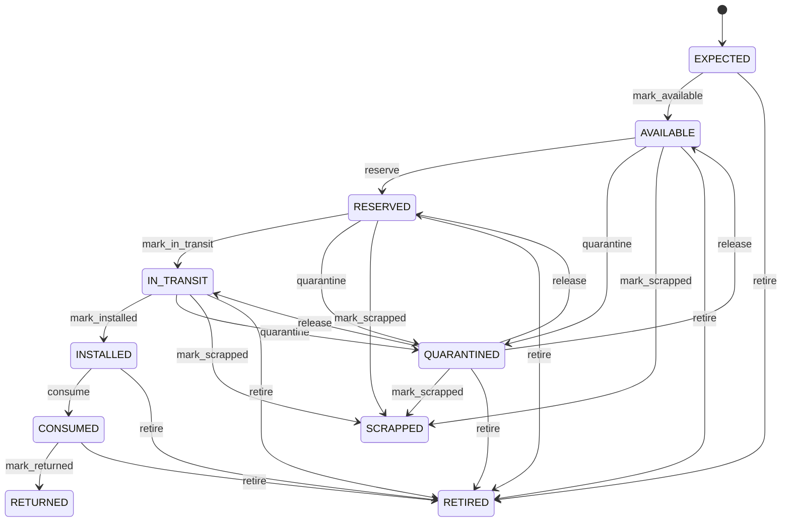

# Serial Number

Unit-level identity and custody traceability for serialized products. Product identifies the type, Lot identifies a batch, and SerialNumber identifies one physical unit. Inventory, warehouse, logistics, manufacturing, service, maintenance, warranty, returns, recall, and asset management. SerialNumber travels through InventoryMovement and may be associated with a Lot while preserving unique unit identity. Expected → available/reserved → in transit/installed/consumed/returned/quarantined → scrapped/retired as applicable. Status and custody changes revalidate inventory, reservation, shipment, service, return, and asset workflows; historical custody is never rewritten.

## Finding records

Open **Serial Number** from the menu or from its card on the dashboard.

The list shows Serial Code, Status, Product, Material Issue, Production Receipt, Lot, Scrap, with the most recently changed record first. The **Help** button beside the title opens this window's help text.

- **Search**: type in the search box above the grid to narrow the rows. **Search** at the top left opens advanced search, where you pick a field, a comparison (equals, contains, starts with, before, after, and so on) and a value.
- **Sort**: click a column heading; click again to reverse.
- **Refresh**: the refresh button at the top right re-reads the rows and every dropdown, so a record created a moment ago by someone else appears.
- **Export**: **CSV** downloads the rows you are looking at.
- **Open a record**: click a row. The line under the title, "Showing 1 to n of N entries", tells you how many rows match.

## Creating a record

Choose **New** at the top of the list. The form opens on its own page, with the fields in sections. A badge beside each label names the control (Text, Dropdown, Date, and so on); a red star marks a required field; the question-mark icon shows that field's help; and a hint such as “max 300” shows the longest entry accepted.

1. Fill in the fields described under [Fields](#fields).
2. These are required and must be completed before the record can be saved: **Serial Code**, **Status**, **Product**.
3. For a dropdown that points at another window, pick the matching record; if the record you need does not exist yet, create it in its own window first. A dropdown may narrow to what you have already chosen, for example the states of the chosen country.
4. Choose **Create** (or **Save** in the toolbar). You return to the record, and it appears at the top of the list. If something is wrong the form says which field and why, and nothing is saved.

## Reading, changing and deleting a record

Click a row to open the record. Above the fields are the arrows that step through the list ("1 of 5"). Below them sit **Notes**, where anyone may leave a comment on the record, and the **Audit Trail**, which lists every change with who made it, when, and which fields changed.

- **Edit** (toolbar) makes the fields editable. Change them and choose **Save**; **Undo Changes** puts back what you changed and **Cancel Editing** leaves edit mode.
- **Copy Record** starts a new record from this one.
- **Delete Record** is available in edit mode and asks you to confirm; a record other records still depend on cannot be deleted.

Every change is also written to the [Audit Log](/administration/#audit-log).

## Fields

| Field | What you use | Rules | What to enter |
| --- | --- | --- | --- |
| Serial Code | Text | Required, Up to 200 characters | Business/manufacturer serial identifier. Operational code used to recognize the individual unit. Scanning, receiving, picking, shipment, service, returns, and warranty. Uniqueness is governed for the Product or global namespace. Required. |
| Status | Choice | Required | Operational lifecycle state of the serialized unit. Controls eligibility and custody transitions for the individual unit. Allocation, shipment, service, returns, and disposal. Status is reconciled from authoritative business and inventory events rather than freely edited. Known before receipt. Eligible inventory. Committed to demand. Under logistics movement. Deployed or installed. Used in a process. Entered governed return flow. Restricted pending decision. Physically disposed as scrap. Lifecycle closed. Required. Choose one: Expected, Available, Reserved, In transit, Installed, Consumed, Returned, Quarantined, Scrapped, Retired. |
| Product | Lookup | Required | Product model represented by the serial. Defines the standardized item type. Validation and master-data context. Exactly one Product. Every serial movement must use the same Product. Pick a record from **Product**. |
| Material Issue | Lookup | Optional | The MaterialIssue this SerialNumber belongs to. Pick a record from **Material Issue**. |
| Production Receipt | Lookup | Optional | The ProductionReceipt this SerialNumber belongs to. Pick a record from **Production Receipt**. |
| Lot | Lookup | Optional | Lot or batch from which this serialized unit originates when applicable. Connects unit identity to batch genealogy. Recall, quality, manufacturing, and provenance. Optional for products not lot-controlled. Serial and lot provenance must remain consistent. Pick a record from **Lot**. |
| Scrap | Lookup | Optional | The Scrap this SerialNumber belongs to. Pick a record from **Scrap**. |

## How it connects to other records
- A serial number belongs to one **Product**.
- A serial number belongs to one **Material Issue**.
- A serial number belongs to one **Production Receipt**.
- A serial number belongs to one **Lot**.
- A serial number is linked to many **Inventory Movement** records.
- A serial number belongs to one **Scrap**.

## Lifecycle: Serial number lifecycle

A serial number record starts as **Expected** and ends as **Returned** or **Scrapped** or **Retired**. Open a record and the bar above its fields shows its current **State** and, after **Next**, a button for each move that leaves it; choose one to make the move. Any move the diagram does not draw is refused, for everyone including the administrator.

| From | To | Move |
| --- | --- | --- |
| Expected | Available | Mark available |
| Available | Reserved | Reserve |
| Reserved | In transit | Mark in transit |
| In transit | Installed | Mark installed |
| Installed | Consumed | Consume |
| Consumed | Returned | Mark returned |
| Available | Quarantined | Quarantine |
| Quarantined | Available | Release |
| Reserved | Quarantined | Quarantine |
| Quarantined | Reserved | Release |
| In transit | Quarantined | Quarantine |
| Quarantined | In transit | Release |
| Available | Scrapped | Mark scrapped |
| Reserved | Scrapped | Mark scrapped |
| In transit | Scrapped | Mark scrapped |
| Quarantined | Scrapped | Mark scrapped |
| Expected | Retired | Retire |
| Available | Retired | Retire |
| Reserved | Retired | Retire |
| In transit | Retired | Retire |
| Quarantined | Retired | Retire |
| Installed | Retired | Retire |
| Consumed | Retired | Retire |

## What happens when you save
Business rules run around the save. They are listed here and explained in full under [Business rules](/administration/rules/).

| Rule | When | Order |
| --- | --- | --- |
| Serial number workflows after update | after a serial number is changed | 100 |

Processes started from this record: [Serial number exception raised](/administration/processes/#serial-number-exception-raised).

## Who may use it

Anyone who holds a role with access to the **Serial Number** window. Access is granted by role under [Roles and access](/administration/access/).
