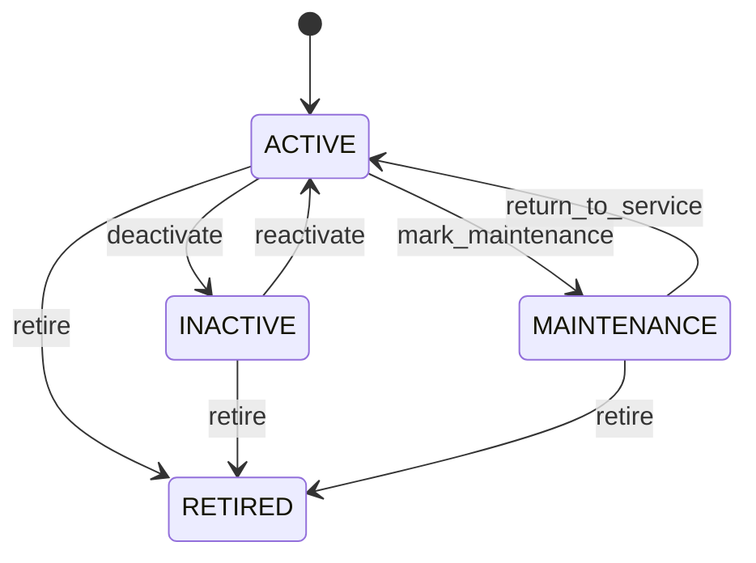

# Work Center

Manufacturing capacity resource used by routing and execution. WorkCenter represents where or by which resource an Operation is performed. Manufacturing planning, scheduling, dispatch, costing, maintenance coordination, and analytics. Operation defines work; Routing sequences work; ManufacturingWorkOrder executes it. Active → temporarily unavailable/maintenance → active or retired. Capacity/status changes revalidate affected schedules and unreleased work without rewriting completed execution.

## Finding records

Open **Work Center** from the menu or from its card on the dashboard.

The list shows Code, Name, Capacity Per Hour, Status, Location, with the most recently changed record first. The **Help** button beside the title opens this window's help text.

- **Search**: type in the search box above the grid to narrow the rows. **Search** at the top left opens advanced search, where you pick a field, a comparison (equals, contains, starts with, before, after, and so on) and a value.
- **Sort**: click a column heading; click again to reverse.
- **Refresh**: the refresh button at the top right re-reads the rows and every dropdown, so a record created a moment ago by someone else appears.
- **Export**: **CSV** downloads the rows you are looking at.
- **Open a record**: click a row. The line under the title, "Showing 1 to n of N entries", tells you how many rows match.

## Creating a record

Choose **New** at the top of the list. The form opens on its own page, with the fields in sections. A badge beside each label names the control (Text, Dropdown, Date, and so on); a red star marks a required field; the question-mark icon shows that field's help; and a hint such as “max 300” shows the longest entry accepted.

1. Fill in the fields described under [Fields](#fields).
2. These are required and must be completed before the record can be saved: **Code**, **Name**, **Status**.
3. For a dropdown that points at another window, pick the matching record; if the record you need does not exist yet, create it in its own window first. A dropdown may narrow to what you have already chosen, for example the states of the chosen country.
4. Choose **Create** (or **Save** in the toolbar). You return to the record, and it appears at the top of the list. If something is wrong the form says which field and why, and nothing is saved.

## Reading, changing and deleting a record

Click a row to open the record. Above the fields are the arrows that step through the list ("1 of 5"). Below them sit **Notes**, where anyone may leave a comment on the record, and the **Audit Trail**, which lists every change with who made it, when, and which fields changed.

- **Edit** (toolbar) makes the fields editable. Change them and choose **Save**; **Undo Changes** puts back what you changed and **Cancel Editing** leaves edit mode.
- **Copy Record** starts a new record from this one.
- **Delete Record** is available in edit mode and asks you to confirm; a record other records still depend on cannot be deleted.

Every change is also written to the [Audit Log](/administration/#audit-log).

## Fields

| Field | What you use | Rules | What to enter |
| --- | --- | --- | --- |
| Code | Text | Required, Unique, Up to 100 characters | Human-facing work-center code. Operational identifier used in manufacturing plans and execution. Scheduling, dispatching, reporting, and integration. Unique within its manufacturing context. Required. |
| Name | Text | Required, Up to 300 characters | Descriptive work-center name. Communicates the resource function to planners and operators. Planning and execution UI/reporting. Complements the stable code. Required. |
| Capacity Per Hour | Amount | Optional | Nominal output or processing capacity per hour. Planning assumption for finite or rough-cut scheduling. Capacity planning and schedule feasibility. Actual execution is captured separately. Optional when capacity is not quantity-based. |
| Status | Choice | Required | Operational eligibility of the work center. Controls whether new work may be scheduled or executed. Scheduling and maintenance coordination. Existing historical operations remain valid. Available subject to capacity. Temporarily unavailable. Unavailable due to maintenance. Permanently unavailable for new work. Required. Choose one: Active, Inactive, Maintenance, Retired. |
| Location | Lookup | Optional | Physical or organizational location of the resource. Places manufacturing capacity within the operating network. Scheduling, material staging, and reporting. Optional for virtual or pooled resources. Location eligibility constrains execution. Pick a record from **Location**. |

## How it connects to other records
- A work center has many **Routing** records.
- A work center belongs to one **Location**.

## Lifecycle: Work center lifecycle

A work center record starts as **Active** and ends as **Retired**. Open a record and the bar above its fields shows its current **State** and, after **Next**, a button for each move that leaves it; choose one to make the move. Any move the diagram does not draw is refused, for everyone including the administrator.

| From | To | Move |
| --- | --- | --- |
| Active | Inactive | Deactivate |
| Inactive | Active | Reactivate |
| Active | Maintenance | Mark maintenance |
| Maintenance | Active | Return to service |
| Active | Retired | Retire |
| Inactive | Retired | Retire |
| Maintenance | Retired | Retire |

## Who may use it

Anyone who holds a role with access to the **Work Center** window. Access is granted by role under [Roles and access](/administration/access/).
