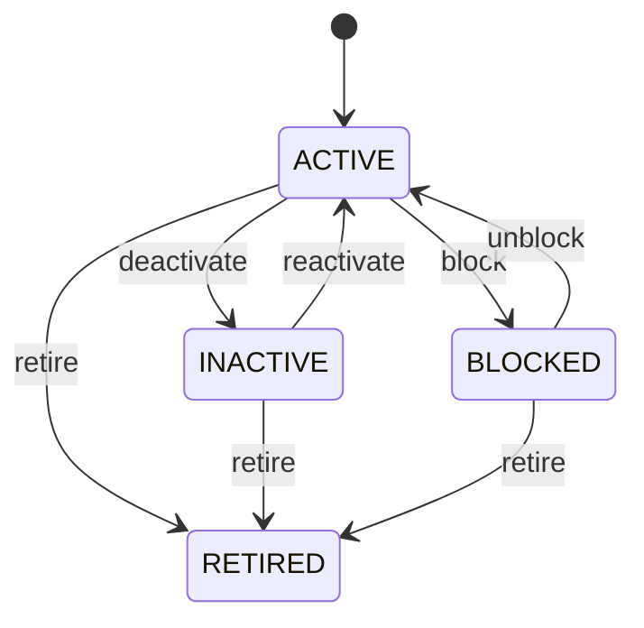

# Party

The foundational CEDM business concept for an identifiable person or organization participating in business. Party separates who an actor is from the roles that actor performs. The same party can be a customer, supplier, employee, owner, provider, or contract party without creating duplicate identities. Used as the identity foundation for onboarding, customer management, procurement, sales, finance, logistics, HR, healthcare, contracts, compliance, and audit. Party connects to Person or Organization for intrinsic identity details and to PartyRole for business roles. Transactions and domain entities should reference the appropriate role when role-specific behavior matters. Party identity is long-lived. Operational eligibility is controlled by status, while historical relationships and transactions remain referentially valid. One organization may be represented by a single Party and simultaneously participate as Customer and Supplier in different business relationships.

## Finding records

Open **Party** from the menu or from its card on the dashboard.

The list shows Party Type, Display Name, Status, External Reference, Nonprofit Campaign, with the most recently changed record first. The **Help** button beside the title opens this window's help text.

- **Search**: type in the search box above the grid to narrow the rows. **Search** at the top left opens advanced search, where you pick a field, a comparison (equals, contains, starts with, before, after, and so on) and a value.
- **Sort**: click a column heading; click again to reverse.
- **Refresh**: the refresh button at the top right re-reads the rows and every dropdown, so a record created a moment ago by someone else appears.
- **Export**: **CSV** downloads the rows you are looking at.
- **Open a record**: click a row. The line under the title, "Showing 1 to n of N entries", tells you how many rows match.

## Creating a record

Choose **New** at the top of the list. The form opens on its own page, with the fields in sections. A badge beside each label names the control (Text, Dropdown, Date, and so on); a red star marks a required field; the question-mark icon shows that field's help; and a hint such as “max 300” shows the longest entry accepted.

1. Fill in the fields described under [Fields](#fields).
2. These are required and must be completed before the record can be saved: **Party Type**, **Display Name**, **Status**.
3. For a dropdown that points at another window, pick the matching record; if the record you need does not exist yet, create it in its own window first. A dropdown may narrow to what you have already chosen, for example the states of the chosen country.
4. Choose **Create** (or **Save** in the toolbar). You return to the record, and it appears at the top of the list. If something is wrong the form says which field and why, and nothing is saved.

## Reading, changing and deleting a record

Click a row to open the record. Above the fields are the arrows that step through the list ("1 of 5"). Below them sit **Notes**, where anyone may leave a comment on the record, and the **Audit Trail**, which lists every change with who made it, when, and which fields changed.

- **Edit** (toolbar) makes the fields editable. Change them and choose **Save**; **Undo Changes** puts back what you changed and **Cancel Editing** leaves edit mode.
- **Copy Record** starts a new record from this one.
- **Delete Record** is available in edit mode and asks you to confirm; a record other records still depend on cannot be deleted.

Every change is also written to the [Audit Log](/administration/#audit-log).

## Fields

| Field | What you use | Rules | What to enter |
| --- | --- | --- | --- |
| Party Type | Choice | Required | Identifies whether the party is a person or an organization. Determines which party specialization is applicable and prevents business processes from interpreting an organization as an individual or vice versa. Used to select Person or Organization details and to drive validation, forms, search, reporting, and role assignment. PERSON requires the Person specialization; ORGANIZATION requires the Organization specialization. The party represents an individual human being. The party represents a legal, commercial, governmental, nonprofit, or other organized body. Required because the party's specialization and applicable business semantics depend on it. Choose one: Person, Organization. |
| Display Name | Text | Required, Up to 300 characters | The business-facing name by which the party is normally displayed and recognized. Provides a consistent human-readable representation independent of whether the party is a person or organization. Used in forms, search results, documents, transactions, reports, notifications, and user interfaces. It is a presentation identity for the Party and does not replace legal names, person names, or organization registration names stored by specializations. Required so every party can be unambiguously presented to users and business processes. |
| Status | Choice | Required | Controls whether the party may participate in new business activity. Represents the operational lifecycle of the party relationship with the enterprise, not the party's legal existence. Used by onboarding, transaction validation, account maintenance, compliance, and deactivation processes. A party may remain historically referenced after becoming INACTIVE, BLOCKED, or RETIRED; lifecycle state therefore does not imply deletion. The party is available for normal business participation. The party is retained but is not normally eligible for new activity. Business activity is restricted pending resolution of a business, risk, compliance, or operational condition. The party relationship is permanently ended for normal operational use while historical references remain valid. Required because downstream processes must know whether participation is currently permitted. Choose one: Active, Inactive, Blocked, Retired. |
| External Reference | Text | Up to 200 characters | An identifier assigned to the party by an external system or business partner. Preserves a cross-system identity that allows CEDM to reconcile a party with another master-data system. Used for integrations, migration, reconciliation, EDI, synchronization, and external lookup. It is not the canonical CEDM identity; Party.partyId remains the internal identity while externalReference provides interoperability context. Optional when no external system identity exists or when the external identity is maintained elsewhere. |
| Nonprofit Campaign | Lookup | Optional | The NonprofitCampaign this Party belongs to. Pick a record from **Nonprofit Campaign**. |

## How it connects to other records
- A party has one **Person**.
- A party has one **Organization**.
- A party has many **Address** records.
- A party has many **Party Role** records.
- A party has many **Party Relationship** records.
- A party has many **Contact Point** records.
- A party has many **Task** records.
- A party belongs to one **Nonprofit Campaign**.

## Lifecycle: Party lifecycle

A party record starts as **Active** and ends as **Retired**. Open a record and the bar above its fields shows its current **State** and, after **Next**, a button for each move that leaves it; choose one to make the move. Any move the diagram does not draw is refused, for everyone including the administrator.

| From | To | Move |
| --- | --- | --- |
| Active | Inactive | Deactivate |
| Inactive | Active | Reactivate |
| Active | Blocked | Block |
| Blocked | Active | Unblock |
| Active | Retired | Retire |
| Inactive | Retired | Retire |
| Blocked | Retired | Retire |

## What happens when you save
Business rules run around the save. They are listed here and explained in full under [Business rules](/administration/rules/).

| Rule | When | Order |
| --- | --- | --- |
| Party workflows after update | after a party is changed | 100 |

Processes started from this record: [Party exception raised](/administration/processes/#party-exception-raised).

## Who may use it

Anyone who holds a role with access to the **Party** window. Access is granted by role under [Roles and access](/administration/access/).
