# Record lifecycles

A lifecycle is the set of states a record can be in and the moves between them. The application enforces it on every write, through the screen and through the API: a move the diagram does not draw is refused for everyone, administrators included. Role restrictions narrow who may make a particular move. This application has **25** lifecycles.

## Party: Party lifecycle

States: **Active**, **Inactive**, **Blocked**, **Retired**. A new record starts as **Active**; **Retired** ends the lifecycle.

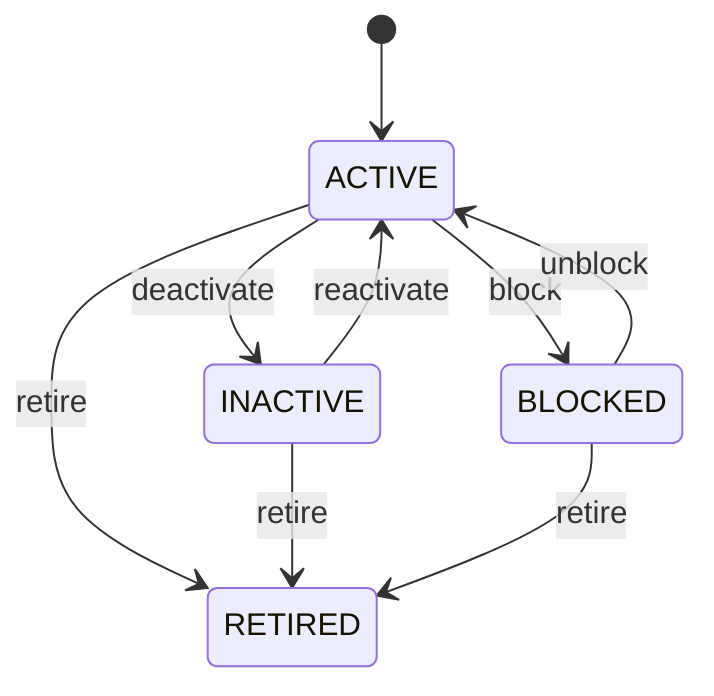
```mermaid
stateDiagram-v2
  [*] --> ACTIVE
  ACTIVE --> INACTIVE: deactivate
  INACTIVE --> ACTIVE: reactivate
  ACTIVE --> BLOCKED: block
  BLOCKED --> ACTIVE: unblock
  ACTIVE --> RETIRED: retire
  INACTIVE --> RETIRED: retire
  BLOCKED --> RETIRED: retire
```

Any role that may change the record may make any move the diagram draws.

See [Party](/entities/foundation/party/) for the record itself.

## Organization: Organization lifecycle

States: **Draft**, **Active**, **Inactive**, **Retired**. A new record starts as **Draft**; **Retired** ends the lifecycle.

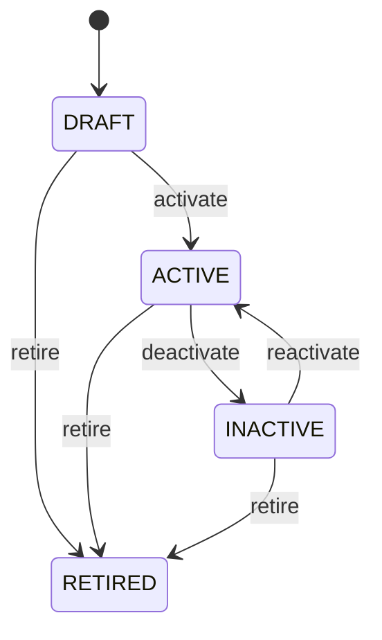
```mermaid
stateDiagram-v2
  [*] --> DRAFT
  DRAFT --> ACTIVE: activate
  ACTIVE --> INACTIVE: deactivate
  INACTIVE --> ACTIVE: reactivate
  DRAFT --> RETIRED: retire
  ACTIVE --> RETIRED: retire
  INACTIVE --> RETIRED: retire
```

Any role that may change the record may make any move the diagram draws.

See [Organization](/entities/foundation/organization/) for the record itself.

## Party Role: Party role lifecycle

States: **Active**, **Inactive**, **Expired**. A new record starts as **Active**; **Expired** ends the lifecycle.

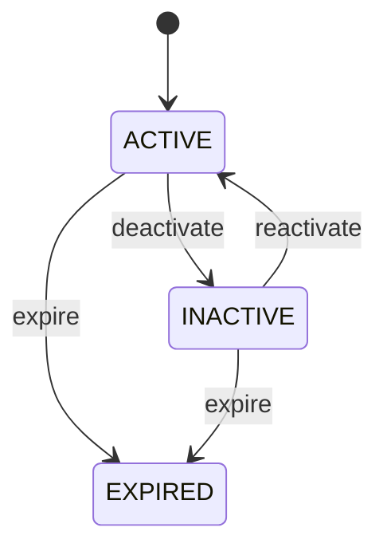
```mermaid
stateDiagram-v2
  [*] --> ACTIVE
  ACTIVE --> INACTIVE: deactivate
  INACTIVE --> ACTIVE: reactivate
  ACTIVE --> EXPIRED: expire
  INACTIVE --> EXPIRED: expire
```

Any role that may change the record may make any move the diagram draws.

See [Party Role](/entities/foundation/party-role/) for the record itself.

## Address: Address lifecycle

States: **Active**, **Inactive**, **Retired**. A new record starts as **Active**; **Retired** ends the lifecycle.

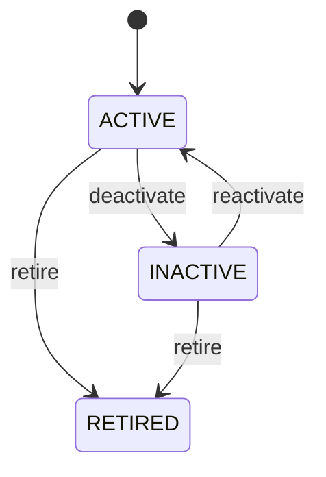
```mermaid
stateDiagram-v2
  [*] --> ACTIVE
  ACTIVE --> INACTIVE: deactivate
  INACTIVE --> ACTIVE: reactivate
  ACTIVE --> RETIRED: retire
  INACTIVE --> RETIRED: retire
```

Any role that may change the record may make any move the diagram draws.

See [Address](/entities/foundation/address/) for the record itself.

## Location: Location lifecycle

States: **Planned**, **Active**, **Inactive**, **Closed**, **Retired**. A new record starts as **Planned**; **Closed**, **Retired** ends the lifecycle.

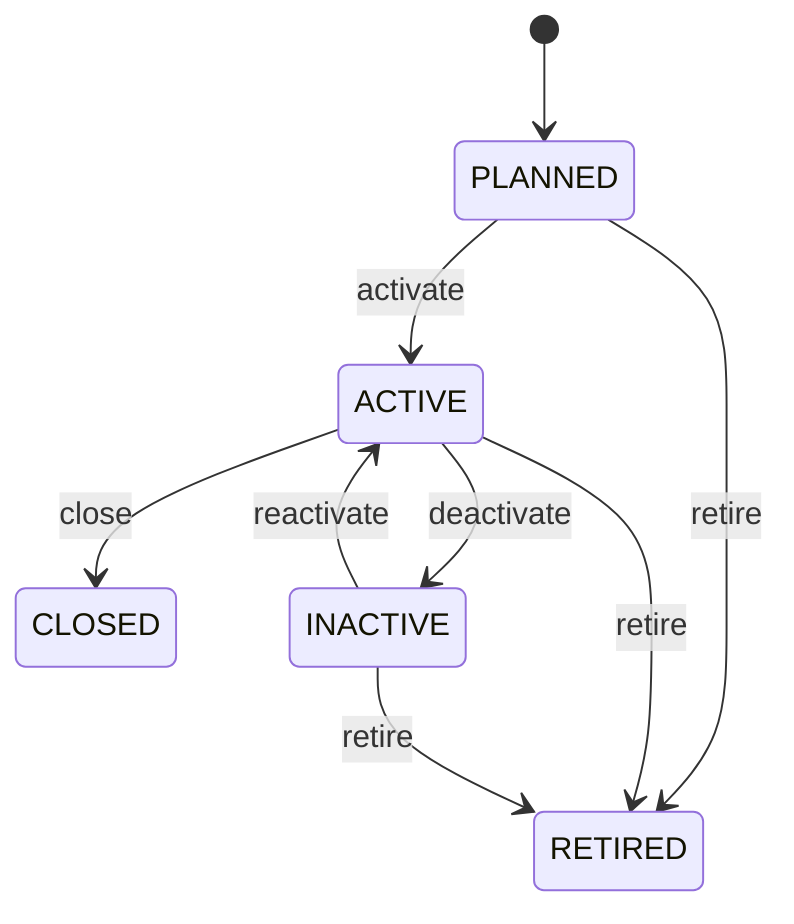
```mermaid
stateDiagram-v2
  [*] --> PLANNED
  PLANNED --> ACTIVE: activate
  ACTIVE --> CLOSED: close
  ACTIVE --> INACTIVE: deactivate
  INACTIVE --> ACTIVE: reactivate
  PLANNED --> RETIRED: retire
  ACTIVE --> RETIRED: retire
  INACTIVE --> RETIRED: retire
```

Any role that may change the record may make any move the diagram draws.

See [Location](/entities/foundation/location/) for the record itself.

## Currency: Currency lifecycle

States: **Active**, **Inactive**, **Retired**. A new record starts as **Active**; **Retired** ends the lifecycle.

```mermaid
stateDiagram-v2
  [*] --> ACTIVE
  ACTIVE --> INACTIVE: deactivate
  INACTIVE --> ACTIVE: reactivate
  ACTIVE --> RETIRED: retire
  INACTIVE --> RETIRED: retire
```

Any role that may change the record may make any move the diagram draws.

See [Currency](/entities/foundation/currency/) for the record itself.

## Exchange Rate: Exchange rate lifecycle

States: **Draft**, **Active**, **Expired**, **Cancelled**. A new record starts as **Draft**; **Expired**, **Cancelled** ends the lifecycle.

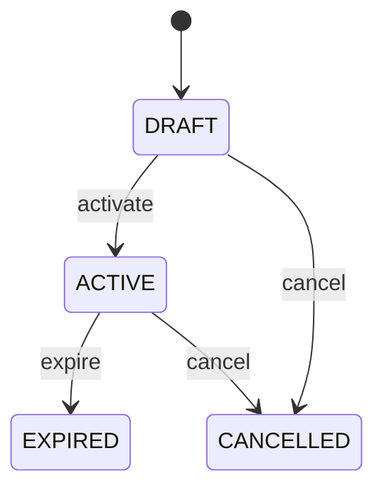
```mermaid
stateDiagram-v2
  [*] --> DRAFT
  DRAFT --> ACTIVE: activate
  ACTIVE --> EXPIRED: expire
  DRAFT --> CANCELLED: cancel
  ACTIVE --> CANCELLED: cancel
```

Any role that may change the record may make any move the diagram draws.

See [Exchange Rate](/entities/foundation/exchange-rate/) for the record itself.

## Unit Of Measure: Unit of measure lifecycle

States: **Active**, **Inactive**, **Retired**. A new record starts as **Active**; **Retired** ends the lifecycle.

```mermaid
stateDiagram-v2
  [*] --> ACTIVE
  ACTIVE --> INACTIVE: deactivate
  INACTIVE --> ACTIVE: reactivate
  ACTIVE --> RETIRED: retire
  INACTIVE --> RETIRED: retire
```

Any role that may change the record may make any move the diagram draws.

See [Unit Of Measure](/entities/foundation/unit-of-measure/) for the record itself.

## Task: Task lifecycle

States: **Created**, **Ready**, **Assigned**, **In progress**, **Blocked**, **Completed**, **Cancelled**, **Failed**. A new record starts as **Created**; **Completed**, **Cancelled**, **Failed** ends the lifecycle.

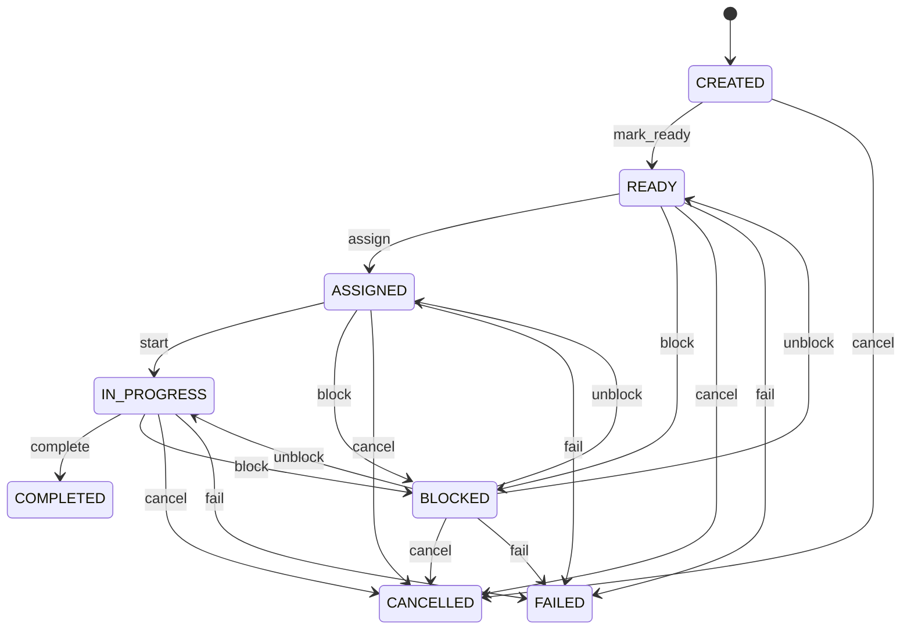
```mermaid
stateDiagram-v2
  [*] --> CREATED
  CREATED --> READY: mark_ready
  READY --> ASSIGNED: assign
  ASSIGNED --> IN_PROGRESS: start
  IN_PROGRESS --> COMPLETED: complete
  READY --> BLOCKED: block
  BLOCKED --> READY: unblock
  ASSIGNED --> BLOCKED: block
  BLOCKED --> ASSIGNED: unblock
  IN_PROGRESS --> BLOCKED: block
  BLOCKED --> IN_PROGRESS: unblock
  CREATED --> CANCELLED: cancel
  READY --> CANCELLED: cancel
  ASSIGNED --> CANCELLED: cancel
  IN_PROGRESS --> CANCELLED: cancel
  BLOCKED --> CANCELLED: cancel
  READY --> FAILED: fail
  ASSIGNED --> FAILED: fail
  IN_PROGRESS --> FAILED: fail
  BLOCKED --> FAILED: fail
```

Any role that may change the record may make any move the diagram draws.

See [Task](/entities/foundation/task/) for the record itself.

## Supplier: Supplier lifecycle

States: **Active**, **Inactive**, **Blocked**, **Retired**. A new record starts as **Active**; **Retired** ends the lifecycle.

```mermaid
stateDiagram-v2
  [*] --> ACTIVE
  ACTIVE --> INACTIVE: deactivate
  INACTIVE --> ACTIVE: reactivate
  ACTIVE --> BLOCKED: block
  BLOCKED --> ACTIVE: unblock
  ACTIVE --> RETIRED: retire
  INACTIVE --> RETIRED: retire
  BLOCKED --> RETIRED: retire
```

Any role that may change the record may make any move the diagram draws.

See [Supplier](/entities/procurement/supplier/) for the record itself.

## Purchase Requisition: Purchase requisition lifecycle

States: **Draft**, **Submitted**, **Approved**, **Rejected**, **Ordered**, **Closed**, **Cancelled**. A new record starts as **Draft**; **Closed**, **Rejected**, **Cancelled** ends the lifecycle.

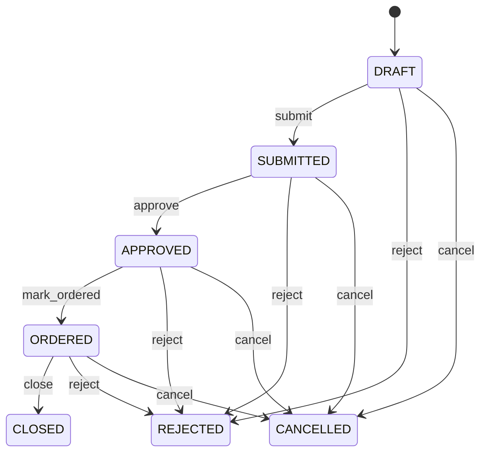
```mermaid
stateDiagram-v2
  [*] --> DRAFT
  DRAFT --> SUBMITTED: submit
  SUBMITTED --> APPROVED: approve
  APPROVED --> ORDERED: mark_ordered
  ORDERED --> CLOSED: close
  DRAFT --> REJECTED: reject
  SUBMITTED --> REJECTED: reject
  APPROVED --> REJECTED: reject
  ORDERED --> REJECTED: reject
  DRAFT --> CANCELLED: cancel
  SUBMITTED --> CANCELLED: cancel
  APPROVED --> CANCELLED: cancel
  ORDERED --> CANCELLED: cancel
```

Any role that may change the record may make any move the diagram draws.

See [Purchase Requisition](/entities/procurement/purchase-requisition/) for the record itself.

## Request For Quotation: Request for quotation lifecycle

States: **Draft**, **Issued**, **Closed**, **Awarded**, **Cancelled**. A new record starts as **Draft**; **Awarded**, **Cancelled** ends the lifecycle.

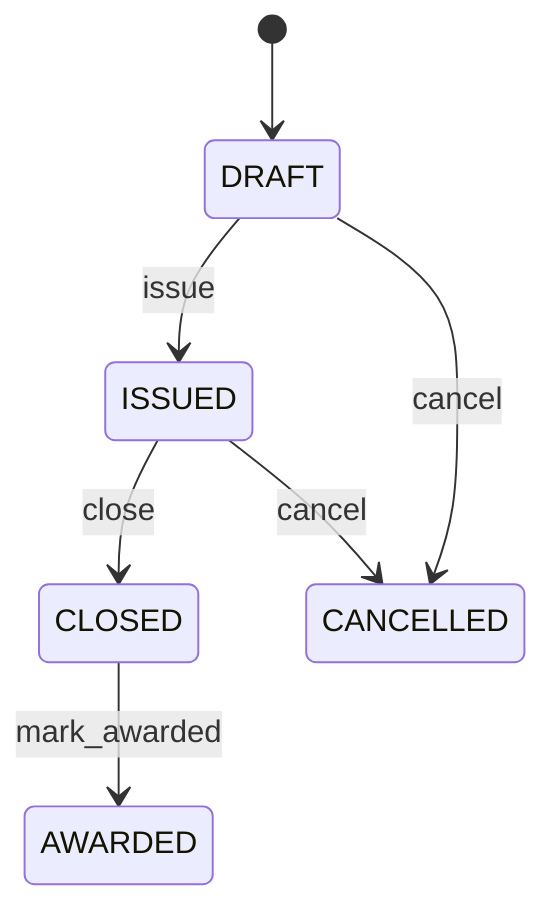
```mermaid
stateDiagram-v2
  [*] --> DRAFT
  DRAFT --> ISSUED: issue
  ISSUED --> CLOSED: close
  CLOSED --> AWARDED: mark_awarded
  DRAFT --> CANCELLED: cancel
  ISSUED --> CANCELLED: cancel
```

Any role that may change the record may make any move the diagram draws.

See [Request For Quotation](/entities/procurement/request-for-quotation/) for the record itself.

## Supplier Quotation: Supplier quotation lifecycle

States: **Received**, **Under review**, **Accepted**, **Rejected**, **Expired**, **Withdrawn**. A new record starts as **Received**; **Rejected**, **Expired**, **Withdrawn** ends the lifecycle.

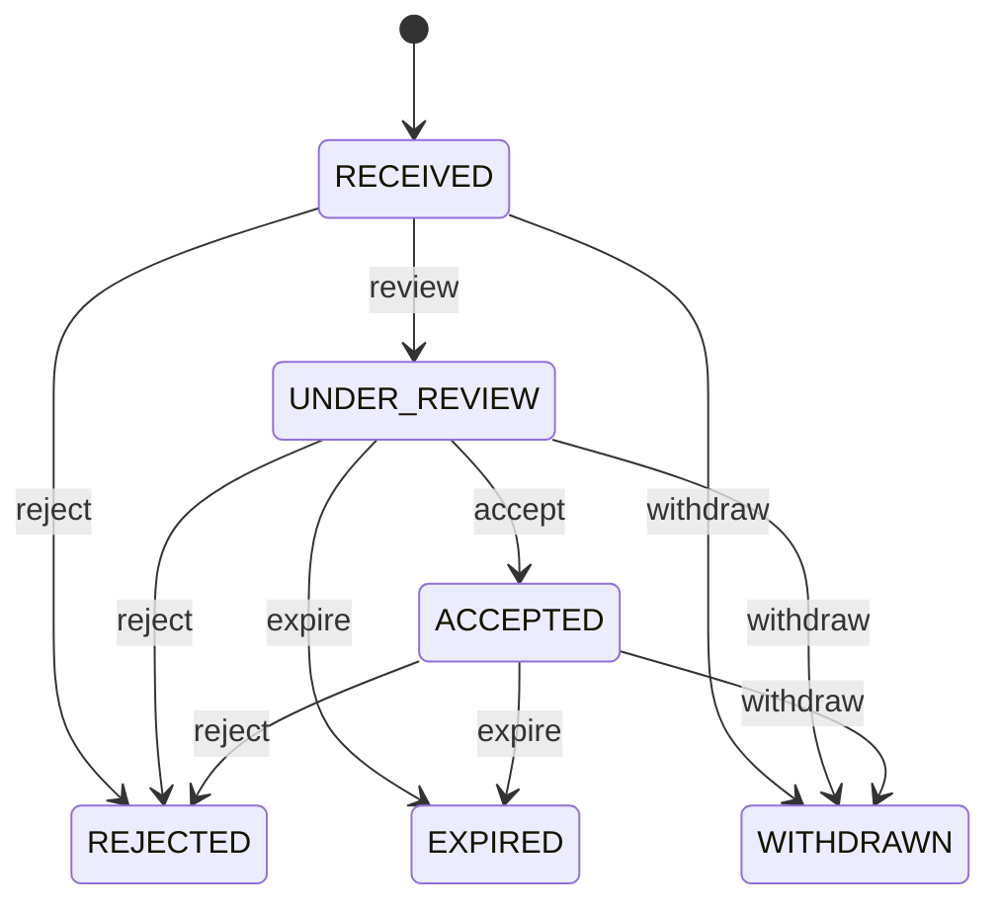
```mermaid
stateDiagram-v2
  [*] --> RECEIVED
  RECEIVED --> UNDER_REVIEW: review
  UNDER_REVIEW --> ACCEPTED: accept
  RECEIVED --> REJECTED: reject
  UNDER_REVIEW --> REJECTED: reject
  ACCEPTED --> REJECTED: reject
  UNDER_REVIEW --> EXPIRED: expire
  ACCEPTED --> EXPIRED: expire
  RECEIVED --> WITHDRAWN: withdraw
  UNDER_REVIEW --> WITHDRAWN: withdraw
  ACCEPTED --> WITHDRAWN: withdraw
```

Any role that may change the record may make any move the diagram draws.

See [Supplier Quotation](/entities/procurement/supplier-quotation/) for the record itself.

## Purchase Order: Purchase order lifecycle

States: **Draft**, **Approved**, **Sent**, **Partially received**, **Received**, **Cancelled**, **Closed**. A new record starts as **Draft**; **Closed**, **Cancelled** ends the lifecycle.

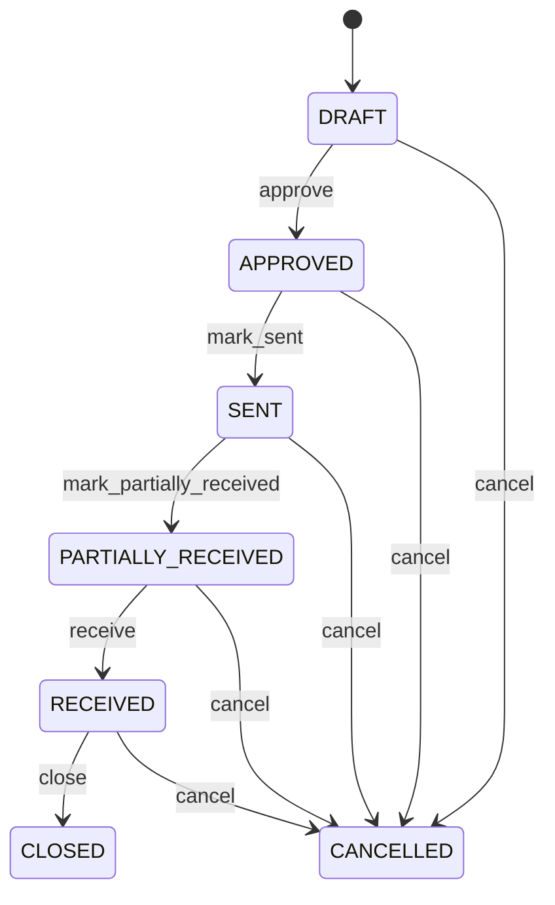
```mermaid
stateDiagram-v2
  [*] --> DRAFT
  DRAFT --> APPROVED: approve
  APPROVED --> SENT: mark_sent
  SENT --> PARTIALLY_RECEIVED: mark_partially_received
  PARTIALLY_RECEIVED --> RECEIVED: receive
  RECEIVED --> CLOSED: close
  DRAFT --> CANCELLED: cancel
  APPROVED --> CANCELLED: cancel
  SENT --> CANCELLED: cancel
  PARTIALLY_RECEIVED --> CANCELLED: cancel
  RECEIVED --> CANCELLED: cancel
```

Any role that may change the record may make any move the diagram draws.

See [Purchase Order](/entities/procurement/purchase-order/) for the record itself.

## Goods Receipt: Goods receipt lifecycle

States: **Draft**, **Received**, **Inspection pending**, **Accepted**, **Partially accepted**, **Rejected**, **Cancelled**. A new record starts as **Draft**; **Rejected**, **Cancelled** ends the lifecycle.

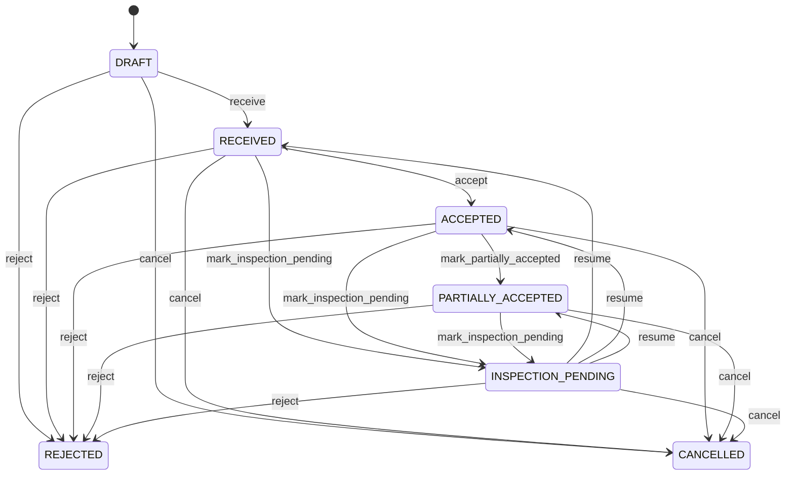
```mermaid
stateDiagram-v2
  [*] --> DRAFT
  DRAFT --> RECEIVED: receive
  RECEIVED --> ACCEPTED: accept
  ACCEPTED --> PARTIALLY_ACCEPTED: mark_partially_accepted
  RECEIVED --> INSPECTION_PENDING: mark_inspection_pending
  INSPECTION_PENDING --> RECEIVED: resume
  ACCEPTED --> INSPECTION_PENDING: mark_inspection_pending
  INSPECTION_PENDING --> ACCEPTED: resume
  PARTIALLY_ACCEPTED --> INSPECTION_PENDING: mark_inspection_pending
  INSPECTION_PENDING --> PARTIALLY_ACCEPTED: resume
  DRAFT --> REJECTED: reject
  RECEIVED --> REJECTED: reject
  ACCEPTED --> REJECTED: reject
  PARTIALLY_ACCEPTED --> REJECTED: reject
  INSPECTION_PENDING --> REJECTED: reject
  DRAFT --> CANCELLED: cancel
  RECEIVED --> CANCELLED: cancel
  ACCEPTED --> CANCELLED: cancel
  PARTIALLY_ACCEPTED --> CANCELLED: cancel
  INSPECTION_PENDING --> CANCELLED: cancel
```

Any role that may change the record may make any move the diagram draws.

See [Goods Receipt](/entities/procurement-and-sourcing-records/goods-receipt/) for the record itself.

## Supplier Claim: Supplier claim lifecycle

States: **Draft**, **Open**, **Under review**, **Accepted**, **Partially accepted**, **Rejected**, **Resolved**, **Closed**, **Cancelled**, **Escalated**. A new record starts as **Draft**; **Closed**, **Rejected**, **Cancelled** ends the lifecycle.

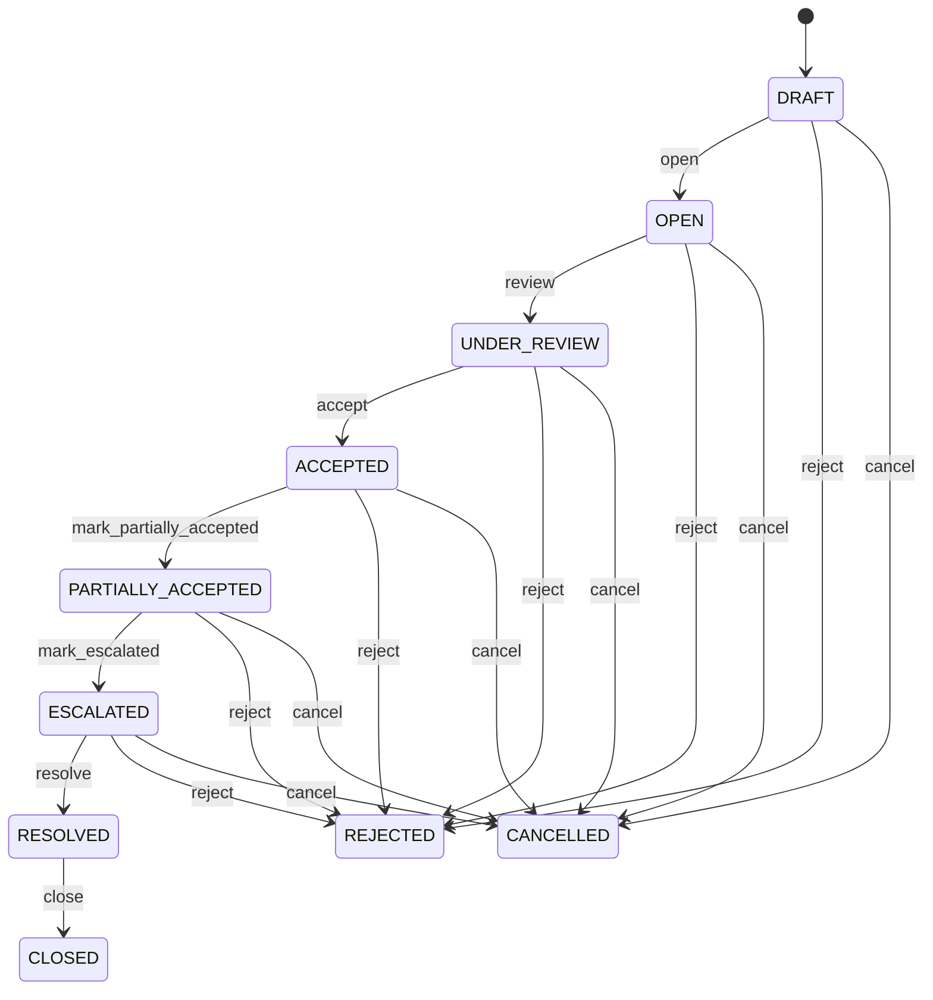
```mermaid
stateDiagram-v2
  [*] --> DRAFT
  DRAFT --> OPEN: open
  OPEN --> UNDER_REVIEW: review
  UNDER_REVIEW --> ACCEPTED: accept
  ACCEPTED --> PARTIALLY_ACCEPTED: mark_partially_accepted
  PARTIALLY_ACCEPTED --> ESCALATED: mark_escalated
  ESCALATED --> RESOLVED: resolve
  RESOLVED --> CLOSED: close
  DRAFT --> REJECTED: reject
  OPEN --> REJECTED: reject
  UNDER_REVIEW --> REJECTED: reject
  ACCEPTED --> REJECTED: reject
  PARTIALLY_ACCEPTED --> REJECTED: reject
  ESCALATED --> REJECTED: reject
  DRAFT --> CANCELLED: cancel
  OPEN --> CANCELLED: cancel
  UNDER_REVIEW --> CANCELLED: cancel
  ACCEPTED --> CANCELLED: cancel
  PARTIALLY_ACCEPTED --> CANCELLED: cancel
  ESCALATED --> CANCELLED: cancel
```

Any role that may change the record may make any move the diagram draws.

See [Supplier Claim](/entities/procurement-and-sourcing-records/supplier-claim/) for the record itself.

## Supplier Claim Resolution: Supplier claim resolution lifecycle

States: **Draft**, **Approved**, **In execution**, **Partially executed**, **Executed**, **Failed**, **Cancelled**. A new record starts as **Draft**; **Executed**, **Failed**, **Cancelled** ends the lifecycle.

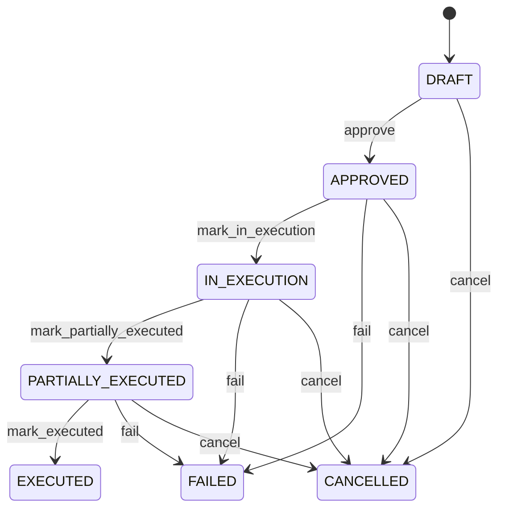
```mermaid
stateDiagram-v2
  [*] --> DRAFT
  DRAFT --> APPROVED: approve
  APPROVED --> IN_EXECUTION: mark_in_execution
  IN_EXECUTION --> PARTIALLY_EXECUTED: mark_partially_executed
  PARTIALLY_EXECUTED --> EXECUTED: mark_executed
  APPROVED --> FAILED: fail
  IN_EXECUTION --> FAILED: fail
  PARTIALLY_EXECUTED --> FAILED: fail
  DRAFT --> CANCELLED: cancel
  APPROVED --> CANCELLED: cancel
  IN_EXECUTION --> CANCELLED: cancel
  PARTIALLY_EXECUTED --> CANCELLED: cancel
```

Any role that may change the record may make any move the diagram draws.

See [Supplier Claim Resolution](/entities/procurement-and-sourcing-records/supplier-claim-resolution/) for the record itself.

## Supplier Credit Note: Supplier credit note lifecycle

States: **Draft**, **Approved**, **Posted**, **Partially applied**, **Fully applied**, **Cancelled**, **Reversed**. A new record starts as **Draft**; **Fully applied**, **Cancelled**, **Reversed** ends the lifecycle.

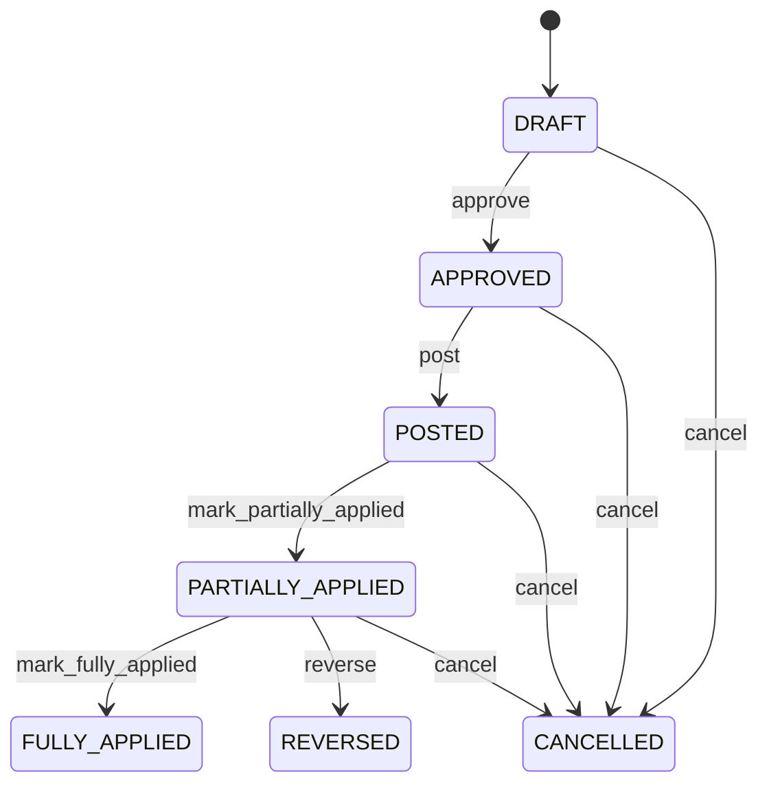
```mermaid
stateDiagram-v2
  [*] --> DRAFT
  DRAFT --> APPROVED: approve
  APPROVED --> POSTED: post
  POSTED --> PARTIALLY_APPLIED: mark_partially_applied
  PARTIALLY_APPLIED --> FULLY_APPLIED: mark_fully_applied
  DRAFT --> CANCELLED: cancel
  APPROVED --> CANCELLED: cancel
  POSTED --> CANCELLED: cancel
  PARTIALLY_APPLIED --> CANCELLED: cancel
  PARTIALLY_APPLIED --> REVERSED: reverse
```

Any role that may change the record may make any move the diagram draws.

See [Supplier Credit Note](/entities/procurement-and-sourcing-records/supplier-credit-note/) for the record itself.

## Supplier Credit Note Application: Supplier credit note application lifecycle

States: **Draft**, **Active**, **Reversed**, **Cancelled**. A new record starts as **Draft**; **Reversed**, **Cancelled** ends the lifecycle.

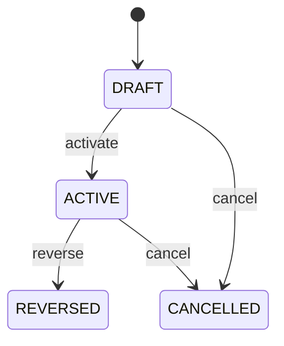
```mermaid
stateDiagram-v2
  [*] --> DRAFT
  DRAFT --> ACTIVE: activate
  ACTIVE --> REVERSED: reverse
  DRAFT --> CANCELLED: cancel
  ACTIVE --> CANCELLED: cancel
```

Any role that may change the record may make any move the diagram draws.

See [Supplier Credit Note Application](/entities/procurement-and-sourcing-records/supplier-credit-note-application/) for the record itself.

## Supplier Debit Note: Supplier debit note lifecycle

States: **Draft**, **Approved**, **Posted**, **Partially applied**, **Fully applied**, **Disputed**, **Cancelled**, **Reversed**. A new record starts as **Draft**; **Fully applied**, **Cancelled**, **Reversed** ends the lifecycle.

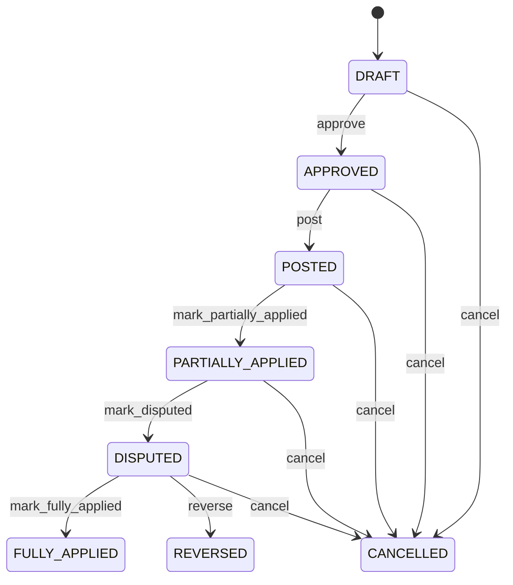
```mermaid
stateDiagram-v2
  [*] --> DRAFT
  DRAFT --> APPROVED: approve
  APPROVED --> POSTED: post
  POSTED --> PARTIALLY_APPLIED: mark_partially_applied
  PARTIALLY_APPLIED --> DISPUTED: mark_disputed
  DISPUTED --> FULLY_APPLIED: mark_fully_applied
  DRAFT --> CANCELLED: cancel
  APPROVED --> CANCELLED: cancel
  POSTED --> CANCELLED: cancel
  PARTIALLY_APPLIED --> CANCELLED: cancel
  DISPUTED --> CANCELLED: cancel
  DISPUTED --> REVERSED: reverse
```

Any role that may change the record may make any move the diagram draws.

See [Supplier Debit Note](/entities/procurement-and-sourcing-records/supplier-debit-note/) for the record itself.

## Supplier Debit Note Application: Supplier debit note application lifecycle

States: **Draft**, **Active**, **Reversed**, **Cancelled**. A new record starts as **Draft**; **Reversed**, **Cancelled** ends the lifecycle.

```mermaid
stateDiagram-v2
  [*] --> DRAFT
  DRAFT --> ACTIVE: activate
  ACTIVE --> REVERSED: reverse
  DRAFT --> CANCELLED: cancel
  ACTIVE --> CANCELLED: cancel
```

Any role that may change the record may make any move the diagram draws.

See [Supplier Debit Note Application](/entities/procurement-and-sourcing-records/supplier-debit-note-application/) for the record itself.

## Supplier Performance Assessment: Supplier performance assessment lifecycle

States: **Draft**, **In review**, **Approved**, **Published**, **Superseded**, **Cancelled**. A new record starts as **Draft**; **Superseded**, **Cancelled** ends the lifecycle.

```mermaid
stateDiagram-v2
  [*] --> DRAFT
  DRAFT --> IN_REVIEW: mark_in_review
  IN_REVIEW --> APPROVED: approve
  APPROVED --> PUBLISHED: publish
  DRAFT --> SUPERSEDED: mark_superseded
  IN_REVIEW --> SUPERSEDED: mark_superseded
  APPROVED --> SUPERSEDED: mark_superseded
  PUBLISHED --> SUPERSEDED: mark_superseded
  DRAFT --> CANCELLED: cancel
  IN_REVIEW --> CANCELLED: cancel
  APPROVED --> CANCELLED: cancel
  PUBLISHED --> CANCELLED: cancel
```

Any role that may change the record may make any move the diagram draws.

See [Supplier Performance Assessment](/entities/procurement-and-sourcing-records/supplier-performance-assessment/) for the record itself.

## Supplier Return: Supplier return lifecycle

States: **Draft**, **Authorized**, **In transit**, **Received by supplier**, **Completed**, **Cancelled**, **Exception**. A new record starts as **Draft**; **Completed**, **Cancelled** ends the lifecycle.

```mermaid
stateDiagram-v2
  [*] --> DRAFT
  DRAFT --> AUTHORIZED: authorize
  AUTHORIZED --> IN_TRANSIT: mark_in_transit
  IN_TRANSIT --> RECEIVED_BY_SUPPLIER: mark_received_by_supplier
  RECEIVED_BY_SUPPLIER --> COMPLETED: complete
  AUTHORIZED --> EXCEPTION: mark_exception
  EXCEPTION --> AUTHORIZED: resolve_exception
  IN_TRANSIT --> EXCEPTION: mark_exception
  EXCEPTION --> IN_TRANSIT: resolve_exception
  RECEIVED_BY_SUPPLIER --> EXCEPTION: mark_exception
  EXCEPTION --> RECEIVED_BY_SUPPLIER: resolve_exception
  DRAFT --> CANCELLED: cancel
  AUTHORIZED --> CANCELLED: cancel
  IN_TRANSIT --> CANCELLED: cancel
  RECEIVED_BY_SUPPLIER --> CANCELLED: cancel
  EXCEPTION --> CANCELLED: cancel
```

Any role that may change the record may make any move the diagram draws.

See [Supplier Return](/entities/procurement-and-sourcing-records/supplier-return/) for the record itself.

## Product: Product lifecycle

States: **Draft**, **Active**, **Discontinued**, **Blocked**, **Retired**. A new record starts as **Draft**; **Discontinued**, **Retired** ends the lifecycle.

```mermaid
stateDiagram-v2
  [*] --> DRAFT
  DRAFT --> ACTIVE: activate
  ACTIVE --> BLOCKED: block
  BLOCKED --> ACTIVE: unblock
  DRAFT --> DISCONTINUED: discontinue
  ACTIVE --> DISCONTINUED: discontinue
  BLOCKED --> DISCONTINUED: discontinue
  DRAFT --> RETIRED: retire
  ACTIVE --> RETIRED: retire
  BLOCKED --> RETIRED: retire
```

Any role that may change the record may make any move the diagram draws.

See [Product](/entities/foundation/product/) for the record itself.

## Invoice: Invoice lifecycle

States: **Draft**, **Issued**, **Partially paid**, **Paid**, **Overdue**, **Cancelled**, **Void**. A new record starts as **Draft**; **Paid**, **Cancelled**, **Void** ends the lifecycle.

```mermaid
stateDiagram-v2
  [*] --> DRAFT
  DRAFT --> ISSUED: issue
  ISSUED --> PARTIALLY_PAID: mark_partially_paid
  PARTIALLY_PAID --> PAID: pay
  ISSUED --> OVERDUE: mark_overdue
  OVERDUE --> ISSUED: resume
  PARTIALLY_PAID --> OVERDUE: mark_overdue
  OVERDUE --> PARTIALLY_PAID: resume
  DRAFT --> CANCELLED: cancel
  ISSUED --> CANCELLED: cancel
  PARTIALLY_PAID --> CANCELLED: cancel
  OVERDUE --> CANCELLED: cancel
  DRAFT --> VOID: void
  ISSUED --> VOID: void
  PARTIALLY_PAID --> VOID: void
  OVERDUE --> VOID: void
```

Any role that may change the record may make any move the diagram draws.

See [Invoice](/entities/foundation/invoice/) for the record itself.

