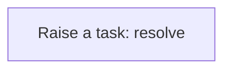
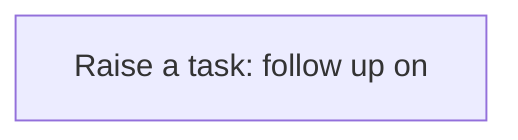
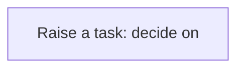
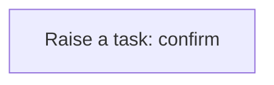

# Processes

A process is a sequence of steps the application runs for you: create a task, update a record, call a service. A business rule usually starts it; you can also run one by hand from the Workflow Designer. Every run is logged step by step in the Workflow Monitor. This application has **27** processes.


## Party exception raised {#party-exception-raised}

When a party is blocked, a high-priority task asks someone to resolve it.

Runs when a **Party** is changed, started by a business rule.



1. **Raise a task: resolve** — creates a **Task** record.


## Exchange rate follow up required {#exchange-rate-follow-up-required}

When a exchange rate is cancelled, a task asks someone to settle what depended on it.

Runs when a **Exchange Rate** is changed, started by a business rule.



1. **Raise a task: follow up on** — creates a **Task** record.


## Supplier exception raised {#supplier-exception-raised}

When a supplier is blocked, a high-priority task asks someone to resolve it.

Runs when a **Supplier** is changed, started by a business rule.


1. **Raise a task: resolve** — creates a **Task** record.


## Purchase requisition approval requested {#purchase-requisition-approval-requested}

When a purchase requisition is submitted, a task asks someone to decide on it.

Runs when a **Purchase Requisition** is changed, started by a business rule.



1. **Raise a task: decide on** — creates a **Task** record.


## Purchase requisition follow up required {#purchase-requisition-follow-up-required}

When a purchase requisition is rejected or cancelled, a task asks someone to settle what depended on it.

Runs when a **Purchase Requisition** is changed, started by a business rule.


1. **Raise a task: follow up on** — creates a **Task** record.


## Request for quotation follow up required {#request-for-quotation-follow-up-required}

When a request for quotation is cancelled, a task asks someone to settle what depended on it.

Runs when a **Request For Quotation** is changed, started by a business rule.


1. **Raise a task: follow up on** — creates a **Task** record.


## Supplier quotation approval requested {#supplier-quotation-approval-requested}

When a supplier quotation is under review, a task asks someone to decide on it.

Runs when a **Supplier Quotation** is changed, started by a business rule.


1. **Raise a task: decide on** — creates a **Task** record.


## Supplier quotation follow up required {#supplier-quotation-follow-up-required}

When a supplier quotation is rejected, a task asks someone to settle what depended on it.

Runs when a **Supplier Quotation** is changed, started by a business rule.


1. **Raise a task: follow up on** — creates a **Task** record.


## Purchase order follow up required {#purchase-order-follow-up-required}

When a purchase order is cancelled, a task asks someone to settle what depended on it.

Runs when a **Purchase Order** is changed, started by a business rule.


1. **Raise a task: follow up on** — creates a **Task** record.


## Goods receipt follow up required {#goods-receipt-follow-up-required}

When a goods receipt is rejected or cancelled, a task asks someone to settle what depended on it.

Runs when a **Goods Receipt** is changed, started by a business rule.


1. **Raise a task: follow up on** — creates a **Task** record.


## Supplier claim approval requested {#supplier-claim-approval-requested}

When a supplier claim is under review, a task asks someone to decide on it.

Runs when a **Supplier Claim** is changed, started by a business rule.


1. **Raise a task: decide on** — creates a **Task** record.


## Supplier claim follow up required {#supplier-claim-follow-up-required}

When a supplier claim is rejected or cancelled, a task asks someone to settle what depended on it.

Runs when a **Supplier Claim** is changed, started by a business rule.


1. **Raise a task: follow up on** — creates a **Task** record.


## Supplier claim resolution exception raised {#supplier-claim-resolution-exception-raised}

When a supplier claim resolution is failed, a high-priority task asks someone to resolve it.

Runs when a **Supplier Claim Resolution** is changed, started by a business rule.


1. **Raise a task: resolve** — creates a **Task** record.


## Supplier claim resolution follow up required {#supplier-claim-resolution-follow-up-required}

When a supplier claim resolution is cancelled, a task asks someone to settle what depended on it.

Runs when a **Supplier Claim Resolution** is changed, started by a business rule.


1. **Raise a task: follow up on** — creates a **Task** record.


## Supplier credit note follow up required {#supplier-credit-note-follow-up-required}

When a supplier credit note is cancelled or reversed, a task asks someone to settle what depended on it.

Runs when a **Supplier Credit Note** is changed, started by a business rule.


1. **Raise a task: follow up on** — creates a **Task** record.


## Supplier credit note completion confirmed {#supplier-credit-note-completion-confirmed}

When a supplier credit note is posted, a task asks someone to confirm the outcome.

Runs when a **Supplier Credit Note** is changed, started by a business rule.



1. **Raise a task: confirm** — creates a **Task** record.


## Supplier credit note application follow up required {#supplier-credit-note-application-follow-up-required}

When a supplier credit note application is cancelled or reversed, a task asks someone to settle what depended on it.

Runs when a **Supplier Credit Note Application** is changed, started by a business rule.


1. **Raise a task: follow up on** — creates a **Task** record.


## Supplier debit note follow up required {#supplier-debit-note-follow-up-required}

When a supplier debit note is cancelled or reversed, a task asks someone to settle what depended on it.

Runs when a **Supplier Debit Note** is changed, started by a business rule.


1. **Raise a task: follow up on** — creates a **Task** record.


## Supplier debit note completion confirmed {#supplier-debit-note-completion-confirmed}

When a supplier debit note is posted, a task asks someone to confirm the outcome.

Runs when a **Supplier Debit Note** is changed, started by a business rule.


1. **Raise a task: confirm** — creates a **Task** record.


## Supplier debit note application follow up required {#supplier-debit-note-application-follow-up-required}

When a supplier debit note application is cancelled or reversed, a task asks someone to settle what depended on it.

Runs when a **Supplier Debit Note Application** is changed, started by a business rule.


1. **Raise a task: follow up on** — creates a **Task** record.


## Supplier performance assessment follow up required {#supplier-performance-assessment-follow-up-required}

When a supplier performance assessment is cancelled, a task asks someone to settle what depended on it.

Runs when a **Supplier Performance Assessment** is changed, started by a business rule.

```mermaid
flowchart TD
  S0["Raise a task: follow up on"]

```

1. **Raise a task: follow up on** — creates a **Task** record.


## Supplier return exception raised {#supplier-return-exception-raised}

When a supplier return is exception, a high-priority task asks someone to resolve it.

Runs when a **Supplier Return** is changed, started by a business rule.

```mermaid
flowchart TD
  S0["Raise a task: resolve"]

```

1. **Raise a task: resolve** — creates a **Task** record.


## Supplier return follow up required {#supplier-return-follow-up-required}

When a supplier return is cancelled, a task asks someone to settle what depended on it.

Runs when a **Supplier Return** is changed, started by a business rule.

```mermaid
flowchart TD
  S0["Raise a task: follow up on"]

```

1. **Raise a task: follow up on** — creates a **Task** record.


## Supplier return completion confirmed {#supplier-return-completion-confirmed}

When a supplier return is completed, a task asks someone to confirm the outcome.

Runs when a **Supplier Return** is changed, started by a business rule.

```mermaid
flowchart TD
  S0["Raise a task: confirm"]

```

1. **Raise a task: confirm** — creates a **Task** record.


## Product exception raised {#product-exception-raised}

When a product is blocked, a high-priority task asks someone to resolve it.

Runs when a **Product** is changed, started by a business rule.

```mermaid
flowchart TD
  S0["Raise a task: resolve"]

```

1. **Raise a task: resolve** — creates a **Task** record.


## Invoice exception raised {#invoice-exception-raised}

When a invoice is overdue, a high-priority task asks someone to resolve it.

Runs when a **Invoice** is changed, started by a business rule.

```mermaid
flowchart TD
  S0["Raise a task: resolve"]

```

1. **Raise a task: resolve** — creates a **Task** record.


## Invoice follow up required {#invoice-follow-up-required}

When a invoice is cancelled or void, a task asks someone to settle what depended on it.

Runs when a **Invoice** is changed, started by a business rule.

```mermaid
flowchart TD
  S0["Raise a task: follow up on"]

```

1. **Raise a task: follow up on** — creates a **Task** record.


