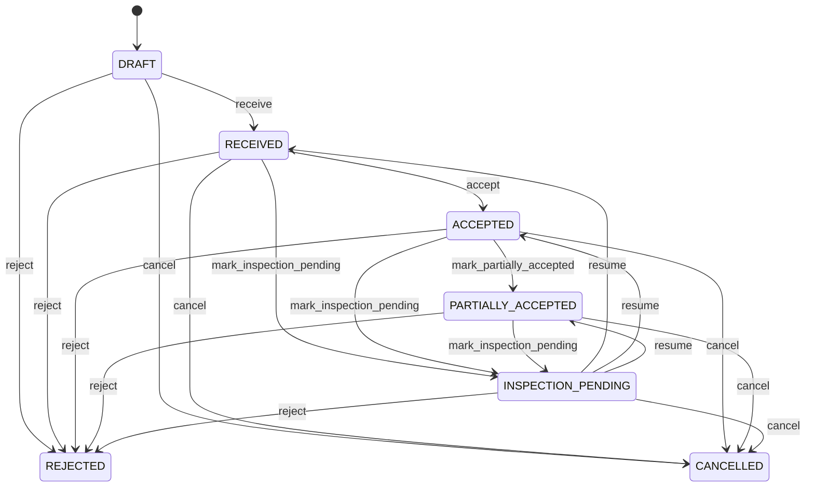

# Goods Receipt

Controlled receiving document whose line evidence establishes original fulfillment and eligible basis for later supplier returns. GoodsReceipt is the fulfillment bridge between PurchaseOrder commitment and accepted inventory/service. SupplierReturn is a later reverse-procurement event that consumes eligible accepted receipt evidence without rewriting it. Receiving, warehouse operations, procurement, quality, supplier management, accounts payable, inventory control, three-way matching and supplier returns. PurchaseOrder is the commitment. GoodsReceiptLine is actual receipt/disposition evidence. InventoryMovement is physical stock consequence. InvoiceLine is financial claim. SupplierReturnLine records later quantity returned. SupplierCreditNoteLine records financial reduction. Draft → line validation → received → inspection/disposition → accepted/partially accepted/rejected → accepted inventory posting and PO fulfillment → invoice matching. Later, eligible accepted receipt quantity → SupplierReturn → attributable inventory issue/return-to-supplier movement → SupplierCreditNote → payable reconciliation. Historical receipt quantities remain immutable. Draft → Received → Inspection Pending → Accepted/Partially Accepted/Rejected → controlled correction if required. Posted evidence remains historical. Header status changes drive allowed downstream workflow; line changes recalculate header totals/state. Supplier returns consume eligible accepted quantities and create separate inventory/financial consequences rather than modifying receipt history. All downstream posting is idempotent and traceable to receipt lines. A receipt records 96 units: 94 accepted and 2 rejected. Later, 10 of the 94 accepted units are returned to the supplier. The receipt remains 96 received and 94 accepted; SupplierReturnLine references the receipt evidence, an attributable InventoryMovement reduces stock by 10, and SupplierCreditNote records the payable reduction.

## Finding records

Open **Goods Receipt** from the menu or from its card on the dashboard.

The list shows Receipt Number, Receipt Date, Status, Received Quantity, Accepted Quantity, Notes, Supplier, with the most recently changed record first. The **Help** button beside the title opens this window's help text.

- **Search**: type in the search box above the grid to narrow the rows. **Search** at the top left opens advanced search, where you pick a field, a comparison (equals, contains, starts with, before, after, and so on) and a value.
- **Sort**: click a column heading; click again to reverse.
- **Refresh**: the refresh button at the top right re-reads the rows and every dropdown, so a record created a moment ago by someone else appears.
- **Export**: **CSV** downloads the rows you are looking at.
- **Open a record**: click a row. The line under the title, "Showing 1 to n of N entries", tells you how many rows match.

## Creating a record

Choose **New** at the top of the list. The form opens on its own page, with the fields in sections. A badge beside each label names the control (Text, Dropdown, Date, and so on); a red star marks a required field; the question-mark icon shows that field's help; and a hint such as “max 300” shows the longest entry accepted.

1. Fill in the fields described under [Fields](#fields).
2. These are required and must be completed before the record can be saved: **Receipt Number**, **Receipt Date**, **Status**, **Received Quantity**, **Accepted Quantity**, **Supplier**, **Purchase Order**.
3. For a dropdown that points at another window, pick the matching record; if the record you need does not exist yet, create it in its own window first. A dropdown may narrow to what you have already chosen, for example the states of the chosen country.
4. Choose **Create** (or **Save** in the toolbar). You return to the record, and it appears at the top of the list. If something is wrong the form says which field and why, and nothing is saved.

## Reading, changing and deleting a record

Click a row to open the record. Above the fields are the arrows that step through the list ("1 of 5"). Below them sit **Notes**, where anyone may leave a comment on the record, and the **Audit Trail**, which lists every change with who made it, when, and which fields changed.

- **Edit** (toolbar) makes the fields editable. Change them and choose **Save**; **Undo Changes** puts back what you changed and **Cancel Editing** leaves edit mode.
- **Copy Record** starts a new record from this one.
- **Delete Record** is available in edit mode and asks you to confirm; a record other records still depend on cannot be deleted.

Every change is also written to the [Audit Log](/administration/#audit-log).

## Fields

| Field | What you use | Rules | What to enter |
| --- | --- | --- | --- |
| Receipt Number | Text | Required, Unique, Up to 100 characters | Human-facing receiving reference. Identifies the receipt in warehouse and supplier operations. Documents, audit, matching and return processing. Distinct from SupplierReturn.returnNumber and PurchaseOrder number. Provides operational reference across receipt and later return workflows. Required. |
| Receipt Date | Date and time | Required | Date and time the receipt was recorded. Establishes receiving chronology. Inventory history, procurement, matching and audit. Distinct from later SupplierReturn.returnDate. Anchors original receipt evidence. Required. |
| Status | Choice | Required | Controlled receiving-document lifecycle state. Indicates whether receipt evidence can affect fulfillment and inventory. Controls receiving progression and authorized corrections. SupplierReturn is a later reverse-procurement event and does not rewrite receipt status. Controls receiving progression and authorized corrections. The status of the goods receipt is draft; set it when that is what the business means for this record. The status of the goods receipt is received; set it when that is what the business means for this record. The status of the goods receipt is inspection pending; set it when that is what the business means for this record. The status of the goods receipt is accepted; set it when that is what the business means for this record. The status of the goods receipt is partially accepted; set it when that is what the business means for this record. The status of the goods receipt is rejected; set it when that is what the business means for this record. The status of the goods receipt is cancelled; set it when that is what the business means for this record. Choose one: Draft, Received, Inspection pending, Accepted, Partially accepted, Rejected, Cancelled. |
| Received Quantity | Amount | Required | Total quantity physically recorded as received. Sum of line received quantities. Receiving and audit. SupplierReturn eligibility is derived from accepted receipt evidence, not received quantity alone. Provides original physical receipt basis. Required. |
| Accepted Quantity | Amount | Required | Quantity accepted after receiving controls. Sum of line accepted quantities that may become inventory. Inventory posting, PO fulfillment and invoice matching. SupplierReturnLine eligibility is normally based on accepted quantity and subsequent prior returns. Provides authoritative accepted receipt basis for later supplier returns. Required. |
| Notes | Text | Up to 2000 characters | Receiving notes and operational context. Human-readable context for receipt exceptions or inspection. Operations and audit. Does not replace structured disposition or return evidence. Supports review. Optional. |
| Supplier | Lookup | Required | Supplier that delivered the receipt. Identifies the commercial party responsible for the delivery. Receiving, procurement, audit and supplier return processing. Supplies supplier context for subsequent returns. Pick a record from **Supplier**. |
| Purchase Order | Lookup | Required | Procurement commitment fulfilled by this receipt. Connects received goods to what was ordered. Receiving, fulfillment, matching and supplier return eligibility. Supplies original procurement context. Pick a record from **Purchase Order**. |
| Supplier Claim | Lookup | Optional | The SupplierClaim this GoodsReceipt belongs to. Pick a record from **Supplier Claim**. |
| Supplier Performance Assessment | Lookup | Optional | The SupplierPerformanceAssessment this GoodsReceipt belongs to. Pick a record from **Supplier Performance Assessment**. |

## How it connects to other records
- A goods receipt belongs to one **Supplier**.
- A goods receipt belongs to one **Purchase Order**.
- A goods receipt has many **Goods Receipt** records.
- A goods receipt is linked to many **Invoice** records.
- A goods receipt is linked to many **Supplier Return** records.
- A goods receipt belongs to one **Supplier Claim**.
- A goods receipt belongs to one **Supplier Performance Assessment**.

## Lifecycle: Goods receipt lifecycle

A goods receipt record starts as **Draft** and ends as **Rejected** or **Cancelled**. Open a record and the bar above its fields shows its current **State** and, after **Next**, a button for each move that leaves it; choose one to make the move. Any move the diagram does not draw is refused, for everyone including the administrator.

| From | To | Move |
| --- | --- | --- |
| Draft | Received | Receive |
| Received | Accepted | Accept |
| Accepted | Partially accepted | Mark partially accepted |
| Received | Inspection pending | Mark inspection pending |
| Inspection pending | Received | Resume |
| Accepted | Inspection pending | Mark inspection pending |
| Inspection pending | Accepted | Resume |
| Partially accepted | Inspection pending | Mark inspection pending |
| Inspection pending | Partially accepted | Resume |
| Draft | Rejected | Reject |
| Received | Rejected | Reject |
| Accepted | Rejected | Reject |
| Partially accepted | Rejected | Reject |
| Inspection pending | Rejected | Reject |
| Draft | Cancelled | Cancel |
| Received | Cancelled | Cancel |
| Accepted | Cancelled | Cancel |
| Partially accepted | Cancelled | Cancel |
| Inspection pending | Cancelled | Cancel |

## What happens when you save
Business rules run around the save. They are listed here and explained in full under [Business rules](/administration/rules/).

| Rule | When | Order |
| --- | --- | --- |
| Goods receipt invariants before create | before a goods receipt is created | 100 |
| Goods receipt invariants before update | before a goods receipt is changed | 100 |
| Goods receipt workflows after update | after a goods receipt is changed | 100 |

Processes started from this record: [Goods receipt follow up required](/administration/processes/#goods-receipt-follow-up-required).

## Who may use it

Anyone who holds a role with access to the **Goods Receipt** window. Access is granted by role under [Roles and access](/administration/access/).
