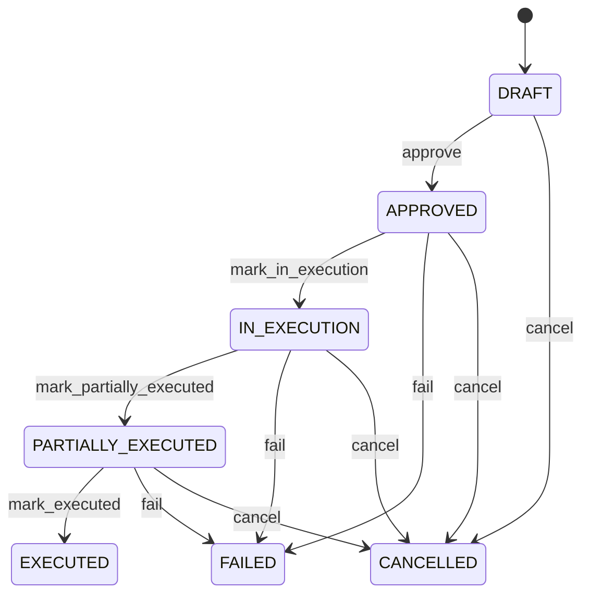

# Supplier Claim Resolution

Converts a supplier claim decision into a controlled auditable execution plan without conflating the case remedy and resulting transactions. SupplierClaim explains the problem; SupplierClaimResolution records the agreed remedy; SupplierReturn SupplierCreditNote SupplierDebitNote and Payment execute distinct physical or financial consequences. Supplier dispute management procurement recovery accounts payable quality logistics and audit. The resolution bridges case management and execution while preserving independent transaction histories. SupplierClaim accepted → remedy negotiated → SupplierClaimResolution approved → required return/credit/debit/payment executed → evidence reconciled → claim resolved/closed. Draft → approved → in execution → partially executed/executed, with failed and cancelled paths. Changes to the originating claim or downstream execution evidence require resolution revalidation; completed downstream transactions are corrected through their own compensating workflows. A quality claim is accepted for three defective units and EUR 300 recovery. The resolution authorizes RETURN plus CREDIT, links the resulting SupplierReturn and SupplierCreditNote, and becomes executed only after both required outcomes reconcile.

## Finding records

Open **Supplier Claim Resolution** from the menu or from its card on the dashboard.

The list shows Resolution Number, Resolution Date, Resolution Type, Status, Approved Amount, Supplier, Supplier Claim, with the most recently changed record first. The **Help** button beside the title opens this window's help text.

- **Search**: type in the search box above the grid to narrow the rows. **Search** at the top left opens advanced search, where you pick a field, a comparison (equals, contains, starts with, before, after, and so on) and a value.
- **Sort**: click a column heading; click again to reverse.
- **Refresh**: the refresh button at the top right re-reads the rows and every dropdown, so a record created a moment ago by someone else appears.
- **Export**: **CSV** downloads the rows you are looking at.
- **Open a record**: click a row. The line under the title, "Showing 1 to n of N entries", tells you how many rows match.

## Creating a record

Choose **New** at the top of the list. The form opens on its own page, with the fields in sections. A badge beside each label names the control (Text, Dropdown, Date, and so on); a red star marks a required field; the question-mark icon shows that field's help; and a hint such as “max 300” shows the longest entry accepted.

1. Fill in the fields described under [Fields](#fields).
2. These are required and must be completed before the record can be saved: **Resolution Number**, **Resolution Date**, **Resolution Type**, **Status**, **Supplier Claim**.
3. For a dropdown that points at another window, pick the matching record; if the record you need does not exist yet, create it in its own window first. A dropdown may narrow to what you have already chosen, for example the states of the chosen country.
4. Choose **Create** (or **Save** in the toolbar). You return to the record, and it appears at the top of the list. If something is wrong the form says which field and why, and nothing is saved.

## Reading, changing and deleting a record

Click a row to open the record. Above the fields are the arrows that step through the list ("1 of 5"). Below them sit **Notes**, where anyone may leave a comment on the record, and the **Audit Trail**, which lists every change with who made it, when, and which fields changed.

- **Edit** (toolbar) makes the fields editable. Change them and choose **Save**; **Undo Changes** puts back what you changed and **Cancel Editing** leaves edit mode.
- **Copy Record** starts a new record from this one.
- **Delete Record** is available in edit mode and asks you to confirm; a record other records still depend on cannot be deleted.

Every change is also written to the [Audit Log](/administration/#audit-log).

## Fields

| Field | What you use | Rules | What to enter |
| --- | --- | --- | --- |
| Resolution Number | Text | Required, Unique, Up to 100 characters | Human-facing resolution reference. Identifies the resolution decision for operational and supplier communication. Used in approvals correspondence reconciliation and audit. Distinct from the SupplierClaim claimNumber and downstream transaction numbers. Correlates resolution activity. Required. |
| Resolution Date | Date and time | Required | Date and time the resolution was authorized. Establishes when the agreed remedy became effective. SLA reporting audit and financial control. Anchors downstream execution. Required. |
| Resolution Type | Choice | Required | Authorized remedy for the supplier claim. Defines what outcome was agreed without itself executing the remedy. Routes downstream workflows and measures recovery outcomes. RETURN may require SupplierReturn; CREDIT may require SupplierCreditNote; DEBIT_ADJUSTMENT may require SupplierDebitNote; CASH_RECOVERY may require Payment. Determines required execution evidence. Required. The resolution type of the supplier claim resolution is no action; set it when that is what the business means for this record. The resolution type of the supplier claim resolution is replacement; set it when that is what the business means for this record. The resolution type of the supplier claim resolution is repair; set it when that is what the business means for this record. The resolution type of the supplier claim resolution is return; set it when that is what the business means for this record. The resolution type of the supplier claim resolution is credit; set it when that is what the business means for this record. The resolution type of the supplier claim resolution is debit adjustment; set it when that is what the business means for this record. The resolution type of the supplier claim resolution is price adjustment; set it when that is what the business means for this record. The resolution type of the supplier claim resolution is cash recovery; set it when that is what the business means for this record. The resolution type of the supplier claim resolution is accepted exception; set it when that is what the business means for this record. Choose one: No action, Replacement, Repair, Return, Credit, Debit adjustment, Price adjustment, Cash recovery, Accepted exception. |
| Status | Choice | Required | Lifecycle state of the resolution. Separates decision approval from execution and completion. Controls downstream work and claim closure. Resolution status does not replace SupplierClaim or downstream transaction statuses. Gates execution and confirms whether required consequences completed. Required. The status of the supplier claim resolution is draft; set it when that is what the business means for this record. The status of the supplier claim resolution is approved; set it when that is what the business means for this record. The status of the supplier claim resolution is in execution; set it when that is what the business means for this record. The status of the supplier claim resolution is partially executed; set it when that is what the business means for this record. The status of the supplier claim resolution is executed; set it when that is what the business means for this record. The status of the supplier claim resolution is failed; set it when that is what the business means for this record. The status of the supplier claim resolution is cancelled; set it when that is what the business means for this record. Choose one: Draft, Approved, In execution, Partially executed, Executed, Failed, Cancelled. |
| Approved Amount | Amount | Optional | Monetary recovery authorized by the resolution. Defines the financial amount expected from the agreed remedy. Supplier recovery and reconciliation. Not itself a credit note debit note or cash receipt; execution requires the appropriate financial transaction. Provides the controlled financial target. Optional for non-financial remedies. |
| Supplier | Lookup | Optional | The Supplier this SupplierClaimResolution belongs to. Pick a record from **Supplier**. |
| Supplier Claim | Lookup | Required | Supplier claim being resolved. Connects the remedy to the case and evidence that established the issue. Claim closure and audit. Supplies authoritative case context. Pick a record from **Supplier Claim**. |
| Supplier Performance Assessment | Lookup | Optional | The SupplierPerformanceAssessment this SupplierClaimResolution belongs to. Pick a record from **Supplier Performance Assessment**. |

## How it connects to other records
- A supplier claim resolution belongs to one **Supplier**.
- A supplier claim resolution belongs to one **Supplier Claim**.
- A supplier claim resolution has many **Supplier Return** records.
- A supplier claim resolution has many **Supplier Credit Note** records.
- A supplier claim resolution has many **Supplier Debit Note** records.
- A supplier claim resolution belongs to one **Supplier Performance Assessment**.

## Lifecycle: Supplier claim resolution lifecycle

A supplier claim resolution record starts as **Draft** and ends as **Executed** or **Failed** or **Cancelled**. Open a record and the bar above its fields shows its current **State** and, after **Next**, a button for each move that leaves it; choose one to make the move. Any move the diagram does not draw is refused, for everyone including the administrator.

| From | To | Move |
| --- | --- | --- |
| Draft | Approved | Approve |
| Approved | In execution | Mark in execution |
| In execution | Partially executed | Mark partially executed |
| Partially executed | Executed | Mark executed |
| Approved | Failed | Fail |
| In execution | Failed | Fail |
| Partially executed | Failed | Fail |
| Draft | Cancelled | Cancel |
| Approved | Cancelled | Cancel |
| In execution | Cancelled | Cancel |
| Partially executed | Cancelled | Cancel |

## What happens when you save
Business rules run around the save. They are listed here and explained in full under [Business rules](/administration/rules/).

| Rule | When | Order |
| --- | --- | --- |
| Supplier claim resolution invariants before create | before a supplier claim resolution is created | 100 |
| Supplier claim resolution invariants before update | before a supplier claim resolution is changed | 100 |
| Supplier claim resolution workflows after update | after a supplier claim resolution is changed | 100 |

Processes started from this record: [Supplier claim resolution exception raised](/administration/processes/#supplier-claim-resolution-exception-raised), [Supplier claim resolution follow up required](/administration/processes/#supplier-claim-resolution-follow-up-required).

## Who may use it

Anyone who holds a role with access to the **Supplier Claim Resolution** window. Access is granted by role under [Roles and access](/administration/access/).
