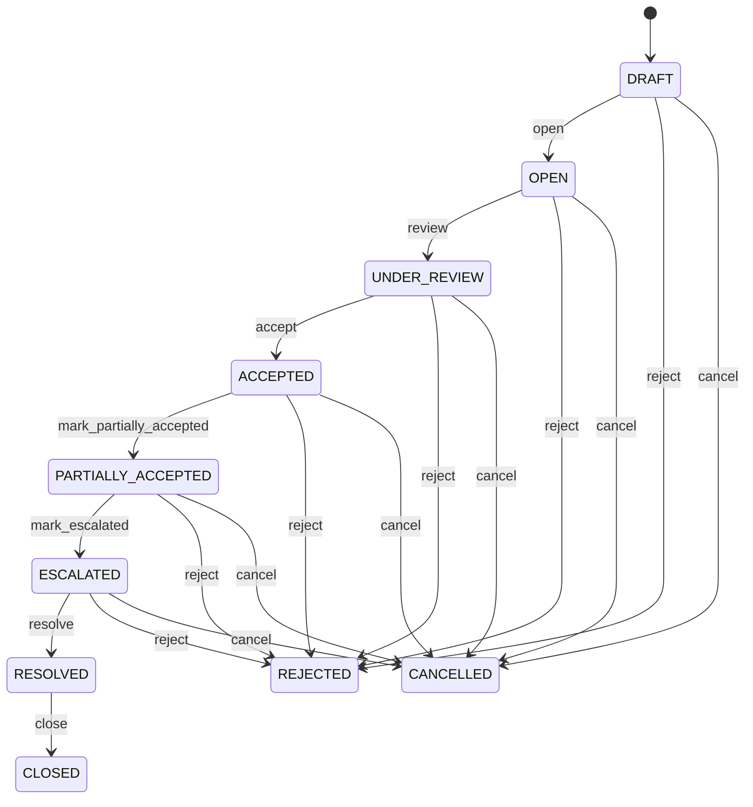

# Supplier Claim

Provides a formal auditable case for supplier-related quality or commercial recovery while keeping the decision and physical/financial consequences as separate controlled records. SupplierClaim explains what went wrong and what recovery was requested or agreed. SupplierClaimResolution records the authorized remedy. SupplierReturn handles physical reversal; SupplierCreditNote or SupplierDebitNote handles financial adjustment; Payment handles cash movement. Supplier quality procurement warranty dispute management recovery supplier scorecards accounts payable and audit. PurchaseOrder GoodsReceipt and Invoice provide source evidence; QualityInspection provides technical evidence; SupplierClaimResolution governs the remedy; downstream transactions execute it. Issue detected → claim opened → evidence collected → supplier review → accepted/rejected → SupplierClaimResolution approved → create required SupplierReturn/SupplierCreditNote/SupplierDebitNote/Payment → reconcile outcome → close claim. No downstream effect is inferred merely from claim acceptance. Draft → open → under review → accepted/partially accepted/rejected → resolved → closed, with cancellation and escalation paths. Changes to source receipt inspection invoice return resolution or financial evidence trigger claim revalidation or reconciliation; completed source transactions remain immutable. An invoice contains an overcharge of EUR 500. A SupplierClaim records the issue, a SupplierClaimResolution authorizes DEBIT_ADJUSTMENT, and a SupplierDebitNote records the recovery while the original Invoice remains unchanged.

## Finding records

Open **Supplier Claim** from the menu or from its card on the dashboard.

The list shows Claim Number, Claim Date, Status, Claim Type, Claimed Amount, Resolution Code, Notes, with the most recently changed record first. The **Help** button beside the title opens this window's help text.

- **Search**: type in the search box above the grid to narrow the rows. **Search** at the top left opens advanced search, where you pick a field, a comparison (equals, contains, starts with, before, after, and so on) and a value.
- **Sort**: click a column heading; click again to reverse.
- **Refresh**: the refresh button at the top right re-reads the rows and every dropdown, so a record created a moment ago by someone else appears.
- **Export**: **CSV** downloads the rows you are looking at.
- **Open a record**: click a row. The line under the title, "Showing 1 to n of N entries", tells you how many rows match.

## Creating a record

Choose **New** at the top of the list. The form opens on its own page, with the fields in sections. A badge beside each label names the control (Text, Dropdown, Date, and so on); a red star marks a required field; the question-mark icon shows that field's help; and a hint such as “max 300” shows the longest entry accepted.

1. Fill in the fields described under [Fields](#fields).
2. These are required and must be completed before the record can be saved: **Claim Number**, **Claim Date**, **Status**, **Claim Type**, **Supplier**.
3. For a dropdown that points at another window, pick the matching record; if the record you need does not exist yet, create it in its own window first. A dropdown may narrow to what you have already chosen, for example the states of the chosen country.
4. Choose **Create** (or **Save** in the toolbar). You return to the record, and it appears at the top of the list. If something is wrong the form says which field and why, and nothing is saved.

## Reading, changing and deleting a record

Click a row to open the record. Above the fields are the arrows that step through the list ("1 of 5"). Below them sit **Notes**, where anyone may leave a comment on the record, and the **Audit Trail**, which lists every change with who made it, when, and which fields changed.

- **Edit** (toolbar) makes the fields editable. Change them and choose **Save**; **Undo Changes** puts back what you changed and **Cancel Editing** leaves edit mode.
- **Copy Record** starts a new record from this one.
- **Delete Record** is available in edit mode and asks you to confirm; a record other records still depend on cannot be deleted.

Every change is also written to the [Audit Log](/administration/#audit-log).

## Fields

| Field | What you use | Rules | What to enter |
| --- | --- | --- | --- |
| Claim Number | Text | Required, Unique, Up to 100 characters | Business-facing supplier claim reference. Identifies the claim for procurement quality and supplier communication. Used in correspondence investigations reporting and reconciliation. Distinct from PurchaseOrder GoodsReceipt Invoice SupplierReturn and financial adjustment numbers. Provides the operational reference throughout the claim lifecycle. Required. |
| Claim Date | Date and time | Required | Date and time the claim was raised. Establishes when the organization formally asserted the supplier issue. Supports SLA measurement dispute aging supplier performance and audit. Distinct from receipt inspection return resolution and financial-document dates. Anchors claim chronology. Required. |
| Status | Choice | Required | Lifecycle state of the supplier claim. Indicates whether the issue is being prepared investigated accepted disputed resolved or closed. Controls investigation supplier response settlement and escalation. Claim status is independent from SupplierReturn SupplierCreditNote SupplierDebitNote and SupplierClaimResolution statuses. Coordinates the case while physical and financial effects remain separate transactions. Required. The status of the supplier claim is draft; set it when that is what the business means for this record. The status of the supplier claim is open; set it when that is what the business means for this record. The status of the supplier claim is under review; set it when that is what the business means for this record. The status of the supplier claim is accepted; set it when that is what the business means for this record. The status of the supplier claim is partially accepted; set it when that is what the business means for this record. The status of the supplier claim is rejected; set it when that is what the business means for this record. The status of the supplier claim is resolved; set it when that is what the business means for this record. The status of the supplier claim is closed; set it when that is what the business means for this record. The status of the supplier claim is cancelled; set it when that is what the business means for this record. The status of the supplier claim is escalated; set it when that is what the business means for this record. Choose one: Draft, Open, Under review, Accepted, Partially accepted, Rejected, Resolved, Closed, Cancelled, Escalated. |
| Claim Type | Choice | Required | Classification of the supplier issue. States the principal business nature of the claim. Drives routing evidence requirements supplier scorecards and analytics. May be supported by QualityInspection or receiving evidence and may result in a return credit debit or other resolution. Determines investigation and resolution policy. Required. The claim type of the supplier claim is quality; set it when that is what the business means for this record. The claim type of the supplier claim is damage; set it when that is what the business means for this record. The claim type of the supplier claim is shortage; set it when that is what the business means for this record. The claim type of the supplier claim is overage; set it when that is what the business means for this record. The claim type of the supplier claim is wrong item; set it when that is what the business means for this record. The claim type of the supplier claim is warranty; set it when that is what the business means for this record. The claim type of the supplier claim is service; set it when that is what the business means for this record. The claim type of the supplier claim is commercial; set it when that is what the business means for this record. The claim type of the supplier claim is delivery; set it when that is what the business means for this record. The claim type of the supplier claim is documentation; set it when that is what the business means for this record. The claim type of the supplier claim is other; set it when that is what the business means for this record. Choose one: Quality, Damage, Shortage, Overage, Wrong item, Warranty, Service, Commercial, Delivery, Documentation, Other. |
| Claimed Amount | Amount | Optional | Financial value asserted by the organization in the claim. Represents requested or estimated monetary recovery before supplier agreement or final adjustment. Supports negotiation exposure reporting and recovery analysis. It is not an accounting posting and must not be confused with SupplierCreditNote.totalAmount or SupplierDebitNote.totalAmount. Provides commercial context for settlement negotiation. Optional for non-financial claims. |
| Resolution Code | Choice | Optional | Agreed outcome category of the supplier claim. Records the high-level outcome without itself executing the resulting transaction. Supports supplier performance recovery analytics and downstream workflow routing. Detailed authorization is represented by SupplierClaimResolution; RETURN may create SupplierReturn; CREDIT may create SupplierCreditNote; DEBIT_ADJUSTMENT may create SupplierDebitNote. Summarizes the resolution after agreement. Optional until resolution is agreed. The resolution code of the supplier claim is no action; set it when that is what the business means for this record. The resolution code of the supplier claim is replacement; set it when that is what the business means for this record. The resolution code of the supplier claim is repair; set it when that is what the business means for this record. The resolution code of the supplier claim is return; set it when that is what the business means for this record. The resolution code of the supplier claim is credit; set it when that is what the business means for this record. The resolution code of the supplier claim is debit adjustment; set it when that is what the business means for this record. The resolution code of the supplier claim is price adjustment; set it when that is what the business means for this record. The resolution code of the supplier claim is accepted exception; set it when that is what the business means for this record. The resolution code of the supplier claim is rejected; set it when that is what the business means for this record. Choose one: No action, Replacement, Repair, Return, Credit, Debit adjustment, Price adjustment, Accepted exception, Rejected. |
| Notes | Text | Up to 4000 characters | Additional claim narrative and investigation context. Records information not represented by structured fields. Supplier communication investigation escalation and audit. Complements structured inspection receipt invoice and return evidence without replacing it. Supports review and resolution. Optional. |
| Supplier | Lookup | Required | Supplier against whom the claim is raised. Identifies the external party responsible for the disputed supply or service. Supports communication scorecards recovery and escalation. Supplies supplier qualification and commercial context. Pick a record from **Supplier**. |
| Purchase Order | Lookup | Optional | Procurement commitment associated with the claim. Connects the supplier issue to the original purchasing commitment. Supports contractual price and quantity investigation. Supplies commercial source evidence. Pick a record from **Purchase Order**. |
| Supplier Performance Assessment | Lookup | Optional | The SupplierPerformanceAssessment this SupplierClaim belongs to. Pick a record from **Supplier Performance Assessment**. |

## How it connects to other records
- A supplier claim belongs to one **Supplier**.
- A supplier claim belongs to one **Purchase Order**.
- A supplier claim has many **Goods Receipt** records.
- A supplier claim has many **Supplier Return** records.
- A supplier claim has many **Supplier Credit Note** records.
- A supplier claim has many **Supplier Debit Note** records.
- A supplier claim has many **Supplier Claim Resolution** records.
- A supplier claim has many **Invoice** records.
- A supplier claim belongs to one **Supplier Performance Assessment**.

## Lifecycle: Supplier claim lifecycle

A supplier claim record starts as **Draft** and ends as **Closed** or **Rejected** or **Cancelled**. Open a record and the bar above its fields shows its current **State** and, after **Next**, a button for each move that leaves it; choose one to make the move. Any move the diagram does not draw is refused, for everyone including the administrator.

| From | To | Move |
| --- | --- | --- |
| Draft | Open | Open |
| Open | Under review | Review |
| Under review | Accepted | Accept |
| Accepted | Partially accepted | Mark partially accepted |
| Partially accepted | Escalated | Mark escalated |
| Escalated | Resolved | Resolve |
| Resolved | Closed | Close |
| Draft | Rejected | Reject |
| Open | Rejected | Reject |
| Under review | Rejected | Reject |
| Accepted | Rejected | Reject |
| Partially accepted | Rejected | Reject |
| Escalated | Rejected | Reject |
| Draft | Cancelled | Cancel |
| Open | Cancelled | Cancel |
| Under review | Cancelled | Cancel |
| Accepted | Cancelled | Cancel |
| Partially accepted | Cancelled | Cancel |
| Escalated | Cancelled | Cancel |

## What happens when you save
Business rules run around the save. They are listed here and explained in full under [Business rules](/administration/rules/).

| Rule | When | Order |
| --- | --- | --- |
| Supplier claim invariants before create | before a supplier claim is created | 100 |
| Supplier claim invariants before update | before a supplier claim is changed | 100 |
| Supplier claim workflows after update | after a supplier claim is changed | 100 |

Processes started from this record: [Supplier claim approval requested](/administration/processes/#supplier-claim-approval-requested), [Supplier claim follow up required](/administration/processes/#supplier-claim-follow-up-required).

## Who may use it

Anyone who holds a role with access to the **Supplier Claim** window. Access is granted by role under [Roles and access](/administration/access/).
