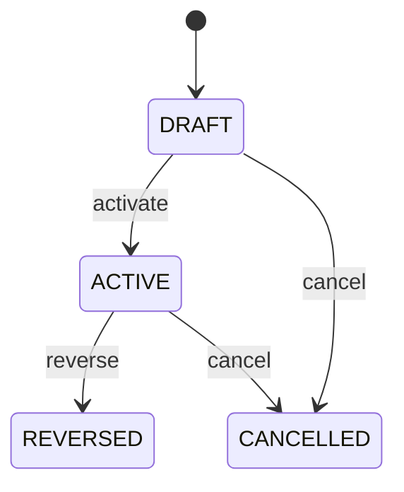

# Supplier Credit Note Application

Provides the auditable bridge by which a posted SupplierCreditNote is consumed against a purchase Invoice. SupplierCreditNote establishes the authorized payable reduction; Invoice remains the original claim; SupplierCreditNoteApplication records exactly where and how much of the credit was used. Accounts payable, supplier returns, supplier statements, invoice reconciliation, tax, audit and payment planning. SupplierCreditNoteLine explains source credit detail; InvoiceLine explains original payable detail; this entity records header-level application evidence; JournalEntry records accounting recognition. SupplierCreditNote posted → select eligible purchase Invoice → validate remaining credit and payable exposure → currency/rate validation → activate application → update SupplierCreditNote amountApplied/amountUnapplied and payable exposure → reverse and reallocate when required. Draft → active → reversed/cancelled. Historical applications are retained. Changes to posted SupplierCreditNote or Invoice never rewrite an application; corrections use reversal and replacement applications. A posted USD 1,000 SupplierCreditNote is applied to a USD 1,000 purchase invoice. The application consumes USD 1,000 of available supplier credit and reduces the payable exposure by USD 1,000. If applied incorrectly, the application is reversed and a new application is created.

## Finding records

Open **Supplier Credit Note Application** from the menu or from its card on the dashboard.

The list shows Supplier Credit Amount, Invoice Amount, Exchange Rate, Applied At, Status, Reversal Of Application, Supplier Credit Note, with the most recently changed record first. The **Help** button beside the title opens this window's help text.

- **Search**: type in the search box above the grid to narrow the rows. **Search** at the top left opens advanced search, where you pick a field, a comparison (equals, contains, starts with, before, after, and so on) and a value.
- **Sort**: click a column heading; click again to reverse.
- **Refresh**: the refresh button at the top right re-reads the rows and every dropdown, so a record created a moment ago by someone else appears.
- **Export**: **CSV** downloads the rows you are looking at.
- **Open a record**: click a row. The line under the title, "Showing 1 to n of N entries", tells you how many rows match.

## Creating a record

Choose **New** at the top of the list. The form opens on its own page, with the fields in sections. A badge beside each label names the control (Text, Dropdown, Date, and so on); a red star marks a required field; the question-mark icon shows that field's help; and a hint such as “max 300” shows the longest entry accepted.

1. Fill in the fields described under [Fields](#fields).
2. These are required and must be completed before the record can be saved: **Supplier Credit Amount**, **Invoice Amount**, **Applied At**, **Status**, **Supplier Credit Note**, **Invoice**.
3. For a dropdown that points at another window, pick the matching record; if the record you need does not exist yet, create it in its own window first. A dropdown may narrow to what you have already chosen, for example the states of the chosen country.
4. Choose **Create** (or **Save** in the toolbar). You return to the record, and it appears at the top of the list. If something is wrong the form says which field and why, and nothing is saved.

## Reading, changing and deleting a record

Click a row to open the record. Above the fields are the arrows that step through the list ("1 of 5"). Below them sit **Notes**, where anyone may leave a comment on the record, and the **Audit Trail**, which lists every change with who made it, when, and which fields changed.

- **Edit** (toolbar) makes the fields editable. Change them and choose **Save**; **Undo Changes** puts back what you changed and **Cancel Editing** leaves edit mode.
- **Copy Record** starts a new record from this one.
- **Delete Record** is available in edit mode and asks you to confirm; a record other records still depend on cannot be deleted.

Every change is also written to the [Audit Log](/administration/#audit-log).

## Fields

| Field | What you use | Rules | What to enter |
| --- | --- | --- | --- |
| Supplier Credit Amount | Amount | Required | Portion of the SupplierCreditNote consumed by this application. Represents the source-side amount of supplier credit allocated to an invoice. Controls remaining unapplied supplier credit and reconciliation. Must use the SupplierCreditNote currency. Establishes the amount consumed from the supplier credit. Required. |
| Invoice Amount | Amount | Required | Amount by which the purchase Invoice payable claim is reduced. Represents the target-side financial effect on the payable. Drives payable exposure and reconciliation. Must use the Invoice currency and may differ from supplierCreditAmount only under governed exchange-rate treatment. Supplies the claim-side adjustment. Required. |
| Exchange Rate | Lookup | Optional | Exchange rate used when supplier credit and invoice currencies differ. Preserves conversion evidence for cross-currency supplier credit application. Supports audit and reproducibility. Required for permitted cross-currency applications. Connects source supplier credit value to target invoice value. Optional when currencies are identical. Pick a record from **Exchange Rate**. |
| Applied At | Date and time | Required | Timestamp when the supplier credit application became effective. Establishes adjustment chronology. Supports accounting periods, supplier statements, audit and reconciliation. Distinct from SupplierCreditNoteDate and InvoiceDate. Determines when payable exposure changes. Required. |
| Status | Choice | Required | Lifecycle state of the supplier credit application. Indicates whether the application currently reduces payable exposure. Controls SupplierCreditNote and Invoice projections. SupplierCreditNote and Invoice statuses remain independent historical facts. ACTIVE creates the application effect; reversal removes it through a compensating event. Required. The status of the supplier credit note application is draft; set it when that is what the business means for this record. The status of the supplier credit note application is active; set it when that is what the business means for this record. The status of the supplier credit note application is reversed; set it when that is what the business means for this record. The status of the supplier credit note application is cancelled; set it when that is what the business means for this record. Choose one: Draft, Active, Reversed, Cancelled. |
| Reversal Of Application | Lookup | Optional | Prior supplier credit application reversed by this record. Links correction to the original payable adjustment application. Supports audit and controlled reallocation. Reversal is a new historical event and does not edit the original. Enables correction while preserving history. Optional for normal applications. Pick a record from **Supplier Credit Note Application**. |
| Supplier Credit Note | Lookup | Required | Supplier credit note supplying the payable reduction. Identifies the authorized supplier financial credit being consumed. Supports payable reconciliation and supplier statements. Exactly one SupplierCreditNote supplies each application. Supplies available credit and currency context. Pick a record from **Supplier Credit Note**. |
| Invoice | Lookup | Required | Purchase Invoice receiving the payable reduction. Identifies the supplier claim whose exposure is reduced. Supports accounts payable, reconciliation and supplier statements. Exactly one Invoice is targeted. Supplies eligible payable exposure and currency context. Pick a record from **Invoice**. |

## How it connects to other records
- A supplier credit note application belongs to one **Supplier Credit Note**.
- A supplier credit note application belongs to one **Invoice**.
- A supplier credit note application belongs to one **Exchange Rate**.

## Lifecycle: Supplier credit note application lifecycle

A supplier credit note application record starts as **Draft** and ends as **Reversed** or **Cancelled**. Open a record and the bar above its fields shows its current **State** and, after **Next**, a button for each move that leaves it; choose one to make the move. Any move the diagram does not draw is refused, for everyone including the administrator.

| From | To | Move |
| --- | --- | --- |
| Draft | Active | Activate |
| Active | Reversed | Reverse |
| Draft | Cancelled | Cancel |
| Active | Cancelled | Cancel |

## What happens when you save
Business rules run around the save. They are listed here and explained in full under [Business rules](/administration/rules/).

| Rule | When | Order |
| --- | --- | --- |
| Supplier credit note application invariants before create | before a supplier credit note application is created | 100 |
| Supplier credit note application invariants before update | before a supplier credit note application is changed | 100 |
| Supplier credit note application workflows after update | after a supplier credit note application is changed | 100 |

Processes started from this record: [Supplier credit note application follow up required](/administration/processes/#supplier-credit-note-application-follow-up-required).

## Who may use it

Anyone who holds a role with access to the **Supplier Credit Note Application** window. Access is granted by role under [Roles and access](/administration/access/).
