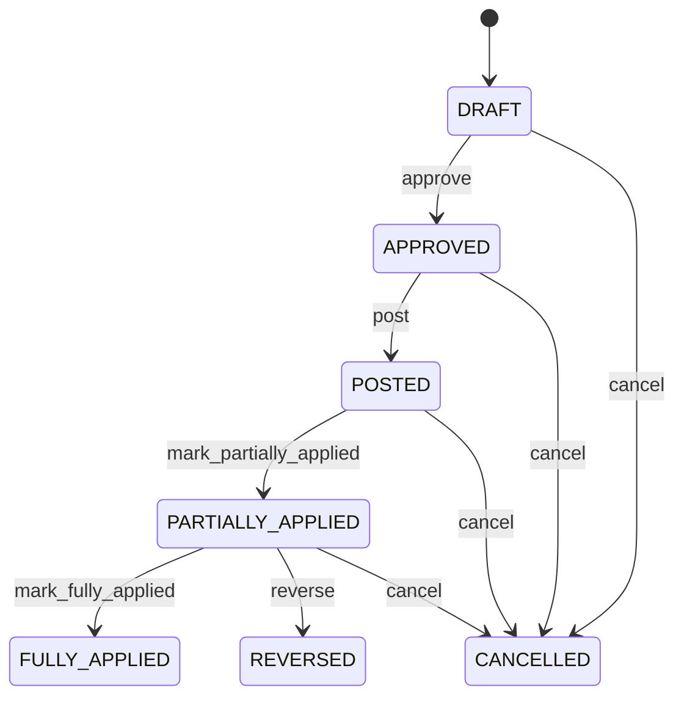

# Supplier Credit Note

Represents an explicit financial reduction of supplier payable exposure while preserving original procurement invoice claim resolution and return history. SupplierClaim explains the issue; SupplierClaimResolution authorizes the remedy; SupplierReturn is the physical event; SupplierCreditNote records the financial consequence; SupplierCreditNoteApplication records consumption against invoices; JournalEntry records accounting recognition. Accounts payable procurement supplier reconciliation claims tax accounting and audit. SupplierReturn records physical reversal, SupplierClaim records the case, SupplierClaimResolution records the authorized outcome, Invoice records the original payable claim, SupplierCreditNoteLine records financial detail, SupplierCreditNoteApplication records payable application, and JournalEntry records accounting. Claim/return/adjustment approval → SupplierClaimResolution → credit calculation from original transaction evidence → supplier credit approval → posting → JournalEntry → SupplierCreditNoteApplication against eligible Invoice → payable balance reconciliation. Supplier settlement or refund is a separate financial workflow. Draft → approved → posted → partially applied/fully applied, with cancellation before posting and reversal after posting. Changes to claim resolution return or invoice evidence trigger revalidation before posting. Posted credit changes require reversal/replacement. Applications are corrected by reversal/reallocation rather than mutation. Three defective units are returned. SupplierClaimResolution authorizes CREDIT for EUR 300, SupplierCreditNote records the approved credit, accounting recognizes it, and SupplierCreditNoteApplication applies it against the supplier invoice without changing historical invoice lines.

## Finding records

Open **Supplier Credit Note** from the menu or from its card on the dashboard.

The list shows Credit Note Number, Credit Note Date, Status, Currency, Subtotal, Tax Amount, Total Amount, with the most recently changed record first. The **Help** button beside the title opens this window's help text.

- **Search**: type in the search box above the grid to narrow the rows. **Search** at the top left opens advanced search, where you pick a field, a comparison (equals, contains, starts with, before, after, and so on) and a value.
- **Sort**: click a column heading; click again to reverse.
- **Refresh**: the refresh button at the top right re-reads the rows and every dropdown, so a record created a moment ago by someone else appears.
- **Export**: **CSV** downloads the rows you are looking at.
- **Open a record**: click a row. The line under the title, "Showing 1 to n of N entries", tells you how many rows match.

## Creating a record

Choose **New** at the top of the list. The form opens on its own page, with the fields in sections. A badge beside each label names the control (Text, Dropdown, Date, and so on); a red star marks a required field; the question-mark icon shows that field's help; and a hint such as “max 300” shows the longest entry accepted.

1. Fill in the fields described under [Fields](#fields).
2. These are required and must be completed before the record can be saved: **Credit Note Number**, **Credit Note Date**, **Status**, **Currency**, **Subtotal**, **Tax Amount**, **Total Amount**, **Amount Applied**, **Amount Unapplied**, **Supplier**.
3. For a dropdown that points at another window, pick the matching record; if the record you need does not exist yet, create it in its own window first. A dropdown may narrow to what you have already chosen, for example the states of the chosen country.
4. Choose **Create** (or **Save** in the toolbar). You return to the record, and it appears at the top of the list. If something is wrong the form says which field and why, and nothing is saved.

## Reading, changing and deleting a record

Click a row to open the record. Above the fields are the arrows that step through the list ("1 of 5"). Below them sit **Notes**, where anyone may leave a comment on the record, and the **Audit Trail**, which lists every change with who made it, when, and which fields changed.

- **Edit** (toolbar) makes the fields editable. Change them and choose **Save**; **Undo Changes** puts back what you changed and **Cancel Editing** leaves edit mode.
- **Copy Record** starts a new record from this one.
- **Delete Record** is available in edit mode and asks you to confirm; a record other records still depend on cannot be deleted.

Every change is also written to the [Audit Log](/administration/#audit-log).

## Fields

| Field | What you use | Rules | What to enter |
| --- | --- | --- | --- |
| Credit Note Number | Text | Required, Unique, Up to 100 characters | Business-facing supplier credit reference. Identifies the credit document for supplier communication and financial reconciliation. Used by accounts payable suppliers auditors and integrations. Correlates internal adjustment with external supplier documentation. Required. |
| Credit Note Date | Date | Required | Effective date of supplier credit adjustment. Establishes financial chronology and applicable accounting/tax period. Payable aging tax reporting and period control. Anchors recognition of adjustment. Required. |
| Status | Choice | Required | Lifecycle state of supplier credit. Separates preparation authorization accounting recognition and application against supplier claims. Controls posting payable reconciliation and reversal. Status does not change original Invoice GoodsReceipt SupplierClaim or SupplierClaimResolution history. POSTED establishes adjustment; application states reflect controlled consumption. Required. The status of the supplier credit note is draft; set it when that is what the business means for this record. The status of the supplier credit note is approved; set it when that is what the business means for this record. The status of the supplier credit note is posted; set it when that is what the business means for this record. The status of the supplier credit note is partially applied; set it when that is what the business means for this record. The status of the supplier credit note is fully applied; set it when that is what the business means for this record. The status of the supplier credit note is cancelled; set it when that is what the business means for this record. The status of the supplier credit note is reversed; set it when that is what the business means for this record. Choose one: Draft, Approved, Posted, Partially applied, Fully applied, Cancelled, Reversed. |
| Currency | Lookup | Required | Currency in which supplier credit is denominated. Defines monetary denomination of adjustment. Payable reconciliation accounting tax and application. Qualifies all credit monetary values. Required. Pick a record from **Currency**. |
| Subtotal | Amount | Required | Credit value before applicable tax. Pre-tax reduction derived from credit lines. Tax calculation and reconciliation. Feeds total credit calculation. Required. |
| Tax Amount | Amount | Required | Tax component reversed or adjusted. Tax correction associated with credited value. Tax reporting and accounting reconciliation. Contributes to total credit. Required, including zero. |
| Total Amount | Amount | Required | Total payable reduction represented by supplier credit. Financial value recognized as credit against supplier exposure. Accounts payable reconciliation statements and accounting. Determines maximum adjustment available for application. Required. |
| Amount Applied | Amount | Required | Portion of supplier credit already applied to payable claims. Separates credit created from portion consumed against invoices. Drives open credit and payable reconciliation. Must reconcile with active SupplierCreditNoteApplication records. Changes only through explicit application/reversal events. Required. |
| Amount Unapplied | Amount | Required | Remaining supplier credit not yet applied. Available credit exposure under policy. Future invoice application or supplier settlement/refund processing. Reconciles totalAmount less active applications. Required. |
| Supplier | Lookup | Required | Supplier associated with the credit. Identifies supplier whose payable exposure is reduced. Payables and supplier statements. Reconciles source Invoice SupplierClaim and SupplierReturn context. Pick a record from **Supplier**. |
| Supplier Claim | Lookup | Optional | Supplier claim supporting the credit. Connects the financial adjustment to the business case and evidence for recovery. Claim resolution audit and reconciliation. Provides case context for credit authorization. Pick a record from **Supplier Claim**. |
| Supplier Claim Resolution | Lookup | Optional | Authorized claim resolution that approved this credit remedy. Connects the credit to the controlled decision authorizing the financial recovery. Governance approval execution tracking and claim closure. Supplies execution mandate for CREDIT resolution. Pick a record from **Supplier Claim Resolution**. |
| Source Return | Lookup | Optional | Supplier return that caused the credit. Connects financial adjustment to physical reverse-procurement event. Return-to-credit traceability and approval. Provides return eligibility evidence. Pick a record from **Supplier Return**. |

## How it connects to other records
- A supplier credit note belongs to one **Supplier**.
- A supplier credit note belongs to one **Supplier Claim**.
- A supplier credit note belongs to one **Supplier Claim Resolution**.
- A supplier credit note belongs to one **Supplier Return**.
- A supplier credit note has many **Supplier Credit Note** records.
- A supplier credit note is linked to many **Invoice** records.
- A supplier credit note has many **Supplier Credit Note Application** records.

## Lifecycle: Supplier credit note lifecycle

A supplier credit note record starts as **Draft** and ends as **Fully applied** or **Cancelled** or **Reversed**. Open a record and the bar above its fields shows its current **State** and, after **Next**, a button for each move that leaves it; choose one to make the move. Any move the diagram does not draw is refused, for everyone including the administrator.

| From | To | Move |
| --- | --- | --- |
| Draft | Approved | Approve |
| Approved | Posted | Post |
| Posted | Partially applied | Mark partially applied |
| Partially applied | Fully applied | Mark fully applied |
| Draft | Cancelled | Cancel |
| Approved | Cancelled | Cancel |
| Posted | Cancelled | Cancel |
| Partially applied | Cancelled | Cancel |
| Partially applied | Reversed | Reverse |

## What happens when you save
Business rules run around the save. They are listed here and explained in full under [Business rules](/administration/rules/).

| Rule | When | Order |
| --- | --- | --- |
| Supplier credit note invariants before create | before a supplier credit note is created | 100 |
| Supplier credit note invariants before update | before a supplier credit note is changed | 100 |
| Supplier credit note workflows after update | after a supplier credit note is changed | 100 |

Processes started from this record: [Supplier credit note follow up required](/administration/processes/#supplier-credit-note-follow-up-required), [Supplier credit note completion confirmed](/administration/processes/#supplier-credit-note-completion-confirmed).

## Who may use it

Anyone who holds a role with access to the **Supplier Credit Note** window. Access is granted by role under [Roles and access](/administration/access/).
