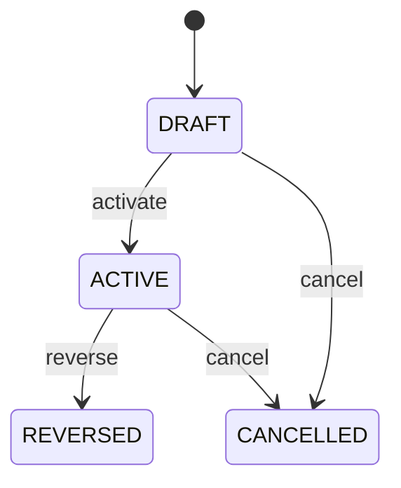

# Supplier Debit Note Application

Records the controlled application of a posted SupplierDebitNote against a specific supplier invoice payable claim. SupplierDebitNote establishes the financial adjustment; this entity records where that adjustment is consumed. It is not a Payment and does not rewrite the original Invoice. Accounts payable, supplier statements, reconciliation, audit, dispute resolution and financial integration. SupplierDebitNote is the source adjustment, Invoice is the target payable claim, ExchangeRate provides cross-currency evidence, and JournalEntry records accounting recognition separately. SupplierClaim/SupplierClaimResolution authorize recovery → SupplierDebitNote approved and posted → eligible Invoice selected → application validated → ACTIVE application → payable exposure reduced → debit remaining reconciled. Corrections use reversal. Draft → active, with reversed or cancelled paths. Changes to source debit posting, invoice eligibility, currency or exchange-rate evidence require application revalidation; active applications are corrected through reversal rather than mutation. A posted EUR 500 SupplierDebitNote is applied against a EUR 500 supplier invoice. The application records EUR 500 debit amount and invoice amount, becomes ACTIVE, and reduces the payable exposure while preserving the original invoice history.

## Finding records

Open **Supplier Debit Note Application** from the menu or from its card on the dashboard.

The list shows Supplier Debit Amount, Invoice Amount, Exchange Rate, Applied At, Status, Reversal Of Application, Supplier Debit Note, with the most recently changed record first. The **Help** button beside the title opens this window's help text.

- **Search**: type in the search box above the grid to narrow the rows. **Search** at the top left opens advanced search, where you pick a field, a comparison (equals, contains, starts with, before, after, and so on) and a value.
- **Sort**: click a column heading; click again to reverse.
- **Refresh**: the refresh button at the top right re-reads the rows and every dropdown, so a record created a moment ago by someone else appears.
- **Export**: **CSV** downloads the rows you are looking at.
- **Open a record**: click a row. The line under the title, "Showing 1 to n of N entries", tells you how many rows match.

## Creating a record

Choose **New** at the top of the list. The form opens on its own page, with the fields in sections. A badge beside each label names the control (Text, Dropdown, Date, and so on); a red star marks a required field; the question-mark icon shows that field's help; and a hint such as “max 300” shows the longest entry accepted.

1. Fill in the fields described under [Fields](#fields).
2. These are required and must be completed before the record can be saved: **Supplier Debit Amount**, **Invoice Amount**, **Applied At**, **Status**, **Supplier Debit Note**, **Invoice**.
3. For a dropdown that points at another window, pick the matching record; if the record you need does not exist yet, create it in its own window first. A dropdown may narrow to what you have already chosen, for example the states of the chosen country.
4. Choose **Create** (or **Save** in the toolbar). You return to the record, and it appears at the top of the list. If something is wrong the form says which field and why, and nothing is saved.

## Reading, changing and deleting a record

Click a row to open the record. Above the fields are the arrows that step through the list ("1 of 5"). Below them sit **Notes**, where anyone may leave a comment on the record, and the **Audit Trail**, which lists every change with who made it, when, and which fields changed.

- **Edit** (toolbar) makes the fields editable. Change them and choose **Save**; **Undo Changes** puts back what you changed and **Cancel Editing** leaves edit mode.
- **Copy Record** starts a new record from this one.
- **Delete Record** is available in edit mode and asks you to confirm; a record other records still depend on cannot be deleted.

Every change is also written to the [Audit Log](/administration/#audit-log).

## Fields

| Field | What you use | Rules | What to enter |
| --- | --- | --- | --- |
| Supplier Debit Amount | Amount | Required | Amount of the supplier debit consumed by this application in debit-note currency. Defines the portion of the posted debit allocated to this payable claim. Reconciliation and remaining-amount calculation. May differ from invoiceAmount when currencies differ and an ExchangeRate is used. Reduces the unapplied supplier debit balance. Required and positive. |
| Invoice Amount | Amount | Required | Amount of payable exposure reduced on the target invoice. Records the invoice-currency effect of the debit application. Accounts payable reconciliation and audit. Must reconcile to supplierDebitAmount using the recorded exchange rate when currencies differ. Reduces invoice payable exposure without changing original invoice totals. Required and positive. |
| Exchange Rate | Lookup | Optional | Exchange-rate evidence used when debit and invoice currencies differ. Provides reproducible conversion between application currencies. Accounting, tax, reconciliation and audit. Required for cross-currency application under policy. Determines the conversion used for invoiceAmount. Optional when currencies are identical. Pick a record from **Exchange Rate**. |
| Applied At | Date and time | Required | Time the debit application became effective. Establishes settlement chronology. Period control, audit, supplier statements and reconciliation. Anchors the application event. Required. |
| Status | Choice | Required | Lifecycle state of the debit application. Separates preparation from effective application and later reversal. Controls payable projections and remaining debit balance. Application status does not replace SupplierDebitNote or Invoice status. ACTIVE contributes to settlement projections; REVERSED removes its active effect through compensating evidence. Required. The status of the supplier debit note application is draft; set it when that is what the business means for this record. The status of the supplier debit note application is active; set it when that is what the business means for this record. The status of the supplier debit note application is reversed; set it when that is what the business means for this record. The status of the supplier debit note application is cancelled; set it when that is what the business means for this record. Choose one: Draft, Active, Reversed, Cancelled. |
| Reversal Of Application | Lookup | Optional | Prior application being reversed. Provides explicit lineage for a corrective reversal. Audit, reconciliation and error correction. Reversal is a new event and does not mutate the original application. Links compensating evidence to the prior application. Required when status is REVERSED under the reversal model. Pick a record from **Supplier Debit Note Application**. |
| Supplier Debit Note | Lookup | Required | Posted supplier debit being applied. Identifies the source financial adjustment. Remaining-balance and audit reconciliation. Supplies available debit amount and supplier context. Pick a record from **Supplier Debit Note**. |
| Invoice | Lookup | Required | Supplier payable invoice receiving the debit application. Identifies the eligible original payable claim whose outstanding exposure is reduced. Accounts payable, reconciliation and supplier statements. Supplies target claim and currency context. Pick a record from **Invoice**. |

## How it connects to other records
- A supplier debit note application belongs to one **Supplier Debit Note**.
- A supplier debit note application belongs to one **Invoice**.
- A supplier debit note application belongs to one **Exchange Rate**.

## Lifecycle: Supplier debit note application lifecycle

A supplier debit note application record starts as **Draft** and ends as **Reversed** or **Cancelled**. Open a record and the bar above its fields shows its current **State** and, after **Next**, a button for each move that leaves it; choose one to make the move. Any move the diagram does not draw is refused, for everyone including the administrator.

| From | To | Move |
| --- | --- | --- |
| Draft | Active | Activate |
| Active | Reversed | Reverse |
| Draft | Cancelled | Cancel |
| Active | Cancelled | Cancel |

## What happens when you save
Business rules run around the save. They are listed here and explained in full under [Business rules](/administration/rules/).

| Rule | When | Order |
| --- | --- | --- |
| Supplier debit note application invariants before create | before a supplier debit note application is created | 100 |
| Supplier debit note application invariants before update | before a supplier debit note application is changed | 100 |
| Supplier debit note application workflows after update | after a supplier debit note application is changed | 100 |

Processes started from this record: [Supplier debit note application follow up required](/administration/processes/#supplier-debit-note-application-follow-up-required).

## Who may use it

Anyone who holds a role with access to the **Supplier Debit Note Application** window. Access is granted by role under [Roles and access](/administration/access/).
