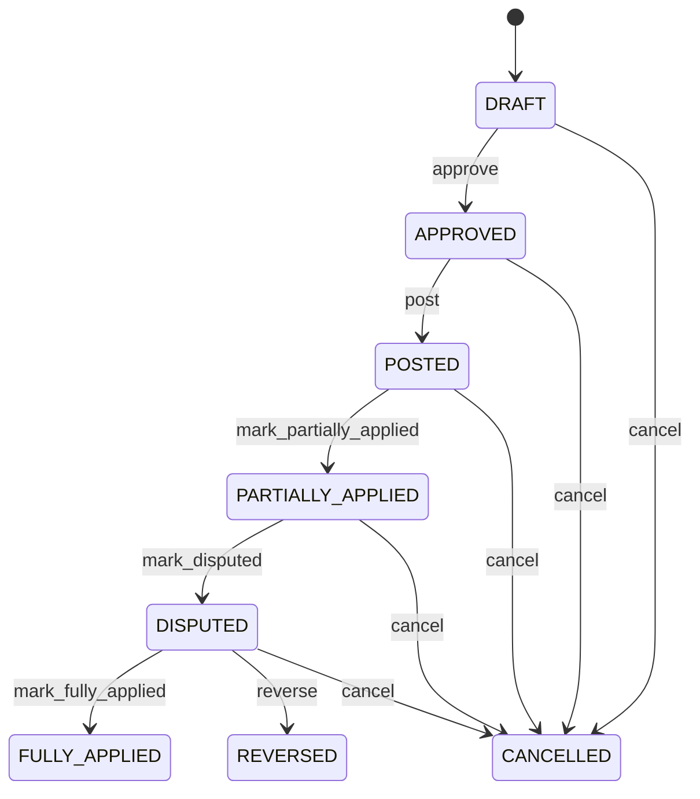

# Supplier Debit Note

Represents a buyer-issued financial debit against a supplier while preserving the original payable claim supplier-claim history resolution decision and application evidence. SupplierClaim explains the issue, SupplierClaimResolution authorizes the remedy, SupplierDebitNote records the financial recovery, SupplierDebitNoteApplication allocates that recovery to payable claims, and JournalEntry provides accounting recognition. Payment remains the separate cash-movement concept. Accounts payable procurement recovery supplier disputes tax accounting and audit. SupplierClaim provides the case, SupplierClaimResolution provides authorization, Invoice provides the original payable claim, SupplierDebitNote provides the adjustment, SupplierDebitNoteApplication provides claim-level application, and JournalEntry provides accounting evidence. Claim/investigation → recovery approval → SupplierClaimResolution → debit calculation → approval → posting → accounting recognition → SupplierDebitNoteApplication → payable reconciliation or supplier dispute → claim closure/reversal. Draft → approved → posted → partially/fully applied, with dispute cancellation and reversal paths. Changes to claim resolution invoice or supporting evidence before posting trigger revalidation. Posted adjustments and active applications are corrected by reversal/replacement rather than mutation. A supplier overcharges by EUR 500. The SupplierClaim is accepted, SupplierClaimResolution authorizes DEBIT_ADJUSTMENT for EUR 500, SupplierDebitNote is posted for EUR 500, and a SupplierDebitNoteApplication applies the debit to the eligible supplier invoice without rewriting the original Invoice.

## Finding records

Open **Supplier Debit Note** from the menu or from its card on the dashboard.

The list shows Debit Note Number, Debit Note Date, Status, Currency, Subtotal, Tax Amount, Total Amount, with the most recently changed record first. The **Help** button beside the title opens this window's help text.

- **Search**: type in the search box above the grid to narrow the rows. **Search** at the top left opens advanced search, where you pick a field, a comparison (equals, contains, starts with, before, after, and so on) and a value.
- **Sort**: click a column heading; click again to reverse.
- **Refresh**: the refresh button at the top right re-reads the rows and every dropdown, so a record created a moment ago by someone else appears.
- **Export**: **CSV** downloads the rows you are looking at.
- **Open a record**: click a row. The line under the title, "Showing 1 to n of N entries", tells you how many rows match.

## Creating a record

Choose **New** at the top of the list. The form opens on its own page, with the fields in sections. A badge beside each label names the control (Text, Dropdown, Date, and so on); a red star marks a required field; the question-mark icon shows that field's help; and a hint such as “max 300” shows the longest entry accepted.

1. Fill in the fields described under [Fields](#fields).
2. These are required and must be completed before the record can be saved: **Debit Note Number**, **Debit Note Date**, **Status**, **Currency**, **Subtotal**, **Tax Amount**, **Total Amount**, **Amount Applied**, **Amount Remaining**, **Supplier**.
3. For a dropdown that points at another window, pick the matching record; if the record you need does not exist yet, create it in its own window first. A dropdown may narrow to what you have already chosen, for example the states of the chosen country.
4. Choose **Create** (or **Save** in the toolbar). You return to the record, and it appears at the top of the list. If something is wrong the form says which field and why, and nothing is saved.

## Reading, changing and deleting a record

Click a row to open the record. Above the fields are the arrows that step through the list ("1 of 5"). Below them sit **Notes**, where anyone may leave a comment on the record, and the **Audit Trail**, which lists every change with who made it, when, and which fields changed.

- **Edit** (toolbar) makes the fields editable. Change them and choose **Save**; **Undo Changes** puts back what you changed and **Cancel Editing** leaves edit mode.
- **Copy Record** starts a new record from this one.
- **Delete Record** is available in edit mode and asks you to confirm; a record other records still depend on cannot be deleted.

Every change is also written to the [Audit Log](/administration/#audit-log).

## Fields

| Field | What you use | Rules | What to enter |
| --- | --- | --- | --- |
| Debit Note Number | Text | Required, Unique, Up to 100 characters | Human-facing supplier debit reference. Identifies the debit adjustment in supplier correspondence and financial operations. Used for reconciliation supplier statements audit and integrations. Distinct from supplier claim purchase order invoice and return numbers. Provides operational reference throughout the debit lifecycle. Required. |
| Debit Note Date | Date | Required | Effective date of the supplier debit adjustment. Establishes financial chronology and accounting or tax period. Period control reconciliation reporting and supplier communication. Distinct from claim resolution invoice return and payment dates. Anchors recognition of the adjustment. Required. |
| Status | Choice | Required | Lifecycle state of the supplier debit adjustment. Separates preparation authorization accounting recognition application dispute and reversal. Controls posting payable reconciliation and supplier dispute workflows. Status does not alter original Invoice GoodsReceipt SupplierClaim or SupplierClaimResolution evidence. POSTED creates financial evidence; application and dispute states track subsequent handling. Required. The status of the supplier debit note is draft; set it when that is what the business means for this record. The status of the supplier debit note is approved; set it when that is what the business means for this record. The status of the supplier debit note is posted; set it when that is what the business means for this record. The status of the supplier debit note is partially applied; set it when that is what the business means for this record. The status of the supplier debit note is fully applied; set it when that is what the business means for this record. The status of the supplier debit note is disputed; set it when that is what the business means for this record. The status of the supplier debit note is cancelled; set it when that is what the business means for this record. The status of the supplier debit note is reversed; set it when that is what the business means for this record. Choose one: Draft, Approved, Posted, Partially applied, Fully applied, Disputed, Cancelled, Reversed. |
| Currency | Lookup | Required | Currency in which debit amounts are denominated. Defines the monetary denomination of the adjustment. Accounting reconciliation supplier settlement and reporting. Cross-currency application requires explicit ExchangeRate evidence. Qualifies all monetary values. Required. Pick a record from **Currency**. |
| Subtotal | Amount | Required | Pre-tax value of the supplier debit adjustment. Aggregate financial increase before applicable tax. Calculation tax and reconciliation. Feeds totalAmount. Required. |
| Tax Amount | Amount | Required | Tax component associated with the debit adjustment. Represents applicable tax added to the adjustment. Tax reporting accounting and reconciliation. Contributes to totalAmount. Required including zero. |
| Total Amount | Amount | Required | Total supplier debit adjustment. Financial amount by which supplier-related recoverable exposure is increased. Accounts payable supplier settlement accounting and reconciliation. It is an adjustment, not a replacement for the original supplier Invoice. Determines the maximum amount available for controlled application. Required. |
| Amount Applied | Amount | Required | Portion of the supplier debit recognized against eligible supplier payable claims. Tracks how much posted debit has been consumed by active SupplierDebitNoteApplication records. Reconciliation supplier statements and reporting. SupplierDebitNoteApplication is the explicit settlement evidence; Payment remains separate cash movement. Changes through controlled application or reversal events. Required. |
| Amount Remaining | Amount | Required | Unapplied portion of the posted supplier debit. Represents debit value still available for payable application or governed settlement handling. Reconciliation supplier statements and resolution tracking. Determines whether the debit is fully applied. Required. |
| Supplier | Lookup | Required | Supplier responsible for the financial adjustment. Identifies the external party whose payable exposure is adjusted. Payables supplier communication and reconciliation. Establishes party context. Pick a record from **Supplier**. |
| Supplier Claim | Lookup | Optional | Supplier claim that provides the commercial or quality case for the debit. Connects financial adjustment to the case that established the recovery entitlement. Traceability approval and dispute management. Provides supporting evidence without replacing the debit document. Pick a record from **Supplier Claim**. |
| Supplier Claim Resolution | Lookup | Optional | Authorized claim resolution that approved this debit remedy. Connects the posted financial adjustment to the controlled decision that authorized the recovery. Governance approval audit and claim closure. Supplies the execution mandate for DEBIT_ADJUSTMENT or another authorized financial remedy. Pick a record from **Supplier Claim Resolution**. |

## How it connects to other records
- A supplier debit note belongs to one **Supplier**.
- A supplier debit note belongs to one **Supplier Claim**.
- A supplier debit note belongs to one **Supplier Claim Resolution**.
- A supplier debit note is linked to many **Invoice** records.
- A supplier debit note has many **Supplier Debit Note** records.
- A supplier debit note has many **Supplier Debit Note Application** records.

## Lifecycle: Supplier debit note lifecycle

A supplier debit note record starts as **Draft** and ends as **Fully applied** or **Cancelled** or **Reversed**. Open a record and the bar above its fields shows its current **State** and, after **Next**, a button for each move that leaves it; choose one to make the move. Any move the diagram does not draw is refused, for everyone including the administrator.

| From | To | Move |
| --- | --- | --- |
| Draft | Approved | Approve |
| Approved | Posted | Post |
| Posted | Partially applied | Mark partially applied |
| Partially applied | Disputed | Mark disputed |
| Disputed | Fully applied | Mark fully applied |
| Draft | Cancelled | Cancel |
| Approved | Cancelled | Cancel |
| Posted | Cancelled | Cancel |
| Partially applied | Cancelled | Cancel |
| Disputed | Cancelled | Cancel |
| Disputed | Reversed | Reverse |

## What happens when you save
Business rules run around the save. They are listed here and explained in full under [Business rules](/administration/rules/).

| Rule | When | Order |
| --- | --- | --- |
| Supplier debit note invariants before create | before a supplier debit note is created | 100 |
| Supplier debit note invariants before update | before a supplier debit note is changed | 100 |
| Supplier debit note workflows after update | after a supplier debit note is changed | 100 |

Processes started from this record: [Supplier debit note follow up required](/administration/processes/#supplier-debit-note-follow-up-required), [Supplier debit note completion confirmed](/administration/processes/#supplier-debit-note-completion-confirmed).

## Who may use it

Anyone who holds a role with access to the **Supplier Debit Note** window. Access is granted by role under [Roles and access](/administration/access/).
