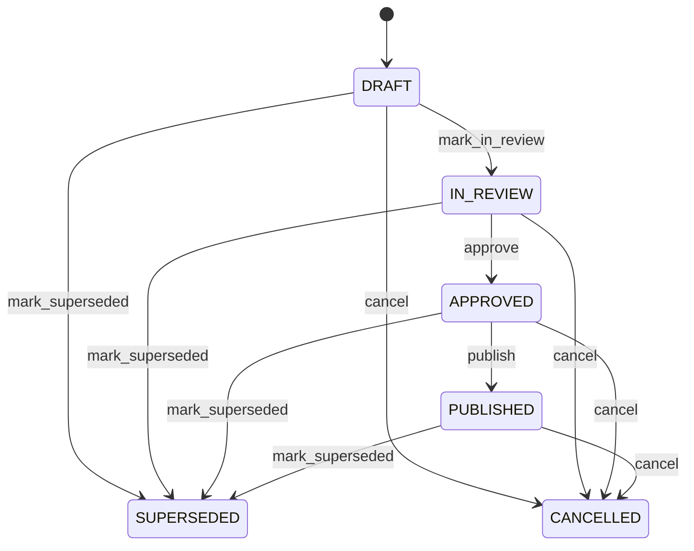

# Supplier Performance Assessment

Provides a governed supplier scorecard that converts procurement, receipt, quality, claim, return and corrective-action evidence into an auditable performance assessment. Supplier remains the master relationship; operational transactions provide evidence; SupplierPerformanceAssessment interprets that evidence for governance without rewriting the underlying facts. Supplier qualification, sourcing, supplier reviews, performance management, corrective improvement, risk management and procurement analytics. PurchaseOrder and GoodsReceipt provide commercial and delivery evidence; QualityInspection and SupplierClaim provide quality evidence; SupplierReturn and SupplierClaimResolution provide recovery evidence; CorrectiveAction provides improvement evidence. Define evaluation period and methodology → collect transaction evidence → calculate measures → review → approve → publish scorecard → trigger supplier improvement, qualification or sourcing decisions where policy requires → later supersede with a new assessment. Draft → in review → approved → published, with superseded and cancelled paths. Changes to source transactions do not rewrite a published assessment; they trigger governed re-evaluation or a superseding assessment when the change materially affects the score. Supplier qualification decisions consuming the assessment must retain the assessment identity as evidence. A quarterly assessment evaluates 120 purchase orders, 115 receipts, inspection failures, supplier claims and returns. The governed score is 82 and rating GOOD. The published assessment supports the next supplier review while all underlying transactions remain independently auditable.

## Finding records

Open **Supplier Performance Assessment** from the menu or from its card on the dashboard.

The list shows Assessment Number, Assessment Date, Period Start, Period End, Status, Overall Score, Rating, with the most recently changed record first. The **Help** button beside the title opens this window's help text.

- **Search**: type in the search box above the grid to narrow the rows. **Search** at the top left opens advanced search, where you pick a field, a comparison (equals, contains, starts with, before, after, and so on) and a value.
- **Sort**: click a column heading; click again to reverse.
- **Refresh**: the refresh button at the top right re-reads the rows and every dropdown, so a record created a moment ago by someone else appears.
- **Export**: **CSV** downloads the rows you are looking at.
- **Open a record**: click a row. The line under the title, "Showing 1 to n of N entries", tells you how many rows match.

## Creating a record

Choose **New** at the top of the list. The form opens on its own page, with the fields in sections. A badge beside each label names the control (Text, Dropdown, Date, and so on); a red star marks a required field; the question-mark icon shows that field's help; and a hint such as “max 300” shows the longest entry accepted.

1. Fill in the fields described under [Fields](#fields).
2. These are required and must be completed before the record can be saved: **Assessment Number**, **Assessment Date**, **Period Start**, **Period End**, **Status**, **Supplier**.
3. For a dropdown that points at another window, pick the matching record; if the record you need does not exist yet, create it in its own window first. A dropdown may narrow to what you have already chosen, for example the states of the chosen country.
4. Choose **Create** (or **Save** in the toolbar). You return to the record, and it appears at the top of the list. If something is wrong the form says which field and why, and nothing is saved.

## Reading, changing and deleting a record

Click a row to open the record. Above the fields are the arrows that step through the list ("1 of 5"). Below them sit **Notes**, where anyone may leave a comment on the record, and the **Audit Trail**, which lists every change with who made it, when, and which fields changed.

- **Edit** (toolbar) makes the fields editable. Change them and choose **Save**; **Undo Changes** puts back what you changed and **Cancel Editing** leaves edit mode.
- **Copy Record** starts a new record from this one.
- **Delete Record** is available in edit mode and asks you to confirm; a record other records still depend on cannot be deleted.

Every change is also written to the [Audit Log](/administration/#audit-log).

## Fields

| Field | What you use | Rules | What to enter |
| --- | --- | --- | --- |
| Assessment Number | Text | Required, Unique, Up to 100 characters | Human-facing assessment reference. Identifies the performance evaluation for operational and supplier communication. Review meetings, supplier scorecards, audit and reporting. Distinct from supplierCode, claimNumber and purchase order numbers. Correlates evidence and decisions throughout the assessment lifecycle. Required. |
| Assessment Date | Date | Required | Date on which the assessment is formally recorded. Establishes the governance point at which the evaluated performance becomes an assessment record. Supplier reviews, audit, reporting and decision chronology. Anchors approval and follow-up actions. Required. |
| Period Start | Date | Required | Beginning of the performance evaluation period. Defines the historical window from which performance evidence is evaluated. Score calculation, supplier comparison and trend reporting. Evidence transactions must fall within or be explicitly associated with this evaluation scope. Establishes assessment boundaries. Required. |
| Period End | Date | Required | End of the performance evaluation period. Defines the closing boundary of the performance evidence window. Score calculation, reporting and supplier review. Completes the assessment scope. Required. |
| Status | Choice | Required | Lifecycle state of the supplier performance assessment. Separates calculation, review, approval, publication and replacement of scorecard results. Controls whether the assessment may be changed or consumed by supplier governance. Does not change the status of Supplier, PurchaseOrder, GoodsReceipt, Invoice or SupplierClaim records. PUBLISHED makes the assessment an approved historical scorecard; corrections use a replacement or superseding assessment. Required. The status of the supplier performance assessment is draft; set it when that is what the business means for this record. The status of the supplier performance assessment is in review; set it when that is what the business means for this record. The status of the supplier performance assessment is approved; set it when that is what the business means for this record. The status of the supplier performance assessment is published; set it when that is what the business means for this record. The status of the supplier performance assessment is superseded; set it when that is what the business means for this record. The status of the supplier performance assessment is cancelled; set it when that is what the business means for this record. Choose one: Draft, In review, Approved, Published, Superseded, Cancelled. |
| Overall Score | Amount | Optional | Aggregate supplier performance score for the assessment scope. Represents the governed result of the configured supplier scorecard calculation. Supplier ranking, sourcing decisions, escalation and trend analysis. Must be derived from defined performance measures and must not be treated as raw transaction evidence. Supports approval and supplier governance decisions. Optional until score calculation is complete. |
| Rating | Choice | Optional | Interpreted supplier performance rating. Converts the approved score or governed assessment criteria into a business-facing performance category. Supplier segmentation, review cadence and improvement decisions. Rating is an assessment conclusion, not a replacement for underlying delivery, quality, claim or commercial evidence. Supports governance actions and escalation. Optional until the assessment is evaluated. The rating of the supplier performance assessment is excellent; set it when that is what the business means for this record. The rating of the supplier performance assessment is good; set it when that is what the business means for this record. The rating of the supplier performance assessment is acceptable; set it when that is what the business means for this record. The rating of the supplier performance assessment is needs improvement; set it when that is what the business means for this record. The rating of the supplier performance assessment is unsatisfactory; set it when that is what the business means for this record. Choose one: Excellent, Good, Acceptable, Needs improvement, Unsatisfactory. |
| Notes | Text | Up to 4000 characters | Qualitative context supporting the assessment. Records material observations, explanations or agreed context that structured scores do not capture. Supplier review, audit and improvement planning. Supplements but does not replace measurable evidence. Optional. |
| Supplier | Lookup | Required | Supplier being evaluated. Identifies the external party whose performance is assessed. Supplier governance, sourcing and improvement management. Supplies the master relationship and qualification context. Pick a record from **Supplier**. |

## How it connects to other records
- A supplier performance assessment belongs to one **Supplier**.
- A supplier performance assessment has many **Purchase Order** records.
- A supplier performance assessment has many **Goods Receipt** records.
- A supplier performance assessment has many **Supplier Claim** records.
- A supplier performance assessment has many **Supplier Return** records.
- A supplier performance assessment has many **Supplier Claim Resolution** records.

## Lifecycle: Supplier performance assessment lifecycle

A supplier performance assessment record starts as **Draft** and ends as **Superseded** or **Cancelled**. Open a record and the bar above its fields shows its current **State** and, after **Next**, a button for each move that leaves it; choose one to make the move. Any move the diagram does not draw is refused, for everyone including the administrator.

| From | To | Move |
| --- | --- | --- |
| Draft | In review | Mark in review |
| In review | Approved | Approve |
| Approved | Published | Publish |
| Draft | Superseded | Mark superseded |
| In review | Superseded | Mark superseded |
| Approved | Superseded | Mark superseded |
| Published | Superseded | Mark superseded |
| Draft | Cancelled | Cancel |
| In review | Cancelled | Cancel |
| Approved | Cancelled | Cancel |
| Published | Cancelled | Cancel |

## What happens when you save
Business rules run around the save. They are listed here and explained in full under [Business rules](/administration/rules/).

| Rule | When | Order |
| --- | --- | --- |
| Supplier performance assessment invariants before create | before a supplier performance assessment is created | 100 |
| Supplier performance assessment invariants before update | before a supplier performance assessment is changed | 100 |
| Supplier performance assessment workflows after update | after a supplier performance assessment is changed | 100 |

Processes started from this record: [Supplier performance assessment follow up required](/administration/processes/#supplier-performance-assessment-follow-up-required).

## Who may use it

Anyone who holds a role with access to the **Supplier Performance Assessment** window. Access is granted by role under [Roles and access](/administration/access/).
