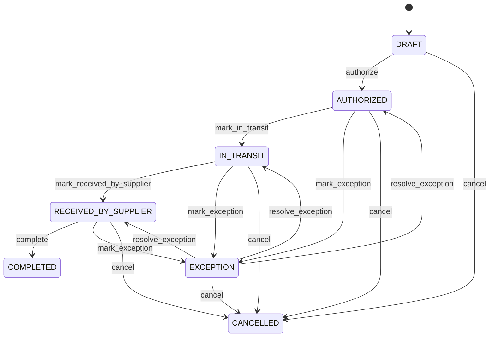

# Supplier Return

Coordinates the controlled reversal of accepted procurement fulfillment while preserving original purchasing, receiving, inventory, quality and financial history. A supplier return is a new reverse-procurement event; it does not delete or rewrite the original PurchaseOrder, GoodsReceipt or Invoice. Purchasing, warehouse operations, quality, supplier management, accounts payable and audit. PurchaseOrder identifies the commitment, GoodsReceipt identifies accepted receipt, SupplierReturnLine identifies returned quantity, QualityInspection provides quality evidence where required, InventoryMovement records physical reversal, and SupplierCreditNote records financial adjustment. Return request → authorization → quality inspection where required → dispatch → supplier receipt → inventory reversal → supplier credit assessment/posting → completion. Each physical, quality and financial consequence has independent evidence. Draft → authorized → in transit → received by supplier → completed, with cancellation and exception paths. Changes to source receipt, supplier return lines, product, quality policy or financial eligibility affecting an open return trigger revalidation of dependent inspections, inventory and credit workflows. Ten accepted units were received from a supplier and three are defective. A supplier return authorizes three units, QualityInspection records the failed inspection and return disposition, InventoryMovement reduces eligible stock by three, and a SupplierCreditNote reduces the payable claim for the approved amount. The original receipt and invoice remain historical evidence.

## Finding records

Open **Supplier Return** from the menu or from its card on the dashboard.

The list shows Return Number, Status, Return Date, Reason Code, Supplier, Purchase Order, Supplier Claim, with the most recently changed record first. The **Help** button beside the title opens this window's help text.

- **Search**: type in the search box above the grid to narrow the rows. **Search** at the top left opens advanced search, where you pick a field, a comparison (equals, contains, starts with, before, after, and so on) and a value.
- **Sort**: click a column heading; click again to reverse.
- **Refresh**: the refresh button at the top right re-reads the rows and every dropdown, so a record created a moment ago by someone else appears.
- **Export**: **CSV** downloads the rows you are looking at.
- **Open a record**: click a row. The line under the title, "Showing 1 to n of N entries", tells you how many rows match.

## Creating a record

Choose **New** at the top of the list. The form opens on its own page, with the fields in sections. A badge beside each label names the control (Text, Dropdown, Date, and so on); a red star marks a required field; the question-mark icon shows that field's help; and a hint such as “max 300” shows the longest entry accepted.

1. Fill in the fields described under [Fields](#fields).
2. These are required and must be completed before the record can be saved: **Return Number**, **Status**, **Return Date**, **Supplier**.
3. For a dropdown that points at another window, pick the matching record; if the record you need does not exist yet, create it in its own window first. A dropdown may narrow to what you have already chosen, for example the states of the chosen country.
4. Choose **Create** (or **Save** in the toolbar). You return to the record, and it appears at the top of the list. If something is wrong the form says which field and why, and nothing is saved.

## Reading, changing and deleting a record

Click a row to open the record. Above the fields are the arrows that step through the list ("1 of 5"). Below them sit **Notes**, where anyone may leave a comment on the record, and the **Audit Trail**, which lists every change with who made it, when, and which fields changed.

- **Edit** (toolbar) makes the fields editable. Change them and choose **Save**; **Undo Changes** puts back what you changed and **Cancel Editing** leaves edit mode.
- **Copy Record** starts a new record from this one.
- **Delete Record** is available in edit mode and asks you to confirm; a record other records still depend on cannot be deleted.

Every change is also written to the [Audit Log](/administration/#audit-log).

## Fields

| Field | What you use | Rules | What to enter |
| --- | --- | --- | --- |
| Return Number | Text | Required, Unique, Up to 100 characters | Human-facing supplier return reference. Operational identifier communicated to warehouse staff and the supplier. Used for logistics, supplier communication, investigation and reconciliation. Distinct from the original purchase order, receipt and invoice numbers. Correlates operational return activity across systems. Required for operational traceability. |
| Status | Choice | Required | Lifecycle state of the supplier return. Indicates authorization, transport, supplier receipt, completion or controlled exception. Controls logistics, inventory and financial workflows. Return status does not itself reverse inventory or accounts payable. Coordinates dependent workflows without replacing InventoryMovement, QualityInspection or SupplierCreditNote evidence. Required for controlled lifecycle. The status of the supplier return is draft; set it when that is what the business means for this record. The status of the supplier return is authorized; set it when that is what the business means for this record. The status of the supplier return is in transit; set it when that is what the business means for this record. The status of the supplier return is received by supplier; set it when that is what the business means for this record. The status of the supplier return is completed; set it when that is what the business means for this record. The status of the supplier return is cancelled; set it when that is what the business means for this record. The status of the supplier return is exception; set it when that is what the business means for this record. Choose one: Draft, Authorized, In transit, Received by supplier, Completed, Cancelled, Exception. |
| Return Date | Date and time | Required | Business timestamp for initiating the supplier return. Establishes the chronology of the reverse-procurement event. Supports logistics, audit, reporting and supplier claims. Distinct from original receipt date and supplier acceptance date. Anchors the return event. Required for chronology. |
| Reason Code | Text | Up to 100 characters | Reason for returning received goods to the supplier. Classifies defects, over-receipt, wrong item, damage, commercial rejection or other causes. Supports quality, supplier performance, warranty, claims and analytics. Explains why the return occurs and is distinct from physical disposition. Drives applicable approval, quality and supplier-claim policies. Optional only when policy permits an uncoded reason. |
| Supplier | Lookup | Required | Supplier to whom the goods are being returned. Identifies the external party receiving the returned goods. Supports authorization, logistics, supplier claims and payable reconciliation. Must normally agree with the source PurchaseOrder and GoodsReceipt supplier. Pick a record from **Supplier**. |
| Purchase Order | Lookup | Optional | Original procurement commitment associated with the returned goods. Connects the reverse event to the commercial purchase commitment. Supports quantity eligibility and procurement traceability. Supplies original commitment context; it is not itself changed by the return. Pick a record from **Purchase Order**. |
| Supplier Claim | Lookup | Optional | The SupplierClaim this SupplierReturn belongs to. Pick a record from **Supplier Claim**. |
| Supplier Claim Resolution | Lookup | Optional | The SupplierClaimResolution this SupplierReturn belongs to. Pick a record from **Supplier Claim Resolution**. |
| Supplier Performance Assessment | Lookup | Optional | The SupplierPerformanceAssessment this SupplierReturn belongs to. Pick a record from **Supplier Performance Assessment**. |

## How it connects to other records
- A supplier return belongs to one **Supplier**.
- A supplier return belongs to one **Purchase Order**.
- A supplier return is linked to many **Goods Receipt** records.
- A supplier return belongs to one **Supplier Claim**.
- A supplier return belongs to one **Supplier Claim Resolution**.
- A supplier return has many **Supplier Credit Note** records.
- A supplier return belongs to one **Supplier Performance Assessment**.
- A supplier return has many **Invoice** records.
- A supplier return has many **Supplier Return** records.

## Lifecycle: Supplier return lifecycle

A supplier return record starts as **Draft** and ends as **Completed** or **Cancelled**. Open a record and the bar above its fields shows its current **State** and, after **Next**, a button for each move that leaves it; choose one to make the move. Any move the diagram does not draw is refused, for everyone including the administrator.

| From | To | Move |
| --- | --- | --- |
| Draft | Authorized | Authorize |
| Authorized | In transit | Mark in transit |
| In transit | Received by supplier | Mark received by supplier |
| Received by supplier | Completed | Complete |
| Authorized | Exception | Mark exception |
| Exception | Authorized | Resolve exception |
| In transit | Exception | Mark exception |
| Exception | In transit | Resolve exception |
| Received by supplier | Exception | Mark exception |
| Exception | Received by supplier | Resolve exception |
| Draft | Cancelled | Cancel |
| Authorized | Cancelled | Cancel |
| In transit | Cancelled | Cancel |
| Received by supplier | Cancelled | Cancel |
| Exception | Cancelled | Cancel |

## What happens when you save
Business rules run around the save. They are listed here and explained in full under [Business rules](/administration/rules/).

| Rule | When | Order |
| --- | --- | --- |
| Supplier return workflows after update | after a supplier return is changed | 100 |

Processes started from this record: [Supplier return exception raised](/administration/processes/#supplier-return-exception-raised), [Supplier return follow up required](/administration/processes/#supplier-return-follow-up-required), [Supplier return completion confirmed](/administration/processes/#supplier-return-completion-confirmed).

## Who may use it

Anyone who holds a role with access to the **Supplier Return** window. Access is granted by role under [Roles and access](/administration/access/).
