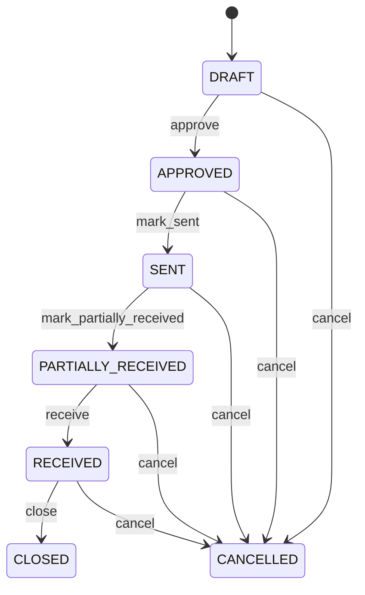

# Purchase Order

Represents the formal commercial procurement commitment between a buying organization and a Supplier. PurchaseOrder establishes what the Supplier is expected to provide; it is not proof that goods arrived or that later returns occurred. Purchasing, supplier management, receiving, warehouse operations, accounts payable, budgeting, inventory planning and analytics. PurchaseRequisition represents internal demand. PurchaseOrder converts approved demand into an external commitment. PurchaseOrderLine specifies the commitment. GoodsReceipt records actual receipt and acceptance. InventoryMovement records stock effects. SupplierReturn reverses eligible fulfillment. Invoice records the supplier claim. SupplierCreditNote records authorized financial reduction. Payment settles claims. Draft, approval, issuance, receipt, return, cancellation and closure are distinct stages. Financial settlement can continue after physical fulfillment or return. PurchaseOrder → GoodsReceipt → acceptance → InventoryMovement; when goods must be returned, eligible receipt → SupplierReturn → InventoryMovement reversal → SupplierCreditNote → payable reconciliation. A depot orders 100 parts, receives 96 and accepts 94. Later, three accepted parts are returned as defective. The original order and receipt remain unchanged; SupplierReturn and its inventory/credit workflows record the reversal.

## Finding records

Open **Purchase Order** from the menu or from its card on the dashboard.

The list shows Order Number, Order Date, Status, Currency, Requested Delivery Date, Total Amount, Supplier, with the most recently changed record first. The **Help** button beside the title opens this window's help text.

- **Search**: type in the search box above the grid to narrow the rows. **Search** at the top left opens advanced search, where you pick a field, a comparison (equals, contains, starts with, before, after, and so on) and a value.
- **Sort**: click a column heading; click again to reverse.
- **Refresh**: the refresh button at the top right re-reads the rows and every dropdown, so a record created a moment ago by someone else appears.
- **Export**: **CSV** downloads the rows you are looking at.
- **Open a record**: click a row. The line under the title, "Showing 1 to n of N entries", tells you how many rows match.

## Creating a record

Choose **New** at the top of the list. The form opens on its own page, with the fields in sections. A badge beside each label names the control (Text, Dropdown, Date, and so on); a red star marks a required field; the question-mark icon shows that field's help; and a hint such as “max 300” shows the longest entry accepted.

1. Fill in the fields described under [Fields](#fields).
2. These are required and must be completed before the record can be saved: **Order Number**, **Order Date**, **Status**, **Supplier**.
3. For a dropdown that points at another window, pick the matching record; if the record you need does not exist yet, create it in its own window first. A dropdown may narrow to what you have already chosen, for example the states of the chosen country.
4. Choose **Create** (or **Save** in the toolbar). You return to the record, and it appears at the top of the list. If something is wrong the form says which field and why, and nothing is saved.

## Reading, changing and deleting a record

Click a row to open the record. Above the fields are the arrows that step through the list ("1 of 5"). Below them sit **Notes**, where anyone may leave a comment on the record, and the **Audit Trail**, which lists every change with who made it, when, and which fields changed.

- **Edit** (toolbar) makes the fields editable. Change them and choose **Save**; **Undo Changes** puts back what you changed and **Cancel Editing** leaves edit mode.
- **Copy Record** starts a new record from this one.
- **Delete Record** is available in edit mode and asks you to confirm; a record other records still depend on cannot be deleted.

Every change is also written to the [Audit Log](/administration/#audit-log).

## Fields

| Field | What you use | Rules | What to enter |
| --- | --- | --- | --- |
| Order Number | Text | Required, Unique, Up to 100 characters | Human-facing procurement reference. Used by buyers, suppliers, receiving, accounts payable and integrations. Business reference distinct from technical purchaseOrderId. Correlates procurement activity across systems. Required for operational traceability. |
| Order Date | Date and time | Required | Date and time the procurement commitment is created or issued. Supports chronology, approval, reporting and reconciliation. Distinct from requested delivery, receipt, return, invoice and payment dates. Anchors the commitment lifecycle. Required for chronology. |
| Status | Choice | Required | Lifecycle state of the procurement commitment. Controls authorization, issuance, fulfillment, cancellation and closure. PurchaseOrder status does not prove physical receipt, supplier return or invoice settlement; those are separate facts. Being prepared. Internally authorized. Communicated to Supplier. Some committed quantity accepted while outstanding fulfillment remains. Required fulfillment accepted under policy. Remaining commitment terminated. Required operational and financial processing complete. Choose one: Draft, Approved, Sent, Partially received, Received, Cancelled, Closed. |
| Currency | Lookup | Optional | Currency qualifying order monetary values. Used for pricing, totals, invoice matching, supplier credit calculation and financial reporting. Qualifies amounts and does not identify Supplier or Product. Pick a record from **Currency**. |
| Requested Delivery Date | Date | Optional | Buyer's requested delivery or completion date. Used for supplier communication and fulfillment planning. A request, not proof of actual receipt or return. Supports delivery planning. |
| Total Amount | Amount | Optional | Order-level value derived from committed lines and commercial adjustments. Used for approval, budget, supplier commitment and invoice reconciliation. Must reconcile with PurchaseOrderLine values and currencyId. |
| Supplier | Lookup | Required | Supplier receiving the procurement commitment. Drives sourcing, delivery, receiving, supplier performance, returns and accounts payable. GoodsReceipt and SupplierReturn supplier should normally match this supplier. Pick a record from **Supplier**. |
| Request For Quotation | Lookup | Optional | Sourcing solicitation from which this order was awarded when applicable. Preserves demand-to-source-to-order traceability. Procurement compliance, price validation, and audit. Optional for direct or non-RFQ procurement. Supplies sourcing context without replacing order approval. Pick a record from **Request For Quotation**. |
| Supplier Quotation | Lookup | Optional | Accepted supplier offer forming the commercial basis of this order when applicable. Preserves awarded price and term provenance. Order verification, three-way sourcing audit, and supplier analysis. Optional where procurement does not use supplier quotations. Provides offer evidence while PurchaseOrder remains the external commitment. Pick a record from **Supplier Quotation**. |
| Organization | Lookup | Optional | Buying organization responsible for the commitment. Supports authorization, legal entity, budget, tax and reporting. Pick a record from **Organization**. |
| Delivery Location | Lookup | Optional | Intended operational destination for ordered goods or services. Used for receiving and logistics planning. Pick a record from **Location**. |
| Supplier Performance Assessment | Lookup | Optional | The SupplierPerformanceAssessment this PurchaseOrder belongs to. Pick a record from **Supplier Performance Assessment**. |

## How it connects to other records
- A purchase order belongs to one **Supplier**.
- A purchase order belongs to one **Request For Quotation**.
- A purchase order belongs to one **Supplier Quotation**.
- A purchase order belongs to one **Organization**.
- A purchase order has many **Purchase Order** records.
- A purchase order belongs to one **Location**.
- A purchase order has many **Goods Receipt** records.
- A purchase order has many **Invoice** records.
- A purchase order has many **Supplier Return** records.
- A purchase order has many **Supplier Claim** records.
- A purchase order belongs to one **Supplier Performance Assessment**.

## Lifecycle: Purchase order lifecycle

A purchase order record starts as **Draft** and ends as **Closed** or **Cancelled**. Open a record and the bar above its fields shows its current **State** and, after **Next**, a button for each move that leaves it; choose one to make the move. Any move the diagram does not draw is refused, for everyone including the administrator.

| From | To | Move |
| --- | --- | --- |
| Draft | Approved | Approve |
| Approved | Sent | Mark sent |
| Sent | Partially received | Mark partially received |
| Partially received | Received | Receive |
| Received | Closed | Close |
| Draft | Cancelled | Cancel |
| Approved | Cancelled | Cancel |
| Sent | Cancelled | Cancel |
| Partially received | Cancelled | Cancel |
| Received | Cancelled | Cancel |

## What happens when you save
Business rules run around the save. They are listed here and explained in full under [Business rules](/administration/rules/).

| Rule | When | Order |
| --- | --- | --- |
| Purchase order invariants before create | before a purchase order is created | 100 |
| Purchase order invariants before update | before a purchase order is changed | 100 |
| Purchase order workflows after update | after a purchase order is changed | 100 |

Processes started from this record: [Purchase order follow up required](/administration/processes/#purchase-order-follow-up-required).

## Who may use it

Anyone who holds a role with access to the **Purchase Order** window. Access is granted by role under [Roles and access](/administration/access/).
