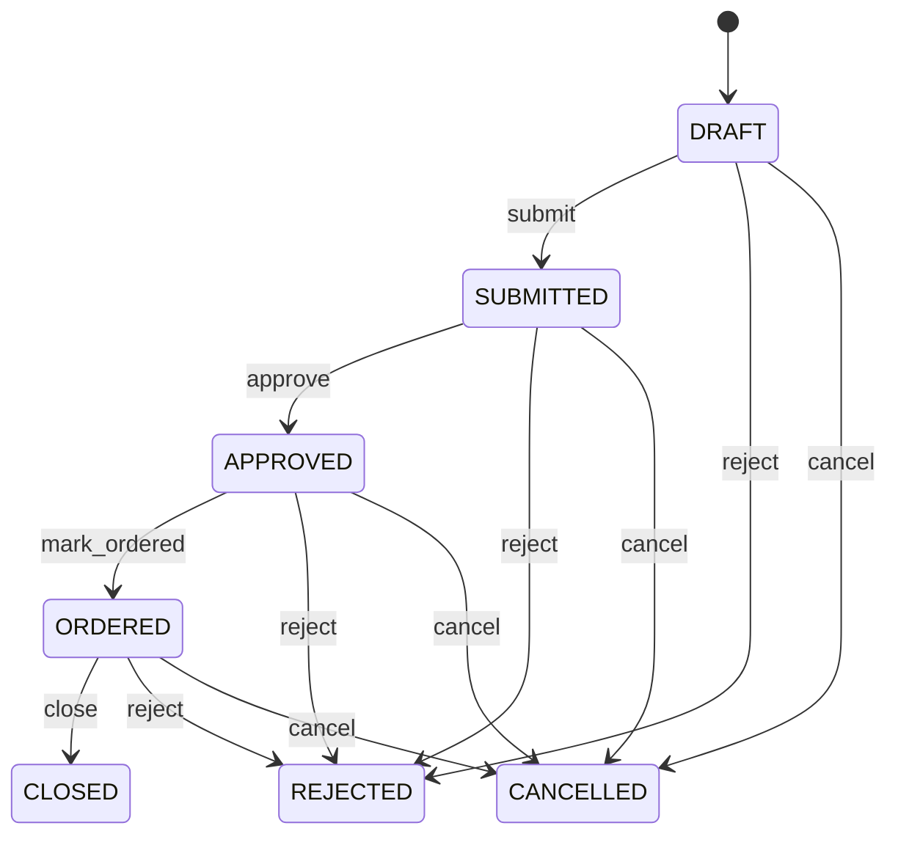

# Purchase Requisition

Represents internal demand for goods or services before that demand becomes an external procurement commitment. PurchaseRequisition is the demand and authorization layer of procurement. It answers what the organization needs, why it is needed, who requested it, and whether the organization authorized procurement. PurchaseOrder answers what was actually committed to a Supplier. Used by employees, managers, budget owners, procurement teams, sourcing functions, inventory planners, maintenance organizations, and approval workflows. PurchaseRequisition connects requester, organization, requested lines, and optional preferred supplier. Once approved, procurement may source the demand and create a PurchaseOrder. The resulting order establishes supplier commitments; receipts and InventoryMovement record physical fulfillment; invoices and payments handle financial settlement. Demand starts as DRAFT, is SUBMITTED for review, may be APPROVED or REJECTED, and becomes ORDERED when an authorized procurement commitment satisfies it. CLOSED indicates completion of the requisition process; CANCELLED terminates the demand without creating further obligations. A depot maintenance team discovers that 200 replacement components are required for upcoming repairs. A technician creates a PurchaseRequisition with the required Product lines and quantities, provides a justification, and submits it. After approval, procurement sources the items and creates a PurchaseOrder for the selected Supplier. The requisition remains the evidence of internal demand while the purchase order becomes the external commercial commitment.

## Finding records

Open **Purchase Requisition** from the menu or from its card on the dashboard.

The list shows Requisition Number, Requisition Date, Status, Justification, Requester, Organization, Supplier, with the most recently changed record first. The **Help** button beside the title opens this window's help text.

- **Search**: type in the search box above the grid to narrow the rows. **Search** at the top left opens advanced search, where you pick a field, a comparison (equals, contains, starts with, before, after, and so on) and a value.
- **Sort**: click a column heading; click again to reverse.
- **Refresh**: the refresh button at the top right re-reads the rows and every dropdown, so a record created a moment ago by someone else appears.
- **Export**: **CSV** downloads the rows you are looking at.
- **Open a record**: click a row. The line under the title, "Showing 1 to n of N entries", tells you how many rows match.

## Creating a record

Choose **New** at the top of the list. The form opens on its own page, with the fields in sections. A badge beside each label names the control (Text, Dropdown, Date, and so on); a red star marks a required field; the question-mark icon shows that field's help; and a hint such as “max 300” shows the longest entry accepted.

1. Fill in the fields described under [Fields](#fields).
2. These are required and must be completed before the record can be saved: **Requisition Number**, **Requisition Date**, **Status**, **Requester**.
3. For a dropdown that points at another window, pick the matching record; if the record you need does not exist yet, create it in its own window first. A dropdown may narrow to what you have already chosen, for example the states of the chosen country.
4. Choose **Create** (or **Save** in the toolbar). You return to the record, and it appears at the top of the list. If something is wrong the form says which field and why, and nothing is saved.

## Reading, changing and deleting a record

Click a row to open the record. Above the fields are the arrows that step through the list ("1 of 5"). Below them sit **Notes**, where anyone may leave a comment on the record, and the **Audit Trail**, which lists every change with who made it, when, and which fields changed.

- **Edit** (toolbar) makes the fields editable. Change them and choose **Save**; **Undo Changes** puts back what you changed and **Cancel Editing** leaves edit mode.
- **Copy Record** starts a new record from this one.
- **Delete Record** is available in edit mode and asks you to confirm; a record other records still depend on cannot be deleted.

Every change is also written to the [Audit Log](/administration/#audit-log).

## Fields

| Field | What you use | Rules | What to enter |
| --- | --- | --- | --- |
| Requisition Number | Text | Required, Unique, Up to 100 characters | The business-facing reference used by employees, procurement teams, approvers, and reports to identify the request. Used in approval forms, sourcing communication, procurement reports, and links between internal demand and downstream purchase orders. It identifies the internal request, not the supplier's response or the eventual PurchaseOrder number. Required for operational and approval traceability. |
| Requisition Date | Date | Required | The date on which the internal procurement demand was formally created. Used for demand aging, approval turnaround, budgeting, sourcing analysis, and procurement planning. It represents internal demand creation and is distinct from PurchaseOrder.orderDate, supplier confirmation, and actual receipt. Required so procurement demand has a defined point in time. |
| Status | Choice | Required | Controls the lifecycle of the internal procurement request and whether it may progress toward sourcing or ordering. Drives approval workflow, buyer action, sourcing eligibility, conversion to PurchaseOrder, reporting, and cancellation rules. Requisition status describes internal demand authorization; PurchaseOrder status describes an external procurement commitment. Approval of a requisition does not itself mean a supplier has been ordered. The requester is preparing the demand and may still change it. The request has been submitted for review and approval. The organization has authorized the requested procurement demand, subject to sourcing and purchasing policy. The requested procurement demand was not approved. The approved demand has been converted into or otherwise satisfied by a PurchaseOrder or equivalent procurement commitment. The requisition lifecycle is complete and no further procurement action is required. The request has been intentionally withdrawn before completion. Required because procurement workflows need an authoritative demand state. Choose one: Draft, Submitted, Approved, Rejected, Ordered, Closed, Cancelled. |
| Justification | Text | Up to 2000 characters | The business reason explaining why the requested goods or services are needed. Used by approvers to evaluate necessity, budget owners to validate spend, and procurement teams to understand sourcing context. Justification explains the reason for demand; it does not replace line-level product, quantity, delivery, or commercial information. Optional when organizational policy does not require a written justification for the particular request. |
| Requester | Lookup | Required | Identifies the person or party that originated the procurement demand. Used for approval routing, clarification, accountability, notifications, and audit. Exactly one requester is responsible for originating the requisition. Requester is the demand originator and is not necessarily the buyer, approver, supplier, or eventual receiver. Pick a record from **Party**. |
| Organization | Lookup | Optional | Identifies the organizational context responsible for the procurement demand. Used for budget ownership, approval routing, purchasing policy, cost attribution, and reporting. Zero or one organization may be explicit when inherited from the requester or surrounding procurement context. The organization is the internal demand context and is distinct from the Supplier that may eventually fulfill the request. Pick a record from **Organization**. |
| Supplier | Lookup | Optional | Identifies a preferred or known Supplier when the requester or procurement process already has a supplier in mind. Used for preferred-supplier sourcing, direct procurement, catalog requests, and buyer guidance. Optional because supplier selection may occur only after the requisition is approved and sourced competitively. A supplier on a requisition is a sourcing preference or known fulfillment candidate; it does not establish a PurchaseOrder commitment. Pick a record from **Supplier**. |

## How it connects to other records
- A purchase requisition belongs to one **Party**.
- A purchase requisition belongs to one **Organization**.
- A purchase requisition has many **Purchase Requisition** records.
- A purchase requisition belongs to one **Supplier**.
- A purchase requisition is linked to many **Request For Quotation** records.

## Lifecycle: Purchase requisition lifecycle

A purchase requisition record starts as **Draft** and ends as **Closed** or **Rejected** or **Cancelled**. Open a record and the bar above its fields shows its current **State** and, after **Next**, a button for each move that leaves it; choose one to make the move. Any move the diagram does not draw is refused, for everyone including the administrator.

| From | To | Move |
| --- | --- | --- |
| Draft | Submitted | Submit |
| Submitted | Approved | Approve |
| Approved | Ordered | Mark ordered |
| Ordered | Closed | Close |
| Draft | Rejected | Reject |
| Submitted | Rejected | Reject |
| Approved | Rejected | Reject |
| Ordered | Rejected | Reject |
| Draft | Cancelled | Cancel |
| Submitted | Cancelled | Cancel |
| Approved | Cancelled | Cancel |
| Ordered | Cancelled | Cancel |

## What happens when you save
Business rules run around the save. They are listed here and explained in full under [Business rules](/administration/rules/).

| Rule | When | Order |
| --- | --- | --- |
| Purchase requisition workflows after update | after a purchase requisition is changed | 100 |

Processes started from this record: [Purchase requisition approval requested](/administration/processes/#purchase-requisition-approval-requested), [Purchase requisition follow up required](/administration/processes/#purchase-requisition-follow-up-required).

## Who may use it

Anyone who holds a role with access to the **Purchase Requisition** window. Access is granted by role under [Roles and access](/administration/access/).
