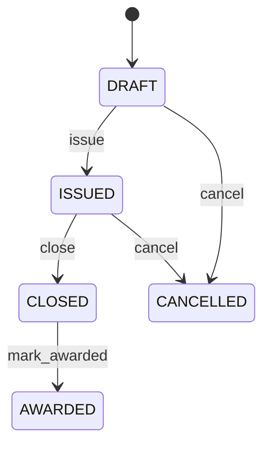

# Request For Quotation

Governs solicitation of supplier offers for approved procurement demand. PurchaseRequisition authorizes internal demand; RequestForQuotation solicits offers; SupplierQuotation records offers; PurchaseOrder creates the external commitment. Strategic sourcing, competitive procurement, supplier selection, negotiation, compliance, and audit. Bridges requisitions and suppliers to comparable responses and resulting purchase orders. Draft → issued → closed/awarded, with cancellation. Demand or supplier eligibility changes revalidate open sourcing; awarded history remains auditable and downstream orders require controlled amendment.

## Finding records

Open **Request For Quotation** from the menu or from its card on the dashboard.

The list shows Rfq Number, Issued At, Response Due At, Status, with the most recently changed record first. The **Help** button beside the title opens this window's help text.

- **Search**: type in the search box above the grid to narrow the rows. **Search** at the top left opens advanced search, where you pick a field, a comparison (equals, contains, starts with, before, after, and so on) and a value.
- **Sort**: click a column heading; click again to reverse.
- **Refresh**: the refresh button at the top right re-reads the rows and every dropdown, so a record created a moment ago by someone else appears.
- **Export**: **CSV** downloads the rows you are looking at.
- **Open a record**: click a row. The line under the title, "Showing 1 to n of N entries", tells you how many rows match.

## Creating a record

Choose **New** at the top of the list. The form opens on its own page, with the fields in sections. A badge beside each label names the control (Text, Dropdown, Date, and so on); a red star marks a required field; the question-mark icon shows that field's help; and a hint such as “max 300” shows the longest entry accepted.

1. Fill in the fields described under [Fields](#fields).
2. These are required and must be completed before the record can be saved: **Rfq Number**, **Status**.
3. For a dropdown that points at another window, pick the matching record; if the record you need does not exist yet, create it in its own window first. A dropdown may narrow to what you have already chosen, for example the states of the chosen country.
4. Choose **Create** (or **Save** in the toolbar). You return to the record, and it appears at the top of the list. If something is wrong the form says which field and why, and nothing is saved.

## Reading, changing and deleting a record

Click a row to open the record. Above the fields are the arrows that step through the list ("1 of 5"). Below them sit **Notes**, where anyone may leave a comment on the record, and the **Audit Trail**, which lists every change with who made it, when, and which fields changed.

- **Edit** (toolbar) makes the fields editable. Change them and choose **Save**; **Undo Changes** puts back what you changed and **Cancel Editing** leaves edit mode.
- **Copy Record** starts a new record from this one.
- **Delete Record** is available in edit mode and asks you to confirm; a record other records still depend on cannot be deleted.

Every change is also written to the [Audit Log](/administration/#audit-log).

## Fields

| Field | What you use | Rules | What to enter |
| --- | --- | --- | --- |
| Rfq Number | Text | Required, Unique, Up to 100 characters | Business-facing RFQ reference. Identifies the solicitation to buyers and suppliers. Supplier communication, comparison, reports, and audit. Distinct from requisition and purchase-order numbers. Correlates supplier responses. Required. |
| Issued At | Date and time | Optional | Time the RFQ was formally issued. Establishes when suppliers were invited to respond. Sourcing chronology and response-window control. Distinct from demand approval and award time. Optional while draft. |
| Response Due At | Date and time | Optional | Deadline for supplier responses. Defines the normal competitive response window. Supplier communication, late-response policy, and sourcing SLA. Does not itself award business. Optional when sourcing policy has no fixed deadline. |
| Status | Choice | Required | Lifecycle state of the RFQ. Controls solicitation, response, closure, and award behavior. Sourcing workflow and governance. Award does not itself create a supplier commitment; PurchaseOrder does. Being prepared. Open to invited supplier responses. Response collection ended without final award state. One or more responses were selected for downstream commitment. Sourcing request terminated. Required. Choose one: Draft, Issued, Closed, Awarded, Cancelled. |

## How it connects to other records
- A request for quotation is linked to many **Supplier** records.
- A request for quotation is linked to many **Purchase Requisition** records.
- A request for quotation has many **Request For Quotation** records.
- A request for quotation has many **Supplier Quotation** records.
- A request for quotation has many **Purchase Order** records.

## Lifecycle: Request for quotation lifecycle

A request for quotation record starts as **Draft** and ends as **Awarded** or **Cancelled**. Open a record and the bar above its fields shows its current **State** and, after **Next**, a button for each move that leaves it; choose one to make the move. Any move the diagram does not draw is refused, for everyone including the administrator.

| From | To | Move |
| --- | --- | --- |
| Draft | Issued | Issue |
| Issued | Closed | Close |
| Closed | Awarded | Mark awarded |
| Draft | Cancelled | Cancel |
| Issued | Cancelled | Cancel |

## What happens when you save
Business rules run around the save. They are listed here and explained in full under [Business rules](/administration/rules/).

| Rule | When | Order |
| --- | --- | --- |
| Request for quotation workflows after update | after a request for quotation is changed | 100 |

Processes started from this record: [Request for quotation follow up required](/administration/processes/#request-for-quotation-follow-up-required).

## Who may use it

Anyone who holds a role with access to the **Request For Quotation** window. Access is granted by role under [Roles and access](/administration/access/).
