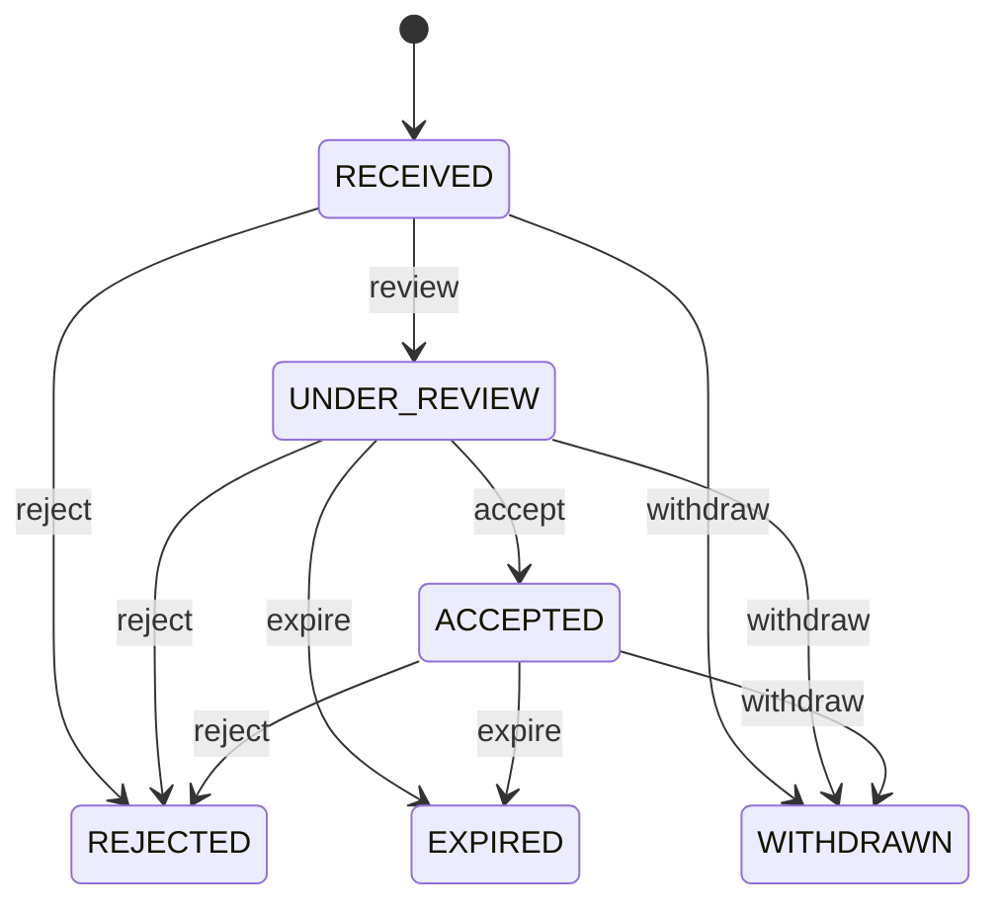

# Supplier Quotation

Preserves a supplier's commercial response to governed sourcing. SupplierQuotation is evidence of an offer; RequestForQuotation is the solicitation; PurchaseOrder is the later commitment. Sourcing, bid comparison, negotiation, supplier selection, procurement compliance, and audit. Connects Supplier and RFQ to resulting PurchaseOrders without conflating offer and commitment. Received → under review → accepted/rejected/expired/withdrawn. Supplier qualification, RFQ changes, and validity changes revalidate open evaluation; accepted historical offers remain immutable evidence.

## Finding records

Open **Supplier Quotation** from the menu or from its card on the dashboard.

The list shows Quotation Number, Submitted At, Valid Until, Total Amount, Status, Supplier, Request For Quotation, with the most recently changed record first. The **Help** button beside the title opens this window's help text.

- **Search**: type in the search box above the grid to narrow the rows. **Search** at the top left opens advanced search, where you pick a field, a comparison (equals, contains, starts with, before, after, and so on) and a value.
- **Sort**: click a column heading; click again to reverse.
- **Refresh**: the refresh button at the top right re-reads the rows and every dropdown, so a record created a moment ago by someone else appears.
- **Export**: **CSV** downloads the rows you are looking at.
- **Open a record**: click a row. The line under the title, "Showing 1 to n of N entries", tells you how many rows match.

## Creating a record

Choose **New** at the top of the list. The form opens on its own page, with the fields in sections. A badge beside each label names the control (Text, Dropdown, Date, and so on); a red star marks a required field; the question-mark icon shows that field's help; and a hint such as “max 300” shows the longest entry accepted.

1. Fill in the fields described under [Fields](#fields).
2. These are required and must be completed before the record can be saved: **Quotation Number**, **Submitted At**, **Status**, **Supplier**, **Request For Quotation**.
3. For a dropdown that points at another window, pick the matching record; if the record you need does not exist yet, create it in its own window first. A dropdown may narrow to what you have already chosen, for example the states of the chosen country.
4. Choose **Create** (or **Save** in the toolbar). You return to the record, and it appears at the top of the list. If something is wrong the form says which field and why, and nothing is saved.

## Reading, changing and deleting a record

Click a row to open the record. Above the fields are the arrows that step through the list ("1 of 5"). Below them sit **Notes**, where anyone may leave a comment on the record, and the **Audit Trail**, which lists every change with who made it, when, and which fields changed.

- **Edit** (toolbar) makes the fields editable. Change them and choose **Save**; **Undo Changes** puts back what you changed and **Cancel Editing** leaves edit mode.
- **Copy Record** starts a new record from this one.
- **Delete Record** is available in edit mode and asks you to confirm; a record other records still depend on cannot be deleted.

Every change is also written to the [Audit Log](/administration/#audit-log).

## Fields

| Field | What you use | Rules | What to enter |
| --- | --- | --- | --- |
| Quotation Number | Text | Required, Up to 120 characters | Supplier or sourcing reference for the offer. Human-facing identifier of the commercial response. Communication, comparison, order conversion, and audit. Scoped with supplier where supplier numbering is not globally unique. Required. |
| Submitted At | Date and time | Required | Time the supplier response was received or submitted. Establishes offer chronology and deadline compliance. Sourcing governance and audit. Distinct from RFQ issue and purchase-order dates. Required. |
| Valid Until | Date | Optional | Last date on which the commercial offer remains valid. Defines the supplier's price/terms validity window. Award eligibility and purchase-order conversion. Expiry does not rewrite historical offer evidence. Optional if no explicit expiry applies. |
| Total Amount | Amount | Optional | Total offered commercial amount. Summarizes the supplier offer for comparison. Sourcing analysis, approvals, and order conversion. Must reconcile with detailed offer basis when line detail is modeled. Optional while offer pricing is incomplete. |
| Status | Choice | Required | Evaluation state of the supplier offer. Controls whether the response is pending, selected, rejected, expired, or withdrawn. Comparison and award workflow. ACCEPTED authorizes downstream conversion but PurchaseOrder remains the commitment. Offer captured. Being evaluated. Selected through governed award. Not selected. Validity elapsed. Supplier withdrew the offer. Required. Choose one: Received, Under review, Accepted, Rejected, Expired, Withdrawn. |
| Supplier | Lookup | Required | Supplier making the offer. Identifies the commercial counterparty candidate. Qualification, comparison, award, and performance analysis. Exactly one supplier owns the response. Must be eligible under sourcing policy. Pick a record from **Supplier**. |
| Request For Quotation | Lookup | Required | RFQ answered by this offer. Supplies the governed solicitation and demand context. Comparison and audit. Every sourcing response belongs to exactly one RFQ. Defines requirements and eligible sourcing context. Pick a record from **Request For Quotation**. |

## How it connects to other records
- A supplier quotation belongs to one **Supplier**.
- A supplier quotation belongs to one **Request For Quotation**.
- A supplier quotation has many **Supplier Quotation** records.
- A supplier quotation has many **Purchase Order** records.

## Lifecycle: Supplier quotation lifecycle

A supplier quotation record starts as **Received** and ends as **Rejected** or **Expired** or **Withdrawn**. Open a record and the bar above its fields shows its current **State** and, after **Next**, a button for each move that leaves it; choose one to make the move. Any move the diagram does not draw is refused, for everyone including the administrator.

| From | To | Move |
| --- | --- | --- |
| Received | Under review | Review |
| Under review | Accepted | Accept |
| Received | Rejected | Reject |
| Under review | Rejected | Reject |
| Accepted | Rejected | Reject |
| Under review | Expired | Expire |
| Accepted | Expired | Expire |
| Received | Withdrawn | Withdraw |
| Under review | Withdrawn | Withdraw |
| Accepted | Withdrawn | Withdraw |

## What happens when you save
Business rules run around the save. They are listed here and explained in full under [Business rules](/administration/rules/).

| Rule | When | Order |
| --- | --- | --- |
| Supplier quotation invariants before create | before a supplier quotation is created | 100 |
| Supplier quotation invariants before update | before a supplier quotation is changed | 100 |
| Supplier quotation workflows after update | after a supplier quotation is changed | 100 |

Processes started from this record: [Supplier quotation approval requested](/administration/processes/#supplier-quotation-approval-requested), [Supplier quotation follow up required](/administration/processes/#supplier-quotation-follow-up-required).

## Who may use it

Anyone who holds a role with access to the **Supplier Quotation** window. Access is granted by role under [Roles and access](/administration/access/).
