# Record lifecycles

A lifecycle is the set of states a record can be in and the moves between them. The application enforces it on every write, through the screen and through the API: a move the diagram does not draw is refused for everyone, administrators included. Role restrictions narrow who may make a particular move. This application has **16** lifecycles.

## Party: Party lifecycle

States: **Active**, **Inactive**, **Blocked**, **Retired**. A new record starts as **Active**; **Retired** ends the lifecycle.

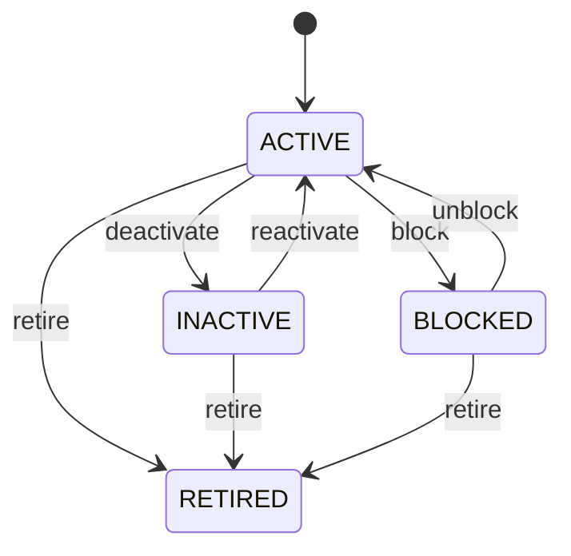

Any role that may change the record may make any move the diagram draws.

See [Party](/entities/foundation/party/) for the record itself.

## Organization: Organization lifecycle

States: **Draft**, **Active**, **Inactive**, **Retired**. A new record starts as **Draft**; **Retired** ends the lifecycle.

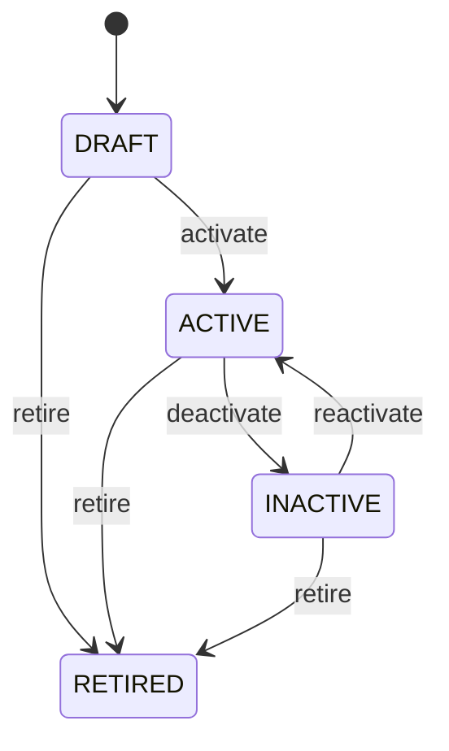

Any role that may change the record may make any move the diagram draws.

See [Organization](/entities/foundation/organization/) for the record itself.

## Party Role: Party role lifecycle

States: **Active**, **Inactive**, **Expired**. A new record starts as **Active**; **Expired** ends the lifecycle.

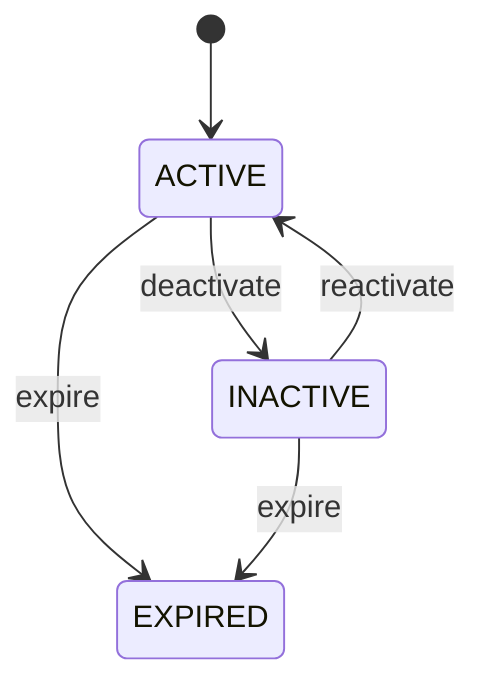

Any role that may change the record may make any move the diagram draws.

See [Party Role](/entities/foundation/party-role/) for the record itself.

## Address: Address lifecycle

States: **Active**, **Inactive**, **Retired**. A new record starts as **Active**; **Retired** ends the lifecycle.

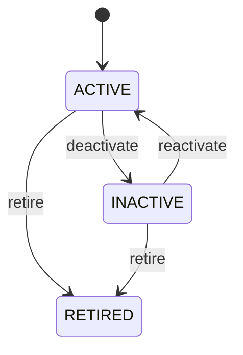

Any role that may change the record may make any move the diagram draws.

See [Address](/entities/foundation/address/) for the record itself.

## Location: Location lifecycle

States: **Planned**, **Active**, **Inactive**, **Closed**, **Retired**. A new record starts as **Planned**; **Closed**, **Retired** ends the lifecycle.

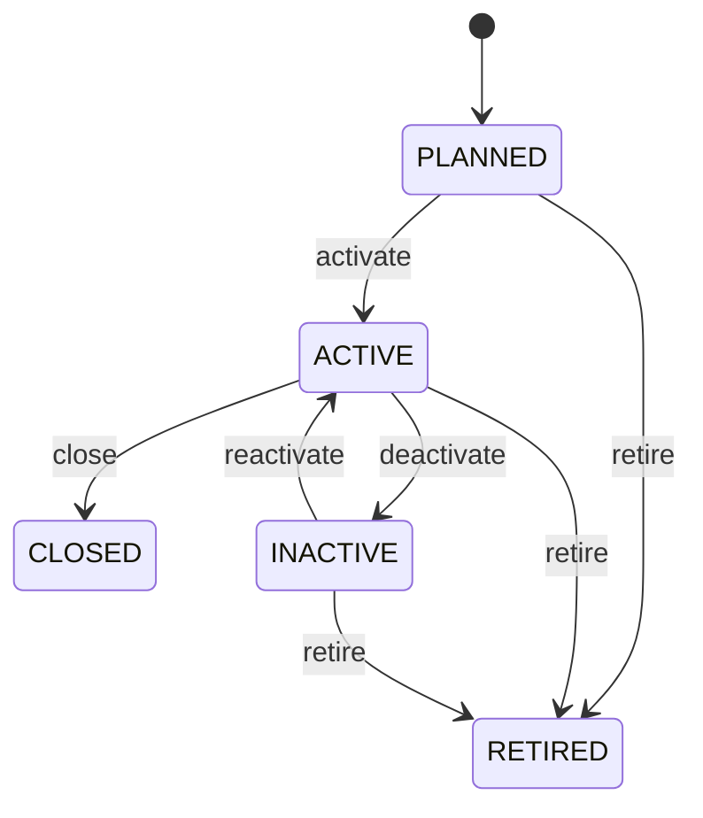

Any role that may change the record may make any move the diagram draws.

See [Location](/entities/foundation/location/) for the record itself.

## Currency: Currency lifecycle

States: **Active**, **Inactive**, **Retired**. A new record starts as **Active**; **Retired** ends the lifecycle.

Any role that may change the record may make any move the diagram draws.

See [Currency](/entities/foundation/currency/) for the record itself.

## Exchange Rate: Exchange rate lifecycle

States: **Draft**, **Active**, **Expired**, **Cancelled**. A new record starts as **Draft**; **Expired**, **Cancelled** ends the lifecycle.

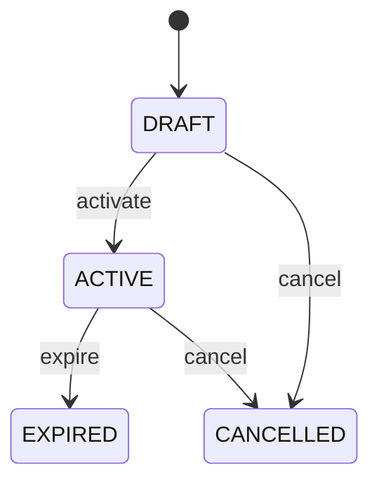

Any role that may change the record may make any move the diagram draws.

See [Exchange Rate](/entities/foundation/exchange-rate/) for the record itself.

## Unit Of Measure: Unit of measure lifecycle

States: **Active**, **Inactive**, **Retired**. A new record starts as **Active**; **Retired** ends the lifecycle.

Any role that may change the record may make any move the diagram draws.

See [Unit Of Measure](/entities/foundation/unit-of-measure/) for the record itself.

## Task: Task lifecycle

States: **Created**, **Ready**, **Assigned**, **In progress**, **Blocked**, **Completed**, **Cancelled**, **Failed**. A new record starts as **Created**; **Completed**, **Cancelled**, **Failed** ends the lifecycle.

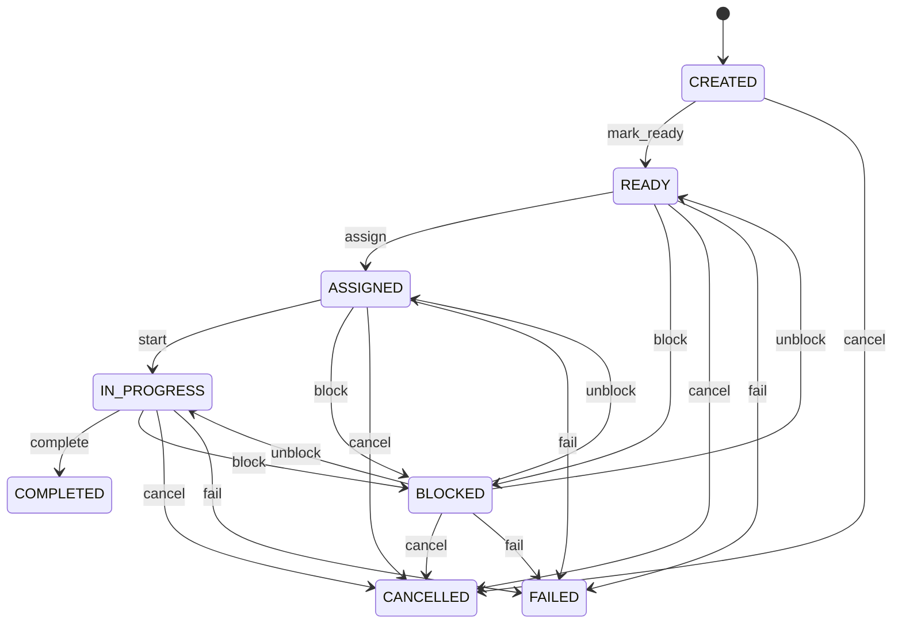

Any role that may change the record may make any move the diagram draws.

See [Task](/entities/foundation/task/) for the record itself.

## Project: Project lifecycle

States: **Draft**, **Planned**, **Active**, **On hold**, **Completed**, **Cancelled**, **Closed**. A new record starts as **Draft**; **Closed**, **Cancelled** ends the lifecycle.

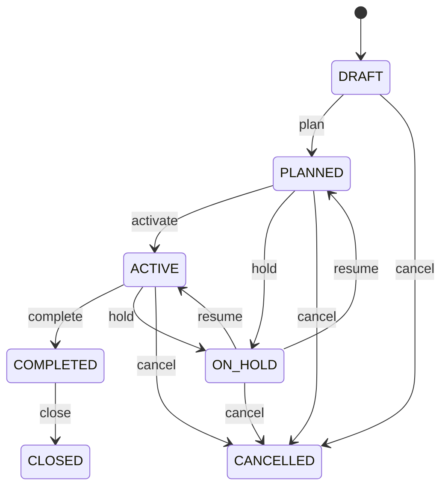

Any role that may change the record may make any move the diagram draws.

See [Project](/entities/project-management/project/) for the record itself.

## Project: Project phase lifecycle

States: **Planned**, **Active**, **Completed**, **Cancelled**. A new record starts as **Planned**; **Completed**, **Cancelled** ends the lifecycle.

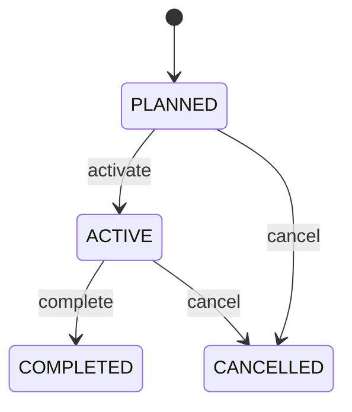

Any role that may change the record may make any move the diagram draws.

See [Project](/entities/foundation/project-phase/) for the record itself.

## Project: Project task lifecycle

States: **Not started**, **In progress**, **Blocked**, **Completed**, **Cancelled**. A new record starts as **Not started**; **Completed**, **Cancelled** ends the lifecycle.

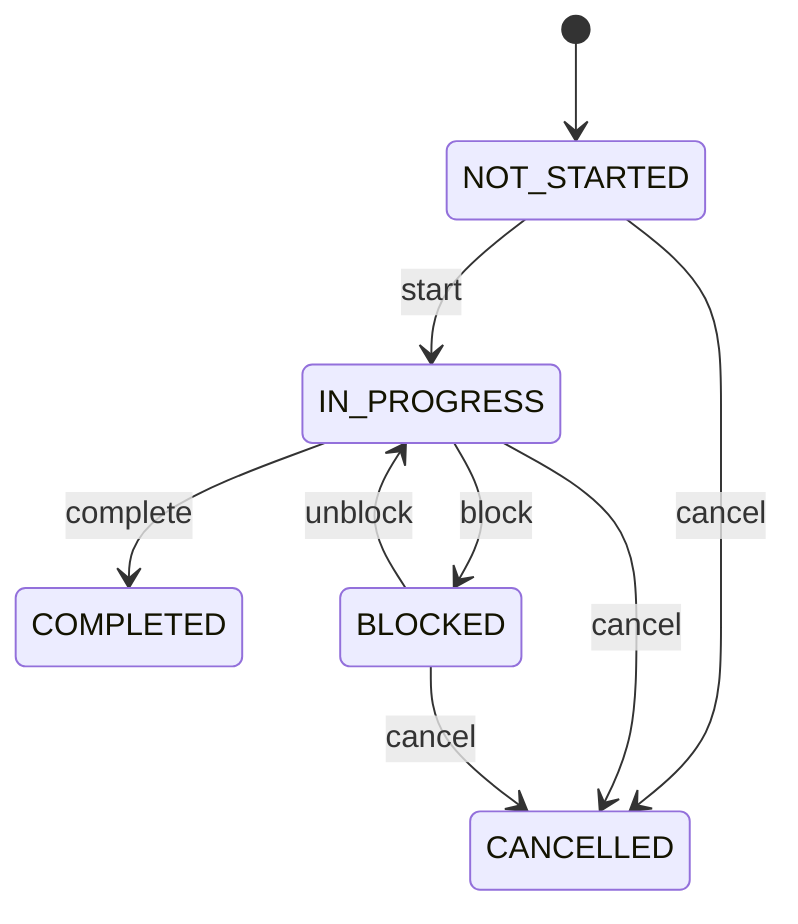

Any role that may change the record may make any move the diagram draws.

See [Project](/entities/foundation/project-task/) for the record itself.

## Project: Milestone lifecycle

States: **Planned**, **At risk**, **Achieved**, **Missed**, **Cancelled**. A new record starts as **Planned**; **Cancelled** ends the lifecycle.

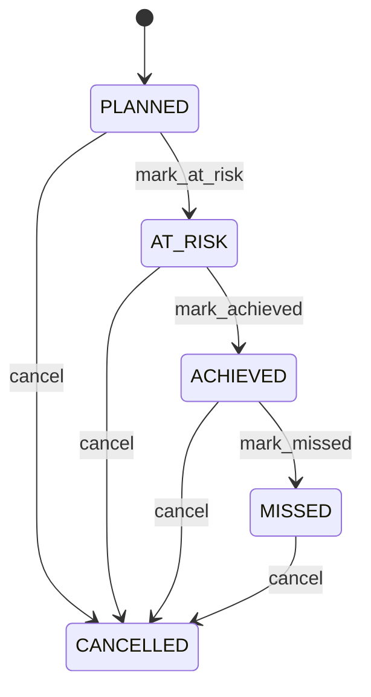

Any role that may change the record may make any move the diagram draws.

See [Project](/entities/foundation/milestone/) for the record itself.

## Project: Resource assignment lifecycle

States: **Draft**, **Active**, **Completed**, **Cancelled**. A new record starts as **Draft**; **Completed**, **Cancelled** ends the lifecycle.

Any role that may change the record may make any move the diagram draws.

See [Project](/entities/foundation/resource-assignment/) for the record itself.

## Timesheet: Timesheet lifecycle

States: **Draft**, **Active**, **Completed**, **Cancelled**. A new record starts as **Draft**; **Completed**, **Cancelled** ends the lifecycle.

Any role that may change the record may make any move the diagram draws.

See [Timesheet](/entities/project-management/timesheet/) for the record itself.

## Professional Engagement: Professional engagement lifecycle

States: **Proposed**, **Active**, **On hold**, **Completed**, **Cancelled**. A new record starts as **Proposed**; **Completed**, **Cancelled** ends the lifecycle.

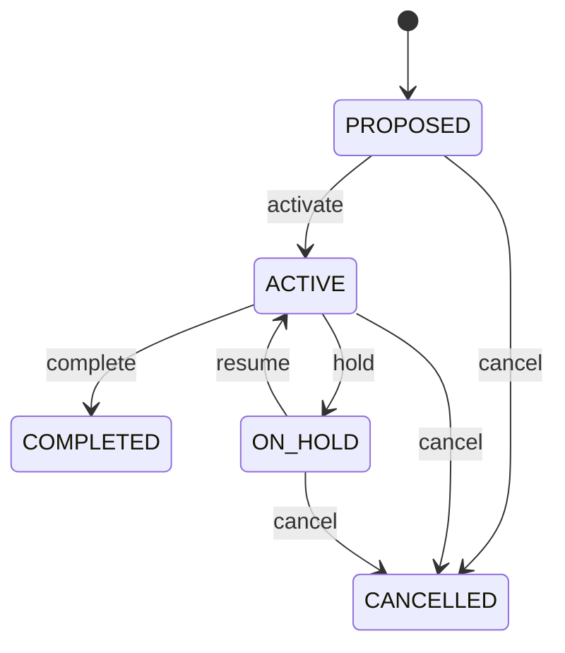

Any role that may change the record may make any move the diagram draws.

See [Professional Engagement](/entities/foundation/professional-engagement/) for the record itself.

