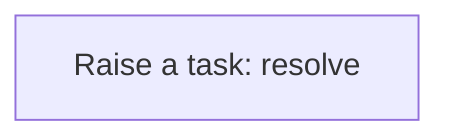
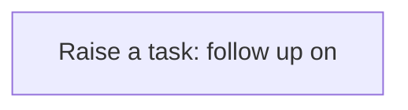
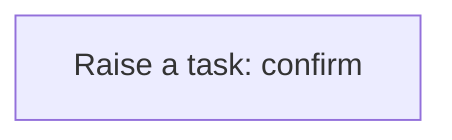
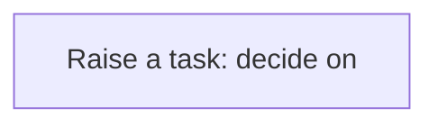

# Processes

A process is a sequence of steps the application runs for you: create a task, update a record, call a service. A business rule usually starts it; you can also run one by hand from the Workflow Designer. Every run is logged step by step in the Workflow Monitor. This application has **15** processes.

## Party exception raised {#party-exception-raised}

When a party is blocked, a high-priority task asks someone to resolve it.

Runs when a **Party** is changed, started by a business rule.

1. **Raise a task: resolve** — creates a **Task** record.

## Exchange rate follow up required {#exchange-rate-follow-up-required}

When a exchange rate is cancelled, a task asks someone to settle what depended on it.

Runs when a **Exchange Rate** is changed, started by a business rule.

1. **Raise a task: follow up on** — creates a **Task** record.

## Project exception raised {#project-exception-raised}

When a project is on hold, a high-priority task asks someone to resolve it.

Runs when a **Project** is changed, started by a business rule.

1. **Raise a task: resolve** — creates a **Task** record.

## Project follow up required {#project-follow-up-required}

When a project is cancelled, a task asks someone to settle what depended on it.

Runs when a **Project** is changed, started by a business rule.

1. **Raise a task: follow up on** — creates a **Task** record.

## Project phase follow up required {#project-phase-follow-up-required}

When a project phase is cancelled, a task asks someone to settle what depended on it.

Runs when a **Project** is changed, started by a business rule.

1. **Raise a task: follow up on** — creates a **Task** record.

## Project task exception raised {#project-task-exception-raised}

When a project task is blocked, a high-priority task asks someone to resolve it.

Runs when a **Project** is changed, started by a business rule.

1. **Raise a task: resolve** — creates a **Task** record.

## Project task follow up required {#project-task-follow-up-required}

When a project task is cancelled, a task asks someone to settle what depended on it.

Runs when a **Project** is changed, started by a business rule.

1. **Raise a task: follow up on** — creates a **Task** record.

## Milestone follow up required {#milestone-follow-up-required}

When a milestone is cancelled, a task asks someone to settle what depended on it.

Runs when a **Project** is changed, started by a business rule.

1. **Raise a task: follow up on** — creates a **Task** record.

## Resource assignment follow up required {#resource-assignment-follow-up-required}

When a resource assignment is cancelled, a task asks someone to settle what depended on it.

Runs when a **Project** is changed, started by a business rule.

1. **Raise a task: follow up on** — creates a **Task** record.

## Resource assignment completion confirmed {#resource-assignment-completion-confirmed}

When a resource assignment is completed, a task asks someone to confirm the outcome.

Runs when a **Project** is changed, started by a business rule.

1. **Raise a task: confirm** — creates a **Task** record.

## Timesheet follow up required {#timesheet-follow-up-required}

When a timesheet is cancelled, a task asks someone to settle what depended on it.

Runs when a **Timesheet** is changed, started by a business rule.

1. **Raise a task: follow up on** — creates a **Task** record.

## Timesheet completion confirmed {#timesheet-completion-confirmed}

When a timesheet is completed, a task asks someone to confirm the outcome.

Runs when a **Timesheet** is changed, started by a business rule.

1. **Raise a task: confirm** — creates a **Task** record.

## Professional engagement approval requested {#professional-engagement-approval-requested}

When a professional engagement is proposed, a task asks someone to decide on it.

Runs when a **Professional Engagement** is changed, started by a business rule.

1. **Raise a task: decide on** — creates a **Task** record.

## Professional engagement exception raised {#professional-engagement-exception-raised}

When a professional engagement is on hold, a high-priority task asks someone to resolve it.

Runs when a **Professional Engagement** is changed, started by a business rule.

1. **Raise a task: resolve** — creates a **Task** record.

## Professional engagement follow up required {#professional-engagement-follow-up-required}

When a professional engagement is cancelled, a task asks someone to settle what depended on it.

Runs when a **Professional Engagement** is changed, started by a business rule.

1. **Raise a task: follow up on** — creates a **Task** record.

