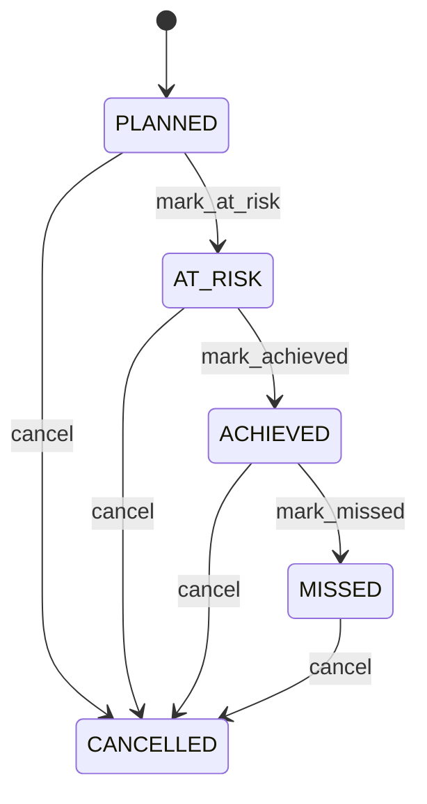

# Project

Represents a project management entity called Milestone within the CEDM business model. Milestone is a business concept with its own identity and lifecycle. It captures information that must remain understandable independently of a database, API, or user interface. Used by business processes, transactions, forms, reports, integrations, and domain capabilities that create, find, change, or relate Milestone records. The entity participates in a wider business graph through relationships with Project, ProjectTask. These relationships provide the context needed to interpret the record rather than treating its fields as isolated database columns. The entity lifecycle is governed by its status, invariants, and related business processes. State changes must preserve the declared business meaning and relationships. A typical Milestone record represents one identifiable business occurrence or master-data object that can be referenced by related CEDM processes.

## Finding records

Lines are added from the parent: open a **Project** and choose the **Project** tab.

The list shows Code, Name, Target Date, Status, Project, Project Phase, with the most recently changed record first. The **Help** button beside the title opens this window's help text.

- **Search**: type in the search box above the grid to narrow the rows. **Search** at the top left opens advanced search, where you pick a field, a comparison (equals, contains, starts with, before, after, and so on) and a value.
- **Sort**: click a column heading; click again to reverse.
- **Refresh**: the refresh button at the top right re-reads the rows and every dropdown, so a record created a moment ago by someone else appears.
- **Export**: **CSV** downloads the rows you are looking at.
- **Open a record**: click a row. The line under the title, "Showing 1 to n of N entries", tells you how many rows match.

## Adding a line

Open the parent record, choose the **Project** tab and use **New**. The line is tied to its parent automatically.

## Reading, changing and deleting a record

Click a row to open the record. Above the fields are the arrows that step through the list ("1 of 5"). Below them sit **Notes**, where anyone may leave a comment on the record, and the **Audit Trail**, which lists every change with who made it, when, and which fields changed.

- **Edit** (toolbar) makes the fields editable. Change them and choose **Save**; **Undo Changes** puts back what you changed and **Cancel Editing** leaves edit mode.
- **Copy Record** starts a new record from this one.
- **Delete Record** is available in edit mode and asks you to confirm; a record other records still depend on cannot be deleted.

Every change is also written to the [Audit Log](/administration/#audit-log).

## Fields

| Field | What you use | Rules | What to enter |
| --- | --- | --- | --- |
| Code | Text | Required, Up to 100 characters | A human-readable business code used to identify or reference the record in operational processes and integrations. Used when creating, reviewing, searching, validating, reporting on, or integrating Milestone records, where applicable. Its meaning is specific to Milestone; it must be interpreted with the entity's relationships, lifecycle, and business rules rather than as an isolated technical value. Required because the business model cannot reliably interpret the record for its declared purpose without this value. |
| Name | Text | Required, Up to 300 characters | The human-readable name used by people, reports, searches, and related business processes. Used when creating, reviewing, searching, validating, reporting on, or integrating Milestone records, where applicable. Its meaning is specific to Milestone; it must be interpreted with the entity's relationships, lifecycle, and business rules rather than as an isolated technical value. Required because the business model cannot reliably interpret the record for its declared purpose without this value. |
| Target Date | Date | Required | Records the business date associated with the target. It is used in chronology, eligibility, scheduling, reporting, and related business rules. Used when creating, reviewing, searching, validating, reporting on, or integrating Milestone records, where applicable. Its meaning is specific to Milestone; it must be interpreted with the entity's relationships, lifecycle, and business rules rather than as an isolated technical value. Required because the business model cannot reliably interpret the record for its declared purpose without this value. |
| Status | Choice | Required | The lifecycle state of the record. It controls which business actions are normally permitted and how the record is treated by related processes. Used when creating, reviewing, searching, validating, reporting on, or integrating Milestone records, where applicable. Its meaning is specific to Milestone; it must be interpreted with the entity's relationships, lifecycle, and business rules rather than as an isolated technical value. Represents the planned state or classification in the context of Milestone. Represents the at risk state or classification in the context of Milestone. Represents the achieved state or classification in the context of Milestone. Represents the missed state or classification in the context of Milestone. Represents the cancelled state or classification in the context of Milestone. Required because the business model cannot reliably interpret the record for its declared purpose without this value. Choose one: Planned, At risk, Achieved, Missed, Cancelled. |
| Project | Lookup | Required | Connects Milestone to Project so related business context can be navigated and enforced. Used when processes need to find or reason about Project records associated with a Milestone. The declared cardinality 1 expresses how many related records may participate in the relationship. The relationship is part of the CEDM semantic graph and is interpreted together with source and target entities, ownership, conditions, and invariants. Pick a record from **Project**. |
| Project Phase | Lookup | Optional | The ProjectPhase this Milestone belongs to. Pick a record from **Project**. |

## How it connects to other records

A project is a line of a **Project**. It has no window of its own: open the project and use the **Project** tab to see and add lines.
- A project belongs to one **Project**.
- A project has many **Project** records.

## Lifecycle: Milestone lifecycle

A project record starts as **Planned** and ends as **Cancelled**. Open a record and the bar above its fields shows its current **State** and, after **Next**, a button for each move that leaves it; choose one to make the move. Any move the diagram does not draw is refused, for everyone including the administrator.

| From | To | Move |
| --- | --- | --- |
| Planned | At risk | Mark at risk |
| At risk | Achieved | Mark achieved |
| Achieved | Missed | Mark missed |
| Planned | Cancelled | Cancel |
| At risk | Cancelled | Cancel |
| Achieved | Cancelled | Cancel |
| Missed | Cancelled | Cancel |

## What happens when you save
Business rules run around the save. They are listed here and explained in full under [Business rules](/administration/rules/).

| Rule | When | Order |
| --- | --- | --- |
| Milestone workflows after update | after a project is changed | 100 |

Processes started from this record: [Milestone follow up required](/administration/processes/#milestone-follow-up-required).

## Who may use it

Anyone who holds a role with access to the **Project** window. Access is granted by role under [Roles and access](/administration/access/).
