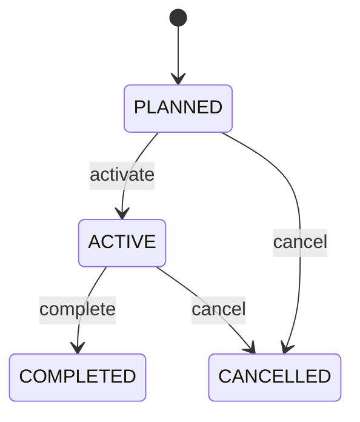

# Project

Governed project lifecycle stage. Groups project execution into manageable stages without replacing tasks or milestones. Project planning, delivery, resources and costing. Project owns context; ProjectTask and Milestone provide execution evidence.

## Finding records

Lines are added from the parent: open a **Project** and choose the **Project** tab.

The list shows Name, Status, Project, with the most recently changed record first. The **Help** button beside the title opens this window's help text.

- **Search**: type in the search box above the grid to narrow the rows. **Search** at the top left opens advanced search, where you pick a field, a comparison (equals, contains, starts with, before, after, and so on) and a value.
- **Sort**: click a column heading; click again to reverse.
- **Refresh**: the refresh button at the top right re-reads the rows and every dropdown, so a record created a moment ago by someone else appears.
- **Export**: **CSV** downloads the rows you are looking at.
- **Open a record**: click a row. The line under the title, "Showing 1 to n of N entries", tells you how many rows match.

## Adding a line

Open the parent record, choose the **Project** tab and use **New**. The line is tied to its parent automatically.

## Reading, changing and deleting a record

Click a row to open the record. Above the fields are the arrows that step through the list ("1 of 5"). Below them sit **Notes**, where anyone may leave a comment on the record, and the **Audit Trail**, which lists every change with who made it, when, and which fields changed.

- **Edit** (toolbar) makes the fields editable. Change them and choose **Save**; **Undo Changes** puts back what you changed and **Cancel Editing** leaves edit mode.
- **Copy Record** starts a new record from this one.
- **Delete Record** is available in edit mode and asks you to confirm; a record other records still depend on cannot be deleted.

Every change is also written to the [Audit Log](/administration/#audit-log).

## Fields

| Field | What you use | Rules | What to enter |
| --- | --- | --- | --- |
| Name | Text | Required, Up to 200 characters | Human-readable phase name. Communicates project stage. Plans and reports. Unique according to project policy. Required. |
| Status | Choice | Required | Phase lifecycle state. Controls phase execution. Project governance. Task/milestone state must reconcile. Not started. Executing. Closed successfully. Terminated. Required. Choose one: Planned, Active, Completed, Cancelled. |
| Project | Lookup | Required | Parent Project. Supplies overall scope/governance. Project execution. Exactly one Project. Phase cannot outlive incompatible project state. Pick a record from **Project**. |

## How it connects to other records

A project is a line of a **Project**. It has no window of its own: open the project and use the **Project** tab to see and add lines.
- A project belongs to one **Project**.
- A project has many **Project** records.

## Lifecycle: Project phase lifecycle

A project record starts as **Planned** and ends as **Completed** or **Cancelled**. Open a record and the bar above its fields shows its current **State** and, after **Next**, a button for each move that leaves it; choose one to make the move. Any move the diagram does not draw is refused, for everyone including the administrator.

| From | To | Move |
| --- | --- | --- |
| Planned | Active | Activate |
| Active | Completed | Complete |
| Planned | Cancelled | Cancel |
| Active | Cancelled | Cancel |

## What happens when you save
Business rules run around the save. They are listed here and explained in full under [Business rules](/administration/rules/).

| Rule | When | Order |
| --- | --- | --- |
| Project phase workflows after update | after a project is changed | 100 |

Processes started from this record: [Project phase follow up required](/administration/processes/#project-phase-follow-up-required).

## Who may use it

Anyone who holds a role with access to the **Project** window. Access is granted by role under [Roles and access](/administration/access/).
