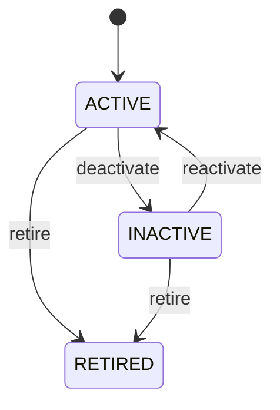

# Unit Of Measure

Defines the measurement semantics that make numeric quantities comparable across CEDM workflows. A quantity without a valid unit is incomplete business information. UnitOfMeasure provides the dimension and conversion context needed to interpret quantities correctly. Central to Product, sales, procurement, receiving, inventory, fulfillment, invoicing, manufacturing, logistics, service, and reporting. Product supplies a default measurement context. Transaction lines may use compatible units. GoodsReceiptLine supplies received/accepted quantities. InventoryBalance and InventoryMovement require consistent measurement. InvoiceLine must be comparable for matching. UOM create/update/retire → identify Products and open transaction dependencies → validate conversions → update future eligibility/configuration → revalidate affected SalesOrderLine/PurchaseOrderLine/GoodsReceiptLine/InventoryMovement/InvoiceLine workflows → preserve historical quantity meaning. A conversion change is never a silent retroactive data transformation. Units are created and activated for use, may become inactive, and may eventually be retired. Retirement prevents new normal use but never changes the meaning of historical quantities. A change to code/name/symbol affects presentation and integrations; a change to category/baseUnit/conversionFactor affects quantity semantics and requires dependency validation; a status change affects future transaction eligibility; historical transaction evidence remains immutable. A product is stocked in EACH but purchased in BOX. If one BOX equals 10 EACH, the PO records 5 BOX and inventory posts 50 EACH after conversion. If the BOX conversion changes to 12 EACH, existing PO and receipt quantities are not silently reinterpreted. Open affected transactions must be revalidated or explicitly converted, while historical receipts and invoices retain the original conversion evidence.

## Finding records

Open **Unit Of Measure** from the menu or from its card on the dashboard.

The list shows Code, Name, Symbol, Category, Conversion Factor, Base Unit, Status, with the most recently changed record first. The **Help** button beside the title opens this window's help text.

- **Search**: type in the search box above the grid to narrow the rows. **Search** at the top left opens advanced search, where you pick a field, a comparison (equals, contains, starts with, before, after, and so on) and a value.
- **Sort**: click a column heading; click again to reverse.
- **Refresh**: the refresh button at the top right re-reads the rows and every dropdown, so a record created a moment ago by someone else appears.
- **Export**: **CSV** downloads the rows you are looking at.
- **Open a record**: click a row. The line under the title, "Showing 1 to n of N entries", tells you how many rows match.

## Creating a record

Choose **New** at the top of the list. The form opens on its own page, with the fields in sections. A badge beside each label names the control (Text, Dropdown, Date, and so on); a red star marks a required field; the question-mark icon shows that field's help; and a hint such as “max 300” shows the longest entry accepted.

1. Fill in the fields described under [Fields](#fields).
2. These are required and must be completed before the record can be saved: **Code**, **Name**, **Category**, **Status**.
3. For a dropdown that points at another window, pick the matching record; if the record you need does not exist yet, create it in its own window first. A dropdown may narrow to what you have already chosen, for example the states of the chosen country.
4. Choose **Create** (or **Save** in the toolbar). You return to the record, and it appears at the top of the list. If something is wrong the form says which field and why, and nothing is saved.

## Reading, changing and deleting a record

Click a row to open the record. Above the fields are the arrows that step through the list ("1 of 5"). Below them sit **Notes**, where anyone may leave a comment on the record, and the **Audit Trail**, which lists every change with who made it, when, and which fields changed.

- **Edit** (toolbar) makes the fields editable. Change them and choose **Save**; **Undo Changes** puts back what you changed and **Cancel Editing** leaves edit mode.
- **Copy Record** starts a new record from this one.
- **Delete Record** is available in edit mode and asks you to confirm; a record other records still depend on cannot be deleted.

Every change is also written to the [Audit Log](/administration/#audit-log).

## Fields

| Field | What you use | Rules | What to enter |
| --- | --- | --- | --- |
| Code | Text | Required, Unique, Up to 30 characters | Standard business code for the unit, such as EACH, KG, L, HOUR, or DAY. Used in forms, integrations, documents, validation, and quantity display. Code identifies the unit definition; it does not represent a conversion or quantity itself. Used to resolve units during order entry, purchasing, receipt, inventory, invoicing, and reporting. Required for operational interoperability. |
| Name | Text | Required, Up to 100 characters | Human-readable name of the measurement unit. Used in user interfaces, reports, documents, catalogs, and search. Describes the unit definition identified by code and unitOfMeasureId. Provides understandable measurement context to business users. Required for clear business interpretation. |
| Symbol | Text | Up to 20 characters | Standard display symbol for the unit. Used for compact display in documents, labels, reports, and interfaces. Symbol is presentation metadata and does not replace the canonical unit code. Improves human-readable representation of quantities. Optional when the unit has no standard symbol or display policy does not require one. |
| Category | Choice | Required | Defines the dimensional family of the unit. Prevents invalid conversions and supports dimensional validation. Conversion is valid only between compatible dimensions under the applicable conversion model. Used when validating Product, SalesOrderLine, PurchaseOrderLine, GoodsReceiptLine, InvoiceLine, and InventoryMovement quantities. Required to establish dimensional compatibility. The category of the unit of measure is quantity; set it when that is what the business means for this record. The category of the unit of measure is length; set it when that is what the business means for this record. The category of the unit of measure is area; set it when that is what the business means for this record. The category of the unit of measure is volume; set it when that is what the business means for this record. The category of the unit of measure is mass; set it when that is what the business means for this record. The category of the unit of measure is time; set it when that is what the business means for this record. The category of the unit of measure is count; set it when that is what the business means for this record. The category of the unit of measure is currency; set it when that is what the business means for this record. The category of the unit of measure is other; set it when that is what the business means for this record. Choose one: Quantity, Length, Area, Volume, Mass, Time, Count, Currency, Other. |
| Conversion Factor | Amount | Optional | Default multiplicative factor relating this unit to its base unit when a simple linear conversion applies. Defines a master conversion used for future quantity interpretation. Used for quantity conversion when no context-specific conversion rule overrides the default. Interpreted with baseUnit and category; it must not be changed casually because dependent open transactions may rely on the prior interpretation. Supplies the conversion used by new and eligible future quantity transactions after dependency validation. Optional for base units or units whose conversion requires a dedicated rule. |
| Base Unit | Lookup | Optional | Identifies the canonical base unit against which this derived unit is normally converted. Supports standardized quantity storage and conversion. A derived unit belongs to the same dimensional category as its base unit. Provides the common measurement basis for reconciliation across PO, receipt, inventory, sales, and invoice quantities. Optional for a base unit itself. Pick a record from **Unit Of Measure**. |
| Status | Choice | Required | Controls whether the unit can be used for new transactions. Used by master-data validation and transaction entry. Retiring a unit must not invalidate historical quantities already recorded with that unit. New quantity-bearing transactions should use ACTIVE units unless an authorized legacy exception exists. Required for transaction eligibility. The status of the unit of measure is active; set it when that is what the business means for this record. The status of the unit of measure is inactive; set it when that is what the business means for this record. The status of the unit of measure is retired; set it when that is what the business means for this record. Choose one: Active, Inactive, Retired. |

## How it connects to other records
- A unit of measure has many **Unit Of Measure** records.

## Lifecycle: Unit of measure lifecycle

A unit of measure record starts as **Active** and ends as **Retired**. Open a record and the bar above its fields shows its current **State** and, after **Next**, a button for each move that leaves it; choose one to make the move. Any move the diagram does not draw is refused, for everyone including the administrator.

| From | To | Move |
| --- | --- | --- |
| Active | Inactive | Deactivate |
| Inactive | Active | Reactivate |
| Active | Retired | Retire |
| Inactive | Retired | Retire |

## Who may use it

Anyone who holds a role with access to the **Unit Of Measure** window. Access is granted by role under [Roles and access](/administration/access/).
