# Record lifecycles

A lifecycle is the set of states a record can be in and the moves between them. The application enforces it on every write, through the screen and through the API: a move the diagram does not draw is refused for everyone, administrators included. Role restrictions narrow who may make a particular move. This application has **21** lifecycles.


## Party: Party lifecycle

States: **Active**, **Inactive**, **Blocked**, **Retired**. A new record starts as **Active**; **Retired** ends the lifecycle.

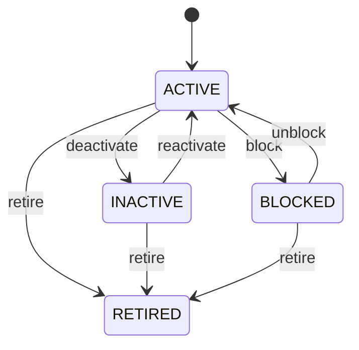

Any role that may change the record may make any move the diagram draws.


See [Party](/entities/foundation/party/) for the record itself.

## Organization: Organization lifecycle

States: **Draft**, **Active**, **Inactive**, **Retired**. A new record starts as **Draft**; **Retired** ends the lifecycle.

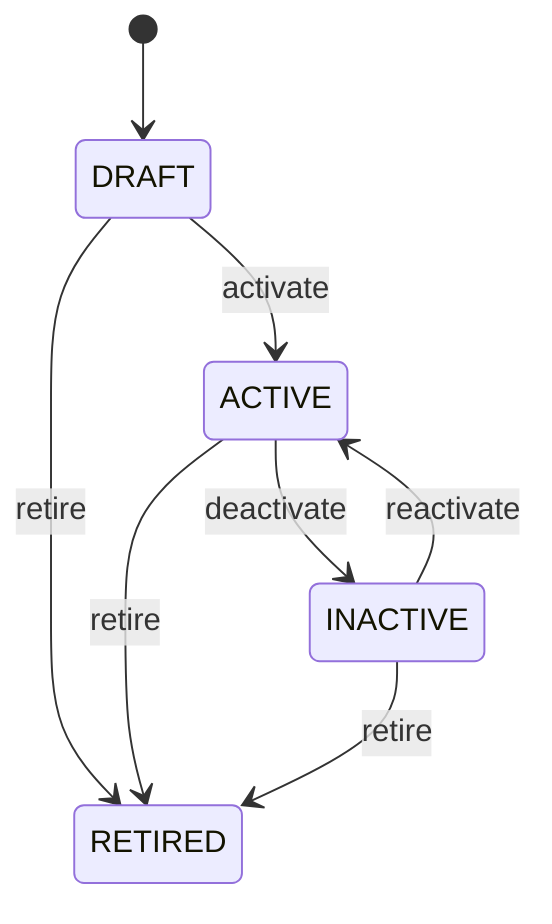

Any role that may change the record may make any move the diagram draws.


See [Organization](/entities/foundation/organization/) for the record itself.

## Party Role: Party role lifecycle

States: **Active**, **Inactive**, **Expired**. A new record starts as **Active**; **Expired** ends the lifecycle.

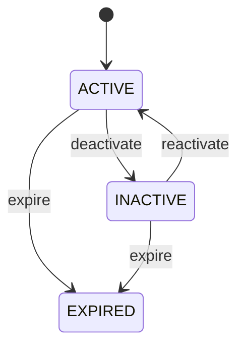

Any role that may change the record may make any move the diagram draws.


See [Party Role](/entities/foundation/party-role/) for the record itself.

## Address: Address lifecycle

States: **Active**, **Inactive**, **Retired**. A new record starts as **Active**; **Retired** ends the lifecycle.

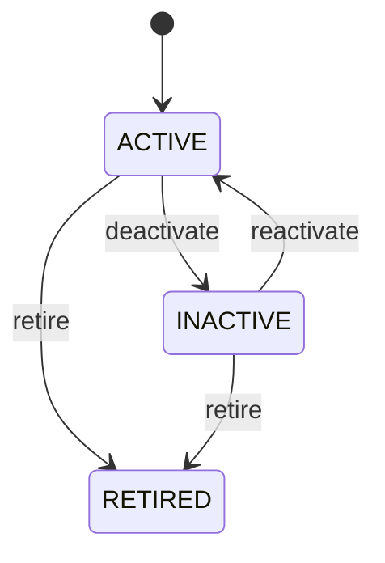

Any role that may change the record may make any move the diagram draws.


See [Address](/entities/foundation/address/) for the record itself.

## Location: Location lifecycle

States: **Planned**, **Active**, **Inactive**, **Closed**, **Retired**. A new record starts as **Planned**; **Closed**, **Retired** ends the lifecycle.

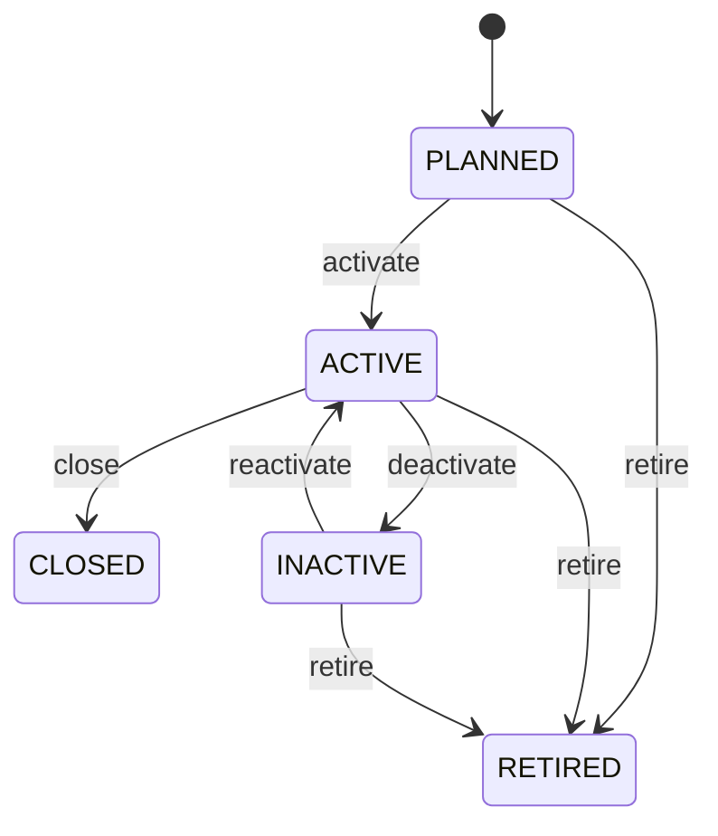

Any role that may change the record may make any move the diagram draws.


See [Location](/entities/foundation/location/) for the record itself.

## Currency: Currency lifecycle

States: **Active**, **Inactive**, **Retired**. A new record starts as **Active**; **Retired** ends the lifecycle.


Any role that may change the record may make any move the diagram draws.


See [Currency](/entities/foundation/currency/) for the record itself.

## Exchange Rate: Exchange rate lifecycle

States: **Draft**, **Active**, **Expired**, **Cancelled**. A new record starts as **Draft**; **Expired**, **Cancelled** ends the lifecycle.

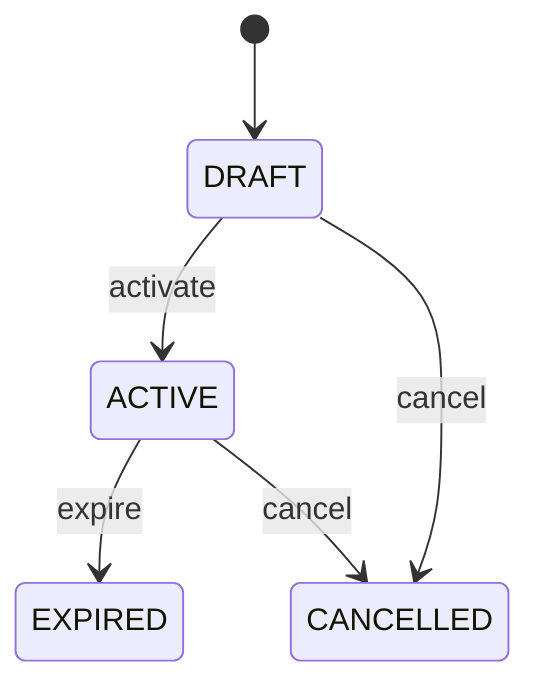

Any role that may change the record may make any move the diagram draws.


See [Exchange Rate](/entities/foundation/exchange-rate/) for the record itself.

## Unit Of Measure: Unit of measure lifecycle

States: **Active**, **Inactive**, **Retired**. A new record starts as **Active**; **Retired** ends the lifecycle.


Any role that may change the record may make any move the diagram draws.


See [Unit Of Measure](/entities/foundation/unit-of-measure/) for the record itself.

## Task: Task lifecycle

States: **Created**, **Ready**, **Assigned**, **In progress**, **Blocked**, **Completed**, **Cancelled**, **Failed**. A new record starts as **Created**; **Completed**, **Cancelled**, **Failed** ends the lifecycle.

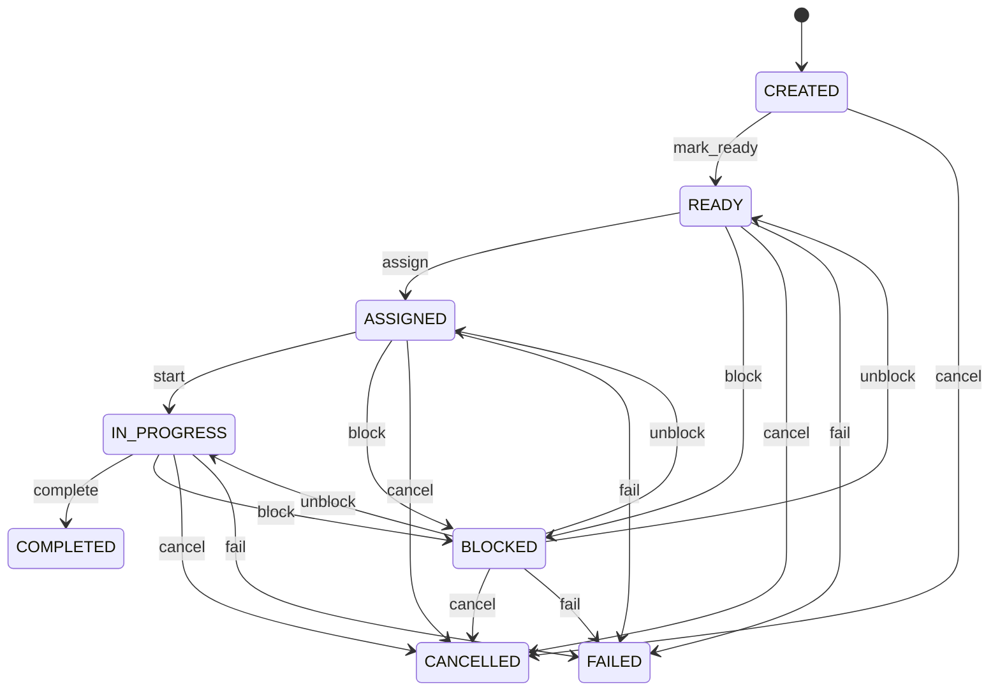

Any role that may change the record may make any move the diagram draws.


See [Task](/entities/foundation/task/) for the record itself.

## Quality Characteristic: Quality characteristic lifecycle

States: **Draft**, **Active**, **Retired**. A new record starts as **Draft**; **Retired** ends the lifecycle.

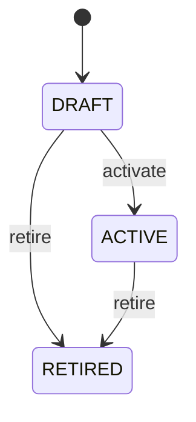

Any role that may change the record may make any move the diagram draws.


See [Quality Characteristic](/entities/quality-management/quality-characteristic/) for the record itself.

## Quality Plan: Quality plan lifecycle

States: **Draft**, **Active**, **Suspended**, **Retired**. A new record starts as **Draft**; **Retired** ends the lifecycle.

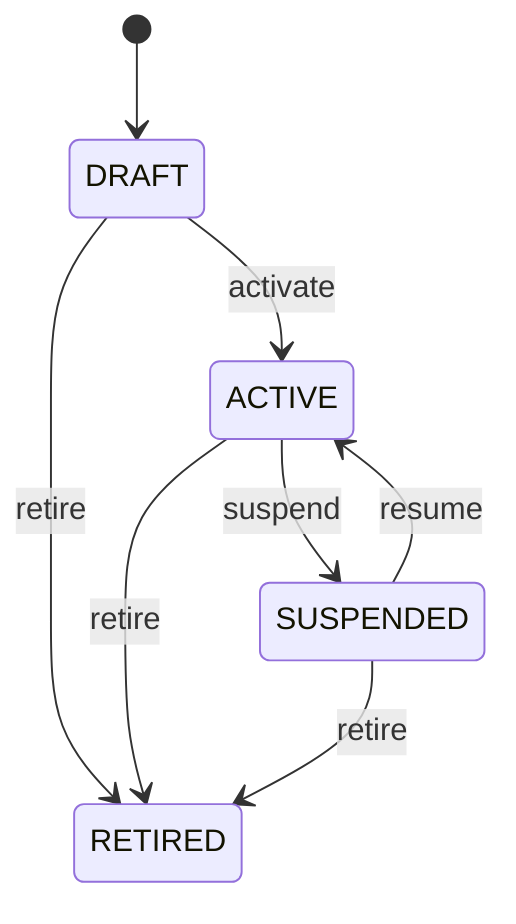

Any role that may change the record may make any move the diagram draws.


See [Quality Plan](/entities/quality-management/quality-plan/) for the record itself.

## Test Method: Test method lifecycle

States: **Draft**, **Active**, **Suspended**, **Retired**. A new record starts as **Draft**; **Retired** ends the lifecycle.


Any role that may change the record may make any move the diagram draws.


See [Test Method](/entities/quality-management/test-method/) for the record itself.

## Sampling Plan: Sampling plan lifecycle

States: **Draft**, **Active**, **Suspended**, **Retired**. A new record starts as **Draft**; **Retired** ends the lifecycle.


Any role that may change the record may make any move the diagram draws.


See [Sampling Plan](/entities/quality-management/sampling-plan/) for the record itself.

## Sampling Rule: Sampling rule lifecycle

States: **Draft**, **Active**, **Retired**. A new record starts as **Draft**; **Retired** ends the lifecycle.


Any role that may change the record may make any move the diagram draws.


See [Sampling Rule](/entities/quality-management/sampling-rule/) for the record itself.

## Quality Inspection: Quality inspection lifecycle

States: **Open**, **In progress**, **Passed**, **Failed**, **Conditional**, **Cancelled**. A new record starts as **Open**; **Passed**, **Failed**, **Cancelled** ends the lifecycle.

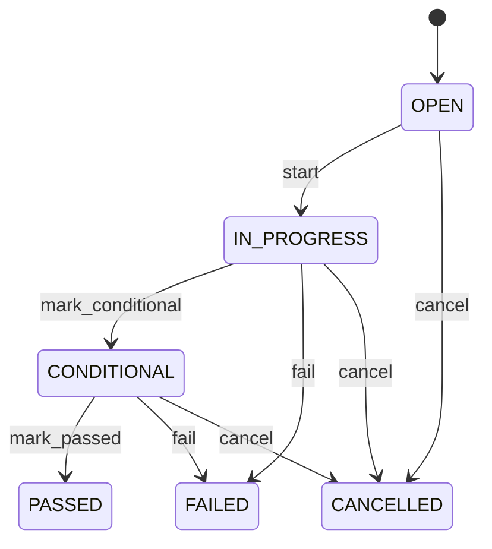

Any role that may change the record may make any move the diagram draws.


See [Quality Inspection](/entities/quality-management/quality-inspection/) for the record itself.

## Inspection Sample: Inspection sample lifecycle

States: **Selected**, **In testing**, **Tested**, **Rejected**, **Disposed**, **Cancelled**. A new record starts as **Selected**; **Rejected**, **Disposed**, **Cancelled** ends the lifecycle.

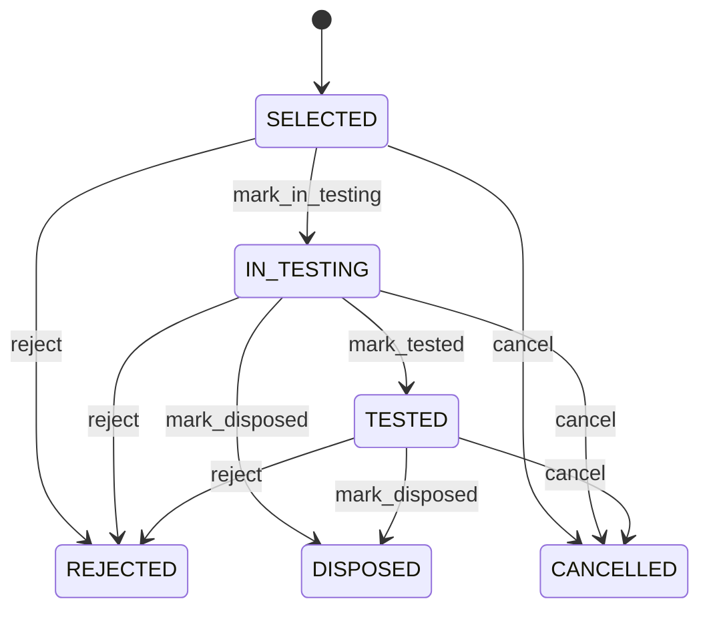

Any role that may change the record may make any move the diagram draws.


See [Inspection Sample](/entities/quality-management/inspection-sample/) for the record itself.

## Nonconformance: Nonconformance lifecycle

States: **Open**, **Under review**, **Contained**, **Corrective action**, **Closed**, **Rejected**. A new record starts as **Open**; **Closed**, **Rejected** ends the lifecycle.

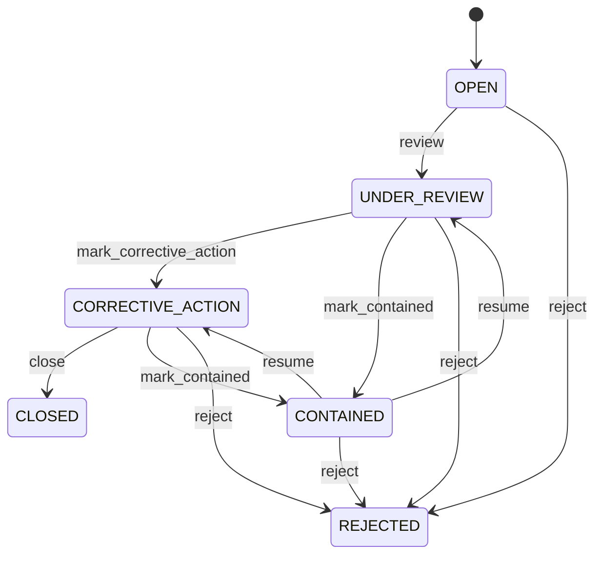

Any role that may change the record may make any move the diagram draws.


See [Nonconformance](/entities/quality-management/nonconformance/) for the record itself.

## Corrective Action: Corrective action lifecycle

States: **Open**, **Assigned**, **In progress**, **Verification**, **Completed**, **Cancelled**. A new record starts as **Open**; **Completed**, **Cancelled** ends the lifecycle.

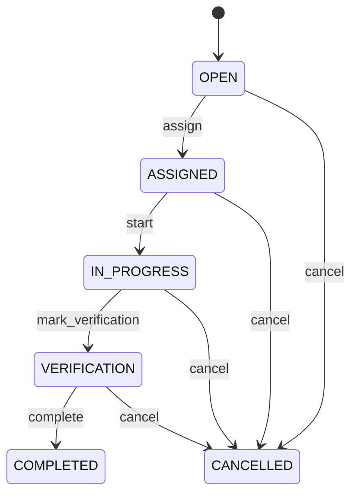

Any role that may change the record may make any move the diagram draws.


See [Corrective Action](/entities/quality-management/corrective-action/) for the record itself.

## Corrective Action Verification: Corrective action verification lifecycle

States: **Open**, **In progress**, **Completed**, **Reopened**, **Cancelled**. A new record starts as **Open**; **Completed**, **Cancelled** ends the lifecycle.

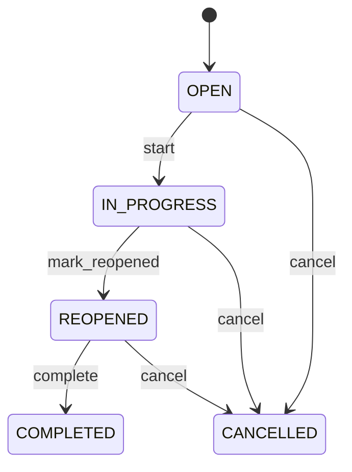

Any role that may change the record may make any move the diagram draws.


See [Corrective Action Verification](/entities/quality-management/corrective-action-verification/) for the record itself.

## Return Disposition: Return disposition lifecycle

States: **Draft**, **Authorized**, **Executed**, **Cancelled**, **Exception**. A new record starts as **Draft**; **Executed**, **Cancelled** ends the lifecycle.

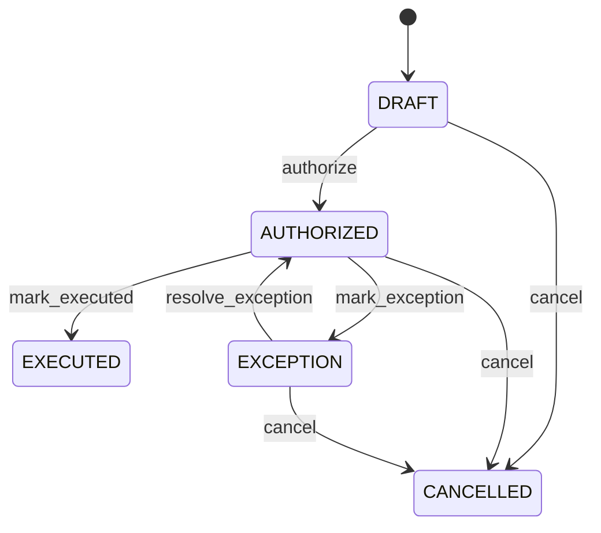

Any role that may change the record may make any move the diagram draws.


See [Return Disposition](/entities/quality-management/return-disposition/) for the record itself.

## Certificate Of Analysis: Certificate of analysis lifecycle

States: **Draft**, **Approved**, **Issued**, **Superseded**, **Void**. A new record starts as **Draft**; **Superseded**, **Void** ends the lifecycle.

```mermaid
stateDiagram-v2
  [*] --> DRAFT
  DRAFT --> APPROVED: approve
  APPROVED --> ISSUED: issue
  DRAFT --> SUPERSEDED: mark_superseded
  APPROVED --> SUPERSEDED: mark_superseded
  ISSUED --> SUPERSEDED: mark_superseded
  DRAFT --> VOID: void
  APPROVED --> VOID: void
  ISSUED --> VOID: void
```

Any role that may change the record may make any move the diagram draws.


See [Certificate Of Analysis](/entities/quality-management/certificate-of-analysis/) for the record itself.

