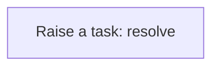
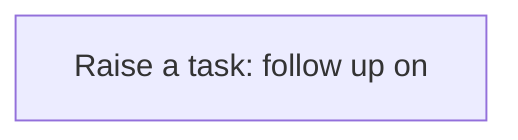
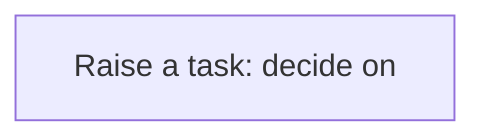
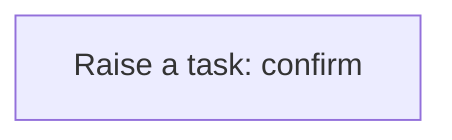

# Processes

A process is a sequence of steps the application runs for you: create a task, update a record, call a service. A business rule usually starts it; you can also run one by hand from the Workflow Designer. Every run is logged step by step in the Workflow Monitor. This application has **13** processes.

## Party exception raised {#party-exception-raised}

When a party is blocked, a high-priority task asks someone to resolve it.

Runs when a **Party** is changed, started by a business rule.

1. **Raise a task: resolve** — creates a **Task** record.

## Exchange rate follow up required {#exchange-rate-follow-up-required}

When a exchange rate is cancelled, a task asks someone to settle what depended on it.

Runs when a **Exchange Rate** is changed, started by a business rule.

1. **Raise a task: follow up on** — creates a **Task** record.

## Quality inspection exception raised {#quality-inspection-exception-raised}

When a quality inspection is failed, a high-priority task asks someone to resolve it.

Runs when a **Quality Inspection** is changed, started by a business rule.

1. **Raise a task: resolve** — creates a **Task** record.

## Quality inspection follow up required {#quality-inspection-follow-up-required}

When a quality inspection is cancelled, a task asks someone to settle what depended on it.

Runs when a **Quality Inspection** is changed, started by a business rule.

1. **Raise a task: follow up on** — creates a **Task** record.

## Inspection sample follow up required {#inspection-sample-follow-up-required}

When a inspection sample is rejected or cancelled, a task asks someone to settle what depended on it.

Runs when a **Inspection Sample** is changed, started by a business rule.

1. **Raise a task: follow up on** — creates a **Task** record.

## Nonconformance approval requested {#nonconformance-approval-requested}

When a nonconformance is under review, a task asks someone to decide on it.

Runs when a **Nonconformance** is changed, started by a business rule.

1. **Raise a task: decide on** — creates a **Task** record.

## Nonconformance follow up required {#nonconformance-follow-up-required}

When a nonconformance is rejected, a task asks someone to settle what depended on it.

Runs when a **Nonconformance** is changed, started by a business rule.

1. **Raise a task: follow up on** — creates a **Task** record.

## Corrective action follow up required {#corrective-action-follow-up-required}

When a corrective action is cancelled, a task asks someone to settle what depended on it.

Runs when a **Corrective Action** is changed, started by a business rule.

1. **Raise a task: follow up on** — creates a **Task** record.

## Corrective action verification follow up required {#corrective-action-verification-follow-up-required}

When a corrective action verification is cancelled, a task asks someone to settle what depended on it.

Runs when a **Corrective Action Verification** is changed, started by a business rule.

1. **Raise a task: follow up on** — creates a **Task** record.

## Corrective action verification completion confirmed {#corrective-action-verification-completion-confirmed}

When a corrective action verification is completed, a task asks someone to confirm the outcome.

Runs when a **Corrective Action Verification** is changed, started by a business rule.

1. **Raise a task: confirm** — creates a **Task** record.

## Return disposition exception raised {#return-disposition-exception-raised}

When a return disposition is exception, a high-priority task asks someone to resolve it.

Runs when a **Return Disposition** is changed, started by a business rule.

1. **Raise a task: resolve** — creates a **Task** record.

## Return disposition follow up required {#return-disposition-follow-up-required}

When a return disposition is cancelled, a task asks someone to settle what depended on it.

Runs when a **Return Disposition** is changed, started by a business rule.

1. **Raise a task: follow up on** — creates a **Task** record.

## Certificate of analysis follow up required {#certificate-of-analysis-follow-up-required}

When a certificate of analysis is void, a task asks someone to settle what depended on it.

Runs when a **Certificate Of Analysis** is changed, started by a business rule.

1. **Raise a task: follow up on** — creates a **Task** record.

