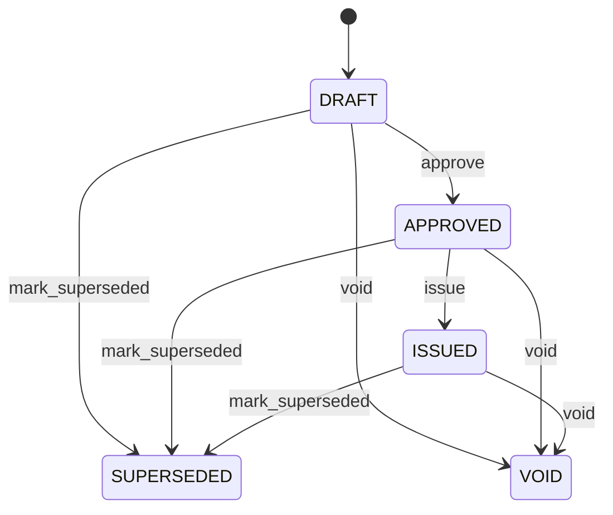

# Certificate Of Analysis

Controlled certificate presenting quality evidence for governed material. CertificateOfAnalysis is a released representation of underlying evidence, not a substitute for QualityInspection or QualityMeasurement. Supplier quality, customer documentation, regulated release, shipments, receipts, compliance, audit, and integrations. Inspections and measurements supply evidence; Product and receipt/shipment provide material context. Draft → approved → issued → superseded/void under controlled document history. Changes to open source evidence invalidate draft/approved certificates for revalidation; issued certificates retain historical source references and are corrected by supersession.

## Finding records

Open **Certificate Of Analysis** from the menu or from its card on the dashboard.

The list shows Certificate Number, Issued At, Status, with the most recently changed record first. The **Help** button beside the title opens this window's help text.

- **Search**: type in the search box above the grid to narrow the rows. **Search** at the top left opens advanced search, where you pick a field, a comparison (equals, contains, starts with, before, after, and so on) and a value.
- **Sort**: click a column heading; click again to reverse.
- **Refresh**: the refresh button at the top right re-reads the rows and every dropdown, so a record created a moment ago by someone else appears.
- **Export**: **CSV** downloads the rows you are looking at.
- **Open a record**: click a row. The line under the title, "Showing 1 to n of N entries", tells you how many rows match.

## Creating a record

Choose **New** at the top of the list. The form opens on its own page, with the fields in sections. A badge beside each label names the control (Text, Dropdown, Date, and so on); a red star marks a required field; the question-mark icon shows that field's help; and a hint such as “max 300” shows the longest entry accepted.

1. Fill in the fields described under [Fields](#fields).
2. These are required and must be completed before the record can be saved: **Certificate Number**, **Status**.
3. For a dropdown that points at another window, pick the matching record; if the record you need does not exist yet, create it in its own window first. A dropdown may narrow to what you have already chosen, for example the states of the chosen country.
4. Choose **Create** (or **Save** in the toolbar). You return to the record, and it appears at the top of the list. If something is wrong the form says which field and why, and nothing is saved.

## Reading, changing and deleting a record

Click a row to open the record. Above the fields are the arrows that step through the list ("1 of 5"). Below them sit **Notes**, where anyone may leave a comment on the record, and the **Audit Trail**, which lists every change with who made it, when, and which fields changed.

- **Edit** (toolbar) makes the fields editable. Change them and choose **Save**; **Undo Changes** puts back what you changed and **Cancel Editing** leaves edit mode.
- **Copy Record** starts a new record from this one.
- **Delete Record** is available in edit mode and asks you to confirm; a record other records still depend on cannot be deleted.

Every change is also written to the [Audit Log](/administration/#audit-log).

## Fields

| Field | What you use | Rules | What to enter |
| --- | --- | --- | --- |
| Certificate Number | Text | Required, Unique, Up to 120 characters | Business-facing certificate reference. Controlled number used to identify the issued certificate. Documents, search, exchange, and audit. Distinct from inspection and shipment numbers. Required. |
| Issued At | Date and time | Optional | Time the certificate was formally issued. Establishes when the quality statement became externally or operationally effective. Compliance, customer documentation, and audit. Required once status is ISSUED. Optional before issuance. |
| Status | Choice | Required | Lifecycle state of the certificate. Controls whether the certificate is preparatory, approved, issued, replaced, or invalidated. Release and document governance. Status does not alter underlying measurements. Being prepared. Reviewed and approved for issuance. Formally issued. Replaced by a later controlled certificate. Invalidated while retained as history. Required. Choose one: Draft, Approved, Issued, Superseded, Void. |

## How it connects to other records
- A certificate of analysis is linked to many **Quality Inspection** records.
- A certificate of analysis has many **Quality Measurement** records.

## Lifecycle: Certificate of analysis lifecycle

A certificate of analysis record starts as **Draft** and ends as **Superseded** or **Void**. Open a record and the bar above its fields shows its current **State** and, after **Next**, a button for each move that leaves it; choose one to make the move. Any move the diagram does not draw is refused, for everyone including the administrator.

| From | To | Move |
| --- | --- | --- |
| Draft | Approved | Approve |
| Approved | Issued | Issue |
| Draft | Superseded | Mark superseded |
| Approved | Superseded | Mark superseded |
| Issued | Superseded | Mark superseded |
| Draft | Void | Void |
| Approved | Void | Void |
| Issued | Void | Void |

## What happens when you save
Business rules run around the save. They are listed here and explained in full under [Business rules](/administration/rules/).

| Rule | When | Order |
| --- | --- | --- |
| Certificate of analysis workflows after update | after a certificate of analysis is changed | 100 |

Processes started from this record: [Certificate of analysis follow up required](/administration/processes/#certificate-of-analysis-follow-up-required).

## Who may use it

Anyone who holds a role with access to the **Certificate Of Analysis** window. Access is granted by role under [Roles and access](/administration/access/).
