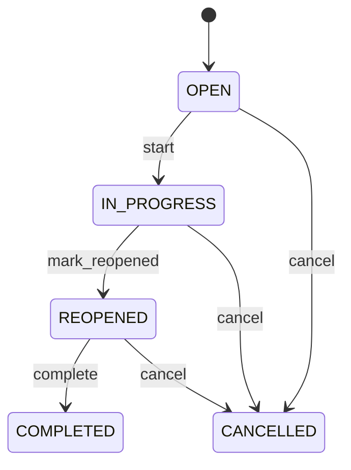

# Corrective Action Verification

Provides independent auditable evidence that a corrective or preventive action achieved its intended result. CorrectiveAction records what was done; CorrectiveActionVerification records whether it worked; Nonconformance records the original quality problem. CAPA supplier quality compliance audit recurrence prevention and issue closure. Verification closes the evidence loop between Nonconformance and CorrectiveAction without conflating implementation with effectiveness. Nonconformance → CorrectiveAction → implementation → effectiveness verification → effective closure or ineffective/reopened action → Nonconformance closure when all required evidence is satisfied. Open → in progress → completed, with reopened or cancelled paths. Ineffective verification reopens or creates additional CorrectiveAction work according to policy; it must not silently close the underlying Nonconformance. A supplier defect causes a corrective action requiring a packaging-process change. After implementation, verification evaluates subsequent lots, records EFFECTIVE, and provides evidence needed to complete the action and eventually close the nonconformance.

## Finding records

Open **Corrective Action Verification** from the menu or from its card on the dashboard.

The list shows Verification Number, Verification Date, Result, Status, Findings, Verified By, Nonconformance, with the most recently changed record first. The **Help** button beside the title opens this window's help text.

- **Search**: type in the search box above the grid to narrow the rows. **Search** at the top left opens advanced search, where you pick a field, a comparison (equals, contains, starts with, before, after, and so on) and a value.
- **Sort**: click a column heading; click again to reverse.
- **Refresh**: the refresh button at the top right re-reads the rows and every dropdown, so a record created a moment ago by someone else appears.
- **Export**: **CSV** downloads the rows you are looking at.
- **Open a record**: click a row. The line under the title, "Showing 1 to n of N entries", tells you how many rows match.

## Creating a record

Choose **New** at the top of the list. The form opens on its own page, with the fields in sections. A badge beside each label names the control (Text, Dropdown, Date, and so on); a red star marks a required field; the question-mark icon shows that field's help; and a hint such as “max 300” shows the longest entry accepted.

1. Fill in the fields described under [Fields](#fields).
2. These are required and must be completed before the record can be saved: **Verification Number**, **Verification Date**, **Result**, **Status**, **Findings**, **Verified By**, **Corrective Action**.
3. For a dropdown that points at another window, pick the matching record; if the record you need does not exist yet, create it in its own window first. A dropdown may narrow to what you have already chosen, for example the states of the chosen country.
4. Choose **Create** (or **Save** in the toolbar). You return to the record, and it appears at the top of the list. If something is wrong the form says which field and why, and nothing is saved.

## Reading, changing and deleting a record

Click a row to open the record. Above the fields are the arrows that step through the list ("1 of 5"). Below them sit **Notes**, where anyone may leave a comment on the record, and the **Audit Trail**, which lists every change with who made it, when, and which fields changed.

- **Edit** (toolbar) makes the fields editable. Change them and choose **Save**; **Undo Changes** puts back what you changed and **Cancel Editing** leaves edit mode.
- **Copy Record** starts a new record from this one.
- **Delete Record** is available in edit mode and asks you to confirm; a record other records still depend on cannot be deleted.

Every change is also written to the [Audit Log](/administration/#audit-log).

## Fields

| Field | What you use | Rules | What to enter |
| --- | --- | --- | --- |
| Verification Number | Text | Required, Unique, Up to 100 characters | Human-facing verification reference. Identifies the verification event for quality operations and audit. Reporting approval audit and supplier communication. Distinct from actionNumber and nonconformance number. Correlates verification evidence throughout closure. Required. |
| Verification Date | Date and time | Required | Date and time effectiveness verification was performed. Establishes when evidence was evaluated against the intended outcome. Audit SLA quality reporting and closure chronology. Anchors the verification event. Required. |
| Result | Choice | Required | Outcome of effectiveness verification. States whether the action achieved its intended quality outcome. Controls corrective-action completion recurrence handling and escalation. Does not rewrite original Nonconformance or CorrectiveAction evidence. Determines whether action may be completed or must be reopened. Required. The result of the corrective action verification is effective; set it when that is what the business means for this record. The result of the corrective action verification is partially effective; set it when that is what the business means for this record. The result of the corrective action verification is ineffective; set it when that is what the business means for this record. The result of the corrective action verification is not verifiable; set it when that is what the business means for this record. Choose one: Effective, Partially effective, Ineffective, Not verifiable. |
| Status | Choice | Required | Lifecycle state of verification. Separates preparation evaluation completion and follow-up. Quality governance and audit. COMPLETED records final verification evidence; REOPENED signals additional action is required. Required. The status of the corrective action verification is open; set it when that is what the business means for this record. The status of the corrective action verification is in progress; set it when that is what the business means for this record. The status of the corrective action verification is completed; set it when that is what the business means for this record. The status of the corrective action verification is reopened; set it when that is what the business means for this record. The status of the corrective action verification is cancelled; set it when that is what the business means for this record. Choose one: Open, In progress, Completed, Reopened, Cancelled. |
| Findings | Text | Required, Up to 4000 characters | Evidence and observations supporting the verification result. Explains what was checked and why the result was reached. Audit quality review supplier improvement and recurrence analysis. Supports effectiveness decision. Required. |
| Verified By | Lookup | Required | Party accountable for performing or approving effectiveness verification. Establishes accountability for the verification decision. Audit trail quality governance and segregation of duties. Provides verification authority. Required. Pick a record from **Party**. |
| Nonconformance | Lookup | Optional | Nonconformance for which the action was established. Connects effectiveness evidence to the original quality deviation. Issue closure and recurrence analysis. Provides context for determining whether the underlying issue is controlled. Pick a record from **Nonconformance**. |
| Corrective Action | Lookup | Required | Corrective action being evaluated. Connects verification evidence to the action whose implementation is assessed. CAPA closure audit and quality reporting. Verification result controls whether action can be completed. Pick a record from **Corrective Action**. |

## How it connects to other records
- A corrective action verification belongs to one **Nonconformance**.
- A corrective action verification belongs to one **Corrective Action**.

## Lifecycle: Corrective action verification lifecycle

A corrective action verification record starts as **Open** and ends as **Completed** or **Cancelled**. Open a record and the bar above its fields shows its current **State** and, after **Next**, a button for each move that leaves it; choose one to make the move. Any move the diagram does not draw is refused, for everyone including the administrator.

| From | To | Move |
| --- | --- | --- |
| Open | In progress | Start |
| In progress | Reopened | Mark reopened |
| Reopened | Completed | Complete |
| Open | Cancelled | Cancel |
| In progress | Cancelled | Cancel |
| Reopened | Cancelled | Cancel |

## What happens when you save
Business rules run around the save. They are listed here and explained in full under [Business rules](/administration/rules/).

| Rule | When | Order |
| --- | --- | --- |
| Corrective action verification workflows after update | after a corrective action verification is changed | 100 |

Processes started from this record: [Corrective action verification follow up required](/administration/processes/#corrective-action-verification-follow-up-required), [Corrective action verification completion confirmed](/administration/processes/#corrective-action-verification-completion-confirmed).

## Who may use it

Anyone who holds a role with access to the **Corrective Action Verification** window. Access is granted by role under [Roles and access](/administration/access/).
