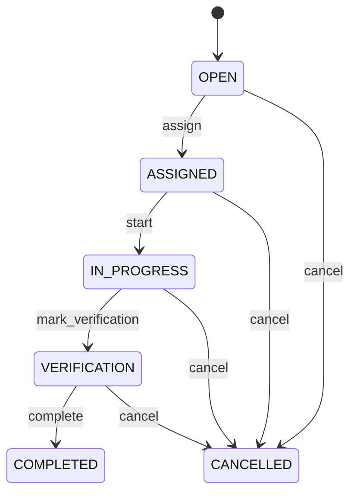

# Corrective Action

Represents a controlled quality action from assignment through implementation and independent effectiveness verification. Nonconformance records the problem; CorrectiveAction records what is done to contain, correct or prevent it; CorrectiveActionVerification records whether the action worked. CAPA, supplier quality, compliance, audit, recurrence prevention and quality improvement. The action connects Nonconformance with responsible Party and one or more CorrectiveActionVerification records. Physical and financial consequences remain represented by their own transactions. Open → assigned → in progress → verification → completed, with cancellation and reopening paths. Nonconformance → action definition → assignment → implementation → verification → effective completion → Nonconformance closure when all required evidence is satisfied. Ineffective verification returns the action to controlled follow-up. Changes to the originating Nonconformance or quality evidence affecting the action trigger revalidation of scope and verification criteria. Verification results may reopen or create additional action work; historical records remain immutable. A supplier defect causes a corrective action to change packaging controls. The action is implemented, a verification evaluates subsequent lots, and only an EFFECTIVE verification permits completion when policy requires effectiveness evidence.

## Finding records

Open **Corrective Action** from the menu or from its card on the dashboard.

The list shows Action Number, Action Type, Description, Status, Due Date, Completed Date, Nonconformance, with the most recently changed record first. The **Help** button beside the title opens this window's help text.

- **Search**: type in the search box above the grid to narrow the rows. **Search** at the top left opens advanced search, where you pick a field, a comparison (equals, contains, starts with, before, after, and so on) and a value.
- **Sort**: click a column heading; click again to reverse.
- **Refresh**: the refresh button at the top right re-reads the rows and every dropdown, so a record created a moment ago by someone else appears.
- **Export**: **CSV** downloads the rows you are looking at.
- **Open a record**: click a row. The line under the title, "Showing 1 to n of N entries", tells you how many rows match.

## Creating a record

Choose **New** at the top of the list. The form opens on its own page, with the fields in sections. A badge beside each label names the control (Text, Dropdown, Date, and so on); a red star marks a required field; the question-mark icon shows that field's help; and a hint such as “max 300” shows the longest entry accepted.

1. Fill in the fields described under [Fields](#fields).
2. These are required and must be completed before the record can be saved: **Action Number**, **Action Type**, **Description**, **Status**.
3. For a dropdown that points at another window, pick the matching record; if the record you need does not exist yet, create it in its own window first. A dropdown may narrow to what you have already chosen, for example the states of the chosen country.
4. Choose **Create** (or **Save** in the toolbar). You return to the record, and it appears at the top of the list. If something is wrong the form says which field and why, and nothing is saved.

## Reading, changing and deleting a record

Click a row to open the record. Above the fields are the arrows that step through the list ("1 of 5"). Below them sit **Notes**, where anyone may leave a comment on the record, and the **Audit Trail**, which lists every change with who made it, when, and which fields changed.

- **Edit** (toolbar) makes the fields editable. Change them and choose **Save**; **Undo Changes** puts back what you changed and **Cancel Editing** leaves edit mode.
- **Copy Record** starts a new record from this one.
- **Delete Record** is available in edit mode and asks you to confirm; a record other records still depend on cannot be deleted.

Every change is also written to the [Audit Log](/administration/#audit-log).

## Fields

| Field | What you use | Rules | What to enter |
| --- | --- | --- | --- |
| Action Number | Text | Required, Unique, Up to 100 characters | Human-facing corrective-action reference. Identifies the action for quality teams, responsible parties and auditors. Communication, reporting, CAPA tracking and integration. Distinct from the originating nonconformance number and verification number. Correlates action work across its lifecycle. Required. |
| Action Type | Choice | Required | Classification of the quality action. Distinguishes immediate containment, correction of an existing condition, root-cause corrective action, and preventive action. Determines evidence expectations, routing and effectiveness criteria. Containment/disposition can control immediate risk while corrective/preventive actions address causes and recurrence. Determines the intended outcome that verification must assess. Required. The action type of the corrective action is containment; set it when that is what the business means for this record. The action type of the corrective action is correction; set it when that is what the business means for this record. The action type of the corrective action is corrective; set it when that is what the business means for this record. The action type of the corrective action is preventive; set it when that is what the business means for this record. Choose one: Containment, Correction, Corrective, Preventive. |
| Description | Text | Required, Up to 4000 characters | Detailed statement of what the action will accomplish. Defines scope, intended outcome and work required to address the quality issue. Assignment, execution, audit and effectiveness assessment. Must remain traceable to the associated Nonconformance or approved quality objective. Defines the implementation target for verification. Required. |
| Status | Choice | Required | Lifecycle state of the action. Indicates whether work is pending, assigned, underway, awaiting effectiveness evidence, completed or cancelled. Controls execution and closure. COMPLETED does not itself prove effectiveness; CorrectiveActionVerification supplies that evidence. VERIFICATION gates final completion when effectiveness verification is required. Required. The status of the corrective action is open; set it when that is what the business means for this record. The status of the corrective action is assigned; set it when that is what the business means for this record. The status of the corrective action is in progress; set it when that is what the business means for this record. The status of the corrective action is verification; set it when that is what the business means for this record. The status of the corrective action is completed; set it when that is what the business means for this record. The status of the corrective action is cancelled; set it when that is what the business means for this record. Choose one: Open, Assigned, In progress, Verification, Completed, Cancelled. |
| Due Date | Date | Optional | Target date for action implementation. Defines when the responsible party is expected to complete implementation. Work planning, escalation, SLA reporting and quality governance. Distinct from completedDate and verificationDate. Supports overdue detection and escalation. Optional when policy does not require a target date. |
| Completed Date | Date | Optional | Date implementation was formally completed. Records when the action work was declared complete, subject to any required effectiveness verification. CAPA metrics, audit and chronology. Does not replace verification evidence where effectiveness is required. Required when status is COMPLETED. Optional until completion. |
| Nonconformance | Lookup | Optional | Quality issue that caused or requires this action. Connects the action to the deviation and its containment, disposition and closure requirements. CAPA traceability, root-cause analysis and audit. Supplies the problem context the action is intended to address. Pick a record from **Nonconformance**. |
| Owner | Lookup | Optional | Party accountable for implementing the action. Identifies the responsible person or organization for execution. Assignment, escalation and accountability. Owns implementation evidence and completion proposal. Pick a record from **Party**. |

## How it connects to other records
- A corrective action belongs to one **Nonconformance**.
- A corrective action belongs to one **Party**.
- A corrective action has many **Corrective Action Verification** records.

## Lifecycle: Corrective action lifecycle

A corrective action record starts as **Open** and ends as **Completed** or **Cancelled**. Open a record and the bar above its fields shows its current **State** and, after **Next**, a button for each move that leaves it; choose one to make the move. Any move the diagram does not draw is refused, for everyone including the administrator.

| From | To | Move |
| --- | --- | --- |
| Open | Assigned | Assign |
| Assigned | In progress | Start |
| In progress | Verification | Mark verification |
| Verification | Completed | Complete |
| Open | Cancelled | Cancel |
| Assigned | Cancelled | Cancel |
| In progress | Cancelled | Cancel |
| Verification | Cancelled | Cancel |

## What happens when you save
Business rules run around the save. They are listed here and explained in full under [Business rules](/administration/rules/).

| Rule | When | Order |
| --- | --- | --- |
| Corrective action workflows after update | after a corrective action is changed | 100 |

Processes started from this record: [Corrective action follow up required](/administration/processes/#corrective-action-follow-up-required).

## Who may use it

Anyone who holds a role with access to the **Corrective Action** window. Access is granted by role under [Roles and access](/administration/access/).
