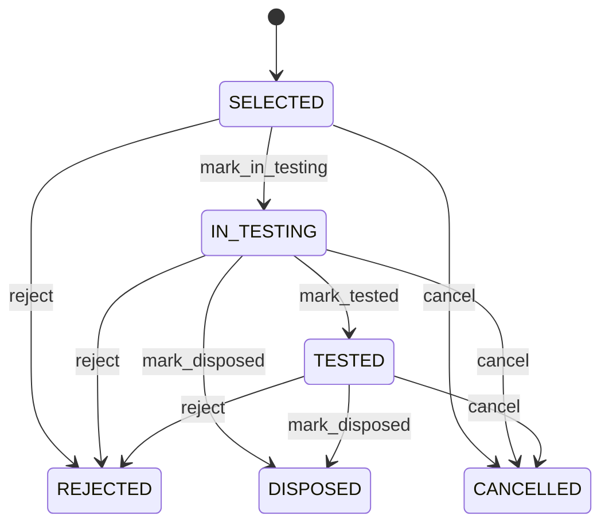

# Inspection Sample

Execution record of the actual sample selected for a governed quality inspection. InspectionSample separates sampling policy from the physical or logical sample actually selected. SamplingPlan and SamplingRule define how selection should occur; InspectionSample records what was actually selected; QualityMeasurement records observations from it. Incoming inspection, supplier quality, acceptance sampling, laboratory testing, process quality, chain of custody, compliance, and audit. QualityInspection is the parent execution; SamplingPlan and SamplingRule define selection policy; Product and UnitOfMeasure identify population semantics; QualityMeasurement records test evidence; Nonconformance and disposition consume resulting quality decisions. QualityPlan → QualityPlanCharacteristic → SamplingPlan/SamplingRule → QualityInspection → InspectionSample selection → sample testing → QualityMeasurement capture/evaluation → aggregate inspection result → Nonconformance/disposition where required. Selected → in testing → tested → disposed/rejected/cancelled as applicable. Historical selection evidence is retained. Sampling policy changes affect open inspections that have not selected samples. Once a sample is selected, later policy changes do not silently change its historical basis. A 500-unit receipt is governed by a rule requiring 20 sampled units. InspectionSample records the selected 20 units and their quantity, preserves the governing rule, and links subsequent weight and purity QualityMeasurements to the sample.

## Finding records

Open **Inspection Sample** from the menu or from its card on the dashboard.

The list shows Sample Number, Selected At, Quantity, Unit Of Measure, Status, Selection Basis, Quality Inspection, with the most recently changed record first. The **Help** button beside the title opens this window's help text.

- **Search**: type in the search box above the grid to narrow the rows. **Search** at the top left opens advanced search, where you pick a field, a comparison (equals, contains, starts with, before, after, and so on) and a value.
- **Sort**: click a column heading; click again to reverse.
- **Refresh**: the refresh button at the top right re-reads the rows and every dropdown, so a record created a moment ago by someone else appears.
- **Export**: **CSV** downloads the rows you are looking at.
- **Open a record**: click a row. The line under the title, "Showing 1 to n of N entries", tells you how many rows match.

## Creating a record

Choose **New** at the top of the list. The form opens on its own page, with the fields in sections. A badge beside each label names the control (Text, Dropdown, Date, and so on); a red star marks a required field; the question-mark icon shows that field's help; and a hint such as “max 300” shows the longest entry accepted.

1. Fill in the fields described under [Fields](#fields).
2. These are required and must be completed before the record can be saved: **Sample Number**, **Selected At**, **Quantity**, **Unit Of Measure**, **Status**, **Quality Inspection**.
3. For a dropdown that points at another window, pick the matching record; if the record you need does not exist yet, create it in its own window first. A dropdown may narrow to what you have already chosen, for example the states of the chosen country.
4. Choose **Create** (or **Save** in the toolbar). You return to the record, and it appears at the top of the list. If something is wrong the form says which field and why, and nothing is saved.

## Reading, changing and deleting a record

Click a row to open the record. Above the fields are the arrows that step through the list ("1 of 5"). Below them sit **Notes**, where anyone may leave a comment on the record, and the **Audit Trail**, which lists every change with who made it, when, and which fields changed.

- **Edit** (toolbar) makes the fields editable. Change them and choose **Save**; **Undo Changes** puts back what you changed and **Cancel Editing** leaves edit mode.
- **Copy Record** starts a new record from this one.
- **Delete Record** is available in edit mode and asks you to confirm; a record other records still depend on cannot be deleted.

Every change is also written to the [Audit Log](/administration/#audit-log).

## Fields

| Field | What you use | Rules | What to enter |
| --- | --- | --- | --- |
| Sample Number | Text | Required, Unique, Up to 100 characters | Human-facing identifier for the selected inspection sample. Provides an operational reference for labeling, handling, testing, and audit. Inspection execution, laboratory handling, reports, and traceability. Identifies the executed sample rather than the sampling policy or parent inspection. Required. |
| Selected At | Date and time | Required | Time at which the sample was selected from the eligible population. Establishes when the actual sampling event occurred. Chain of custody, audit, reproducibility, and inspection chronology. Distinct from QualityInspection.inspectionDate and measuredAt on QualityMeasurement. Required. |
| Quantity | Amount | Required | Quantity represented by the selected sample. States how much material or how many units the sample represents under its unit of measure. Sample reconciliation, measurement scope, inventory traceability, and audit. Must reconcile with the eligible inspection population and sample-selection rule. Required. |
| Unit Of Measure | Lookup | Required | Unit in which the sample quantity is expressed. Gives semantic meaning to the selected sample quantity. Reconciliation, reporting, conversion, and audit. Must be compatible with the source population and governing sampling configuration. Required. Pick a record from **Unit Of Measure**. |
| Status | Choice | Required | Lifecycle state of the selected sample. Shows whether the sample is awaiting testing, being tested, has completed testing, or has been otherwise dispositioned. Sample handling, measurement gating, chain of custody, and audit. Sample status is distinct from overall QualityInspection status and does not independently determine product disposition. Sample has been selected and is awaiting testing or handling. Sample is actively undergoing governed testing. Required testing for the sample has completed. Sample itself was rejected or invalidated for the governed purpose. Sample has been physically disposed of under an authorized process. Sample selection was cancelled under controlled workflow. Required. Choose one: Selected, In testing, Tested, Rejected, Disposed, Cancelled. |
| Selection Basis | Text | Up to 1000 characters | Evidence or description of how this particular sample was selected. Preserves the operational selection basis needed to reproduce or audit the sampling event. Compliance, audit, supplier disputes, and statistical review. Complements the authoritative SamplingRule and does not replace it. Optional when selection is fully reproducible from the governed rule and execution metadata. |
| Quality Inspection | Lookup | Required | QualityInspection for which this sample was selected. Provides the execution context and population being inspected. Sample traceability, inspection completion, measurement linkage, and audit. Every InspectionSample belongs to exactly one QualityInspection. Inspection status and result remain independent; the sample supplies evidence to the inspection. Pick a record from **Quality Inspection**. |
| Sampling Plan | Lookup | Optional | SamplingPlan governing the sample-selection event. Preserves the reusable sampling policy applied at execution time. Audit, reproducibility, analytics, and change-impact analysis. A sample may reference zero or one sampling plan when sampling is not governed by an explicit reusable plan. When populated, the plan must agree with the governing SamplingRule. Pick a record from **Sampling Plan**. |
| Sampling Rule | Lookup | Optional | SamplingRule used to determine this sample selection. Identifies the exact conditional rule that determined sample quantity and acceptance logic. Audit, reproducibility, sample reconciliation, and inspection completion. A sample may have zero or one rule only when an explicit rule is not applicable. When populated, the rule and SamplingPlan must be mutually consistent. Pick a record from **Sampling Rule**. |

## How it connects to other records
- A inspection sample belongs to one **Quality Inspection**.
- A inspection sample belongs to one **Sampling Plan**.
- A inspection sample belongs to one **Sampling Rule**.
- A inspection sample has many **Quality Measurement** records.

## Lifecycle: Inspection sample lifecycle

A inspection sample record starts as **Selected** and ends as **Rejected** or **Disposed** or **Cancelled**. Open a record and the bar above its fields shows its current **State** and, after **Next**, a button for each move that leaves it; choose one to make the move. Any move the diagram does not draw is refused, for everyone including the administrator.

| From | To | Move |
| --- | --- | --- |
| Selected | In testing | Mark in testing |
| In testing | Tested | Mark tested |
| Selected | Rejected | Reject |
| In testing | Rejected | Reject |
| Tested | Rejected | Reject |
| In testing | Disposed | Mark disposed |
| Tested | Disposed | Mark disposed |
| Selected | Cancelled | Cancel |
| In testing | Cancelled | Cancel |
| Tested | Cancelled | Cancel |

## What happens when you save
Business rules run around the save. They are listed here and explained in full under [Business rules](/administration/rules/).

| Rule | When | Order |
| --- | --- | --- |
| Inspection sample invariants before create | before a inspection sample is created | 100 |
| Inspection sample invariants before update | before a inspection sample is changed | 100 |
| Inspection sample workflows after update | after a inspection sample is changed | 100 |

Processes started from this record: [Inspection sample follow up required](/administration/processes/#inspection-sample-follow-up-required).

## Who may use it

Anyone who holds a role with access to the **Inspection Sample** window. Access is granted by role under [Roles and access](/administration/access/).
