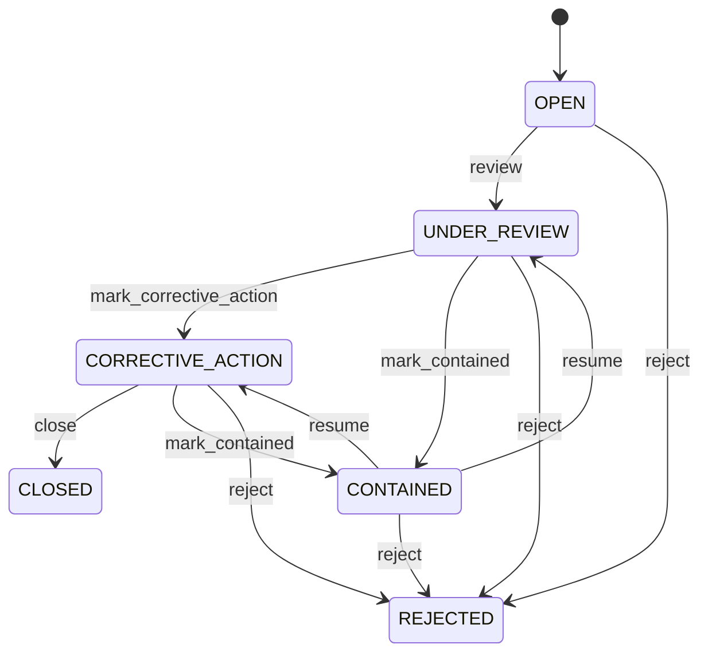

# Nonconformance

Represents a controlled quality deviation and its investigation, containment, disposition and corrective-action lifecycle. Nonconformance captures the quality problem; QualityInspection provides test evidence; ReturnDisposition records controlled operational outcomes; SupplierReturn provides physical response; CorrectiveAction addresses recurrence; CorrectiveActionVerification proves effectiveness. Supplier quality, incoming inspection, returns, CAPA, compliance, audit, supplier performance and risk management. A quality issue may begin at receiving, inspection, customer/supplier return or external complaint. Operational, inventory and financial consequences remain separate business facts linked through traceable relationships. Inspection/receipt/return evidence → Nonconformance → containment → ReturnDisposition where applicable → SupplierReturn/InventoryMovement → CorrectiveAction → effectiveness verification → closure. Financial consequences remain separate through authorized credit/debit workflows. Open → under review → contained → corrective action → closed, with rejection where the issue is invalid. Changes to inspection, receipt, return, disposition, product, corrective action or verification evidence affecting an open issue trigger revalidation. Financial and inventory consequences are never inferred solely from Nonconformance status. Incoming inspection detects defective units. Nonconformance records the defect, affected receipt lines are contained, a return disposition sends the units to quarantine, a supplier return and inventory movement execute the physical response, CorrectiveAction addresses the root cause, and an effective verification supplies closure evidence.

## Finding records

Open **Nonconformance** from the menu or from its card on the dashboard.

The list shows Number, Severity, Status, Description, Detected At, Closed At, Inspection, with the most recently changed record first. The **Help** button beside the title opens this window's help text.

- **Search**: type in the search box above the grid to narrow the rows. **Search** at the top left opens advanced search, where you pick a field, a comparison (equals, contains, starts with, before, after, and so on) and a value.
- **Sort**: click a column heading; click again to reverse.
- **Refresh**: the refresh button at the top right re-reads the rows and every dropdown, so a record created a moment ago by someone else appears.
- **Export**: **CSV** downloads the rows you are looking at.
- **Open a record**: click a row. The line under the title, "Showing 1 to n of N entries", tells you how many rows match.

## Creating a record

Choose **New** at the top of the list. The form opens on its own page, with the fields in sections. A badge beside each label names the control (Text, Dropdown, Date, and so on); a red star marks a required field; the question-mark icon shows that field's help; and a hint such as “max 300” shows the longest entry accepted.

1. Fill in the fields described under [Fields](#fields).
2. These are required and must be completed before the record can be saved: **Number**, **Severity**, **Status**, **Description**, **Detected At**.
3. For a dropdown that points at another window, pick the matching record; if the record you need does not exist yet, create it in its own window first. A dropdown may narrow to what you have already chosen, for example the states of the chosen country.
4. Choose **Create** (or **Save** in the toolbar). You return to the record, and it appears at the top of the list. If something is wrong the form says which field and why, and nothing is saved.

## Reading, changing and deleting a record

Click a row to open the record. Above the fields are the arrows that step through the list ("1 of 5"). Below them sit **Notes**, where anyone may leave a comment on the record, and the **Audit Trail**, which lists every change with who made it, when, and which fields changed.

- **Edit** (toolbar) makes the fields editable. Change them and choose **Save**; **Undo Changes** puts back what you changed and **Cancel Editing** leaves edit mode.
- **Copy Record** starts a new record from this one.
- **Delete Record** is available in edit mode and asks you to confirm; a record other records still depend on cannot be deleted.

Every change is also written to the [Audit Log](/administration/#audit-log).

## Fields

| Field | What you use | Rules | What to enter |
| --- | --- | --- | --- |
| Number | Text | Required, Unique, Up to 100 characters | Business-facing nonconformance reference. Identifies the issue for quality and supplier operations. Audit, reporting, CAPA and dispute handling. Human-recognizable issue reference. Required. |
| Severity | Choice | Required | Business severity of the deviation. Indicates impact and urgency. Prioritization, containment and escalation. Determines response urgency. Required. The severity of the nonconformance is low; set it when that is what the business means for this record. The severity of the nonconformance is medium; set it when that is what the business means for this record. The severity of the nonconformance is high; set it when that is what the business means for this record. The severity of the nonconformance is critical; set it when that is what the business means for this record. Choose one: Low, Medium, High, Critical. |
| Status | Choice | Required | Lifecycle state of the quality issue. Indicates investigation, containment, corrective action and closure. Quality management and audit. Controls allowed responses and closure. Required. The status of the nonconformance is open; set it when that is what the business means for this record. The status of the nonconformance is under review; set it when that is what the business means for this record. The status of the nonconformance is contained; set it when that is what the business means for this record. The status of the nonconformance is corrective action; set it when that is what the business means for this record. The status of the nonconformance is closed; set it when that is what the business means for this record. The status of the nonconformance is rejected; set it when that is what the business means for this record. Choose one: Open, Under review, Contained, Corrective action, Closed, Rejected. |
| Description | Text | Required, Up to 4000 characters | Detailed explanation of the deviation. States what requirement or expected result was not met. Investigation, supplier communication, CAPA and audit. Provides issue evidence. Required. |
| Detected At | Date and time | Required | Time the deviation was detected. Establishes chronology for containment and corrective action. Audit and quality analytics. Anchors issue occurrence. Required. |
| Closed At | Date and time | Optional | Time the issue was formally closed. Establishes completion chronology. Quality performance and audit. Required for closure. Optional until closure. |
| Inspection | Lookup | Optional | Inspection that detected or evidenced the deviation. Connects issue to objective quality evaluation. Investigation and audit. Provides detection evidence. Pick a record from **Quality Inspection**. |
| Owner | Lookup | Optional | Party accountable for issue management. Identifies responsible quality owner or organizational party. Escalation, CAPA and audit. Owns investigation and closure. Pick a record from **Party**. |

## How it connects to other records
- A nonconformance belongs to one **Quality Inspection**.
- A nonconformance has many **Return Disposition** records.
- A nonconformance belongs to one **Party**.
- A nonconformance has many **Corrective Action** records.
- A nonconformance has many **Corrective Action Verification** records.

## Lifecycle: Nonconformance lifecycle

A nonconformance record starts as **Open** and ends as **Closed** or **Rejected**. Open a record and the bar above its fields shows its current **State** and, after **Next**, a button for each move that leaves it; choose one to make the move. Any move the diagram does not draw is refused, for everyone including the administrator.

| From | To | Move |
| --- | --- | --- |
| Open | Under review | Review |
| Under review | Corrective action | Mark corrective action |
| Corrective action | Closed | Close |
| Under review | Contained | Mark contained |
| Contained | Under review | Resume |
| Corrective action | Contained | Mark contained |
| Contained | Corrective action | Resume |
| Open | Rejected | Reject |
| Under review | Rejected | Reject |
| Corrective action | Rejected | Reject |
| Contained | Rejected | Reject |

## What happens when you save
Business rules run around the save. They are listed here and explained in full under [Business rules](/administration/rules/).

| Rule | When | Order |
| --- | --- | --- |
| Nonconformance invariants before create | before a nonconformance is created | 100 |
| Nonconformance invariants before update | before a nonconformance is changed | 100 |
| Nonconformance workflows after update | after a nonconformance is changed | 100 |

Processes started from this record: [Nonconformance approval requested](/administration/processes/#nonconformance-approval-requested), [Nonconformance follow up required](/administration/processes/#nonconformance-follow-up-required).

## Who may use it

Anyone who holds a role with access to the **Nonconformance** window. Access is granted by role under [Roles and access](/administration/access/).
