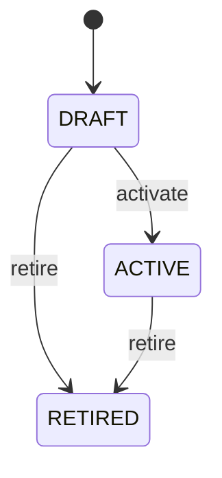

# Quality Characteristic

Reusable definition of one quality property that can be configured by quality plans and observed through quality measurements. QualityCharacteristic answers what property is being evaluated. It intentionally does not own plan-specific limits because the same property can have different acceptance criteria for different products, suppliers, processes, or inspection plans. Quality master data, inspection design, supplier quality, incoming inspection, process control, laboratory testing, compliance, analytics, and audit. QualityCharacteristic is the reusable semantic definition; QualityPlanCharacteristic configures it for a QualityPlan; QualityPlan selects the governed controls; QualityInspection executes them; QualityMeasurement records observations; Nonconformance may consume failed evidence. Draft → active → retired. Retirement preserves historical references and evidence. Changes to meaning, type, or lifecycle require impact analysis across QualityPlanCharacteristic, QualityPlan, open QualityInspection, QualityMeasurement, Nonconformance, and reporting workflows. Historical completed evidence must retain the definition applicable when it was captured. A WEIGHT characteristic has dataType DECIMAL. One QualityPlanCharacteristic may require 9.8–10.2 kg while another plan may require 9.5–10.5 kg; both use the same reusable QualityCharacteristic.

## Finding records

Open **Quality Characteristic** from the menu or from its card on the dashboard.

The list shows Code, Name, Description, Data Type, Status, Evaluation Method, with the most recently changed record first. The **Help** button beside the title opens this window's help text.

- **Search**: type in the search box above the grid to narrow the rows. **Search** at the top left opens advanced search, where you pick a field, a comparison (equals, contains, starts with, before, after, and so on) and a value.
- **Sort**: click a column heading; click again to reverse.
- **Refresh**: the refresh button at the top right re-reads the rows and every dropdown, so a record created a moment ago by someone else appears.
- **Export**: **CSV** downloads the rows you are looking at.
- **Open a record**: click a row. The line under the title, "Showing 1 to n of N entries", tells you how many rows match.

## Creating a record

Choose **New** at the top of the list. The form opens on its own page, with the fields in sections. A badge beside each label names the control (Text, Dropdown, Date, and so on); a red star marks a required field; the question-mark icon shows that field's help; and a hint such as “max 300” shows the longest entry accepted.

1. Fill in the fields described under [Fields](#fields).
2. These are required and must be completed before the record can be saved: **Code**, **Name**, **Data Type**, **Status**.
3. For a dropdown that points at another window, pick the matching record; if the record you need does not exist yet, create it in its own window first. A dropdown may narrow to what you have already chosen, for example the states of the chosen country.
4. Choose **Create** (or **Save** in the toolbar). You return to the record, and it appears at the top of the list. If something is wrong the form says which field and why, and nothing is saved.

## Reading, changing and deleting a record

Click a row to open the record. Above the fields are the arrows that step through the list ("1 of 5"). Below them sit **Notes**, where anyone may leave a comment on the record, and the **Audit Trail**, which lists every change with who made it, when, and which fields changed.

- **Edit** (toolbar) makes the fields editable. Change them and choose **Save**; **Undo Changes** puts back what you changed and **Cancel Editing** leaves edit mode.
- **Copy Record** starts a new record from this one.
- **Delete Record** is available in edit mode and asks you to confirm; a record other records still depend on cannot be deleted.

Every change is also written to the [Audit Log](/administration/#audit-log).

## Fields

| Field | What you use | Rules | What to enter |
| --- | --- | --- | --- |
| Code | Text | Required, Unique, Up to 100 characters | Business code identifying the quality characteristic. Provides a stable human-readable identifier such as WEIGHT, TEMPERATURE, LENGTH, or APPEARANCE. Used in quality plans, measurements, reports, integrations, and validation rules. The code identifies the characteristic, while QualityPlanCharacteristic determines how that characteristic is controlled in a particular plan. Required for reliable reuse and integration. |
| Name | Text | Required, Up to 300 characters | Human-readable name of the quality characteristic. States what property the characteristic represents in language understandable to quality personnel and other users. Used in quality-plan authoring, inspection screens, reports, analytics, and training. Complements code and provides the business-facing meaning of measurements referencing this characteristic. Required so the reusable definition remains understandable. |
| Description | Text | Up to 2000 characters | Detailed explanation of the characteristic and its intended interpretation. Clarifies exactly what is observed and prevents different processes from interpreting the same code differently. Quality-plan design, inspection execution, audit, integration, and governance. Explains the semantic property independently of plan-specific limits. Optional when the name and governed definition are already sufficient. |
| Data Type | Choice | Required | Data representation expected for observations of this characteristic. Determines whether measurements are numeric or categorical and therefore which evaluation rules are valid. Controls QualityMeasurement value selection, validation, user-interface behavior, and downstream analytics. QualityMeasurement must supply an observation compatible with this data type; QualityPlanCharacteristic supplies applicable criteria. A numeric observation that may contain fractional values. A whole-number observation. A textual or categorical observation represented as text. A true/false observation. An observation selected from a governed set of allowed values. Required because evaluation depends on the characteristic data type. Choose one: Decimal, Integer, String, Boolean, Enum. |
| Status | Choice | Required | Lifecycle state of the reusable characteristic definition. Controls whether the characteristic may be newly assigned to quality plans and used for new measurements. Governance, authoring, validation, and retirement control. Retiring a characteristic does not erase historical QualityMeasurement evidence or historical plan configurations. Definition is being prepared and is not normally available for new governed use. Definition is approved for use in applicable QualityPlanCharacteristic records. Definition is no longer normally assigned to new configurations but remains available for historical traceability. Required to govern lifecycle behavior. Choose one: Draft, Active, Retired. |
| Evaluation Method | Text | Up to 500 characters | General method or interpretation approach for observing this characteristic. Describes the expected measurement or observation approach when a reusable default is appropriate. Provides guidance for quality-plan authoring and inspection execution. Plan-specific method overrides or requirements belong to QualityPlanCharacteristic when they differ by plan. Optional because some characteristics are self-evident or fully governed by plan-specific configuration. |

## How it connects to other records
- A quality characteristic has many **Quality Plan Characteristic** records.
- A quality characteristic has many **Quality Measurement** records.

## Lifecycle: Quality characteristic lifecycle

A quality characteristic record starts as **Draft** and ends as **Retired**. Open a record and the bar above its fields shows its current **State** and, after **Next**, a button for each move that leaves it; choose one to make the move. Any move the diagram does not draw is refused, for everyone including the administrator.

| From | To | Move |
| --- | --- | --- |
| Draft | Active | Activate |
| Draft | Retired | Retire |
| Active | Retired | Retire |

## Who may use it

Anyone who holds a role with access to the **Quality Characteristic** window. Access is granted by role under [Roles and access](/administration/access/).
