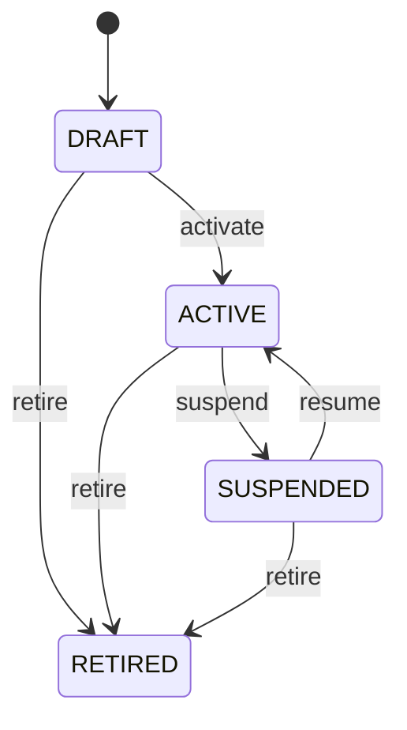

# Quality Plan

Governed definition of how a product or process is inspected. QualityPlan is the parent definition for plan-specific QualityPlanCharacteristic requirements, reusable SamplingPlan policies, and QualityInspection execution. Reusable quality meaning belongs to QualityCharacteristic and reusable sample selection belongs to SamplingPlan rather than being duplicated in every inspection. Quality master data, inspection processes, supplier quality, incoming inspection, process control, laboratory testing, compliance, forms, reports, integrations, and analytics. Product provides applicability; QualityPlanCharacteristic supplies detailed requirements; SamplingPlan and SamplingRule supply sample-selection controls; QualityInspection executes them; InspectionSample records actual selection; QualityMeasurement records observations; Nonconformance and disposition consume failed outcomes. Draft → active → suspended/retired under governed change control. Historical inspections retain the plan, characteristic, sampling plan, and sampling rule configuration applicable when executed. Material plan changes propagate to open inspections and measurements, sample-selection execution, requirement evaluation, nonconformance and disposition workflows, supplier performance evidence, reporting, and audit history. Completed evidence must not be rewritten. An incoming-receipt plan contains required WEIGHT and TEMPERATURE configurations and assigns an acceptance-sampling SamplingPlan. A QualityInspection selects the governed sample through its SamplingRule, captures measurements, and determines the overall result.

## Finding records

Open **Quality Plan** from the menu or from its card on the dashboard.

The list shows Code, Name, Status, with the most recently changed record first. The **Help** button beside the title opens this window's help text.

- **Search**: type in the search box above the grid to narrow the rows. **Search** at the top left opens advanced search, where you pick a field, a comparison (equals, contains, starts with, before, after, and so on) and a value.
- **Sort**: click a column heading; click again to reverse.
- **Refresh**: the refresh button at the top right re-reads the rows and every dropdown, so a record created a moment ago by someone else appears.
- **Export**: **CSV** downloads the rows you are looking at.
- **Open a record**: click a row. The line under the title, "Showing 1 to n of N entries", tells you how many rows match.

## Creating a record

Choose **New** at the top of the list. The form opens on its own page, with the fields in sections. A badge beside each label names the control (Text, Dropdown, Date, and so on); a red star marks a required field; the question-mark icon shows that field's help; and a hint such as “max 300” shows the longest entry accepted.

1. Fill in the fields described under [Fields](#fields).
2. These are required and must be completed before the record can be saved: **Code**, **Name**, **Status**.
3. For a dropdown that points at another window, pick the matching record; if the record you need does not exist yet, create it in its own window first. A dropdown may narrow to what you have already chosen, for example the states of the chosen country.
4. Choose **Create** (or **Save** in the toolbar). You return to the record, and it appears at the top of the list. If something is wrong the form says which field and why, and nothing is saved.

## Reading, changing and deleting a record

Click a row to open the record. Above the fields are the arrows that step through the list ("1 of 5"). Below them sit **Notes**, where anyone may leave a comment on the record, and the **Audit Trail**, which lists every change with who made it, when, and which fields changed.

- **Edit** (toolbar) makes the fields editable. Change them and choose **Save**; **Undo Changes** puts back what you changed and **Cancel Editing** leaves edit mode.
- **Copy Record** starts a new record from this one.
- **Delete Record** is available in edit mode and asks you to confirm; a record other records still depend on cannot be deleted.

Every change is also written to the [Audit Log](/administration/#audit-log).

## Fields

| Field | What you use | Rules | What to enter |
| --- | --- | --- | --- |
| Code | Text | Required, Unique, Up to 100 characters | Business code identifying the quality plan. Provides a stable human-readable reference for the governed inspection definition. Plan selection, search, reports, integrations, and operational instructions. Distinguishes the plan from its characteristic requirements, sampling policies, and inspection transactions. Required for operational identification. |
| Name | Text | Required, Up to 300 characters | Human-readable name of the quality plan. Explains the purpose of the inspection definition. Authoring, selection, inspection execution, reporting, and audit. Names the overall plan whose detailed controls are represented by QualityPlanCharacteristic and SamplingPlan. Required for understandable plan governance. |
| Status | Choice | Required | Lifecycle state of the quality plan. Controls whether the plan may normally govern new inspections. Plan selection, workflow gating, governance, and retirement. Status affects characteristic and sampling configurations and creation of new QualityInspection records; historical inspections remain evidence. Plan is being prepared and is not normally used for production inspection execution. Plan is approved for governed inspection use. Plan is temporarily unavailable for new governed use while retained for traceability. Plan is no longer normally selected for new inspections but remains historical evidence. Required to govern lifecycle behavior. Choose one: Draft, Active, Suspended, Retired. |

## How it connects to other records
- A quality plan has many **Quality Plan Characteristic** records.
- A quality plan is linked to many **Sampling Plan** records.
- A quality plan has many **Quality Inspection** records.
- A quality plan has many **Sampling Rule** records.
- A quality plan has many **Quality Measurement** records.

## Lifecycle: Quality plan lifecycle

A quality plan record starts as **Draft** and ends as **Retired**. Open a record and the bar above its fields shows its current **State** and, after **Next**, a button for each move that leaves it; choose one to make the move. Any move the diagram does not draw is refused, for everyone including the administrator.

| From | To | Move |
| --- | --- | --- |
| Draft | Active | Activate |
| Active | Suspended | Suspend |
| Suspended | Active | Resume |
| Draft | Retired | Retire |
| Active | Retired | Retire |
| Suspended | Retired | Retire |

## Who may use it

Anyone who holds a role with access to the **Quality Plan** window. Access is granted by role under [Roles and access](/administration/access/).
