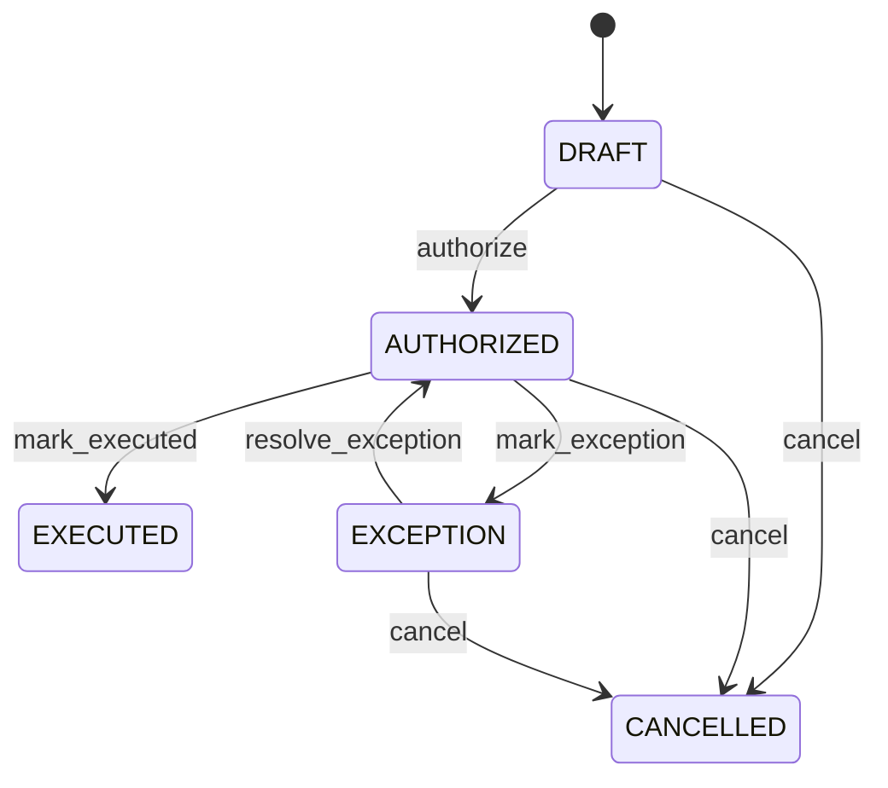

# Return Disposition

Provides the controlled bridge between a returned quantity, its operational outcome, quality evidence and the physical inventory execution. ReturnDisposition decides what happens to returned material. InventoryMovement records what physically happened. CreditNote or SupplierCreditNote records any separate financial consequence. Reverse logistics, warehouse operations, quality, customer returns, supplier returns, inventory control, claims, audit and reconciliation. CustomerReturn/SupplierReturn establish reverse transactions; their lines establish quantities; QualityInspection supplies quality evidence; InventoryMovement records physical effects; CreditNote and SupplierCreditNote record financial adjustments. Return received → inspection where required → disposition authorized → execute attributable InventoryMovement where applicable → update return completion projection → create or release separate financial adjustment when eligible. No financial or inventory effect is inferred merely from authorization. Draft → authorized → executed, with cancellation and exception paths. Historical executed decisions are retained. Changes to return-line eligibility or inspection evidence affecting an unexecuted disposition trigger revalidation. Executed history is corrected through compensating evidence. Five customer-returned units are inspected and dispositioned as three RESTOCK and two QUARANTINE. One disposition records each outcome; InventoryMovement increases unrestricted inventory only for the three restocked units, while the two quarantined units remain unavailable.

## Finding records

Open **Return Disposition** from the menu or from its card on the dashboard.

The list shows Disposition Code, Disposition Date, Quantity, Status, Reason Code, Nonconformance, Quality Inspection, with the most recently changed record first. The **Help** button beside the title opens this window's help text.

- **Search**: type in the search box above the grid to narrow the rows. **Search** at the top left opens advanced search, where you pick a field, a comparison (equals, contains, starts with, before, after, and so on) and a value.
- **Sort**: click a column heading; click again to reverse.
- **Refresh**: the refresh button at the top right re-reads the rows and every dropdown, so a record created a moment ago by someone else appears.
- **Export**: **CSV** downloads the rows you are looking at.
- **Open a record**: click a row. The line under the title, "Showing 1 to n of N entries", tells you how many rows match.

## Creating a record

Choose **New** at the top of the list. The form opens on its own page, with the fields in sections. A badge beside each label names the control (Text, Dropdown, Date, and so on); a red star marks a required field; the question-mark icon shows that field's help; and a hint such as “max 300” shows the longest entry accepted.

1. Fill in the fields described under [Fields](#fields).
2. These are required and must be completed before the record can be saved: **Disposition Code**, **Disposition Date**, **Quantity**, **Status**.
3. For a dropdown that points at another window, pick the matching record; if the record you need does not exist yet, create it in its own window first. A dropdown may narrow to what you have already chosen, for example the states of the chosen country.
4. Choose **Create** (or **Save** in the toolbar). You return to the record, and it appears at the top of the list. If something is wrong the form says which field and why, and nothing is saved.

## Reading, changing and deleting a record

Click a row to open the record. Above the fields are the arrows that step through the list ("1 of 5"). Below them sit **Notes**, where anyone may leave a comment on the record, and the **Audit Trail**, which lists every change with who made it, when, and which fields changed.

- **Edit** (toolbar) makes the fields editable. Change them and choose **Save**; **Undo Changes** puts back what you changed and **Cancel Editing** leaves edit mode.
- **Copy Record** starts a new record from this one.
- **Delete Record** is available in edit mode and asks you to confirm; a record other records still depend on cannot be deleted.

Every change is also written to the [Audit Log](/administration/#audit-log).

## Fields

| Field | What you use | Rules | What to enter |
| --- | --- | --- | --- |
| Disposition Code | Choice | Required | Controlled operational outcome selected for returned material. Defines what should happen to the returned quantity. Drives warehouse execution, quality containment and eligibility for inventory availability. The code is a decision, not the inventory transaction itself and not a CreditNote or SupplierCreditNote. Determines which downstream physical workflow is permitted. Required. The disposition code of the return disposition is restock; set it when that is what the business means for this record. The disposition code of the return disposition is quarantine; set it when that is what the business means for this record. The disposition code of the return disposition is return to supplier; set it when that is what the business means for this record. The disposition code of the return disposition is rework; set it when that is what the business means for this record. The disposition code of the return disposition is repair; set it when that is what the business means for this record. The disposition code of the return disposition is scrap; set it when that is what the business means for this record. The disposition code of the return disposition is reject; set it when that is what the business means for this record. The disposition code of the return disposition is accept; set it when that is what the business means for this record. The disposition code of the return disposition is conditional release; set it when that is what the business means for this record. Choose one: Restock, Quarantine, Return to supplier, Rework, Repair, Scrap, Reject, Accept, Conditional release. |
| Disposition Date | Date and time | Required | Timestamp when the disposition became effective. Establishes chronology for the physical return decision. Supports audit, warehouse processing, SLA measurement and reconciliation. Distinct from returnDate, receiptDate and financial adjustment dates. Anchors execution of the disposition. Required. |
| Quantity | Amount | Required | Quantity covered by this disposition. States how much returned material receives this outcome. Supports partial dispositions and inventory execution. Must reconcile with the related return line quantity and its UnitOfMeasure. Controls the quantity eligible for the resulting InventoryMovement. Required and must be positive. |
| Status | Choice | Required | Lifecycle state of the disposition decision. Indicates whether the decision is proposed, authorized, physically executed, cancelled or exception-managed. Controls whether downstream inventory execution is permitted. Does not replace CustomerReturn, SupplierReturn or QualityInspection status. EXECUTED requires attributable physical evidence where the disposition changes inventory. Required. The status of the return disposition is draft; set it when that is what the business means for this record. The status of the return disposition is authorized; set it when that is what the business means for this record. The status of the return disposition is executed; set it when that is what the business means for this record. The status of the return disposition is cancelled; set it when that is what the business means for this record. The status of the return disposition is exception; set it when that is what the business means for this record. Choose one: Draft, Authorized, Executed, Cancelled, Exception. |
| Reason Code | Text | Up to 100 characters | Business reason supporting the selected disposition. Explains why the returned quantity received the selected operational outcome. Used for quality analysis, supplier/customer disputes and reporting. May derive from return reason or inspection evidence but remains disposition-specific. Supports authorization and exception handling. Optional when another controlled reason source is sufficient. |
| Nonconformance | Lookup | Optional | The Nonconformance this ReturnDisposition belongs to. Pick a record from **Nonconformance**. |
| Quality Inspection | Lookup | Optional | Quality inspection supporting the disposition decision. Links the operational outcome to quality evidence where inspection is required. Supports release, quarantine, rejection, repair, scrap and return decisions. Provides controlled evidence for disposition authorization. Pick a record from **Quality Inspection**. |

## How it connects to other records
- A return disposition belongs to one **Nonconformance**.
- A return disposition belongs to one **Quality Inspection**.

## Lifecycle: Return disposition lifecycle

A return disposition record starts as **Draft** and ends as **Executed** or **Cancelled**. Open a record and the bar above its fields shows its current **State** and, after **Next**, a button for each move that leaves it; choose one to make the move. Any move the diagram does not draw is refused, for everyone including the administrator.

| From | To | Move |
| --- | --- | --- |
| Draft | Authorized | Authorize |
| Authorized | Executed | Mark executed |
| Authorized | Exception | Mark exception |
| Exception | Authorized | Resolve exception |
| Draft | Cancelled | Cancel |
| Authorized | Cancelled | Cancel |
| Exception | Cancelled | Cancel |

## What happens when you save
Business rules run around the save. They are listed here and explained in full under [Business rules](/administration/rules/).

| Rule | When | Order |
| --- | --- | --- |
| Return disposition invariants before create | before a return disposition is created | 100 |
| Return disposition invariants before update | before a return disposition is changed | 100 |
| Return disposition workflows after update | after a return disposition is changed | 100 |

Processes started from this record: [Return disposition exception raised](/administration/processes/#return-disposition-exception-raised), [Return disposition follow up required](/administration/processes/#return-disposition-follow-up-required).

## Who may use it

Anyone who holds a role with access to the **Return Disposition** window. Access is granted by role under [Roles and access](/administration/access/).
