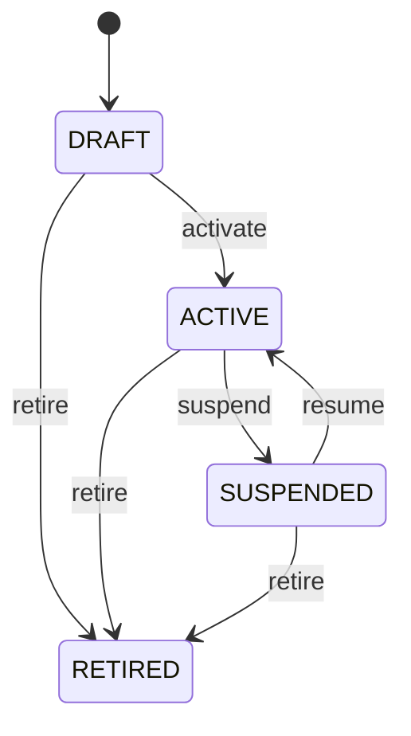

# Sampling Plan

Reusable governed definition for selecting inspection samples. SamplingPlan separates the statistical or operational selection policy from the QualityInspection transaction that executes it. Incoming inspection, supplier quality, process control, laboratory testing, compliance, acceptance sampling, and audit. QualityPlan determines the broader quality controls; SamplingPlan defines how populations are sampled; SamplingRule defines conditional sample quantities and acceptance criteria; inspection execution records the actual selection. Draft → active → suspended/retired. Historical executions retain their governing configuration. Changes propagate to QualityPlans, open inspections, sample-selection transactions, measurement coverage, and inspection completion gating. Completed sample evidence is never silently reinterpreted. A receiving quality plan uses an acceptance-sampling SamplingPlan with different sample sizes for small, medium, and large lot-size ranges.

## Finding records

Open **Sampling Plan** from the menu or from its card on the dashboard.

The list shows Code, Name, Method, Status, with the most recently changed record first. The **Help** button beside the title opens this window's help text.

- **Search**: type in the search box above the grid to narrow the rows. **Search** at the top left opens advanced search, where you pick a field, a comparison (equals, contains, starts with, before, after, and so on) and a value.
- **Sort**: click a column heading; click again to reverse.
- **Refresh**: the refresh button at the top right re-reads the rows and every dropdown, so a record created a moment ago by someone else appears.
- **Export**: **CSV** downloads the rows you are looking at.
- **Open a record**: click a row. The line under the title, "Showing 1 to n of N entries", tells you how many rows match.

## Creating a record

Choose **New** at the top of the list. The form opens on its own page, with the fields in sections. A badge beside each label names the control (Text, Dropdown, Date, and so on); a red star marks a required field; the question-mark icon shows that field's help; and a hint such as “max 300” shows the longest entry accepted.

1. Fill in the fields described under [Fields](#fields).
2. These are required and must be completed before the record can be saved: **Code**, **Name**, **Method**, **Status**.
3. For a dropdown that points at another window, pick the matching record; if the record you need does not exist yet, create it in its own window first. A dropdown may narrow to what you have already chosen, for example the states of the chosen country.
4. Choose **Create** (or **Save** in the toolbar). You return to the record, and it appears at the top of the list. If something is wrong the form says which field and why, and nothing is saved.

## Reading, changing and deleting a record

Click a row to open the record. Above the fields are the arrows that step through the list ("1 of 5"). Below them sit **Notes**, where anyone may leave a comment on the record, and the **Audit Trail**, which lists every change with who made it, when, and which fields changed.

- **Edit** (toolbar) makes the fields editable. Change them and choose **Save**; **Undo Changes** puts back what you changed and **Cancel Editing** leaves edit mode.
- **Copy Record** starts a new record from this one.
- **Delete Record** is available in edit mode and asks you to confirm; a record other records still depend on cannot be deleted.

Every change is also written to the [Audit Log](/administration/#audit-log).

## Fields

| Field | What you use | Rules | What to enter |
| --- | --- | --- | --- |
| Code | Text | Required, Unique, Up to 100 characters | Business code identifying the sampling plan. Provides a stable operational reference for a governed sampling definition. Plan selection, inspection authoring, reports, and integrations. Identifies the sampling definition rather than an individual sample or inspection. Required. |
| Name | Text | Required, Up to 300 characters | Human-readable name of the sampling plan. Explains the purpose of the sampling strategy. Quality authoring, inspection execution, training, reporting, and audit. Describes the overall sampling definition whose detailed rules are represented by SamplingRule. Required. |
| Method | Choice | Required | General method used to select inspection samples. Defines the governed selection approach rather than leaving sampling to operator discretion. Sampling execution, compliance, reproducibility, and audit. SamplingRule refines the method with lot and quantity parameters. Every applicable unit is inspected. Units are selected randomly from the eligible population. Units are selected using a defined interval or systematic pattern. Population is divided into defined strata and samples are selected within them. A fixed number of units is selected. A defined proportion of the population is selected. Sample size and acceptance/rejection criteria are governed by an acceptance-sampling scheme. Required. Choose one: Census, Random, Systematic, Stratified, Fixed size, Percentage, Acceptance sampling. |
| Status | Choice | Required | Lifecycle state of the sampling plan. Controls whether the sampling definition may be assigned to new governed inspections. Governance, authoring, inspection planning, and retirement. Retirement preserves historical inspection evidence and does not invalidate completed samples. Being defined and not normally available for production use. Approved for governed sampling. Temporarily unavailable for new use. No longer normally assigned to new inspections but retained for history. Required. Choose one: Draft, Active, Suspended, Retired. |

## How it connects to other records
- A sampling plan has many **Quality Plan Characteristic** records.
- A sampling plan is linked to many **Quality Plan** records.
- A sampling plan has many **Sampling Rule** records.
- A sampling plan has many **Inspection Sample** records.

## Lifecycle: Sampling plan lifecycle

A sampling plan record starts as **Draft** and ends as **Retired**. Open a record and the bar above its fields shows its current **State** and, after **Next**, a button for each move that leaves it; choose one to make the move. Any move the diagram does not draw is refused, for everyone including the administrator.

| From | To | Move |
| --- | --- | --- |
| Draft | Active | Activate |
| Active | Suspended | Suspend |
| Suspended | Active | Resume |
| Draft | Retired | Retire |
| Active | Retired | Retire |
| Suspended | Retired | Retire |

## Who may use it

Anyone who holds a role with access to the **Sampling Plan** window. Access is granted by role under [Roles and access](/administration/access/).
