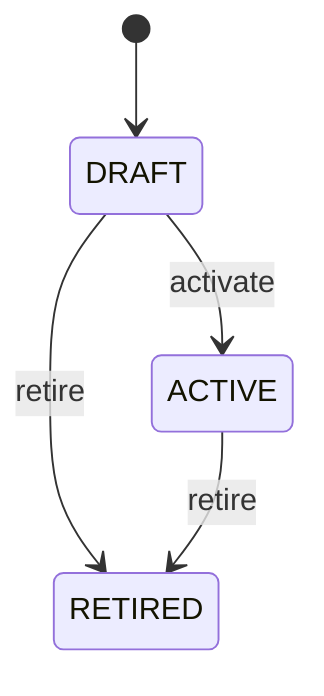

# Sampling Rule

Conditional sampling configuration that translates a SamplingPlan into a deterministic sample size and acceptance threshold. SamplingRule answers how many units to inspect for a qualifying population and, where applicable, how many failures are permitted before rejection. Acceptance sampling, incoming inspection, supplier quality, process control, laboratory sampling, compliance, and audit. SamplingPlan defines the sampling method; QualityPlan may consume the sampling definition; QualityPlanCharacteristic identifies characteristics that participate; QualityInspection executes the sample; QualityMeasurement records observations from selected samples. Draft → active → retired. Historical executions preserve the applicable rule. Changes affect open QualityInspections, sample selection, required measurement coverage, and final inspection evaluation. Completed inspection evidence remains governed by the rule in effect at execution. For lots of 101–500 units, an active rule may require 20 sampled units and accept the lot with no more than one failing sampled unit, with a rejection threshold of two failures.

## Finding records

Open **Sampling Rule** from the menu or from its card on the dashboard.

The list shows Rule Number, Population Min, Population Max, Sample Size, Acceptance Number, Rejection Number, Status, with the most recently changed record first. The **Help** button beside the title opens this window's help text.

- **Search**: type in the search box above the grid to narrow the rows. **Search** at the top left opens advanced search, where you pick a field, a comparison (equals, contains, starts with, before, after, and so on) and a value.
- **Sort**: click a column heading; click again to reverse.
- **Refresh**: the refresh button at the top right re-reads the rows and every dropdown, so a record created a moment ago by someone else appears.
- **Export**: **CSV** downloads the rows you are looking at.
- **Open a record**: click a row. The line under the title, "Showing 1 to n of N entries", tells you how many rows match.

## Creating a record

Choose **New** at the top of the list. The form opens on its own page, with the fields in sections. A badge beside each label names the control (Text, Dropdown, Date, and so on); a red star marks a required field; the question-mark icon shows that field's help; and a hint such as “max 300” shows the longest entry accepted.

1. Fill in the fields described under [Fields](#fields).
2. These are required and must be completed before the record can be saved: **Rule Number**, **Sample Size**, **Status**, **Sampling Plan**.
3. For a dropdown that points at another window, pick the matching record; if the record you need does not exist yet, create it in its own window first. A dropdown may narrow to what you have already chosen, for example the states of the chosen country.
4. Choose **Create** (or **Save** in the toolbar). You return to the record, and it appears at the top of the list. If something is wrong the form says which field and why, and nothing is saved.

## Reading, changing and deleting a record

Click a row to open the record. Above the fields are the arrows that step through the list ("1 of 5"). Below them sit **Notes**, where anyone may leave a comment on the record, and the **Audit Trail**, which lists every change with who made it, when, and which fields changed.

- **Edit** (toolbar) makes the fields editable. Change them and choose **Save**; **Undo Changes** puts back what you changed and **Cancel Editing** leaves edit mode.
- **Copy Record** starts a new record from this one.
- **Delete Record** is available in edit mode and asks you to confirm; a record other records still depend on cannot be deleted.

Every change is also written to the [Audit Log](/administration/#audit-log).

## Fields

| Field | What you use | Rules | What to enter |
| --- | --- | --- | --- |
| Rule Number | Text | Required, Up to 100 characters | Business reference for the sampling rule. Identifies the rule within its sampling plan for authoring, review, and audit. Configuration, inspection execution, reporting, and integration. Rule identity is scoped to the SamplingPlan and is distinct from actual sample records. Required. |
| Population Min | Whole number | Optional | Minimum population quantity for which this rule applies. Defines the lower boundary of the eligible lot or population range. Rule selection and deterministic sampling execution. Interpreted with populationMax and sampleSize. Optional when the rule has no lower population boundary. |
| Population Max | Whole number | Optional | Maximum population quantity for which this rule applies. Defines the upper boundary of the eligible lot or population range. Rule selection and deterministic sampling execution. Interpreted with populationMin and sampleSize. Optional when the rule has no upper population boundary. |
| Sample Size | Whole number | Required | Number of units or observations to select when this rule applies. Defines the required sample quantity before the inspection can satisfy the sampling requirement. Sample selection, inspection execution, and completion gating. Must not exceed the eligible population except where the governing method explicitly permits census behavior. Required. |
| Acceptance Number | Whole number | Optional | Maximum number of failing sampled units permitted for acceptance under this rule. Defines the failure threshold for acceptance-sampling plans. Automated sample evaluation and inspection decision support. Used with rejectionNumber and sample results when method is acceptance sampling. Optional when the plan uses another acceptance mechanism. |
| Rejection Number | Whole number | Optional | Number of failing sampled units at which the sampled population is rejected. Defines the rejection threshold for acceptance-sampling plans. Automated evaluation and inspection decision support. Must be greater than acceptanceNumber when both are configured. Optional when the plan uses another acceptance mechanism. |
| Status | Choice | Required | Lifecycle state of the sampling rule. Controls whether the rule can be selected for new sample executions. Governance, authoring, and inspection execution. Retired rules remain available for historical sample traceability. Rule is being prepared and is not normally selectable. Rule is approved for sampling execution. Rule is no longer selected for new sampling but remains historical evidence. Required. Choose one: Draft, Active, Retired. |
| Sampling Plan | Lookup | Required | SamplingPlan that owns this conditional sampling rule. Provides the overall sampling method and governance context. Rule selection, execution, traceability, and audit. Every rule belongs to exactly one SamplingPlan. The plan supplies the method; the rule supplies conditional quantity and acceptance parameters. Pick a record from **Sampling Plan**. |
| Quality Plan | Lookup | Optional | QualityPlan in which this rule is specifically used when a direct plan association is needed. Provides explicit traceability from a sampling rule to the quality plan it supports. Plan impact analysis, reporting, governance, and integration. A rule may be reusable or directly associated with one QualityPlan. When populated, the associated QualityPlan must agree with the SamplingPlan assignment. Pick a record from **Quality Plan**. |

## How it connects to other records
- A sampling rule belongs to one **Sampling Plan**.
- A sampling rule belongs to one **Quality Plan**.
- A sampling rule has many **Inspection Sample** records.

## Lifecycle: Sampling rule lifecycle

A sampling rule record starts as **Draft** and ends as **Retired**. Open a record and the bar above its fields shows its current **State** and, after **Next**, a button for each move that leaves it; choose one to make the move. Any move the diagram does not draw is refused, for everyone including the administrator.

| From | To | Move |
| --- | --- | --- |
| Draft | Active | Activate |
| Draft | Retired | Retire |
| Active | Retired | Retire |

## Who may use it

Anyone who holds a role with access to the **Sampling Rule** window. Access is granted by role under [Roles and access](/administration/access/).
